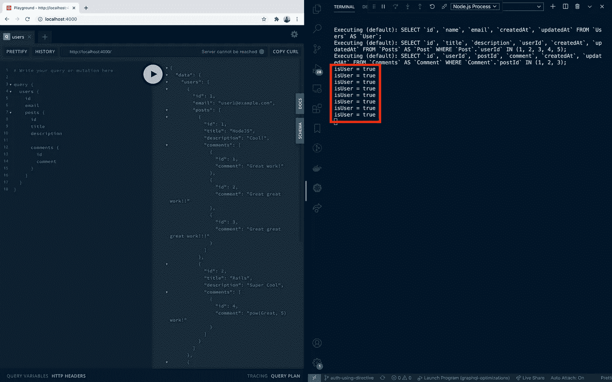
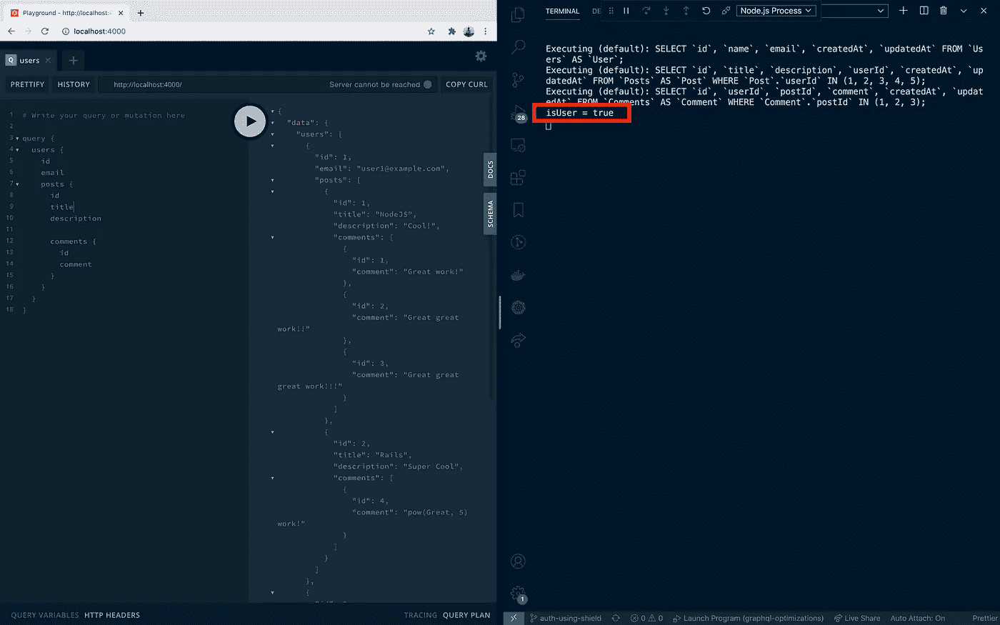

# GraphQL 中的授权—模式指令与 GraphQL 屏蔽

> 原文：<https://levelup.gitconnected.com/authorization-in-graphql-schema-directive-vs-graphql-shield-17085f346488>

> 这篇博客还假设您熟悉 GraphQL 模式指令。如果没有，我推荐阅读这个关于模式指令的 [Apollo 文档](https://www.apollographql.com/docs/apollo-server/schema/directives/)。

假设我们有一个基本的**博客**应用程序，其中一个`User`有许多`Posts`，每个`Post`又有许多`Comments`。

下面是包含这个应用程序的基本 GraphQL 模式的要点。

# 问题陈述

假设我们只希望拥有`USER`角色的登录用户能够访问评论。我们如何实现这一点？

# 方法 1 —使用模式指令

查询、突变和类型的授权可以使用模式指令来实现。事实上，Apollo 文档的这一节带我们看了一个使用指令实现授权的例子。

让我们以阿波罗文档中描述的相同方式实现一个`auth`指令。

在上面的代码中，注意已经检查了`requiredRole`的存在。无论我们在哪里使用`auth`指令，都必须将`requiredRole`作为参数传递。

> 另外，已经完成了对`isUser`文本的记录，这样我们就可以准确地知道这个函数被执行了多少次。

对`baseTypeDefs.js`的更改如下:

注意@auth 指令在`CommentType`中的用法。完整的工作示例，你可以参考[这个库](https://github.com/shrirambalakrishnan/blog-graphql-optimizations/tree/auth-using-directive)。

这里是运行`users`查询时的服务器日志截图。

现在，如您所见， **@auth** 指令对每条`CommentType`记录执行一次。

这种重复执行甚至是必要的吗？这怎么优化？

# 方法 2:graph QL-shield——更好的选择

使用 [GraphQL Shield](https://github.com/maticzav/graphql-shield) 可以非常直观地创建授权规则。

在下面给出的代码中，我为`CommentType`创建了一个`isUser`权限

在`isUser`规则中，请注意`**contextual cache**`的使用，它确保该规则的结果被缓存用于这个特定的上下文和**，从而防止不必要的数据加载**。

完整的实现你可以参考[这个库](https://github.com/shrirambalakrishnan/blog-graphql-optimizations/tree/auth-using-shield)。

在执行相同的查询时，您可以看到‘I user’只被执行了一次。

这里有几个资源可以阅读更多关于这个主题的内容。
1。GraphQL Summit 2020 Talk— [如何认证](https://youtu.be/dBuU61ABEDs)
2。阿波罗官方[博客](https://www.apollographql.com/blog/setting-up-authentication-and-authorization-with-apollo-federation/)