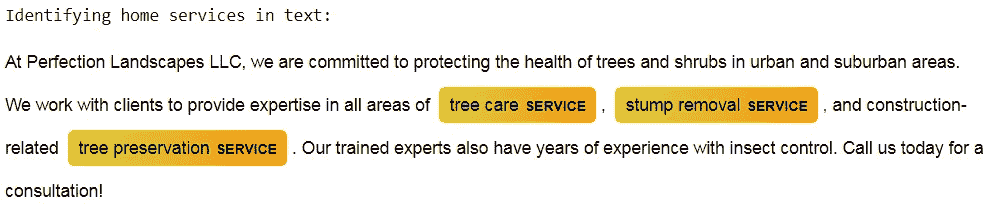
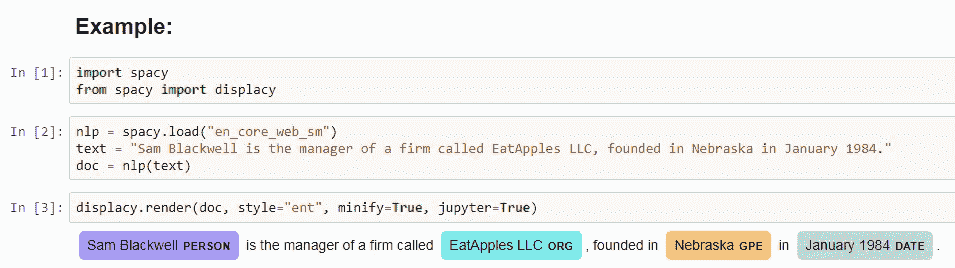
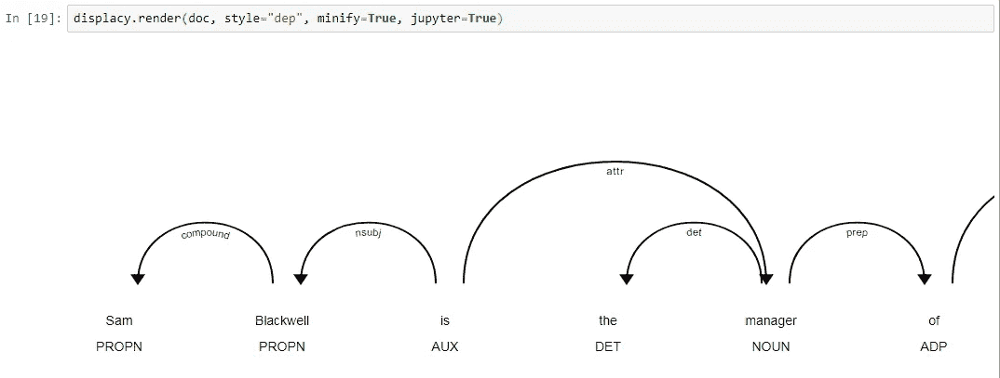
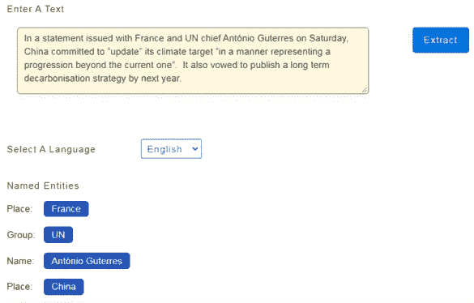
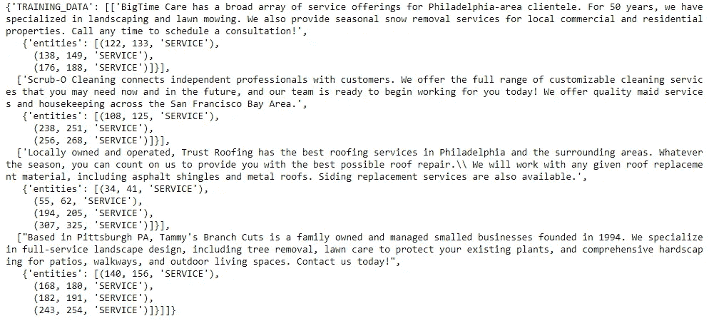
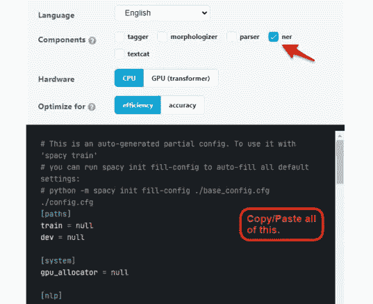
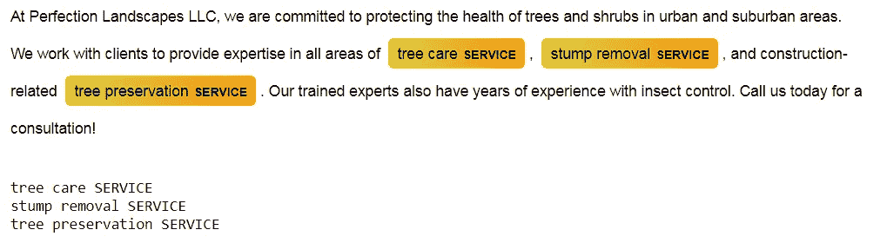
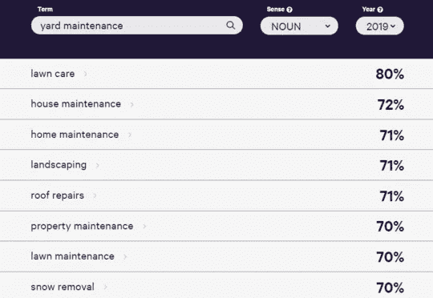

# 通过自定义命名实体识别自动检测任何内容(NER)

> 原文：<https://levelup.gitconnected.com/auto-detect-anything-with-custom-named-entity-recognition-ner-c89d6562e8e9>


图片来自 [Unsplash](https://unsplash.com/) 的 Emmanuel Ikwuegbu

因为 spaCy v3 的发布是最近的，在 2021 年 2 月之前写的教程关于模型如何被训练现在已经过时了。

在这个演练中，我将用一个实际的例子来介绍一个自定义命名实体识别(NER)项目的 ***新的*** 结构。



图片由作者提供。代码演练的最终结果

## **什么是 NER？**

NER 是一个不断发展的自然语言处理领域，旨在准确定位和分类文本中的关键信息。

正如您在这个例子中看到的，spaCy 的“准备就绪”内置 NER 模型已经可以预测人、组织、位置和时间实体。



作者图片

我们还可以更深入地了解模型是如何基于文本的上下文结构来识别命名实体的。



作者图片

> ——《山姆·布莱克威尔是经理》(经理是人，山姆·布莱克威尔很可能是一个人)
> 
> -“…一家名为 EatApples LLC 的公司”(公司是组织，EatApples LLC 很可能是一个组织)

## 为什么用 NER？

NER 在现实世界中有广泛的应用。以一篇在线新闻文章为例；一个经过预训练的 NER 模型可以立即检索关于提到的*人名*、*组织*和*地点*的数据。然后，收集的数据可用于自动将该文章分类到合适的新闻类别中。现在想象一下这个操作被扩展到快速分类成千上万的新闻文章。



给新闻文章分类。归功于[https://komprehend.io/named-entity-recognition](https://komprehend.io/named-entity-recognition)

## 自定义实体

但是如果我们想根据我们自己的词的类别来检测实体呢？

在本文中，我们将利用 NER 来确定家庭服务。经过几个训练实例后，我们的模型将能够标记非结构化文本中提到的各种类型的家庭服务(如“扫雪”、“房屋维护”和“屋顶服务”)。

为了让我们的 NER 模型对一个新的定制标签进行分类，我们首先需要为一个空白模型提供训练数据。

## 空间安装

连续运行这三个命令来启动和运行 spaCy:

```
pip install -U pip setuptools wheel
pip install -U spacy
python -m spacy download en_core_web_sm
```

如果你正在使用康达，或者正在寻找其他安装参数，那么请点击此链接:[https://spacy.io/usage](https://spacy.io/usage)

此外，这些是这个项目必需的库导入。如果有缺失，只需使用 pip 安装。

## **标注数据**

有三种主要的训练方式:

1.  应用现有的 NER 数据集(来自 Kaggle、Metatext 或拥抱脸)

*   例如，你想让 NER 识别提及疾病的内容吗？一个带注释的训练语料库已经存在。点击这里查看:[https://huggingface.co/alvaroalon2/biobert_diseases_ner?text =医生+确诊+凯利+患+白血病+在+他的+64 岁+生日](https://huggingface.co/alvaroalon2/biobert_diseases_ner?text=The%2Bdoctors%2Bdiagnosed%2BKelly%2Bwith%2Bleukemia%2Bon%2Bhis%2B64th%2Bbirthday)。

2)使用 Doccano 或 spaCy Prodigy 软件

*   这些是为快速、用户友好的数据标注而设计的注记工具。请注意，软件的某些方面是有价格标签的。

3)手动标注

*   我们可以注释自己的训练数据。我将向您展示我是如何用正则表达式加速这个过程的。

让我们从第一次训练观察开始。
我只是在标注描述一家企业所提供服务的词语。这是我正在使用的注释格式:

```
= [‘BigTime Care has a broad array of service offerings for Philadelphia-area clientele. For 50 years, we have specialized in landscaping and lawn mowing. We also provide seasonal snow removal services for local commercial and residential properties. Call any time to schedule a consultation!’,
{‘entities’: [(122, 133, ‘SERVICE’),
(138, 149, ‘SERVICE’),
(176, 188, ‘SERVICE’)]}]
```

它由 JSON 格式的文本和带标签的实体组成。

在这里，“美化”是第一实体；该术语从字符位置 122 开始，到 133 结束，我们将其标记为服务。这在(122，133，'服务')达到顶点。“割草”和“除雪”是本例中的其他实体。

让我们来看看自动将数据转换成注释格式的代码。注释行应该能更好地说明发生了什么。

现在我们可以调用 structure_training_data(text，kw_list)进行自动格式化，并让 regex 来完成寻找开始/结束位置的繁重工作。

## **准备培训数据**

这是我创建的迷你训练集。文本和公司名称略有改动，但我们也可以假设文本是从实际的家庭服务网站检索的。

得到的训练数据*(在 collective_dict 内)*:



作者图片

## **训练定制 SpaCy v3 模型**

这是 spaCy v3 不同于其早期版本的主要部分。现在需要在命令行上进行培训。起初，我对此很反感…但是相信我，这再简单不过了。

我们一步一步来！

**1)** 首先，我们需要将我们的训练实例从 JSON 格式转换成 spaCy Doc 对象。然后，Doc 对象被存储在一个集合 DocBin 类中。这正是 spaCy 培训所需的新格式。

**2)**
点击下面的链接。请注意，我在小部件的组件部分选择了“ner”。将小部件的全部内容复制/粘贴到您的文件夹目录下的 base_config.cfg 文件中。
[https://spacy.io/usage/training#config](https://spacy.io/usage/training#config)



作者图片

**3)**
打开 base_config.cfg 文件。
您需要更改的只是顶部的 train 和 dev 变量。

Dev 是为验证数据集保留的。然而，因为我只是为了演示的目的想要训练模型，所以我向 train 和 dev 添加了相同的路径。(注意:这将导致 100%的训练准确性)


作者图片

**4)**

```
python -m spacy init fill-config base_config.cfg config.cfg
```

一个 config.cfg 文件将出现在您的工作目录中。

**5)**
接下来，运行以下程序开始训练:

```
python -m spacy train config.cfg — output ./output
```

训练完成后，生成的模型将出现在名为 output 的新文件夹中。

## **模型结果**

让我们在一段全新的文本上测试我们训练的模型。

**输出:**



作者图片

等一下！请注意模型是如何准确预测“树木护理”、“树桩清除”和“树木保护”作为服务的，尽管这些词不是我们培训的一部分。这就是斯帕西的 NER 的力量！

即使只有四个训练示例，该模型也可以在相应的单词向量中找到相似的单词。这非常有用，因为我们通常无法在训练数据中涵盖实体的每一种可能性和变化。

这个网站演示了单词矢量的概念:
[https://explosion.ai/demos/sense2vec?word = yard % 20 maintenance&sense = NOUN&model = 2019](https://explosion.ai/demos/sense2vec?word=yard%20maintenance&sense=NOUN&model=2019)

例如，如果搜索短语“庭院维护”，我们会看到以下结果:



图片由作者提供。爆款. ai([https://explosion.ai/demos/sense2vec?word = yard % 20 maintenance&sense = NOUN&model = 2019](https://explosion.ai/demos/sense2vec?word=yard%20maintenance&sense=NOUN&model=2019)

已经训练的单词向量能够基于统计语义关联准确地建议同义词和含义。

## **结论**

有了这项技术，现在可以从大量不同的家庭服务网站上检索到准确的服务。

然而……我们目前的 NER 模式还远远没有准备好。请注意，在我们的测试案例中，模型没有将“昆虫控制”作为一项服务。从现在开始，提高模型的准确性就是增加更多的训练数据。在过去，我看到 200-1000 次训练观察是一个很好的起点。

我希望这篇文章能帮助你使用最新版本的 spaCy 构建你自己的定制 NER 模型。

感谢阅读！