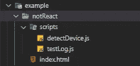
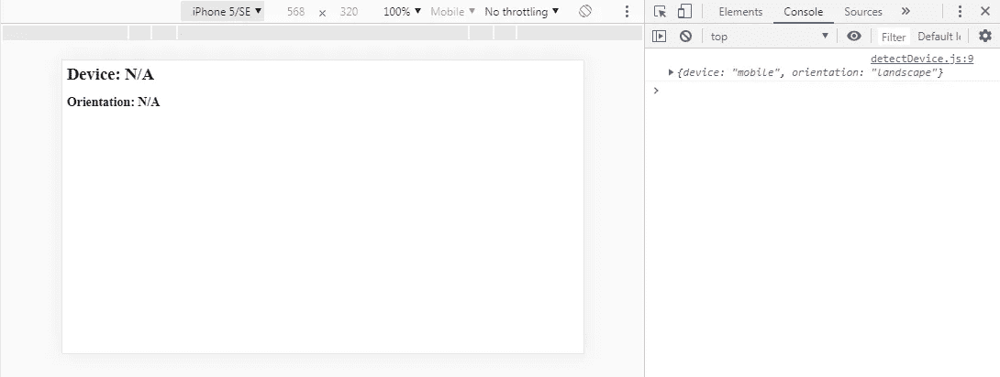

# 自动检测移动设备和屏幕方向

> 原文：<https://levelup.gitconnected.com/auto-detecting-mobile-devices-screen-orientation-ddcf9554b45b>

## 用普通的 JavaScript

作为我在上一篇博客 [**中所写内容的延伸，我想更详细地介绍一下如何用普通 JavaScript 自动检测移动设备和屏幕方向。**](/top-10-tips-i-learned-from-deployment-1a8db769715b)

这是我过去一周一直在做的事情，我认为这将是一个有用的话题来写博客。设计响应式布局有很多种方法，尤其是 JavaScript 为我们提供了多少种选择，但是我们今天要解决的问题非常简单易懂。

*****注意***** 我想指出 Hugo Larrousse 提到的一点，这个解决方案在 Safari 上不工作(感谢 Hugo！).

所以，让我们开始编码吧。

## 基础知识

首先，让我们尝试检测用户是从移动设备还是台式机/笔记本电脑(为了简洁起见，我们只说是一台计算机)连接到我们的项目。

我们可以从确保静态检测页面加载开始。然后，一旦我们有了工作，我们就可以想出如何在设备切换或屏幕方向改变时自动更新我们的功能。最后，我们可以用函数返回的内容来操作一些 DOM 元素，以确保一切按预期运行。

为了确保我们的出发点是一致的，下面是我正在使用的文件夹结构:

目前来看，`detectDevice.js`和`testLog.js`是空白的。

`index.html`是一个基本的 HTML 框架，有一个`root` `div`，一个`h1`元素和一个`h2`元素。它还加载我们的`detectDevice.js`脚本。稍后我们将简要使用`testLog.js`，但这不是必需的:

非常基础的东西。

## 检测移动设备

浏览器的`navigator` `object`为我们提供了我们所需要的完美属性。`navigator.maxTouchPoints`设置连接的设备是否有触摸屏。

如果`navigator.maxTouchPoints === 0`，我们可以安全地假设连接的设备是台式机或笔记本电脑(除非它也有触摸屏，但我们今天不会担心这一点)。如果`navigator.maxTouchPoints === 1`，我们也可以假设连接的设备是智能手机或平板电脑。

由于 0 是一个错误的陈述，我们还可以双击`navigator.maxTouchPoints`到`return` `true`或`false`来代替 1 或 0: `!!navigator.maxTouchPoints`。

为了测试这一点，我们可以在`detectDevice.js`中编写一个`function`，名为……嗯……`detectDevice`和`console.log(!!navigator.maxTouchPoints)`:

在 Chrome 中，如果设备是移动设备，这将`console.log()` `true`或`false`设备是计算机:

桌面:

手机:

太好了。

唯一的问题是，如果我们在设备之间切换，它不会自动更新。我们稍后会解决这个问题。不过现在，让我们让我们的设备方向检测工作。

## 检测屏幕方向

检测屏幕的方向与我们检测设备的方式非常相似。我们浏览器的`window` `object`中还有一个非常有用的属性叫做`window.screen.orientation.angle`，非常适合我们的需要。

`window.screen.orientation.angle`设置浏览器视窗旋转的角度，如果移动设备横放(横向),则为 0 度；如果移动设备正面朝上(纵向),则为 90 度。再说一次，因为 0 是一个错误的声明，我们可以单击或双击`window.screen.orientation.angle`并将其视为一个布尔表达式。

有了这个，我们就可以在`detectDevice.js`上再加一个`function`叫做`detectOrientation`。结合`navigator.maxTouchPoints`，我们可以向`return`写一个嵌套的三元语句:根据设备是否有触摸屏，写“桌面”或“移动”，根据移动设备是侧放还是正面朝上(横向或纵向)，写“横向”或“纵向”:

在 Chrome 中，如果`navigator.maxTouchPoints`是`false`，这将是`console.log()`‘桌面’。如果是`false`，则检查`window.screen.orientation.angle`是否是`false`和`return`‘人像’。如果不是，它会`return`‘风景’:

桌面:

风景:

肖像:

很好。这意味着我们的两个功能是正确检测移动设备和屏幕方向。

但是它们是静态的，并且只在页面加载时执行一次。

理想情况下，我们会让这些`function`动态更新它们正在进行的`return`和`log`操作。例如，如果用户旋转他们的手机，或者如果他们想将他们正在浏览的内容从手机发送到笔记本电脑或台式机。我们希望我们的检测功能能够注意到这一点，并在情况发生变化时发出提示。

好吧，我们也能搞清楚。

## 动态地做两者

首先，让我们将我们的两个探测`function`合并成一个`function`，并将我们的新`function` `return`变成一个`object`。这样，我们可以将两种检测方法打包在一起:

我还想从我们的脚本中删除`function`调用。称之为个人偏好，但它也会帮助我们为以后想做的事情做好准备。我仍然希望`detectDevice()`在我们第一次加载页面时运行，我们可以通过添加一个`“DOMContentLoaded”` `event listener`并让它调用`detectDevice` `function`来保留该功能:

如果我们现在检查浏览器控制台，无论何时页面被重新加载，我们都应该得到一个漂亮的`object`返回:

桌面:

风景:

肖像:

现在我们可以将注意力转向动态更新`detectDevice` `object`。

我们可以通过在浏览器的`window` `object`中添加一个`eventListener`来实现。问题是我们需要我们的`detectDevice` `function`来执行页面加载和浏览器窗口调整。

这意味着我们将需要另一个`function`，也就是所谓的`“DOMContentLoaded”` `eventListener`。这个`function`调用`detectDevice` `function`，给`window` `object`增加一个新的“resize”`eventListener`，每当浏览器窗口调整大小时调用`detectDevice()`:

这正是我们所需要的。

如果我们返回浏览器，尝试在设备和方向之间切换，我们应该会得到正确的`object`的`console.log()`和`return`值:

现在…是的。我知道我们通过一次调用`detectDevice()`得到了两个`return`值。我必须做一些研究，找出原因。

原来，在 Chrome 的开发工具中切换设备或方向时，窗口实际上被调整了两次大小。

我们可以用在`index.html`、`testLog.js`中注释掉的第二个脚本来测试这一点:

我们可以将同样的【调整大小】`eventListener`添加到`window` `object`。这一次，我们可以`console.log()`这两个属性`window.innerWidth`和`window.innerHeight`来看看实际发生了什么。

在`testLog.js`中:

在`index.html`中:

以下是返回的内容:

因此，这似乎不是我们解决方案的问题，只是每当我们在方向之间切换时，窗口被调整大小两次，这导致了两次调用。

有意思。

无论哪种方式，这都不会对我们所写的内容造成问题。我们有动态检测移动设备和屏幕方向的`detectDevice.js`，我们使用的只是几个`eventListners`和几个简单的`functions`。

太棒了。

## 更新 DOM

我想为这个博客做的最后一件事是一些简单的 DOM 操作，并用`detectDevice.js`检测和`return` ing 的内容更新两个 header 元素的`innerHTML`。

为此，我将从`detectDevice` `function`中移除`return`值和`console.log()`值，并在其上链接 1 个额外的`function`。

这个新的`function`将把`detectDeviceObj`作为一个参数，然后查询选择两个标题元素，并用来自`detectDeviceObj`的适当属性替换它们的`innerHTML`:

现在，每当我们切换设备或屏幕方向时，我们都会看到`h1`和`h2` 标签更新:

太棒了。

## 任务完成

虽然我们可以提出许多其他检测移动设备和屏幕方向的解决方案(有许多)，但我发现我们今天提出的解决方案是其中一个更清晰、更易于理解的解决方案。

正如我在博客开始时提到的，这个解决方案还不能在 Safari 上使用。Safari 不支持`navigator.maxTouchPoints`或`window.screen.orientation.angle`。对此，我有一些潜在的解决方案，但我仍在努力寻找不涉及浏览器嗅探的最干净的解决方案。我会更新我的博客。

我的下一篇博客将讨论 React 的移动设备和屏幕方向检测。我们将使用和今天一样的`navigator`和`window`属性，但是它的实现会有一点不同。再说一遍，这并不复杂，但我发现它非常有用。尤其是如果你不想弄乱 CSS 媒体查询的话。

不管怎样，我希望你得到了一些有用的信息，希望你所有的函数都返回 true，所有的请求都用 200 来响应。

保持安全…保持健康…继续为正义而战。