# 自动检测移动设备和屏幕方向(第二部分)

> 原文：<https://levelup.gitconnected.com/auto-detecting-mobile-devices-screen-orientation-part-2-a9c0735b09de>

## 现在有了更多的反应和还原


上周，我们弄清楚了如何使用普通 JavaScript[**自动检测移动设备和屏幕方向。我们的解决方案包括几个事件监听器和几个函数，它们监视浏览器提供的`window`和`navigator`对象中发生的变化。**](/auto-detecting-mobile-devices-screen-orientation-ddcf9554b45b)

今天，我们将扩展该解决方案，并使用 React 实现它。我们仍然围绕着相同的`window`和`navigator`物体旋转，但是也有一些曲折。

之后，我们将安装 Redux 并重构我们的解决方案，不再需要将`props`传递给任何依赖于用户设备或屏幕方向的子组件。

*****注意***** 我还想指出 Hugo Larrousse 提到的一点，上周的解决方案和本周的解决方案都无法与 Safari 兼容(感谢 Hugo！).

所以，让我们开始行动吧。

## 小队目标

我们今天的目标很简单。

使用 React，我们希望自动检测用户是否使用移动设备连接到我们的应用程序，和/或他们是将设备侧放(横向)还是正面朝上(纵向)。

一旦我们这样做了，我们希望将这些信息传递给几个子组件，并有条件地在 DOM 上呈现设备和屏幕方向，以确保它正常工作。

在这之后，我们将安装和设置 Redux，这样我们就可以`store`我们正在检测的东西和`connect`一个子组件到`store`。

## 安装

我们将首先运行基本的`create-react-app`模板来初始设置我们的示例项目:`npx create-react-app with_react`(您可以随意命名您的项目)。完成后，我们应该有了开始所需的通用文件结构:

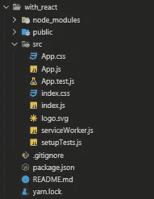

因为我们将使用`state`到`store`我们的检测表达式给我们的值，我将把`App.js`转换成一个`class`组件。我还将删除`header`标签，并用一些占位符文本替换`“Edit <code>src/App.js</code> and save to reload.”`和`“Learn React”`元素:

在我们的浏览器中，我们现在应该看到 React 徽标、模板文本和白色背景:

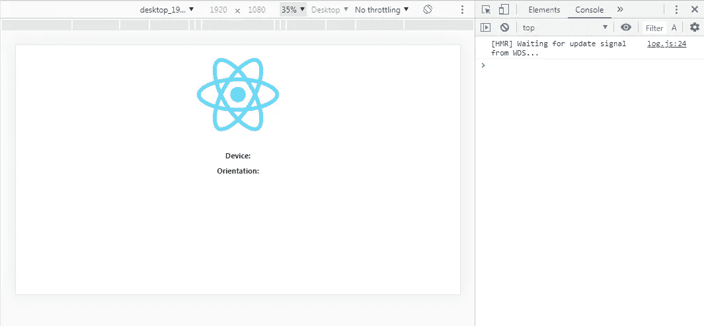

接下来，我将添加 3 个相互嵌套的功能组件，并在组件树的叶子中添加模板文本。

这里是我放置新组件的地方:

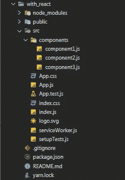

这里是`App.js`和我们 3 个新的子组件的样子:

*中的* `*App.js*`中的 *:*

中的*`*component1.js*`*:**

*中的* `*component2.js*`中的 *:*

*中的* `*component3.js*` *:*

在浏览器中，我们现在应该让每个组件呈现它的名称，最后一个组件也呈现我们的模板文本:

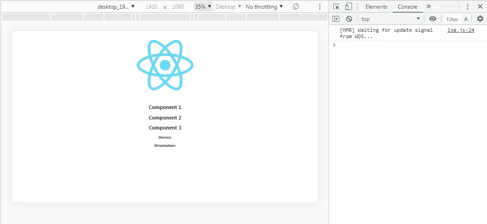

我们可以创建 1 个组件，并为每个子组件重用它，但这样做的目的是为了证明，由于我们只更新了`App.js`中的`state`，我们的解决方案将自动通过我们的组件树向下传递更新的`prop`，而不管我们有多少个子组件。

在我们继续之前，我想给`App.js`添加的最后一个东西是一个`state`对象，以及我们将要使用的`lifecycle`方法。

*中的* `*App.js*` *:*

这样，我们就可以开始实现我们的自动检测表达式了。

## 反应式自动检测

我们需要做的第一件事是给`state`添加两个属性:`device`和`orientation`。我们还将把它们的值设置为我们在上一篇博客中使用的检测表达式。这就是 React 在页面加载时为这两个属性设置初始值的原因。

如果我们最初将它们设置为`null`值，我们在`state`中的两个属性将`return` `null`用于 pageload 上`App.js`的前两次重新渲染，并导致一些我们希望避免的奇怪问题。

因此，通过将它们的初始值设置为我们的检测方法，我们有效地模仿了我们在上一篇博客中用 vanillaJS 设置的`DOMContentLoaded` `eventListener`的行为。

*中的* `*App.js*` *:*

如果我们`console.log` `this.state`，我们可以看到这一点在起作用:

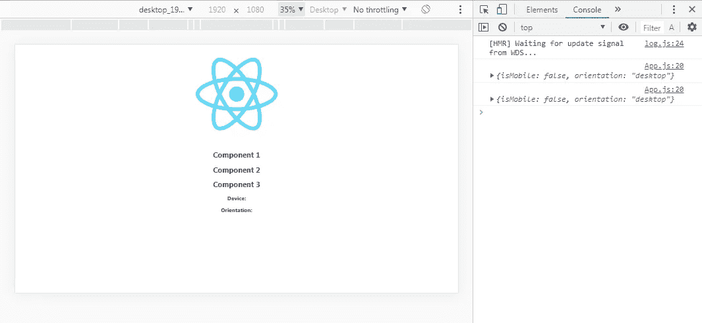

接下来，我们要给`componentDidMount()`加一个`resize`T3。这将指向另一个`function`，它使用我们最初设置的相同方法更新`device`和`orientation`属性的`state`。这将在浏览器窗口调整大小时监听，并自动用我们的两个检测表达式`return`的值更新`state`。

*中的* `*App.js*` *:*

如果我们再次`console.log` `this.state`并在桌面和移动设备之间切换，以及在横向和纵向之间切换，我们应该会看到所有内容都正确更新:

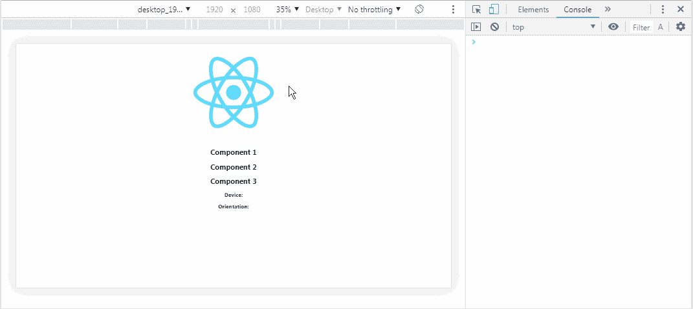

很好。

现在让我们通过组件树传递`device`和`orientation`和`state`属性，并在`Component3.js`的`h2`元素中传递`render`属性。咱们也把`console.log`中的`props`和`Component3.js`中的一样好。

*中的* `*App.js*` *:*

*中的* `*Component1.js*` *:*

中的*`*Component2.js*`中的 *:**

*中的* `*Component3.js*`中的 *:*

我们现在应该看到`Component3`中的`h2`元素自动更新，以及我们在`console`中得到的消息:

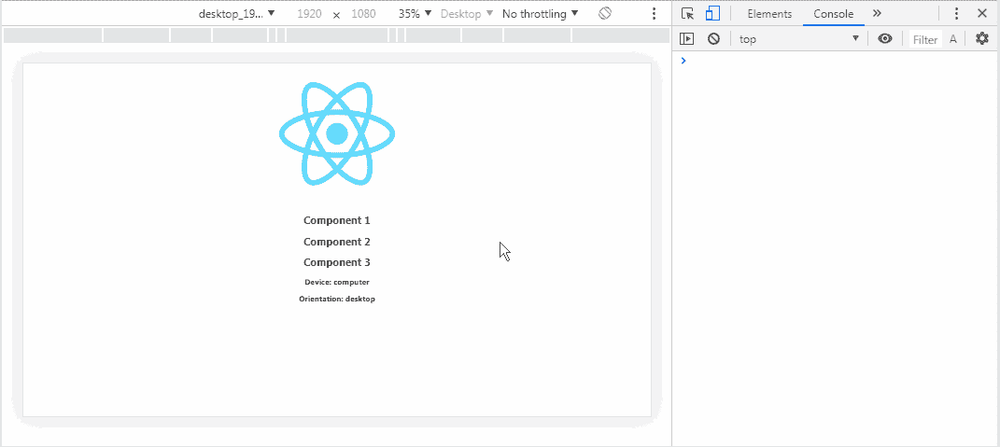

很好。

但是通过组件树向下传递道具是乏味的。尤其是如果一个项目有足够大的规模。此外，我们传递的内容可能会影响我们项目中的每个组件，因此必须有更好的方法来管理`state`。

所以还是装 Redux 吧。

## REDUX 自动检测

首先，我们通过运行`npm install redux`和`npm install react-redux`来安装 Redux。我还建议安装 Redux Dev Tools Chrome 扩展，但这不是必需的。

接下来，我将把基本的`import`还原成`index.js`，并设置几个`constant`变量。我在设置 Redux 时有一些个人偏好，我来解释一下:

```
import { createStore, compose } from ‘redux’
```

`createStore`是必需的，但`compose`不是。我们将使用`compose`到`connect` Redux 到 Redux 开发工具。

```
import { Provider } from ‘react-redux’
```

这是`App.js`访问`store`所必需的，我们将使用 Redux 进行设置。

```
// import detectReducer from ‘./store/reducers/detectReducer’
```

我们还没有创建它，所以现在我将把它注释掉。这是我们将要用来访问和更新`store`的`reducer`。

```
const composeEnhancers = window.__REDUX_DEVTOOLS_EXTENSION_COMPOSE__ || compose
```

这是我们与 Redux 开发工具的连接。

```
const store = createStore(() => {}, composeEnhancers())
```

需要在 Redux 中设置`store`。目前，第一个参数被设置为匿名的`function`，但将被替换为我们的`detectReducer`。我使用一个匿名的`function`作为占位符，同时我们设置 Redux 并确保一切设置正确。如果我们试图添加`detectReducer`而不创建它，我们将得到一个运行时错误。

```
const ExampleApp = (
  <Provider store={store}>
    <App />
  </Provider>
)
```

我个人的偏好之一是为我包装的所有组件设置一个变量。随着项目规模的扩大，我倾向于开始用许多高阶组件包装`App.js`，所以这只是为了把所有东西都放在一个地方。

```
ReactDOM.render( ExampleApp, document.getElementById(‘root’) );
```

我们可以只添加我们定义的`constant`变量，而不是将所有围绕`<App />`的组件添加到 ReactDOM.render()中。

这是`index.js`现在的样子。

`*index.js*` *中的*:**

即使没有创建`action`或`reducer`，我们的项目仍然应该像以前一样工作。我们还没有用 Redux 做任何工作，但是我们添加到`index.js`的所有 Redux 东西不应该影响我们之前所做的功能。

所以让我们改变一下，开始添加我们的`actions`和`reducers`。

我将创建一堆文件和文件夹，从`src`目录中的一个名为……嗯……`actions`的文件夹开始。在`actions`文件夹中，我将创建`actionIndex.js`、`actionTypes.js`和`detectActions.js`，在`reducers`文件夹中，我将创建`detectReducers.js`:

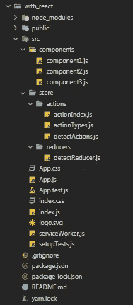

*中的* `*actionIndex.js*` *:*

`actionIndex.js`将是我们正在创建的`actions`列表，并且可以`import`添加到我们想要`dispatch`的任何组件中。这不是必要的，但是我的另一个组织偏好。

*中的* `*actionTypes.js*` *:*

`actionTypes.js`将只有 2 个`actions`，与我们最初在`App.js`的`state`中设置的属性名称相同:`DEVICE`和`ORIENTATION`。

中的*`*detectActions.js*`中的 *:**

`detectActions.js`将要进行`export` 2 功能。既`return`又`actionTypes`被送到它那里，什么也不做。

*中的* `*detectReducers.js*` *:*

对于`detectReducers.js`，我将`initialState`设置为与`App.js`中`state`相同的值。

这将最初在 pageload 上设置`store`，就像我们用 React 中的 detect 方法初始化`state`一样，或者通过调用 vanillaJS 中的`DOMConentLoaded eventListner`。

接下来，我将把`detectReducer`定义为一个匿名的`function`，并向它传递两个参数。第一个是默认值设置为`initialState`的`currentState`，第二个是`action`。然后，我将为我们的两个`actionsTypes` : `DEVICE`和`ORIENTATION`设置一个开关盒。

我将把这两个案例`return`都作为`function`，同时将`currentState`和`action`传递给那些`function` s。我也将这些`function`定义为`device`和`orientation`。这是我们将要更新`store`的地方。

*中的* `*detectReducers.js*` *:*

这是我的另一个组织偏好。我喜欢将`reducer`和它执行的`function`分开，但是你也可以将你的方法直接构建到开关盒本身中。

对于这两个`function`,我将通过使用扩展运算符使它们都成为我们的`store`的`return`和`currentState`,然后用适当的检测表达式在`store`中得到它们各自的属性。

这相当于在`App.js`中调用`this.setState()`，但是额外的好处是可以从我们`connect`到它的任何组件中访问:

*中的* `*detectReducers.js*` *:*

这就是我们为`actions`和`reducers`所要做的一切。现在我们可以取消`index.js`中`detectReducer.js`的`import`的注释，替换`createStore` `constant`中的匿名`function`:

*中的* `*index.js*` *:*

这样，我们可以在浏览器中检查 Redux Dev 工具，看看`store`在页面加载时是否正确更新。它不会自动更新，因为我们还没有把`App.js`连接到 Redux。这是下一步:

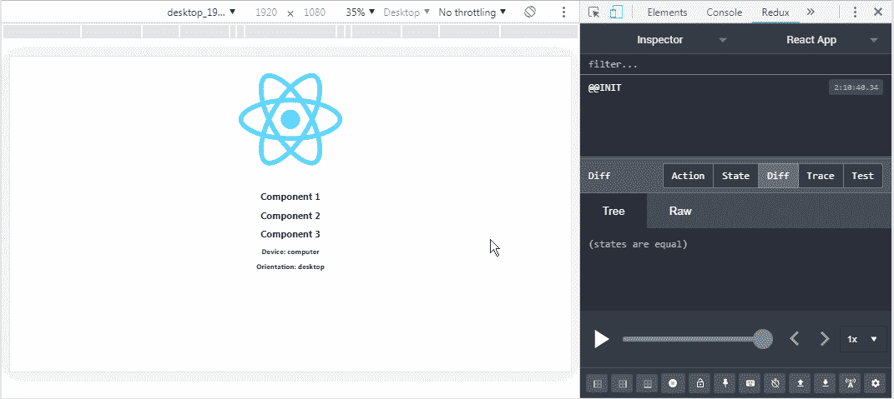

很好。

现在，我们可以回到`App.js`，并将其连接到 Redux。

首先，我们要将 react-redux 中的`import` `connect`，用`mapStateToProps`将`store`添加到`App.js`的`props`，然后将`connect` `App.js`添加到 redux。

最终，我们将不需要`mapStateToProps`，因为我们将只需要从`App.js`开始的`dispatch` `actions`，但是现在我们可以添加它并确保一切正常。从那个和来自`App.js`的`console.log` `props`开始，并检查它是否正在接收 Redux 发送的`props`是一个好主意。

*中的* `*App.js*` *:*

我们可以再次检查浏览器，看看一切是否正常，但不必使用 Redux Dev 工具:

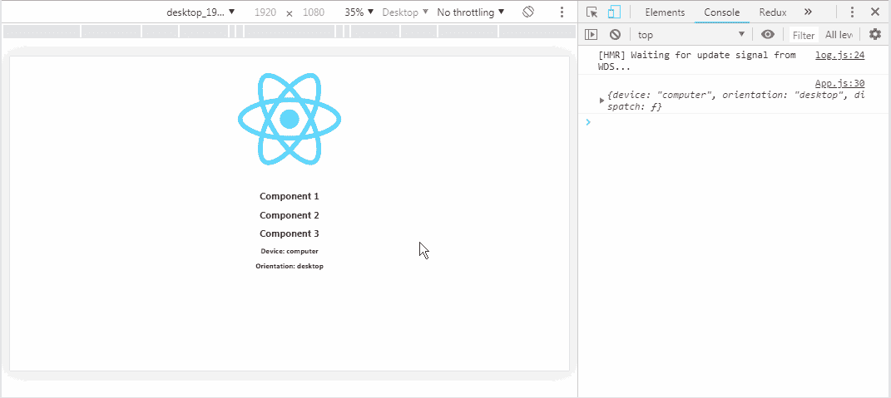

我们确实有一个小问题，当我们切换设备或方向时，Redux 不能正确更新`store`。没关系。我们还没有从`App.js`派遣任何`actions`。

让我们用 Redux 替换我们在`App.js`中设置的原来的`state`管理。首先，我们可以将`./store/actions`中的`import` `actionIndex`，设置成我们想要的`dispatch``actions`。然后，我们可以将`connect`与`App.js`归到那些`actions`与`mapDispatchToProps`中:

*中的* `*App.js*` *:*

我们现在应该看到我们在`detectActions.js`中设置的`actions`是从`App.js`派生出来的`console.log`:

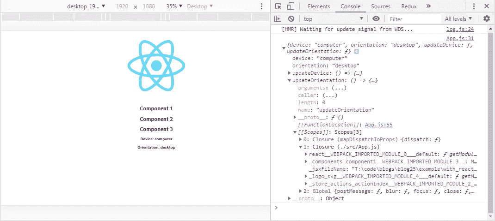

这样，我们就可以用从 Redux 接收的`updateDevice`和`updateOrientation` `actions`来取代我们的普通 React `state`管理。我们可以用`this.props.updateDevice()`和`this.props.updateOrientation()`来代替`state={}`和任何我们打给`this.setState()`的电话。

记得注释掉我们传递给`Component1`的两个`props`，否则你会收到一个`TypeError`，因为我们不再使用`App.js`的`state`:

*中的* `*App.js*` *:*

现在…一切都应该正常了。让我们检查一下浏览器:

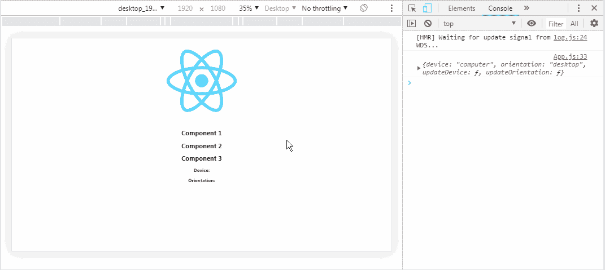

很好。

我们最终可以将`Component3`连接到 Redux，将`render` `store`连接到 DOM。我们要做的就是`import` `connect`，用`mapStateToProps`换`Component3`。我们还可以将`console.log`从`App.js`中移除，将`console.log`从`Component3`中移除，以 100%确保一切正常运行:

*中的* `*Component3.js*` *:*

让我们再检查一次浏览器，确保一切正常:


很好。

让我们最后看一下我们的组件，清除所有旧的管理，我们用 Redux:

*中的* `*index.js*` *:*

中的*`*App.js*`中的 *:**

*** * *注意***** 如果你使用的是`mapDispatchToProps`而没有`mapStateToProps`，那么在你的`connect`调用中，你总是必须将`null`作为第一个参数传递。

*中的* `*Component1.js*` *:*

`*Component2.js*` *中的*:**

*中的* `*Component3.js*` *:*

*中的* `*actionIndex.js*` *:*

中的*`*actionTypes.js*`中的 *:**

*中的*中的`*detectActions.js*`中的 *:*

中的*`*detectReducer.js*`中的 *:**

## 任务完成

正如我在博客开始时提到的，这个解决方案还不能在 Safari 上使用。Safari 不支持`navigator.maxTouchPoints`或`window.screen.orientation.angle`。对此，我有一些潜在的解决方案，但我仍在努力寻找不涉及浏览器嗅探的最干净的解决方案。我会更新这两个博客。

我还在学习 Redux 的诀窍，所以我相当肯定有一种更有效的方法来设置和更新我们在这里完成的存储，尽管这是一个我还没有找到的解决方案。我希望我没有因为一些更好的细节而变得太疯狂，但我认为更好的办法是经历我如何设置 Redux 的每一步，而不是在细节上吝啬。

不管怎样，我希望你得到了一些有用的信息，希望你所有的函数都返回 true，所有的请求都用 200 来响应。

保持安全…保持健康…继续为正义而战。