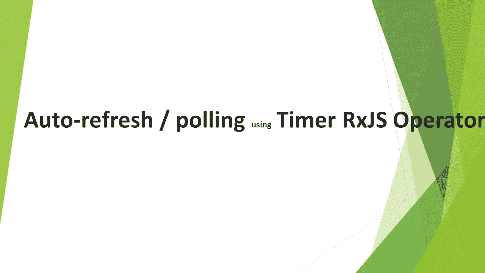

# 使用 RxJS 定时器操作器自动刷新或轮询

> 原文：<https://levelup.gitconnected.com/auto-refresh-or-polling-using-rxjs-timer-operator-2141016c7a53>

## 有时我们需要在组件中每隔一段时间自动刷新/轮询。这可以通过定时器 RxJS 操作器来实现。但是让我们在没有 RxJS 的情况下做这件事，看看我们犯了什么错误，然后我们进化到最佳解决方案。



计时器-rxjs-操作员

轮询-自动刷新-计时器-rxjs-操作员. ts

我们在 ngOnInit 上调用 getData，因为我们需要在创建组件时第一次调用它。然后我们使用窗口对象上可用的 setInterval 方法。

```
this.interval = setInterval(()=>{
                   this.getData();
                   },10000);
```

此方法返回唯一标识间隔的间隔 ID。我们将它存储到组件的区间中，并在 ngOnDestroy 上清除区间。

这种方法的问题是我们订阅了每个调用，但没有取消订阅。

**在处理可观测量时，RxJS 操作员是最好的。所以让我们利用** `***interval***` **运算符**。

轮询-自动刷新-计时器-rxjs-操作员. ts

`interval`运算符以毫秒为单位计算时间间隔，并发出 0、1、2、3 等值。我们使用 switchMap 操作符将它映射到我们的 API 调用。你可以在这里 了解关于`switchMap` [***的一切。***](https://blog.bitsrc.io/rxjs-switchmap-operator-4b045e2fbbda)

上述方法的问题是，我们仍然是第一次单独调用`*getData*` 方法来获取数据。

这可以使用`timer`算子来解决。

轮询-自动刷新-计时器-rxjs-操作员. ts

`timer`有两种口味。`timer(initialDelayInMilliSeconds)`接受一个参数，在给定的延迟时间后，它将发出一次值，然后结束。定时器(`initialDelayInMilliSeconds,interval`)取初始延时和间隔时间。它将在初始延迟后发出值，然后像`interval`操作符一样按给定间隔发出值。这样，我们可以通过将 initialDelay 作为 0 来解决初始调用问题。

我已经使用 takeUntil 运算符取消订阅。这里的 *可以从 [*读出来。*](https://pawan-kumawat.medium.com/prevent-memory-leaks-in-angular-observables-eb48cad9eadb)*

我希望这是清楚的。

我在 Udemy 上创建了一个 Angular 课程，涵盖了 Angular 中的许多实际问题和解决方案，包括这个。这可能是你职业生涯的垫脚石。 [***请看一下***](https://www.udemy.com/course/angular-practicals/?couponCode=F48E50E6ECF6D99AD500) ***。***


角实践

请订阅/关注/喜欢/鼓掌。