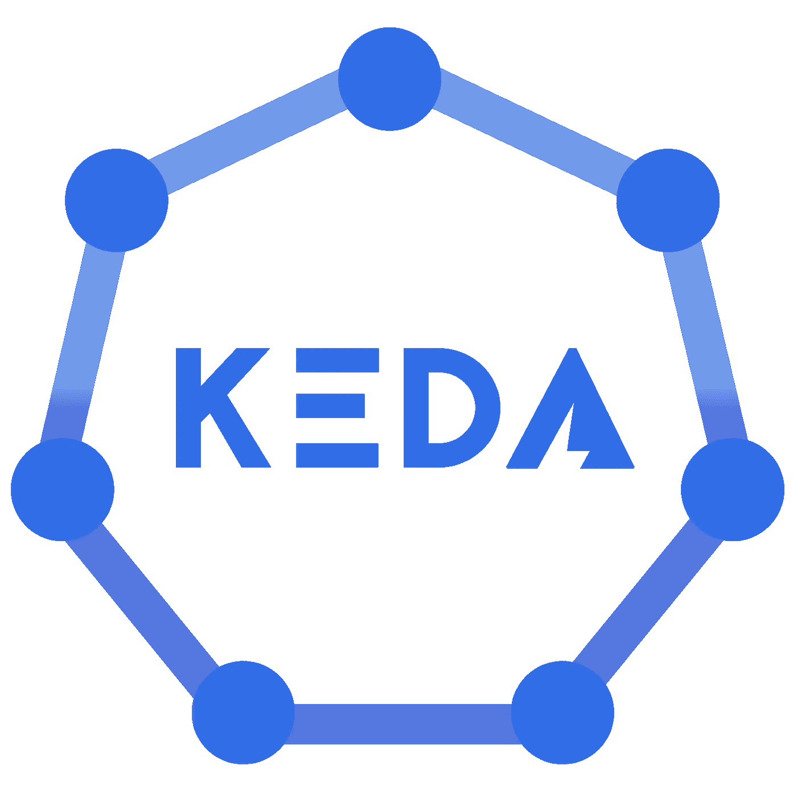

# KEDA 在 Kubernetes 上的自动缩放卡夫卡应用程序

> 原文：<https://levelup.gitconnected.com/auto-scale-kafka-applications-on-kubernetes-with-keda-6fde6aef9d80>

本教程将使用代表`Kubernetes-based Event Driven Autoscaler`的`[KEDA](https://keda.sh/)`演示 Kubernetes 上基于 Kafka 的消费应用程序的自动缩放

> `[*KEDA*](https://cloudblogs.microsoft.com/opensource/2020/04/06/kubernetes-event-driven-autoscaling-keda-cncf-sandbox-project/)` [*目前是 CNCF 沙盒项目*](https://cloudblogs.microsoft.com/opensource/2020/04/06/kubernetes-event-driven-autoscaling-keda-cncf-sandbox-project/)

`*KEDA*` *可以根据需要处理的事件数量驱动 Kubernetes 中任何容器的伸缩。它是一个单一用途的轻量级组件，可以添加到任何 Kubernetes 集群中。KEDA 与标准 Kubernetes 组件一起工作，如水平 Pod 自动缩放器，可以扩展功能而无需覆盖或复制。*



它有一个[内置的 Kafka 缩放器](https://keda.sh/scalers/apache-kafka/)，可以自动缩放您的 Kafka 消费应用程序(传统的消费应用程序，Kafka 流等)。)基于消费者补偿滞后。我将使用 Azure Event Hubs 作为 Kafka broker(尽管这些概念适用于任何 Kafka 集群)，并为 Kubernetes 集群使用 Azure Kubernetes 服务(请随意使用其他服务，如`minikube`)

> *代码在*T5 上可用

我们将经历以下内容:

*   快速概览
*   应用程序和 KEDA 配置(主要是 YAMLs！说实话)
*   如何设置 KEDA 和所需的 Azure 服务
*   部署解决方案并观察自动扩展的效果

# 概观

以下是关键组件:

*   [Producer app](https://github.com/abhirockzz/keda-eventhubs-kafka/tree/master/producer) :这是一个简单的 Go app，向 Kafka 生成模拟的 JSON 数据。它使用了`[sarama](https://github.com/Shopify/sarama)` [库](https://github.com/Shopify/sarama)。您可以将它作为 Docker 容器运行，也可以直接作为 Go 应用程序运行(详情见下一节)
*   [消费 app](https://github.com/abhirockzz/keda-eventhubs-kafka/tree/master/consumer) :这是另一款消费 Kafka 数据的 Go app。为了增加一点多样性，它使用了[confuent Go Kafka 客户端](https://github.com/confluentinc/confluent-kafka-go)。你将作为一名 Kubernetes `Deployment`(详情见下一节)
*   `KEDA` `ScaledObject`(它定义了基于 Kafka 的自动缩放标准)和其他支持清单

# 先决条件

`kubectl`-[https://kubernetes.io/docs/tasks/tools/install-kubectl/](https://kubernetes.io/docs/tasks/tools/install-kubectl/)

如果你选择使用 Azure Event Hubs、Azure Kubernetes 服务(或者两者都用)，你将需要一个[微软 Azure 账户](https://docs.microsoft.com/azure/?WT.mc_id=medium-blog-abhishgu)。去报名参加一个免费的吧！

我将使用`Helm`安装`KEDA`。这是安装`Helm`-[https://helm.sh/docs/intro/install/](https://helm.sh/docs/intro/install/)的文件

> *对于替代方式(* `*Operator Hub*` *或 YAML 文件)的*`*KEDA*`*[*看一下文档*](https://keda.sh/docs/deploy/)*

*下面是如何设置所需的 Azure 服务。*

> **我建议将以下服务作为单个* [*Azure 资源组*](https://docs.microsoft.com/azure/azure-resource-manager/management/overview?WT.mc_id=medium-blog-abhishgu#resource-groups) *的一部分安装，这样可以很容易地清理这些服务**

## *Azure 活动中心*

*[Azure Event Hubs](https://docs.microsoft.com/azure/event-hubs/event-hubs-about?%5BWT.mc_id=medium-blog-abhishgu) 是一个数据流平台和事件摄取服务。它每秒可以接收和处理数百万个事件。[它还提供了一个 Kafka 端点](https://docs.microsoft.com/azure/event-hubs/event-hubs-for-kafka-ecosystem-overview?WT.mc_id=medium-blog-abhishgu)，现有的基于 Kafka 的应用程序可以使用它来运行自己的 Kafka 集群。Event Hubs 支持 Apache Kafka protocol 1.0 和更高版本，并与 Kafka 生态系统中现有的 Kafka 客户端应用程序和其他工具一起工作，包括`Kafka Connect`(在本博客中演示过)`MirrorMaker`等。*

*要设置 Azure Event Hubs 集群，你可以从各种选项中进行选择，包括[Azure 门户](https://docs.microsoft.com/azure/event-hubs/event-hubs-create?WT.mc_id=medium-blog-abhishgu)、 [Azure CLI](https://docs.microsoft.com/azure/event-hubs/event-hubs-quickstart-cli?WT.mc_id=medium-blog-abhishgu) 、 [Azure PowerShell](https://docs.microsoft.com/azure/event-hubs/event-hubs-quickstart-powershell?WT.mc_id=medium-blog-abhishgu) 或[ARM 模板](https://docs.microsoft.com/azure/event-hubs/event-hubs-resource-manager-namespace-event-hub?WT.mc_id=medium-blog-abhishgu)。一旦设置完成，您将需要连接字符串(将在后续步骤中使用)用于[认证到事件中心](https://docs.microsoft.com/azure/event-hubs/authenticate-shared-access-signature?WT.mc_id=medium-blog-abhishgu) — [使用本指南](https://docs.microsoft.com/azure/event-hubs/event-hubs-get-connection-string?WT.mc_id=medium-blog-abhishgu)完成此步骤。*

> **请确保您还创建了一个活动中心(Kafka 主题),我们可以向其发送数据或从其接收数据**

## *蓝色库伯内特服务*

*[Azure Kubernetes 服务(AKS)](https://docs.microsoft.com/azure/aks/intro-kubernetes?WT.mc_id=medium-blog-abhishgu) 让在 Azure 中部署托管的 Kubernetes 集群变得简单。它通过将大部分责任转移给 Azure，降低了管理 Kubernetes 的复杂性和运营开销。以下是如何使用 [Azure CLI](https://docs.microsoft.com/azure/aks/kubernetes-walkthrough?WT.mc_id=medium-blog-abhishgu) 、 [Azure portal](https://docs.microsoft.com/azure/aks/kubernetes-walkthrough-portal?WT.mc_id=medium-blog-abhishgu) 或 [ARM 模板](https://docs.microsoft.com/azure/aks/kubernetes-walkthrough-rm-template?WT.mc_id=medium-blog-abhishgu)建立 AKS 集群的示例*

# *安装 KEDA*

```
*helm repo add kedacore https://kedacore.github.io/charts
helm repo updatekubectl create namespace keda
helm install keda kedacore/keda --namespace keda*
```

*这将安装 KEDA 算子和 KEDA 度量 API 服务器(作为单独的`Deployment`)*

```
*kubectl get deployment -n kedaNAME                              READY   UP-TO-DATE   AVAILABLE   AGE
keda-operator                     1/1     1            1           1h
keda-operator-metrics-apiserver   1/1     1            1           1h*
```

*检查 KEDA 操作员日志*

```
*kubectl logs -f $(kubectl get pod -l=app=keda-operator -o jsonpath='{.items[0].metadata.name}' -n keda) -n keda*
```

# *YAML 时间！*

**

*让我们享受反省一些错误的过程吧！*

## *Kubernetes `Secret`*

*我们使用一个`Secret`来存储活动中心的连接细节。很快会有更多的报道...*

```
*apiVersion: v1
kind: Secret
metadata:
  name: eventhub-kafka-credentials
data:
  authMode: <BASE64_AUTH_MODE>
  username: <BASE64_EVENTHUBS_USERNAME>
  password: <BASE64_EVENTHUBS_CONNECTION_STRING>*
```

## *`ScaledObject`*

*一个`[ScaledObject](https://keda.sh/docs/concepts/scaling-deployments/#scaledobject-spec)`为 [KEDA 卡夫卡定标器](https://keda.sh/scalers/apache-kafka/#trigger-specification)*

*请注意以下参考资料:*

*   *`spec.scaleTargetRef.deploymentName`指向需要缩放的`Deployment`的名称*
*   *`spec.triggers.authenticationRef`指向一个`[TriggerAuthentication](https://keda.sh/docs/concepts/authentication/#re-use-credentials-and-delegate-auth-with-triggerauthentication)`*

```
*apiVersion: keda.k8s.io/v1alpha1
kind: ScaledObject
metadata:
  name: kafka-scaledobject
  namespace: default
  labels:
    deploymentName: kafka-consumer
spec:
  scaleTargetRef:
    deploymentName: kafka-consumer
  pollingInterval: 15
  cooldownPeriod: 100
  maxReplicaCount: 10
  triggers:
    - type: kafka
      metadata:
        bootstrapServers: <EVENTHUBS_NAMESPACE>.servicebus.windows.net:9093
        consumerGroup: <EVENTHUB_CONSUMER_GROUP>
        topic: <EVENTHUB_TOPIC_NAME>
        lagThreshold: "10"
      authenticationRef:
        name: eventhub-kafka-triggerauth*
```

## *消费者`Deployment`*

*Kafka 消费者应用程序作为 Kubernetes 部署运行*

```
*apiVersion: apps/v1
kind: Deployment
metadata:
  name: kafka-consumer
spec:
  replicas: 1
  selector:
    matchLabels:
      app: kafka-consumer
  template:
    metadata:
      labels:
        app: kafka-consumer
    spec:
      containers:
        - name: kafka-consumer
          image: abhirockzz/kafka-consumer
          imagePullPolicy: IfNotPresent
          env:
            - name: KAFKA_EVENTHUB_PASSWORD
              valueFrom:
                secretKeyRef:
                  name: eventhub-kafka-credentials
                  key: password
            - name: KAFKA_EVENTHUB_ENDPOINT
              value: <EVENTHUBS_NAMESPACE>.windows.net:9093
            - name: KAFKA_EVENTHUB_CONSUMER_GROUP
              value: $Default
            - name: KAFKA_EVENTHUB_TOPIC
              value: <EVENTHUB_TOPIC_NAME>*
```

*让我们看看`TriggerAuthentication`长什么样*

## *`TriggerAuthentication`*

*指的是之前描述过的`Secret`(名为`eventhub-kafka-credentials`)*

```
*apiVersion: keda.k8s.io/v1alpha1
kind: TriggerAuthentication
metadata:
  name: eventhub-kafka-triggerauth
spec:
  secretTargetRef:
    - parameter: authMode
      name: eventhub-kafka-credentials
      key: authMode
    - parameter: username
      name: eventhub-kafka-credentials
      key: username
    - parameter: password
      name: eventhub-kafka-credentials
      key: password*
```

# *部署*

*是时候看看实际情况了*

*从克隆`Git`回购开始:*

```
*git clone [https://github.com/abhirockzz/keda-eventhubs-kafka](https://github.com/abhirockzz/keda-eventhubs-kafka)*
```

*我们将为您的事件中心实例部署包含连接字符串的`Secret`。更新文件`[deploy/1-secret.yaml](https://github.com/abhirockzz/keda-eventhubs-kafka/blob/master/deploy/1-secret.yaml)`，其中`password`属性包含事件中心连接字符串的 base64 编码值，例如`echo -n '<eventhubs-connection-string>' | base64`*

> **无需更改*`*username*`*`*authMode*`*。它们分别只是* `*$ConnectionString*` *和* `*sasl_plain*` *的 base64 版本***

**展开`Secret`**

```
**kubectl apply -f deploy/1-secret.yaml**
```

**更新文件`[deploy/3-consumer.yaml](https://github.com/abhirockzz/keda-eventhubs-kafka/blob/master/deploy/3-consumer.yaml)`。检查属于`spec.containers.env`一部分的下列参考资料**

*   **`KAFKA_EVENTHUB_ENDPOINT` -事件中心名称空间的名称**
*   **`KAFKA_EVENTHUB_TOPIC` -活动中心主题的名称**

**例如**

```
**env:
            - name: KAFKA_EVENTHUB_PASSWORD
              valueFrom:
                secretKeyRef:
                  name: eventhub-kafka-credentials
                  key: password
            - name: KAFKA_EVENTHUB_ENDPOINT
              value: my-eventhub.windows.net:9093
            - name: KAFKA_EVENTHUB_CONSUMER_GROUP
              value: $Default
            - name: KAFKA_EVENTHUB_TOPIC
              value: test-topic**
```

**创建消费者应用程序`Deployment`**

```
**kubectl apply -f deploy/3-consumer.yaml**
```

**您应该会看到消费者应用程序很快投入运行(`Running`状态)**

```
**kubectl get pods -w**
```

> ***您可以使用* `*kubectl logs -f $(kubectl get pod -l=app=kafka-consumer -o jsonpath='{.items[0].metadata.name}')*`查看消费者应用日志**

**创建`TriggerAuthentication`，后跟`ScaledObject`**

```
**kubectl apply -f deploy/2-trigger-auth.yaml
kubectl apply -f deploy/4-kafka-scaledobject.yaml**
```

> ***再次检查 KEDA 操作员日志——您应该看到它对刚刚创建了* `*ScaledObject*` *这一事实做出了反应***

```
**kubectl logs -f $(kubectl get pod -l=app=keda-operator -o jsonpath='{.items[0].metadata.name}' -n keda) -n keda**
```

**检查消费者`Pod` - `kubectl get pods`。您将看到现在没有`Pod`了——这是因为 KEDA 实际上将部署缩减到了零个实例。您也可以通过检查部署来确认这一点`kubectl get deployment/kafka-consumer`**

> ***如果您想改变这种行为，例如，至少有一个部署实例正在运行，请将* `*minReplicaCount*` *属性添加到* `*ScaledObject*` *(默认为* `*0*` *)***

**从扩展的角度来看，KEDA 负责:**

*   **根据定标器报告的指标(在这种情况下是 Kafka 消费者滞后),将您的应用从 0 定标到 1 个实例**
*   **将你的应用从 1 实例扩展到 0**

**其余的繁重工作(自动缩放)由水平 Pod 自动缩放器(HPA)(由 KEDA 操作符中的控制器循环创建)完成，这是内置于 Kubernetes 中的本地资源**

# **试验**

**测试自动缩放的舞台已经准备好了。在一个终端，监视消费者`Deployment`资源**

```
**kubectl get deployment -w**
```

**为 producer 应用程序导出环境变量—输入`KAFKA_EVENTHUB_ENDPOINT`、`KAFKA_EVENTHUB_CONNECTION_STRING`和`KAFKA_EVENTHUB_TOPIC`的值**

```
**export KAFKA_EVENTHUB_ENDPOINT=<EVENTHUBS_NAMESPACE>.servicebus.windows.net:9093export KAFKA_EVENTHUB_CONNECTION_STRING="Endpoint=sb://<EVENTHUBS_NAMESPACE>.servicebus.windows.net/;SharedAccessKeyName=RootManageSharedAccessKey;SharedAccessKey=<<EVENTHUBS_ACCESS_KEY>"export KAFKA_EVENTHUB_TOPIC=<TOPIC_NAME>export KAFKA_EVENTHUB_USERNAME="\$ConnectionString"**
```

**构建并运行生成器应用程序**

> ***安装了 Go (* `*1.13*` *或以上)也可以直接运行 Go app-*`*cd producer && go run main.go*`**

```
**docker build -t producer-app producerdocker run --rm -e KAFKA_EVENTHUB_ENDPOINT=$KAFKA_EVENTHUB_ENDPOINT -e KAFKA_EVENTHUB_CONNECTION_STRING=$KAFKA_EVENTHUB_CONNECTION_STRING -e KAFKA_EVENTHUB_TOPIC=$KAFKA_EVENTHUB_TOPIC -e KAFKA_EVENTHUB_USERNAME=$KAFKA_EVENTHUB_USERNAME producer-app**
```

**将开始生成消息，您应该会看到类似以下内容的日志:**

```
**Event Hubs broker [<EVENTHUBS_NAMESPACE>.servicebus.windows.net:9093]
Event Hubs topic keda-test
Waiting for ctrl+c
sent message {"time":"Mon Apr 27 09:21:38 2020"} to partition 1 offset 0
sent message {"time":"Mon Apr 27 09:21:39 2020"} to partition 4 offset 0
sent message {"time":"Mon Apr 27 09:21:40 2020"} to partition 2 offset 0
sent message {"time":"Mon Apr 27 09:21:40 2020"} to partition 2 offset 1
sent message {"time":"Mon Apr 27 09:21:41 2020"} to partition 2 offset 2
sent message {"time":"Mon Apr 27 09:21:41 2020"} to partition 1 offset 1
...**
```

**在另一个终端上，您应该看到您的应用程序随着部署中单元数量的增加而自动伸缩。**

```
**kafka-consumer   0/5   4     0     33s
kafka-consumer   0/5   4     0     33s
kafka-consumer   0/5   4     0     33s
kafka-consumer   0/5   5     0     33s
kafka-consumer   1/5   5     1     80s
kafka-consumer   2/5   5     2     90s
kafka-consumer   3/5   5     3     101s
kafka-consumer   4/5   5     4     101s
kafka-consumer   5/5   5     5     2m9s**
```

****

> ***请注意，* `*Pod*` *的数量不会超过事件中心主题的分区数量。***

**自置居所津贴也将反映同样的地位**

```
**kubectl get hpa/keda-hpa-kafka-consumerNAME                      REFERENCE                   TARGETS       MINPODS   MAXPODS   REPLICAS   AGE
keda-hpa-kafka-consumer   Deployment/kafka-consumer   10/10 (avg)   1         10        5          3m**
```

**您现在可以停止制作人应用程序。随着消息被消费(并且提交了偏移量)，消费者延迟将会持续减少。此时，实例的数量将逐渐减少到`0`。**

# **清理**

**对[卸载](https://keda.sh/docs/deploy/#uninstalling-keda) KEDA:**

```
**helm uninstall -n keda kedakubectl delete -f [https://raw.githubusercontent.com/kedacore/keda/master/deploy/crds/keda.k8s.io_scaledobjects_crd.yaml](https://raw.githubusercontent.com/kedacore/keda/master/deploy/crds/keda.k8s.io_scaledobjects_crd.yaml)kubectl delete -f [https://raw.githubusercontent.com/kedacore/keda/master/deploy/crds/keda.k8s.io_triggerauthentications_crd.yaml](https://raw.githubusercontent.com/kedacore/keda/master/deploy/crds/keda.k8s.io_triggerauthentications_crd.yaml)**
```

**要删除 Azure 服务，只需删除资源组:**

```
**az group delete --name <AZURE_RESOURCE_GROUP> --yes --no-wait**
```

**这篇关于使用 KEDA 自动扩展部署到 Kubernetes 的 Kafka 消费应用程序的博客到此结束！请加入并成为成长中的 KEDA 社区的一部分，详情请查看 https://keda.sh/community/**