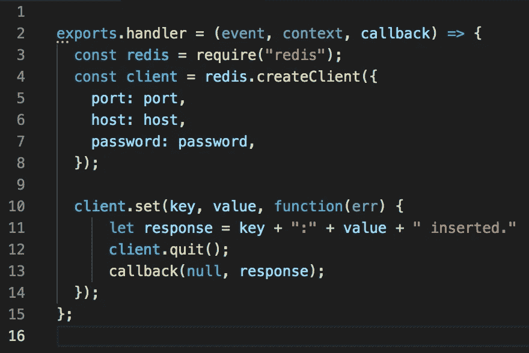

# 使用无服务器 Redis 的自动完成 API

> 原文：<https://levelup.gitconnected.com/autocomplete-api-with-serverless-redis-4f9b1faab39f>



本教程实现了一个由无服务器 Redis 支持的自动完成 API。参见[的演示](https://auto-complete-example.vercel.app/)和 [API 的端点](https://wfgz7cju24.execute-api.us-east-1.amazonaws.com/query?term=ca)和[源代码](https://github.com/upstash/serverless-tutorials/tree/master/auto-complete-api)。

我们将在 Redis 排序集中保存国家名称。在 Redis 排序集合中，具有相同分数的元素按字典顺序排序。所以在我们的例子中，所有的国家名称都有相同的分数，0。我们保留国家的所有前缀，并使用 ZRANK 来查找建议的术语。算法详情见[这篇博文](http://oldblog.antirez.com/post/autocomplete-with-redis.html)。

# 步骤 1:项目设置

如果您还没有安装无服务器框架，请通过:`npm install -g serverless`

在任何文件夹中运行如下`serverless`:

```
>> serverlessServerless: No project detected. Do you want to create a new one? Yes
Serverless: What do you want to make? AWS Node.js
Serverless: What do you want to call this project? test-upstashProject successfully created in 'test-upstash' folder.You can monitor, troubleshoot, and test your new service with a free Serverless account.Serverless: Would you like to enable this? No
You can run the “serverless” command again if you change your mind later.
```

在项目文件夹中，使用以下命令创建一个节点项目:

```
npm init
```

然后安装 redis 客户机，安装时使用:

```
npm install ioredis
```

# 步骤 2: API 实现

如下所示编辑 handler.js 文件。算法详情见[博文](http://oldblog.antirez.com/post/autocomplete-with-redis.html)。

```
var Redis = require("ioredis");
if (typeof client === 'undefined') {
    var client = new Redis(process.env.REDIS_URL);
}
const headers = {
    'Access-Control-Allow-Origin': '*',
    'Access-Control-Allow-Credentials': true,
};module.exports.query = async (event, context, callback) => {
    if (!event.queryStringParameters || !event.queryStringParameters.term) {
        return {
            statusCode: 400,
            headers: headers,
            body: JSON.stringify(
                {
                    message: 'Invalid parameters. Term needed as query param.',
                }
            ),
        };
    }
    let term = event.queryStringParameters.term.toUpperCase();
    let res = []
    let rank = await client.zrank("terms", term)
    if (rank != null) {
        let temp = await client.zrange("terms", rank, rank + 100)
        for (const el of temp) {
            if (!el.startsWith(term)) {
                break;
            }
            if (el.endsWith("*")) {
                res.push(el.substring(0, el.length - 1));
            }
        }
    }
    return {
        statusCode: 200,
        headers: headers,
        body: JSON.stringify(
            {
                message: 'Query:' + event.queryStringParameters.term,
                result: res,
            }
        ),
    };
};
```

# 步骤 3:在 Upstash 上创建数据库

如果您没有数据库，请按照本[指南](https://docs.upstash.com/)创建一个数据库。点击数据库页面内的`Redis Connect`按钮，复制 Redis 网址。复制 ioredis 的 URL，因为我们在应用程序中使用 ioredis。创造。env 文件并粘贴您的 Redis URL:

```
REDIS_URL=YOUR_REDIS_URL
```

# 步骤 4:初始化数据库

我们将用国家名称初始化数据库。从[这里](https://github.com/upstash/serverless-tutorials/blob/master/auto-complete-api/initdb.js)复制并运行 initdb.js 脚本。

我们只需将国家名称及其所有前缀放入排序后的集合中。

```
require('dotenv').config()
var Redis = require("ioredis");var countries = [
    {"name": "Afghanistan", "code": "AF"},
    {"name": "Åland Islands", "code": "AX"},
    {"name": "Albania", "code": "AL"},
    {"name": "Algeria", "code": "DZ"},
    ...
]
var client = new Redis(process.env.REDIS_URL);for (const country of countries) {
    let term = country.name.toUpperCase();
    let terms = [];for (let i = 1; i < term.length; i++) {
        terms.push(0);
        terms.push(term.substring(0, i));
    }
    terms.push(0);
    terms.push(term + "*");
    (async () => {
        await client.zadd("terms", ...terms)
    })();
}
```

# 步骤 5:部署您的功能 [#](https://docs.upstash.com/tutorials/auto_complete_with_serverless_redis#step-5-deploy-your-function)

如下编辑`serverless.yml`并替换您的 Redis URL:

```
service: auto-complete-api
# add this if you set REDIS_URL in .env
useDotenv: true
frameworkVersion: '2'provider:
  name: aws
  runtime: nodejs14.x
  lambdaHashingVersion: 20201221
  environment:
    REDIS_URL: REPLACE_YOUR_REDIS_URLfunctions:
  query:
    handler: handler.query
    events:
      - httpApi:
          path: /query
          method: get
          cors: true
```

在项目文件夹中运行:

```
serverless deploy
```

现在，您可以使用以下命令运行您的函数:

```
serverless invoke -f query -d '{ "queryStringParameters": {"term":"ca"}}'
```

它应该给出以下输出:

```
{
  "statusCode": 200,
  "headers": {
    "Access-Control-Allow-Origin": "*",
    "Access-Control-Allow-Credentials": true
  },
  "body": "{\"message\":\"Query:ca\",\"result\":[\"CAMBODIA\",\"CAMEROON\",\"CANADA\",\"CAPE VERDE\",\"CAYMAN ISLANDS\"]}"
}
```

您还可以使用 AWS 控制台测试您的功能。在 AWS Lambda 部分，单击您的函数。向下滚动到代码部分，点击右上角的`Test`按钮。使用`{ "queryStringParameters": {"term":"ar"}}`作为您的事件数据。

# 步骤 6:本地运行您的函数

在您的项目文件夹中运行:

```
serverless invoke local -f query -d '{ "queryStringParameters": {"term":"ca"}}'
```

它应该给出以下输出:

```
{
  "statusCode": 200,
  "headers": {
    "Access-Control-Allow-Origin": "*",
    "Access-Control-Allow-Credentials": true
  },
  "body": "{\"message\":\"Query:ca\",\"result\":[\"CAMBODIA\",\"CAMEROON\",\"CANADA\",\"CAPE VERDE\",\"CAYMAN ISLANDS\"]}"
}
```

*最初发表于*[T5【https://docs.upstash.com】](https://docs.upstash.com/tutorials/auto_complete_with_serverless_redis)*。*