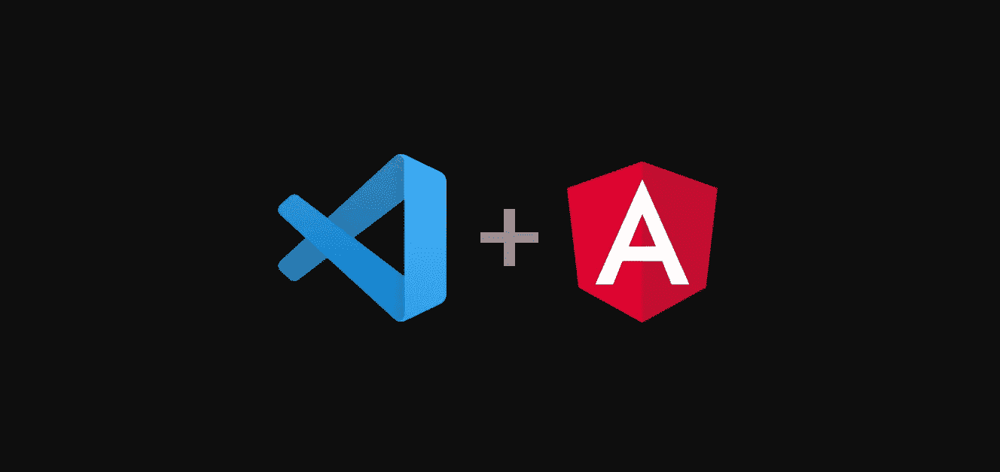
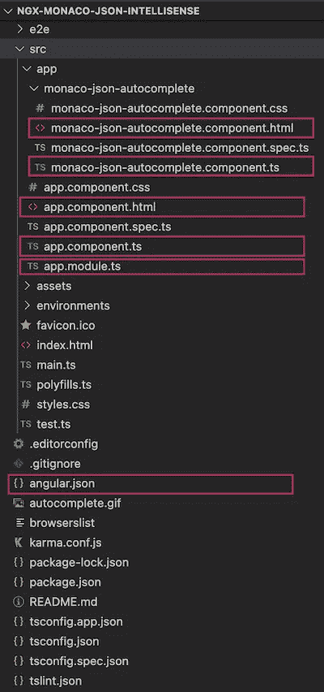
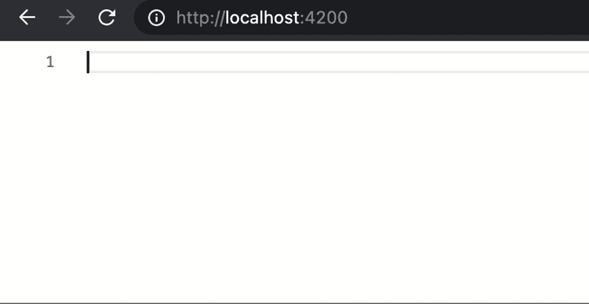

# 用 Angular 和 Monaco 自动完成 JSON

> 原文：<https://levelup.gitconnected.com/autocomplete-json-with-angular-and-monaco-f1dcc01e36e1>



## 让 web 原生编码成为一种特性，而不是一个 bug

微软的 VS 代码近年来越来越受欢迎，这要归功于摩纳哥编辑器。Monaco 编辑器提供了基本的生产力插件和特性，包括:自动完成。这些功能被认为是 IntelliSense，它是任何帮助开发人员的编码功能的统称。[这里的](https://code.visualstudio.com/docs/editor/editingevolved)是对摩纳哥编辑器特性的更好描述。

微软将 Monaco 编辑器的代码开源，这意味着备受喜爱的 VS Code IntelliSense 功能可以并且已经移植到其他平台上。感谢 [atularen](https://github.com/atularen) ，有一个可靠的方法可以将摩纳哥编辑器与 Angular 2 及以上版本集成。本指南将使用 [ngx-monaco-editor](https://www.npmjs.com/package/ngx-monaco-editor) 包为给定的 JSON 模式启用自动完成特性。

本教程的代码在[这里](https://github.com/hyperstripe50/ngx-monaco-json-intellisense)是公开的。

> **注:** 本指南仅适用于 Angular CLI 9.1.12。

# 目录结构参考

下面的文件树供你参考。在本教程中，将编辑洋红色盒装文件。



# 先决条件

*   [角度 CLI 9.1.12](https://www.npmjs.com/package/@angular/cli/v/9.0.4)
*   [NPM](https://nodejs.org/en/download/)

# 设置

更完整的安装指南可以在这里找到，但以下是本教程所要求的。

## 创建项目

创建一个新项目并在其中创建`cd`。

```
ng new ngx-monaco-json-intellisense && cd ngx-monaco-json-intellisense
```

## 安装摩纳哥编辑器包

```
npm install ngx-monaco-editor[@9](http://twitter.com/9).0.0 --save
```

## 编辑 angular.json

将 glob 添加到`angular.json`中，如下例所示。

angular.json

## 在 app.module.ts 中配置摩纳哥

应用程序模块

# 创建编辑器组件

我们将使用 Angular CLI 创建组件`monaco-json-autocomplete`。该组件将配置和显示 Monaco 编辑器。

## 生成摩纳哥-json-autocomplete 组件

```
ng g c monaco-json-autocomplete
```

Monaco 编辑器为 JSON `schema`提供了自动补全功能。该模式定义了 Monaco 将自动完成的 JSON 对象的属性。下面是描述具有一个属性的 JSON 对象的最小模式:`apiVersion`。

该组件将有一个模式的`Input`值。用户可以以 URI 或显式`schema`对象的形式提供字符串值。该组件将从 URI 加载模式，或者简单地使用提供的对象。在编辑器初始化后的任何时候，都可以通过使用`get value()`方法获得编辑器的字符串值。如果组件被扩展为针对编辑器的内容发出输出事件，这将非常有用。

## 编辑 Monaco-JSON-autocomplete . component . ts

摩纳哥-JSON-autocomplete . component . ts

## 编辑 monaco-json-autocomplete.component.html

现在给`monaco-json-autocomplete.component.html`添加相应的 HTML。

monaco-json-autocomplete.component.html

# 使用自动完成组件

选择器`app-monaco-json-autocomplete`现在可以使用自动完成组件了。让我们配置`app.component`来使用它。

## 编辑应用程序.组件. ts

应用程序组件

## 编辑 app.component.html

最后调用`app.component.html`中的选择器。

app.component.html

用`ng serve`运行项目，打开[浏览器](http://localhost:4200)。使用`CTRL + SPACE`显示建议，或者键入一个字母，将出现提前匹配。



# 从服务器加载架构

至此，本教程已经使用了一个模式的显式声明。更实用的方法是从服务器加载模式。从服务器加载将允许您随时更改模式，并且不需要重新构建应用程序。

## 创建一个 JSON 文件

将以下文件另存为`schema.json`。

## 启动简单的服务器

通过将您的目录更改为`schema.json`的目录，用`http-server`托管`schema.json`。

运行以下命令安装`http-server`:

```
npm install http-server -g
```

使用以下命令启动服务器:

```
http-server -p 8000 --cors
```

## 将模式作为 URI 传递

打开`app.component.ts`文件，将显式模式换成对应于`http-server`的`URI`。

## 编辑应用程序.组件. ts

应用程序组件

再次打开 [UI](http://localhost:4200) 查看变化。

# 关于模式的更多信息

Monaco Editor 不仅会对给定的模式执行 typeahead 和 autocomplete，还会显示每个字段的信息并进行验证。下面是一个更详细的模式来显示一些模式属性。关于 JSON 模式的完整文档，请参见这里的。