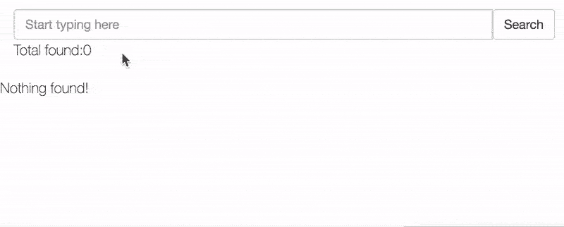
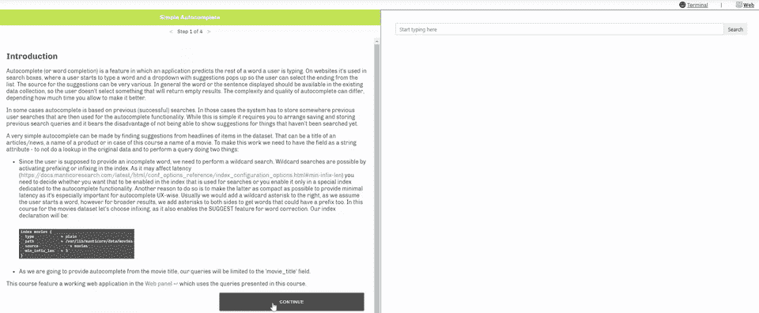

# 蝎狮搜索中的自动完成匹配

> 原文：<https://levelup.gitconnected.com/autocomplete-matching-in-mysql-689a28fceed4>

## 权威指南

## 这篇文章描述了一种在蝎狮搜索中完成单词补全的方法。


蝎狮搜索自动完成

# 什么是自动完成？

Autocomplete(或单词补全)是一种功能，它允许应用程序在用户键入单词时预测单词的剩余部分。它通常是这样工作的:用户开始在搜索栏中键入一个单词，然后弹出一个带有建议的下拉菜单，这样用户就可以从列表中选择一个。

建议的来源可以是多种多样的。如果显示的单词或句子在现有的数据集合中是可用的，那么这是最好的，这样用户就不会选择将返回空结果的东西。但是在某些情况下，autocomplete 是基于以前的(成功的)搜索，理论上可以找到零个结果，但是可能仍然有意义。这完全取决于您的应用程序的具体情况。

最简单的自动完成可以通过从数据集中的项目标题中寻找建议来实现。这可以是一篇文章/新闻的标题，一个产品的名字，或者我们很快就会看到一部电影的名字。为此，我们需要将字段定义为一个[字符串属性](https://docs.manticoresearch.com/latest/html/conf_options_reference/data_source_configuration_options.html#sql-attr-string)或一个[存储字段](https://play.manticoresearch.com/docstore/)。只是为了不在原始数据中做额外的查找。

因为用户应该提供一个不完整的单词，所以我们需要执行通配符搜索。通过激活索引中的前缀或中缀，可以进行通配符搜索。由于[可能会影响响应时间](https://docs.manticoresearch.com/latest/html/conf_options_reference/index_configuration_options.html?_ga=2.5400947.1963281054.1585565336-1675027090.1585565336#min-infix-len)，您需要决定是在用于搜索的索引中启用它，还是仅在专用于自动完成功能的特殊索引中启用它。这样做的另一个原因是使后者尽可能紧凑，以提供最小的延迟，因为它对 UX 方式的自动完成特别重要。通常我们会在右边添加一个通配符星号，因为我们假设用户开始一个单词，但是为了更广泛的结果，我们在两边添加星号以获得也可以有前缀的单词。在本课程中，对于电影数据集，我们选择中缀，因为它还启用了单词更正的建议功能(参见本课程中的[)。我们的索引声明将是:](https://play.manticoresearch.com/didyoumean/)

```
index movies {
  type            = plain
  path            = /var/lib/manticore/data/movies
  source          = movies
  min_infix_len   = 3
}
```

由于我们将从电影标题提供自动完成，我们的查询将限于' movie_title '字段。

# 自动完成电影标题

应用程序的前端可以从搜索框中输入的第一个字符开始查询建议。然而，在索引很大的情况下，这会给系统带来更大的压力，因为它会向服务器发出更多的请求，而且 1-2 个字符的通配符搜索会更慢。让我们假设用户键入“sha”。

```
MySQL [(none)]> SELECT id, movie_title FROM movies WHERE MATCH('@movie_title sha*');
+------+---------------------------------------+
| id   | movie_title                           |
+------+---------------------------------------+
|  118 | A Low Down Dirty Shame                |
|  394 | Austin Powers: The Spy Who Shagged Me |
|  604 | Book of Shadows: Blair Witch 2        |
|  951 | Dark Shadows                          |
| 1318 | Fifty Shades of Black                 |
| 1319 | Fifty Shades of Grey                  |
| 1389 | Forty Shades of Blue                  |
| 1853 | In the Shadow of the Moon             |
| 1928 | Jack Ryan: Shadow Recruit             |
| 3114 | Shade                                 |
| 3115 | Shadow Conspiracy                     |
| 3116 | Shadow of the Vampire                 |
| 3117 | Shadowlands                           |
| 3118 | Shaft                                 |
| 3119 | Shakespeare in Love                   |
| 3120 | Shalako                               |
| 3121 | Shall We Dance                        |
| 3122 | Shallow Hal                           |
| 3123 | Shame                                 |
| 3124 | Shanghai Calling                      |
+------+---------------------------------------+
20 rows in set (0.00 sec)
```

我们主要只关心电影标题，所以我们不会返回所有的列。正如我们所看到的，返回了很多结果。我们可以尝试调整查询，例如通过 facebook likes 添加二级排序，但现在猜测用户在寻找什么还为时过早:

```
MySQL [(none)]> SELECT id, movie_title FROM movies WHERE MATCH('@movie_title sha*') ORDER BY WEIGHT() DESC, cast_total_facebook_likes DESC;
+------+--------------------------------------------------+
| id   | movie_title                                      |
+------+--------------------------------------------------+
|  951 | Dark Shadows                                     |
| 3131 | Shark Tale                                       |
|  394 | Austin Powers: The Spy Who Shagged Me            |
| 3118 | Shaft                                            |
| 4326 | The Shaggy Dog                                   |
| 3142 | Sherlock Holmes: A Game of Shadows               |
| 3134 | Shattered                                        |
| 3123 | Shame                                            |
| 3525 | The Adventures of Sharkboy and Lavagirl 3-D      |
| 3117 | Shadowlands                                      |
| 3129 | Shark Lake                                       |
| 4328 | The Shawshank Redemption                         |
| 3494 | Teenage Mutant Ninja Turtles: Out of the Shadows |
| 3135 | Shattered Glass                                  |
| 3130 | Shark Night 3D                                   |
| 1319 | Fifty Shades of Grey                             |
| 4619 | Tristram Shandy: A Cock and Bull Story           |
|  118 | A Low Down Dirty Shame                           |
| 3132 | Sharknado                                        |
| 1318 | Fifty Shades of Black                            |
+------+--------------------------------------------------+
20 rows in set (0.00 sec)
```

让我们假设用户键入另一个字母:

```
MySQL [(none)]> SELECT id, movie_title FROM movies WHERE MATCH('@movie_title shaf*')  ORDER BY WEIGHT() DES , cast_total_facebook_likes DESC;
+------+-------------+
| id   | movie_title |
+------+-------------+
| 3118 | Shaft       |
+------+-------------+
1 row in set (0.00 sec)
```

现在我们只有一个结果。

让我们再举一个例子，我们键入“shad*”。

```
MySQL [(none)]> SELECT id, movie_title FROM movies WHERE MATCH('@movie_title shad*')  ORDER BY WEIGHT() DES , cast_total_facebook_likes DESC;
+------+--------------------------------------------------+
| id   | movie_title                                      |
+------+--------------------------------------------------+
|  951 | Dark Shadows                                     |
| 3142 | Sherlock Holmes: A Game of Shadows               |
| 3117 | Shadowlands                                      |
| 3494 | Teenage Mutant Ninja Turtles: Out of the Shadows |
| 1319 | Fifty Shades of Grey                             |
| 1318 | Fifty Shades of Black                            |
| 4325 | The Shadow                                       |
| 3115 | Shadow Conspiracy                                |
| 3116 | Shadow of the Vampire                            |
| 1928 | Jack Ryan: Shadow Recruit                        |
| 1389 | Forty Shades of Blue                             |
|  604 | Book of Shadows: Blair Witch 2                   |
| 3114 | Shade                                            |
| 1853 | In the Shadow of the Moon                        |
| 4353 | The Sound and the Shadow                         |
+------+--------------------------------------------------+
15 rows in set (0.00 sec)
```

然后“shado*”:

```
MySQL [(none)]> SELECT id, movie_title FROM movies WHERE MATCH('@movie_title shado*')  ORDER BY WEIGHT() DE C, cast_total_facebook_likes DESC;
+------+--------------------------------------------------+
| id   | movie_title                                      |
+------+--------------------------------------------------+
|  951 | Dark Shadows                                     |
| 3142 | Sherlock Holmes: A Game of Shadows               |
| 3117 | Shadowlands                                      |
| 3494 | Teenage Mutant Ninja Turtles: Out of the Shadows |
| 4325 | The Shadow                                       |
| 3115 | Shadow Conspiracy                                |
| 3116 | Shadow of the Vampire                            |
| 1928 | Jack Ryan: Shadow Recruit                        |
|  604 | Book of Shadows: Blair Witch 2                   |
| 1853 | In the Shadow of the Moon                        |
| 4353 | The Sound and the Shadow                         |
+------+--------------------------------------------------+
11 rows in set (0.00 sec)
```

和“影子”:

```
MySQL [(none)]> SELECT id, movie_title FROM movies WHERE MATCH('@movie_title shadow')  ORDER BY WEIGHT() DE C, cast_total_facebook_likes DESC;
+------+---------------------------+
| id   | movie_title               |
+------+---------------------------+
| 4325 | The Shadow                |
| 3115 | Shadow Conspiracy         |
| 3116 | Shadow of the Vampire     |
| 1928 | Jack Ryan: Shadow Recruit |
| 1853 | In the Shadow of the Moon |
| 4353 | The Sound and the Shadow  |
+------+---------------------------+
6 rows in set (0.00 sec)
```

假设用户正在寻找“shadow”作为第一个单词，他将继续键入另一个单词，例如“shadow c”:

```
MySQL [(none)]> SELECT id, movie_title FROM movies WHERE MATCH('@movie_title shadow c*')  ORDER BY WEIGHT() DESC, cast_total_facebook_likes DESC;
+------+-------------------+
| id   | movie_title       |
+------+-------------------+
| 3115 | Shadow Conspiracy |
+------+-------------------+
1 row in set (0.01 sec)
```

在这种情况下，我们得到的结果应该会让用户满意，但在其他情况下，我们可能会得到更多，用户会像输入第一个单词一样继续输入字母，蝎狮会根据输入返回更多的建议:



# 添加更多过滤器

在前面的例子中，匹配项的唯一限制是作为指定字段的一部分。如果我们愿意，我们可以有一个更严格的自动完成。

例如，这里我们得到以“americ”开头的匹配，比如“American Hustle”，但也有“美国队长:内战”:

```
MySQL [(none)]> SELECT id, movie_title FROM movies WHERE MATCH('@movie_title americ* ') ORDER BY WEIGHT() D SC, cast_total_facebook_likes DESC;
+------+---------------------------------------------------+
| id   | movie_title                                       |
+------+---------------------------------------------------+
|  277 | American Hustle                                   |
|  701 | Captain America: Civil War                        |
|  703 | Captain America: The Winter Soldier               |
|  282 | American Psycho                                   |
| 2612 | Once Upon a Time in America                       |
|  272 | American Gangster                                 |
|  702 | Captain America: The First Avenger                |
|  269 | American Beauty                                   |
|  478 | Beavis and Butt-Head Do America                   |
|  284 | American Sniper                                   |
| 4036 | The Legend of Hell's Gate: An American Conspiracy |
|  273 | American Graffiti                                 |
|  285 | American Splendor                                 |
|  274 | American Heist                                    |
|  287 | America's Sweethearts                             |
|  283 | American Reunion                                  |
|  280 | American Pie                                      |
|  281 | American Pie 2                                    |
|  271 | American Dreamz                                   |
|  286 | American Wedding                                  |
+------+---------------------------------------------------+
20 rows in set (0.00 sec)
```

我们可以使用 start 字段操作符只显示以输入术语开头的记录:

```
MySQL [(none)]> SELECT id, movie_title FROM movies WHERE MATCH('@movie_title ^americ* ') ORDER BY WEIGHT()  ESC, cast_total_facebook_likes DESC;
+------+-------------------------------------+
| id   | movie_title                         |
+------+-------------------------------------+
|  277 | American Hustle                     |
|  282 | American Psycho                     |
|  272 | American Gangster                   |
|  269 | American Beauty                     |
|  284 | American Sniper                     |
|  273 | American Graffiti                   |
|  285 | American Splendor                   |
|  274 | American Heist                      |
|  287 | America's Sweethearts               |
|  283 | American Reunion                    |
|  280 | American Pie                        |
|  281 | American Pie 2                      |
|  271 | American Dreamz                     |
|  286 | American Wedding                    |
|  276 | American History X                  |
|  268 | America Is Still the Place          |
|  279 | American Outlaws                    |
|  275 | American Hero                       |
|  278 | American Ninja 2: The Confrontation |
|  270 | American Desi                       |
+------+-------------------------------------+
20 rows in set (0.00 sec)
```

我们应该考虑的另一件事是重复。这更适用于我们希望在没有唯一值的字段上自动完成的情况。作为一个例子，让我们试着用一个演员的名字来自动完成:

```
MySQL [(none)]> SELECT actor_1_name FROM movies WHERE MATCH('@actor_1_name john* ');
+--------------------+
| actor_1_name       |
+--------------------+
| Johnny Depp        |
| Johnny Depp        |
| Johnny Depp        |
| Dwayne Johnson     |
| Johnny Depp        |
| Johnny Depp        |
| Don Johnson        |
| Dwayne Johnson     |
| Johnny Depp        |
| Johnny Depp        |
| Johnny Depp        |
| Johnny Depp        |
| Johnny Depp        |
| Dwayne Johnson     |
| Johnny Depp        |
| Johnny Depp        |
| R. Brandon Johnson |
| Dwayne Johnson     |
| Johnny Depp        |
| Johnny Depp        |
+--------------------+
20 rows in set (0.09 sec)
```

我们可以看到很多复制品。这可以通过简单地对该字段进行分组来解决——假设我们将它作为一个字符串属性:

```
MySQL [(none)]> SELECT actor_1_name FROM movies WHERE MATCH('@actor_1_name john* ') GROUP BY actor_1_name;
+------------------------+
| actor_1_name           |
+------------------------+
| Johnny Depp            |
| Dwayne Johnson         |
| Don Johnson            |
| R. Brandon Johnson     |
| Johnny Pacar           |
| Kenny Johnston         |
| Johnny Cannizzaro      |
| Nicole Randall Johnson |
| Johnny Lewis           |
| Richard Johnson        |
| Bill Johnson           |
| Eric Johnson           |
| John Belushi           |
| John Cothran           |
| John Ratzenberger      |
| John Cameron Mitchell  |
| John Saxon             |
| John Gatins            |
| John Boyega            |
| John Michael Higgins   |
+------------------------+
20 rows in set (0.10 sec)
```

# 突出

自动完成查询可以返回包含高亮显示的的结果。虽然它也可以在应用程序端执行，但蝎狮搜索完成的突出显示更强大，因为它将遵循搜索查询(相同的标记化设置，查询中的[和【NOTs】，ORs 和](https://play.manticoresearch.com/fulltextintro/)等)。以前面的例子为例，我们需要做的就是使用“SNIPPET”函数:

```
MySQL [(none)]> SELECT SNIPPET(actor_1_name,' john*')  FROM movies WHERE MATCH('@actor_1_name john* ')  GROUP BY actor_1_name  ORDER BY WEIGHT() DESC, cast_total_facebook_likes DESC;
+--------------------------------+
| snippet(actor_1_name,' john*') |
+--------------------------------+
| <b>Johnny</b> Depp             |
| Dwayne <b>Johnson</b>          |
| <b>Johnny</b> Pacar            |
| Don <b>Johnson</b>             |
| <b>Johnny</b> Cannizzaro       |
| <b>Johnny</b> Lewis            |
| Eric <b>Johnson</b>            |
| Nicole Randall <b>Johnson</b>  |
| Kenny <b>Johnston</b>          |
| R. Brandon <b>Johnson</b>      |
| Bill <b>Johnson</b>            |
| Richard <b>Johnson</b>         |
| <b>John</b> Ratzenberger       |
| <b>John</b> Belushi            |
| <b>John</b> Cameron Mitchell   |
| <b>John</b> Cothran            |
| Olivia Newton-<b>John</b>      |
| <b>John</b> Michael Higgins    |
| <b>John</b> Witherspoon        |
| <b>John</b> Amos               |
+--------------------------------+
20 rows in set (0.00 sec)
```

除了使用中缀和前缀，在蝎狮还有其他方式来完成自动完成:使用[调用关键字](https://docs.manticoresearch.com/latest/html/sphinxql_reference/call_keywords_syntax.html)，打开或不打开 [bigram_index](https://docs.manticoresearch.com/latest/html/conf_options_reference/index_configuration_options.html#bigram-index) ，使用[调用 QSUGGEST](https://docs.manticoresearch.com/latest/html/sphinxql_reference/call_qsuggest_syntax.html) / [调用建议](https://docs.manticoresearch.com/latest/html/sphinxql_reference/call_suggest_syntax.html)。但是本文中展示的方式似乎是最容易上手的。如果你想玩蝎狮搜索，试试我们的 [docker image](https://hub.docker.com/r/manticoresearch/manticore) ，它有一个命令行程序，可以在几秒钟内在任何服务器上运行蝎狮。



蝎狮搜索—简单的自动完成课程

# 互动课程

本教程以[交互式课程](https://play.manticoresearch.com/simpleautocomplete/)的形式提供，该课程以命令行和 web 面板为特色，允许您交互式地使用上述示例。