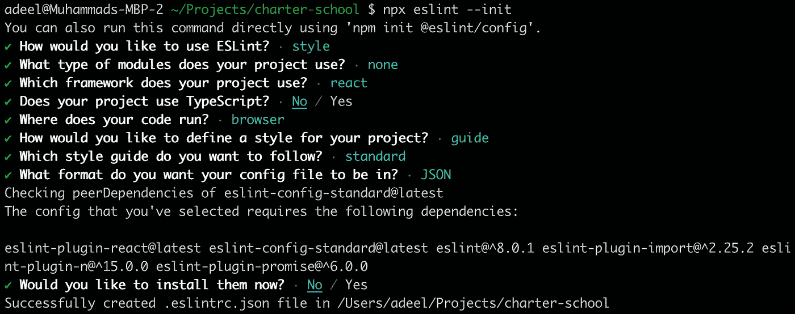

# 使用 ESLint、Prettier、Lint-Staged 和 Husky 自动化并保持代码的一致性

> 原文：<https://levelup.gitconnected.com/automate-and-keep-your-code-consistent-using-eslint-prettier-lint-staged-and-husky-3e186977d7eb>

## 你的代码在不同的开发者之间是一致的吗？您总是在提交之前手动修复 lint 错误和格式问题吗？如果是这样，这篇文章是给你的


布莱克·康纳利在 [Unsplash](https://unsplash.com/s/photos/code-formatting?utm_source=unsplash&utm_medium=referral&utm_content=creditCopyText) 上的照片

当与几个程序员一起工作时，代码风格从不保持一致，并且总是很难保持一致的可读和可维护的代码。

幸运的是，有一种简单的方法可以通过使用 linter 来改进您的代码库，它不仅可以改进代码，还可以使整个团队的代码统一起来。在 linter 的帮助下，来自多个开发人员的不同编码风格融合在一起，最终的代码变得可读和可维护。

在本文中，我们将使用 [**ESLint**](https://eslint.org/) 、[**appetter**](https://prettier.io/)、 [**Husky**](https://typicode.github.io/husky/#/) 和 [**Lint-Staged**](https://github.com/okonet/lint-staged) 来自动化该过程，以确保代码被格式化并修复诸如语法错误之类的编程错误。

> **注:**我在一个名为“ [**Commitzen**](https://commitizen-tools.github.io/commitizen/) ”的团队工作时，发现还有一个工具很有用，它用于定义一种为提交消息设置规则的标准化方式，但这个工具是另一天用的。

是时候深入研究在您的下一个应用程序中安装和使用它们所需的包了。

## 1.必需的软件包安装

首先我们需要安装所有需要的软件包，它们是:

*   **ESLint —** 是一个解析器，用于检查代码并报告 bug、编码错误或打字错误。
*   **更漂亮—** 是一个根据配置格式化代码的工具，我们稍后会看到。
*   **Lint-Staged —** 用于运行 linter 到 staged git 文件，防止提交错误代码。
*   **Husky —** 是一个与 Git 挂钩(如预提交、提交消息、后提交等)协同工作的工具。

如果您使用的是`npm`包管理器，安装所有四个包需要运行的命令应该是这样的:

```
npm install --save-dev eslint prettier lint-staged husky
```

## 2. **ESLint 配置**

现在让我们配置已安装的包，从 ESLint 开始。用于初始化 ESLint 的命令将是:

```
npx eslint --init
```

将出现下面的屏幕，您需要根据自己的需要回答几个问题，配置将被相应地保存。



配置文件类似于下面的内容:

```
{
    "env": {
        "browser": true,
        "es2021": true
    },
    "extends": [
        "plugin:react/recommended",
        "standard"
    ],
    "parserOptions": {
        "ecmaFeatures": {
            "jsx": true
        },
        "ecmaVersion": "latest"
    },
    "plugins": [
        "react"
    ],
    "rules": {
    }
}
```

您还可以创建一个名为`.eslintrc.json`的文件，粘贴上面的配置，而不是运行`npx`命令，并检查整个问题列表。

详细阅读关于 ESLint 规则的更多信息，然后查看 [**ESLint 规则文档**](https://eslint.org/docs/latest/rules/) **。**

## 3.漂亮的配置

为了配置得更漂亮，您需要在应用程序的根文件夹中创建一个`.prettierrc.json`文件，并粘贴以下配置:

```
{
  "bracketSpacing": true,
  "semi": true,
  "singleQuote": true,
  "trailingComma": "all",
  "printWidth": 80,
  "tabWidth": 2
}
```

更漂亮的配置有多种选择，看看[更漂亮的文档](https://prettier.io/docs/en/options.html)。

如果你想忽略一些文件格式使用漂亮，添加一个`.prettierignore`文件在根应用程序文件夹和添加文件在那里。

例如，您可以将以下文件和文件夹添加到`.prettierignore`文件中，因为格式化时不需要它们:

```
package-lock.json
node_modules
```

## **4。棉绒分级配置**

Lint-Staged 的配置并不具有挑战性，所以打开`package.json`文件，最后，在其他配置之后，添加如下配置部分:

```
{
  *...
  ...* "lint-staged": {
    "**/*.{js,jsx}": ["eslint . --fix", "prettier --write ."]
  }
}
```

"`**/*.{js,jsx}`"这个脚本将在您的整个应用程序上运行，这意味着所有带有`js`和`jsx`扩展名的文件，但是如果您想只在 src 文件夹内的文件上执行`lint-staged`，那么就改为编写这个脚本:

```
"src/*.{js,jsx}": ["eslint . --fix", "prettier --write ."]
```

在上述配置中，“…”表示其他配置，您不需要在您的`package.json`文件中添加这些点。

## 5.配置 Husky

我们整个配置的最后一节是 Husky，配置 Husky 有几种方式，但是我们在这里会尽量保持简单。同样，您需要打开 package.json 文件，并在所有其他配置之后添加以下脚本，如下所示:

```
{
  *...
  ...* "scripts": {
    *< ---- other scripts remains here ---- >* "execute-husky": "npx husky install && npx husky add .husky/pre-commit \"npx --no-install lint-staged\""
  },
  "husky": {
    "hooks": {
      "pre-commit": "lint-staged"
    }
  }
}
```

现在您已经在`package.json`文件中添加了上述配置，执行将安装 Husky 的“`execute-husky`”脚本，同时也将触发`pre-commit`钩子。您可以使用`npm`命令运行`execute-husky`命令，例如:

```
npm run execute-husky
```

**您已经完成了这里的所有配置，现在尝试提交您的更改并查看结果。🎉**

*在…*[*Twitter*](https://twitter.com/m_adeel91)*，*[*LinkedIn*](https://www.linkedin.com/in/muhammad-adeel-9ba19951/)*，或者* [*GitHub*](https://github.com/Adeel91)

如果你喜欢阅读这样的故事，并想支持我成为一名作家，可以考虑[报名成为一名媒体成员](https://medium.com/@muhammad-adeel-91/membership)。每月 5 美元，你可以无限制地阅读媒体上的故事。如果你注册使用我的链接，我会赚一小笔佣金。

[](https://medium.com/@muhammad-adeel-91/membership) [## 通过我的推荐链接加入媒体-穆罕默德·阿德勒

### 阅读默罕默德·阿德勒(以及媒体上成千上万的其他作家)的每一个故事。您的会员费直接支持…

medium.com](https://medium.com/@muhammad-adeel-91/membership) 

[***给我买杯咖啡***](https://www.buymeacoffee.com/muhammadadeel)***☕***