# 使用 GitHub Actions 将 Angular SPA 应用程序自动部署到亚马逊 S3

> 原文：<https://levelup.gitconnected.com/automate-angular-spa-application-deployment-to-amazon-s3-using-github-actions-eca72bdd6dda>

在这个故事中，我们将展示如何使用 GitHub Actions 将 Angular SPA 应用程序配置和部署到亚马逊 S3。

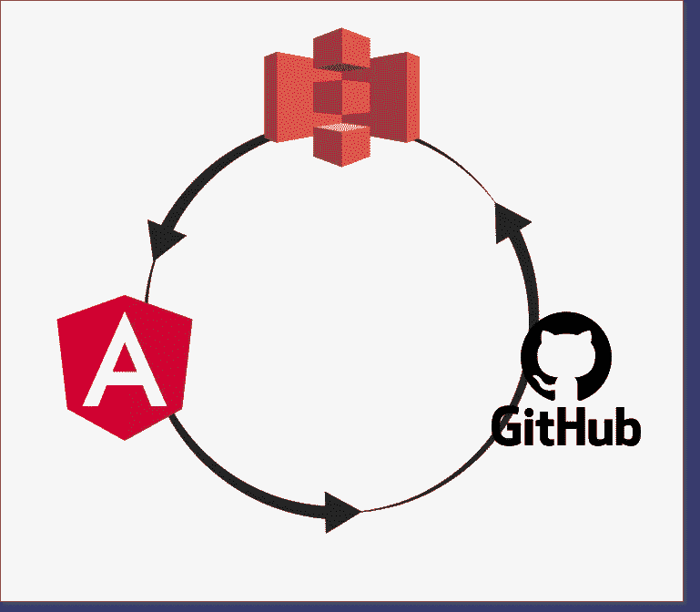

# 先决条件

这是追踪这个故事的所有先决条件的列表:

*   结节
*   角度 CLI
*   有效的 AWS 帐户
*   GitHub 知识库
*   饭桶

# 什么是亚马逊 S3？

亚马逊 S3 是一个简单的存储服务，帮助开发人员和 IT 团队存储、备份、存档和检索网络上任何地方的数据。它允许管理员按类别存储数据，为对象添加标签，为多个客户端配置访问控制，执行大容量数据分析，深入了解存储使用情况，并根据活动衡量趋势。

> [https://aws.amazon.com/s3/](https://aws.amazon.com/s3/)

# 在 AWS 控制台中设置 **S3 桶**

## **创建 s3 桶**

登录 AWS 管理控制台(https://Console . AWS . Amazon . com/Console/home)后，

***转至服务- >存储- > S3***

然后按下*** *创建桶**** 按钮。

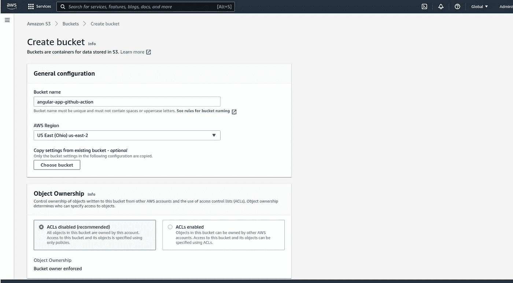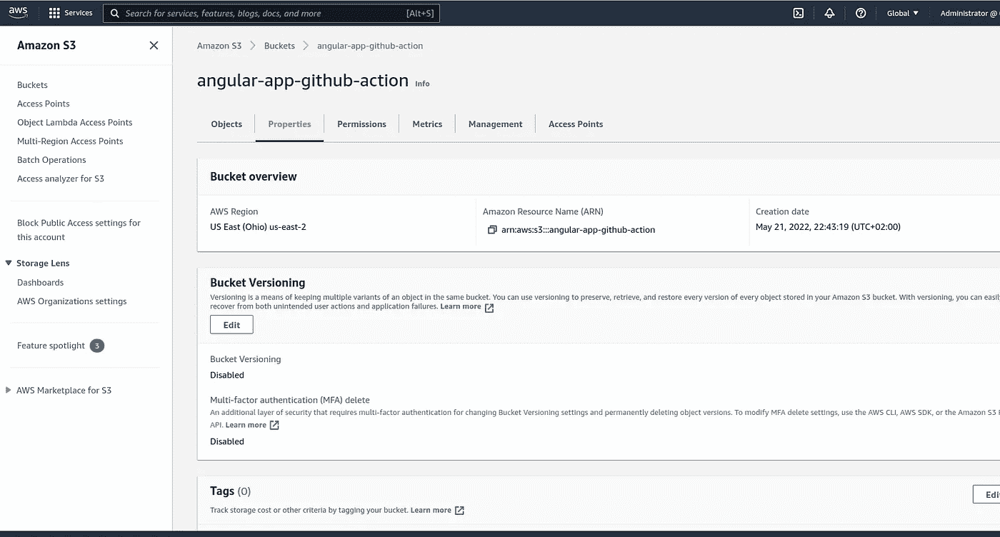

## 添加存储桶策略

转到存储桶>权限选项卡>存储桶策略

添加用 JSON 编写的存储桶策略

要修复“ ***调用 PutObject 操作时出错(AccessControlListNotSupported):bucket 不允许 ACL***”，我们需要启用 bucket ACLs

转到存储桶>权限选项卡>对象所有权

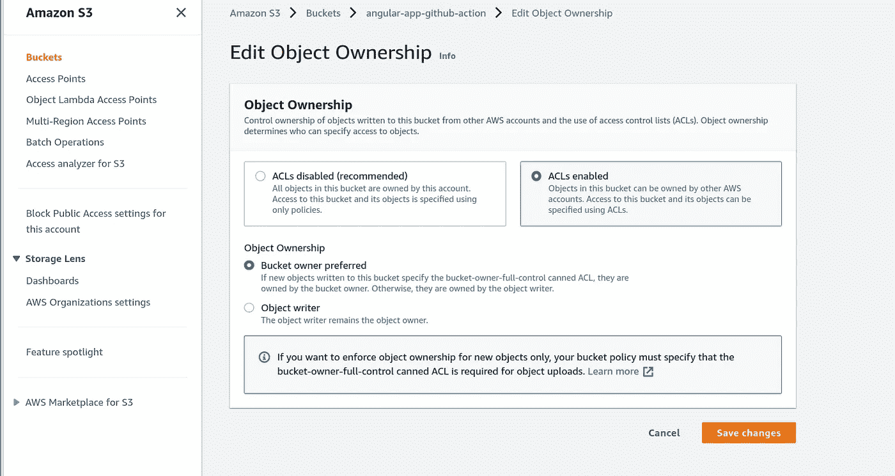

## **为 Github 创建一个 IAM 用户**

前往[https://console.aws.amazon.com/iam/](https://console.aws.amazon.com/iam/)。在导航窗格中，选择用户，然后选择*** *添加用户**** 。

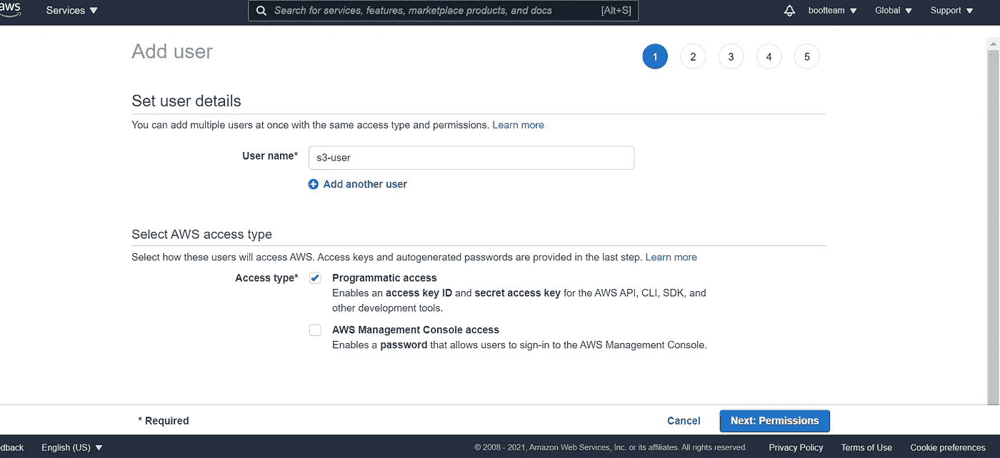

按下一步:权限按钮->转到为我们的新用户设置权限。

现在，选择直接附加现有策略->过滤策略类型 s3，然后选中 ****AmazonS3FullAccess**** 。然后点击“下一篇评论”。

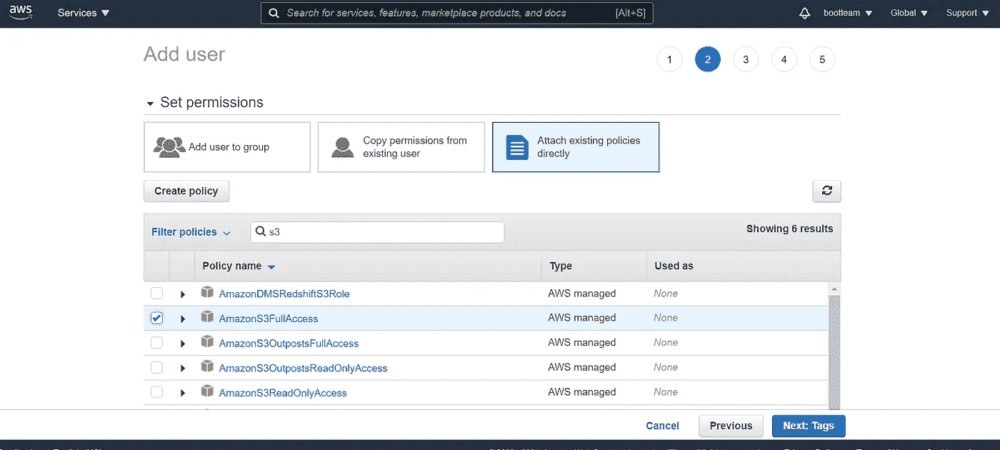

成功创建用户后，下载。用于下载凭据的 csv。{访问密钥 ID，秘密访问密钥}。

# GitHub 存储库设置

## 创建项目存储库

在您的 Github 帐户中，创建一个公共存储库

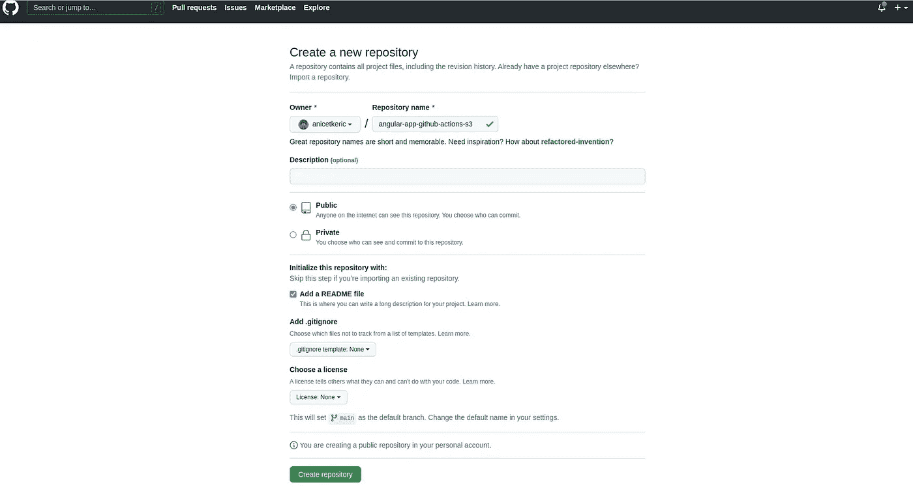

## 添加动作秘密

点选选单设定>机密>动作

用访问密钥 ID 和秘密访问密钥填充密钥/值。例如:对于“访问密钥 ID ”,我们将密钥命名为 **AWS_ACCESS_KEY_ID** ,这些值是从 AWS 获得的。我们将对秘密访问密钥( **AWS_SECRET_ACCESS_KEY** )做同样的事情

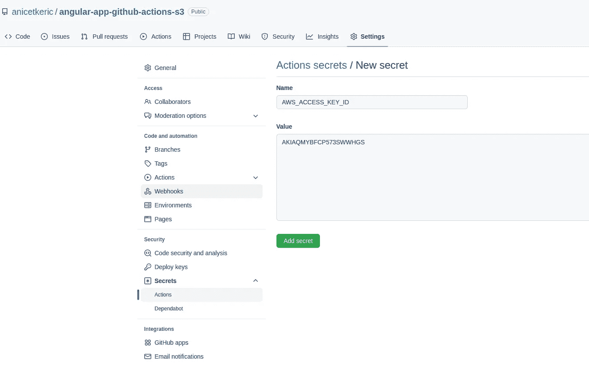

# 创建和配置角度应用程序

现在，让我们创建角度项目。

*   **克隆项目**

*git clone*[*https://github . com/anicetkeric/angular-app-github-actions-S3 . git*](https://github.com/anicetkeric/angular-app-github-actions-s3.git)

*   **创建一个新的工作空间和一个初始应用**

`ng new angular-app-github-actions-s3`

*   **服务应用**

`ng serve --open`

`--open`(或者只是`-o`)选项会自动打开你的浏览器到`[http://localhost:4200/](http://localhost:4200/.)` [。](http://localhost:4200/.)

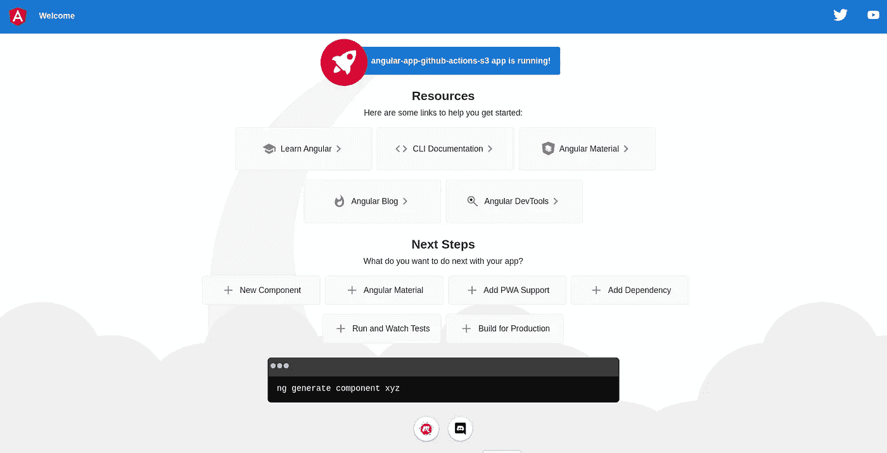

*   创建。**项目目录中的 github/workflows/main-deploy . yml**文件

*   **AWS_ACCESS_KEY_ID** : AWS 访问密钥
*   **AWS _ SECRET _ ACCESS _ KEY**:AWS 秘密访问密钥
*   **AWS _ S3 _ 桶**:我们正在同步的桶的名称。
*   **AWS_REGION** :创建桶的区域。

现在，把代码发送到主分支。

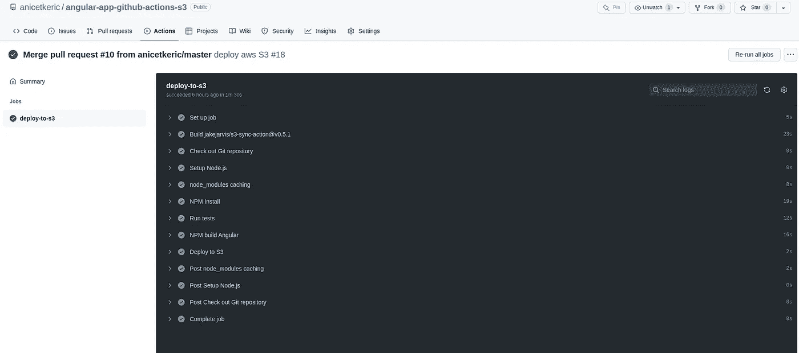

如上图所示，我们创建的所有步骤都已成功执行。

我们的应用程序在 AWS S3 bucket 中可用，可以通过 bucket 网站端点访问。

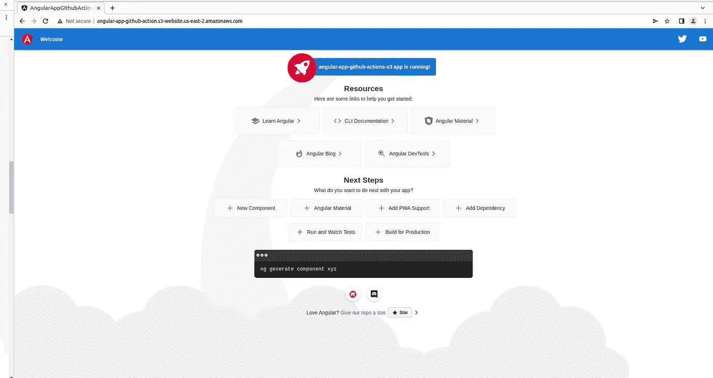

完成了。

完整的源代码可以在 [GitHub](https://github.com/anicetkeric/angular-app-github-actions-s3) 上找到。

# 参考

*   [https://docs.github.com/en/actions/learn-github-actions](https://docs.github.com/en/actions/learn-github-actions)
*   [https://github.com/jakejarvis/s3-sync-action](https://github.com/jakejarvis/s3-sync-action)