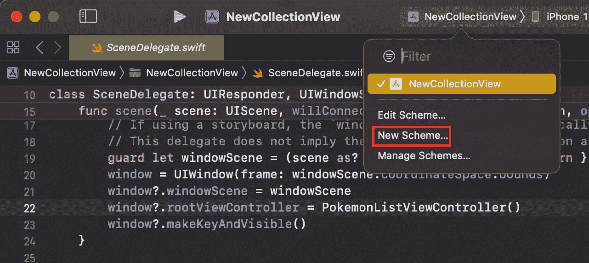
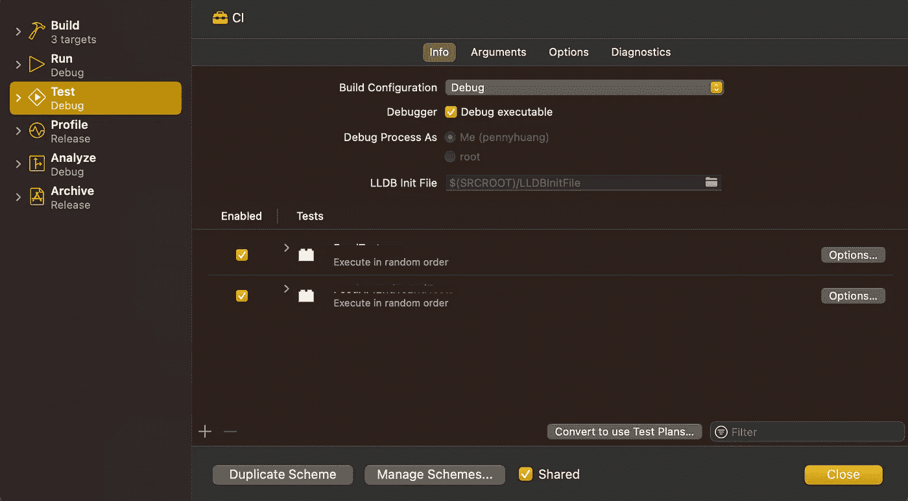
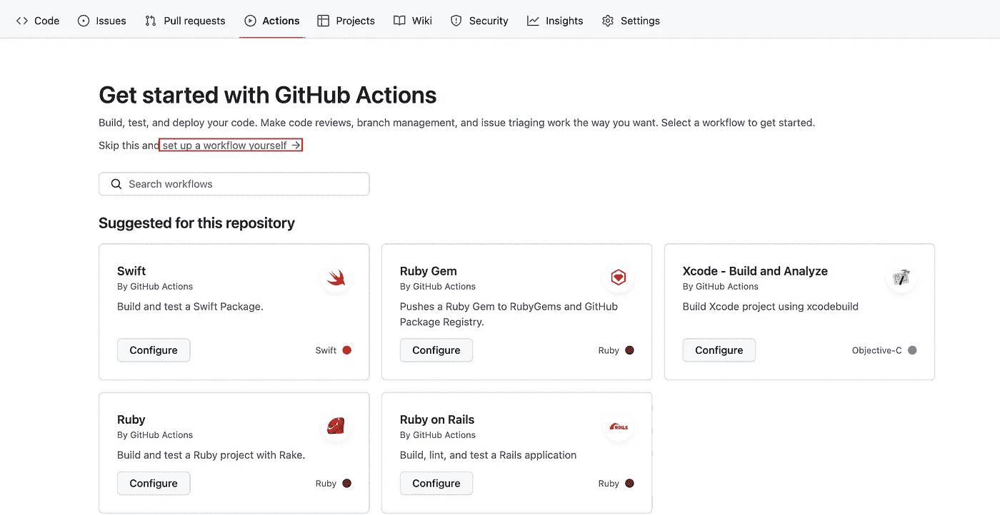
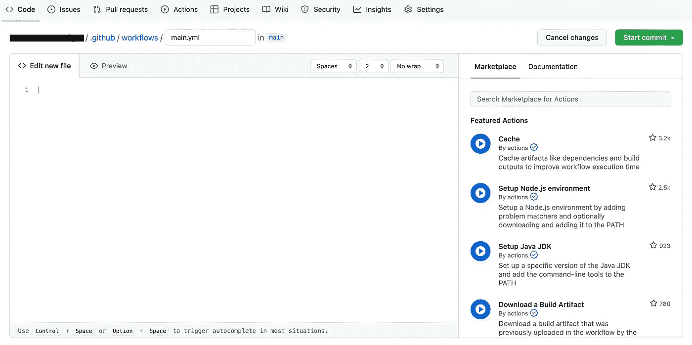
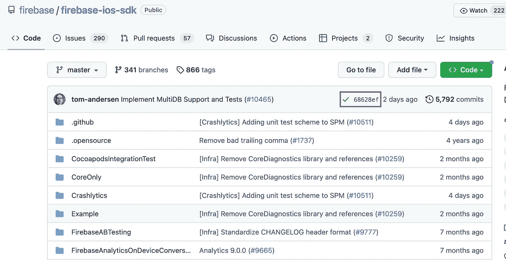
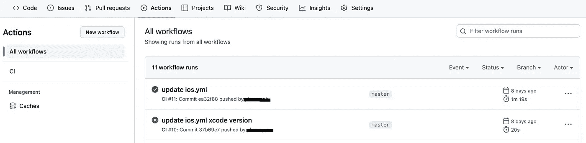
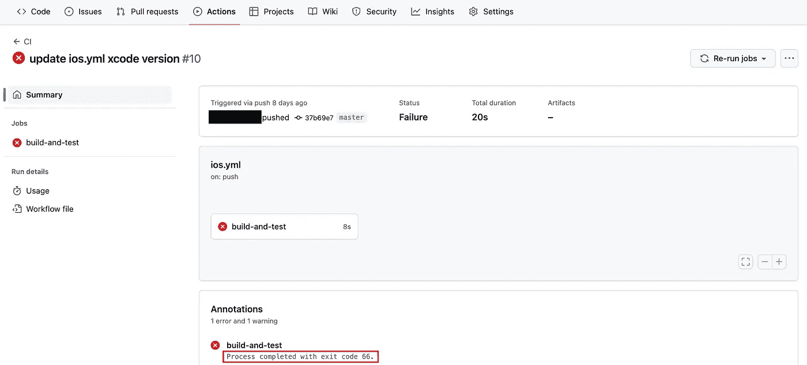
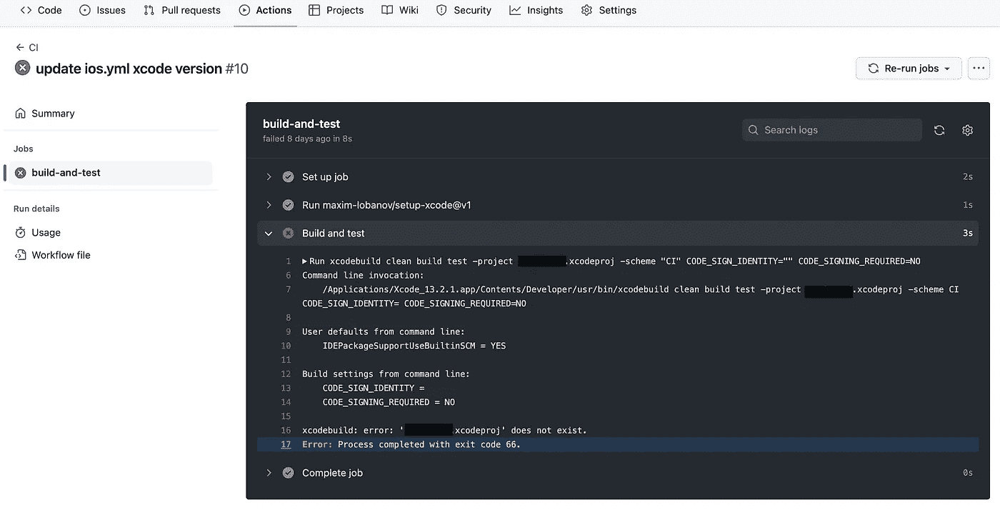

# 通过 GitHub 操作实现 iOS 应用的自动化持续集成(CI)

> 原文：<https://levelup.gitconnected.com/automate-continuous-integration-ci-for-ios-apps-with-github-actions-98a5b6d48d7f>

## 关于如何在 GitHub 上为 iOS 应用程序自动化 CI 管道的分步教程


照片由[rich Great](https://unsplash.com/@richygreat?utm_source=medium&utm_medium=referral)在 [Unsplash](https://unsplash.com?utm_source=medium&utm_medium=referral) 上拍摄

## 先决条件

已经创建了一个名为 **CI** 的方案来定义在持续集成期间要执行的测试。当变更被合并到 master 时，这些测试将被触发，以立即检测任何错误。

如果您还没有为您的持续集成创建一个，请先这样做。



并选择要执行的测试。



## **在 GitHub 上设置 CI**

转到您想要添加 CI 管道的 GitHub 存储库。

转到**操作**并选择**自行设置工作流程**。



它将帮助您创建一个 YAML 文件。



在空文件中，粘贴以下代码，并单击**开始提交**。

关于 YAML 档案中所写的一些解释:

```
name: CI 
```

此工作流的名称。这是可选的。它将出现在 GitHub 存储库的**动作**选项卡中。

```
runs-on: macos-latest
```

这一行将作业配置为在最新版本的 macOS runner 上运行。然而，标签`macos-latest`并不总是最新的版本；目前是 macOS 11，但很快就会变成 macOS 12。如果你现在想在 macOS 12 上运行，使用标签`macos-12`。

要查找可用的跑步者图片，请点击查看[。](https://github.com/actions/runner-images)

```
- name: Checkout repository
  uses: actions/checkout@v3
```

该操作将您的存储库签出到 runner 上，以便您的脚本可以针对您的代码运行。

GitHub Docs 规定:

> 任何时候，当你的工作流运行在库的代码上时，你都应该使用签出操作。

```
- uses: maxim-lobanov/setup-xcode@v1 
  with: 
    xcode-version: latest-stable
```

此操作会将配置为使用最新的稳定 Xcode 版本。

您也可以指定使用特定的 Xcode 版本，如下所示:

```
- uses: maxim-lobanov/setup-xcode@v1 
  with: 
    xcode-version: '14.0'
```

```
- name: Build and test 
  run: xcodebuild clean build test -project <yourProjectName>.xcodeproj -scheme “<yourScheme>” CODE_SIGN_IDENTITY=”” CODE_SIGNING_REQUIRED=NO
```

这个脚本清理构建并测试我的项目。

如果你想在你的工作空间而不是 Xcode 项目上运行，用`-workspace`代替`-project`。

```
-workspace <yourWorkspaceName>.xcworkspace
```

在将脚本部署到 GitHub 之前，尝试在终端上运行脚本，以确保脚本可以成功运行。这可能需要几秒钟。如果一切顺利，您将看到 ****清理成功** 、**构建成功** 、**测试成功**** 分别出现。

现在您已经完成了设置。当您推送新的提交时，此处会出现一个图标，显示此提交是否通过所有检查。



转到存储库的**操作**，您可以看到所有工作流运行的状态。



您也可以在运行中检查错误。



查看构建和测试过程中发生了什么。



## 参考资料:

[](https://docs.github.com/en/actions/using-workflows/about-workflows) [## 关于工作流程- GitHub 文档

### 工作流是一个可配置的自动化流程，将运行一个或多个作业。工作流由 YAML 文件定义…

docs.github.com](https://docs.github.com/en/actions/using-workflows/about-workflows) [](https://github.com/marketplace/actions/setup-xcode-version) [## 设置 Xcode 版本- GitHub 市场

### 此操作旨在 GitHub 操作中在预装版本的 Xcode for macOS 映像之间切换。列表…

github.com](https://github.com/marketplace/actions/setup-xcode-version) [](https://www.essentialdeveloper.com/articles/s02e21-migrating-to-swift-5-2-and-ci-with-github-actions-professional-ios-engineering-series) [## S02E21:使用 GitHub Actions 迁移到 Swift 5.2 和 CI 专业 iOS 工程系列…

### 在这一集中，我们将测验项目迁移到 Swift 5.2 和 Xcode 11.4.1。我们还将 CI 服务器迁移到了 GitHub…

www.essentialdeveloper.com](https://www.essentialdeveloper.com/articles/s02e21-migrating-to-swift-5-2-and-ci-with-github-actions-professional-ios-engineering-series) [](https://engineering.talkdesk.com/test-and-deploy-an-ios-app-with-github-actions-44de9a7dcef6) [## 使用 GitHub 操作测试和部署 iOS 应用程序

### Github 去年夏天公布了 Github 行动。有了这个新工具，您可以分析、构建、测试和部署您的项目…

engineering.talkdesk.com](https://engineering.talkdesk.com/test-and-deploy-an-ios-app-with-github-actions-44de9a7dcef6)  [## 使用 Xcode 从命令行构建常见问题

### 本文档提供了关于命令行工具的常见问题解答。命令行工具包…

developer.apple.com](https://developer.apple.com/library/archive/technotes/tn2339/_index.html) 

# 分级编码

感谢您成为我们社区的一员！在你离开之前:

*   👏为故事鼓掌，跟着作者走👉
*   📰更多内容请查看[升级编码刊物](https://levelup.gitconnected.com/?utm_source=pub&utm_medium=post)
*   🔔关注我们:[推特](https://twitter.com/gitconnected) | [LinkedIn](https://www.linkedin.com/company/gitconnected) | [时事通讯](https://newsletter.levelup.dev)

🚀👉 [**加入升级人才集体，找到一份神奇的工作**](https://jobs.levelup.dev/talent/welcome?referral=true)