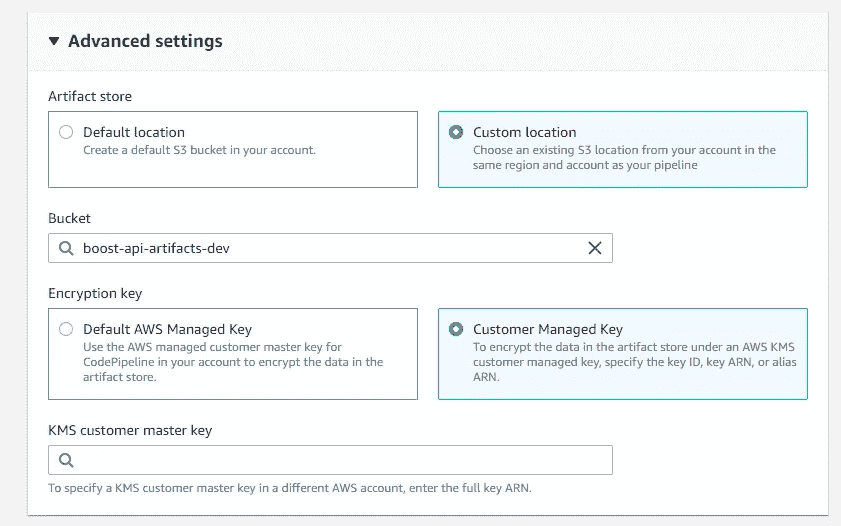

# 使用 AWS CodePipeline 自动化跨客户云信息部署

> 原文：<https://levelup.gitconnected.com/automate-cross-account-cloudformation-deployment-using-aws-codepipeline-c71d81b45722>

[https://unsplash.com/](https://unsplash.com/)

在大多数大型企业应用程序中，使用多个 AWS 帐户比在每个环境中使用一个 AWS 帐户更好。至少，您应该有一个不同的 AWS 帐户用于生产环境，另一个帐户用于处理其他环境。在今天的文章中，我将展示当我们涉及多个客户时，如何在这些环境之间自动创建 AWS 基础设施。

在我们的应用程序中，假设我们有三个 AWS 帐户

*   基础设施客户——负责使用管道创建自动化，维护日志文件等..(跨所有其他环境的共享应用程序)
*   开发客户——负责开发环境的所有 AWS 基础设施
*   生产客户—负责生产环境的所有 AWS 基础架构

在本文中，我将展示如何为 Dev 帐户进行跨帐户部署。对于生产环境也可以这样做。

为了实现这一目标，我们需要执行以下步骤。

*   在我们的**开发账户**中创建一个**交叉账户-iam-角色**。这个 IAM 角色应该拥有 cloudformation 所需的所有权限，以便创建/更新适当的基础设施。这个想法是，当 codepipeline 运行时，它将承担这个角色。
*   在基础设施帐户中创建代码构建角色。
*   在**基础设施账户**中创建一个新的 **KMS 客户管理密钥**。我们还需要为 Dev 帐户提供使用该密钥的权限。
*   在**基础设施帐户**中创建一个**部署工件 S3 存储桶**，并使用我们创建的 KMS 密钥对项目进行加密。
*   授予工件存储桶为 Dev 帐户用户列出和获取项目的权限。
*   在**基础设施帐户**中创建一个**代码构建角色**，并添加一个信任关系策略来承担我们之前创建的**跨帐户角色**。
*   运行代码管道时，假设跨帐户角色并运行 cloudformation 堆栈。

唷，那似乎很多。但不用担心，我会经历每一步。现在，既然我们知道要做什么，就让我们开始实现吧。

## 创建跨帐户 IAM 角色

下面是用于创建跨帐户 IAM 角色的 cloudformation 模板。确保在创建实际基础架构的开发或生产帐户上运行此操作。根据您的要求，您可以添加或删除权限。

这个模板有两个输入参数

*   基础设施帐户 id
*   环境前缀

## 为代码生成创建 IAM 角色并添加信任关系策略

切换到基础架构帐户，然后转到 IAM 和角色。创建一个新角色，其中服务是 CodeBuild，并添加 CloudFormation 完全访问权限。

接下来，用下面的内联 JSON 创建一个新的定制策略。对于 arn，我们需要提供我们在 Dev 帐户中创建的角色的 arn。

## 创建 KMS 客户管理密钥

切换到基础结构帐户，然后转到密钥管理服务并创建一个密钥。

创建用于加密和解密的对称密钥

提供密钥名称、描述和标签。然后提供您可以管理密钥的角色/用户以及谁可以使用密钥。**确保添加我们之前创建的 codebuild IAM 角色，以添加可以使用此键**的角色。

## 创建部署工件 S3 存储桶

在基础设施客户中，转到 S3 并创建一个新的存储桶。给一个有意义的名字，比如**跨账户-工件-开发**

创建对象所有权，启用 ACL。

删除阻止公共访问设置上的前两个勾号

启用桶加密，并提供我们之前创建的 KMS 密钥。

## 授予其他帐户对工件存储桶的权限

现在，我们需要为 Dev 帐户提供访问这个 S3 存储桶的权限。为此，添加以下存储桶策略。确保更换了**账号 _ID**

## Cerate 代码管道和代码构建项目

现在，我们已经创建了跨客户部署所需的所有角色和基础架构。为了实现自动化，我们现在可以开始创建代码管道，一旦我们将它提交/合并到我们的存储库代码，它就会触发。

转到 CodePipeline 并创建一个新管道。提供一个名称并转到 advanced 下，确保更改工件存储和加密密钥。

提供源代码(code commit/GitHub)并创建 codebuild 项目。这里我们需要一些如下的配置。

提供一个合适的名称，并选择您需要的环境映像。之后，确保作为服务角色，您通过选择现有的服务角色来提供我们之前创建的 codebuild IAM 角色。

然后转到附加配置并设置以下环境变量。这些变量将用于我们的 buildspec.yml 文件(我们接下来将创建它)

*   **交叉账户角色** —我们创建的交叉账户角色的 arn
*   **TARGET_ACCOUNT_ID** —开发或生产帐户的帐户 ID。

现在我们可以创建 codebuild 项目和 codepipline 了。

下一步是在我们的存储库中创建一个 **buildspec.yml** 文件。在此之前，在 codebuild 项目中，codebuild 角色需要承担跨帐户角色。这可以使用下面的脚本来完成。

请确保将该脚本文件添加到您的存储库的根目录。然后我们可以在 buildspec.yml 文件中使用这个脚本文件，如下所示。

*   **cross-account-setup.sh** 是我们上面创建的脚本文件
*   **—template-file src/AWS/cloudformation-stack . yml**就是我们要部署的 cloud formation 模板。如果模板可用，您也可以提供 S3 URL。
*   **STACK_NAME** —更改一个名称，您可以在其中命名云编队部署。

是的，现在您可以触发部署并查看跨帐户部署是如何发生的。对于生产帐户或您想要的任何其他数量的帐户，也可以这样做。

参考资料:— [https://www .凯旋科技. com/building-a-ci-CD-pipeline-for-cross-account-deployment-of-an-AWS-lambda-API-with-the-server less-framework/](https://www.triumphtech.com/building-a-ci-cd-pipeline-for-cross-account-deployment-of-an-aws-lambda-api-with-the-serverless-framework/)