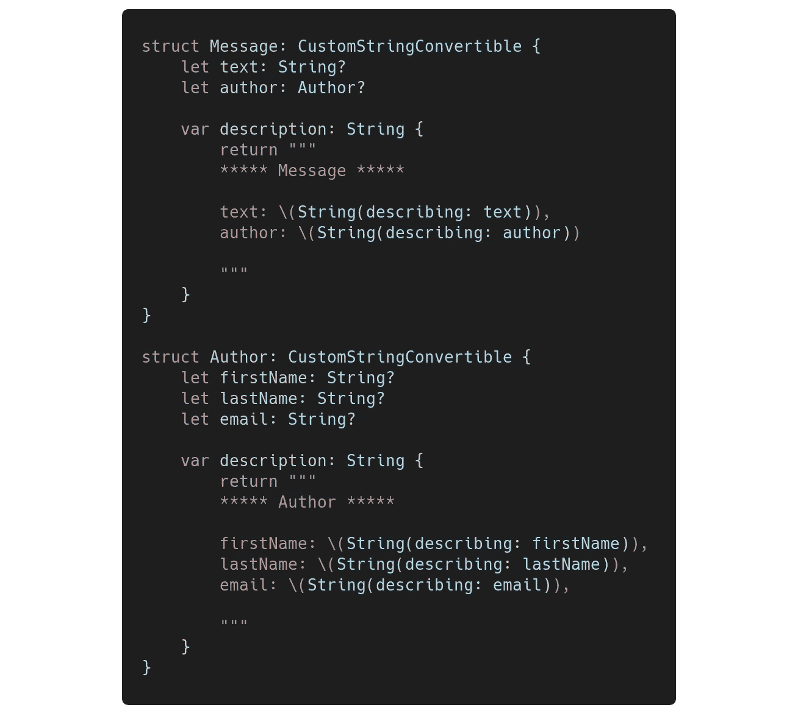
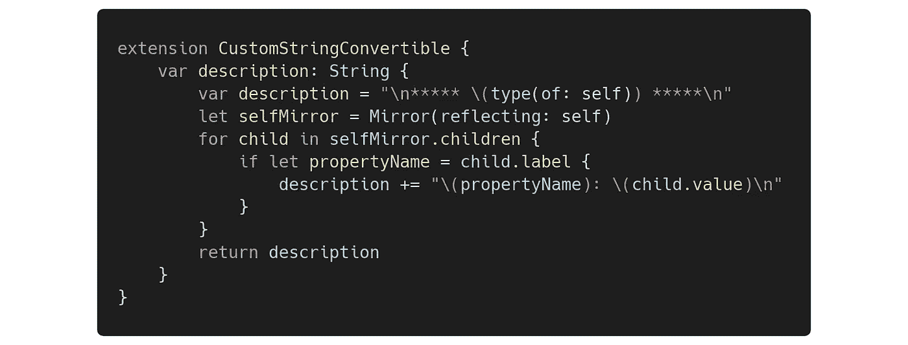
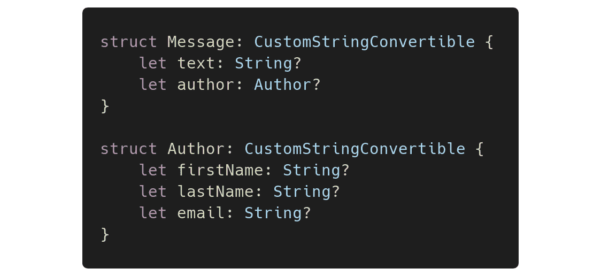
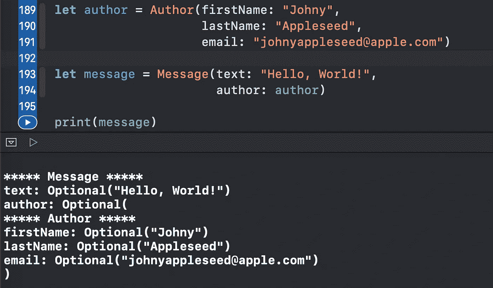
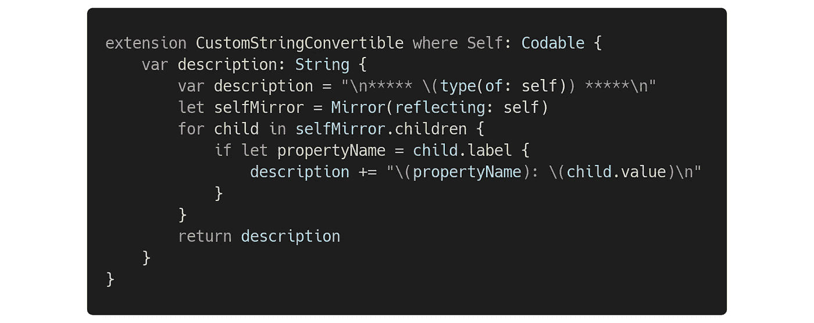

# 使用 CustomStringConvertible 协议自动调试 Swift 对象

> 原文：<https://levelup.gitconnected.com/automate-debugging-swift-objects-using-the-customstringconvertible-protocol-c01fff74380f>

## 一个方便的扩展来复制和粘贴你的应用程序

照片由[弗雷迪婚姻](https://unsplash.com/@fredmarriage?utm_source=medium&utm_medium=referral)在 [Unsplash](https://unsplash.com?utm_source=medium&utm_medium=referral) 上拍摄

在本文中，我们将了解如何在扩展中使用方便的`CustomStringConvertible`协议一致性来轻松地自动调试 Swift 对象。

扩展的源代码可以在文章的底部找到。

事不宜迟，我们开始吧。

# 我们开始吧

如果您曾经遵循过 [CustomStringConvertible 协议](https://medium.com/better-programming/what-is-the-customstringconvertible-protocol-in-swift-4b7ddbc5785b)，那么这段代码对您来说会非常熟悉:

如果只有两个对象需要调试，那就没问题。但是如果你有很多，为每个对象创建相似的`description`属性将会非常耗时。

出于这个原因，我们可以通过在协议上创建一个扩展来自动化这个过程，这样你只需要遵守`CustomStringConvertible`，这个扩展就会帮你完成繁重的工作。

这是扩展:

下面是它的作用:

*   创建一个显示对象类型的字符串
*   创建一个代表对象属性的`Mirror`。
*   迭代对象的属性，并将每个属性的名称和值追加到字符串中。
*   返回完成的字符串

因此，你现在唯一要做的就是简单地符合`CustomStringConvertible`，不需要`description`属性:

现在，如果我们用一个`Author`初始化一个`Message`，然后打印它，我们将看到如下内容:

太好了！我们已经成功地自动调试了 Swift 对象。

有时，您可能希望为每个特定类型提供一个自定义扩展。例如，您的目标可能是以一种方式打印`Codable`对象，而其他方式则不同。通过使用类型约束(`where Self: Codable`)，比以往任何时候都更容易:

现在这个扩展只对`Codable`对象有效。

# 资源

扩展的源代码可以在[概要](https://gist.github.com/zafarivaev/e2d8ccf89e5cf8f72c68d1858f527e12)中找到。

# 包扎

想了解更多酷炫的 Swift 技巧吗？看看我下面的其他故事:

*   [在您的 iOS 应用中使用的 5 个有用的 Swift 扩展](https://medium.com/better-programming/5-useful-swift-extensions-to-use-in-your-ios-app-f54a817ea9a9)
*   [Swift 中的 ExpressibleByIntegerLiteral 协议是什么？](https://medium.com/cleansoftware/what-is-the-expressiblebyintegerliteral-protocol-in-swift-e71ad4a37a96)
*   [在 Swift 5 中创建一个动态字体大小的 UILabel】](/create-a-uilabel-with-dynamic-font-size-in-swift-5-f49ccc26dc5f)
*   [Swift 中可选协议方法的 2 种方式](https://medium.com/better-programming/2-ways-to-make-protocol-methods-optional-in-swift-f032836a343b)
*   [如何在 Swift 中截图你的 iOS 应用的 UI](https://medium.com/better-programming/how-to-screenshot-your-ios-apps-ui-in-swift-5c054a9226a5)

感谢阅读！