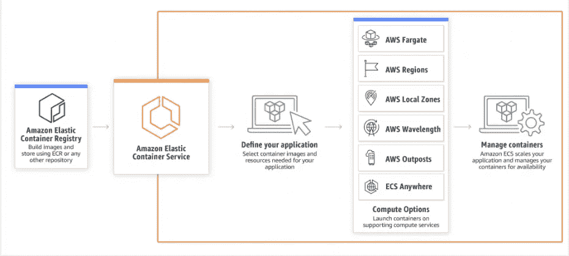
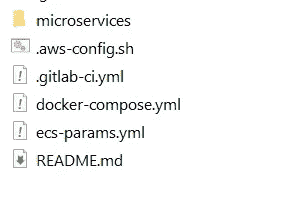
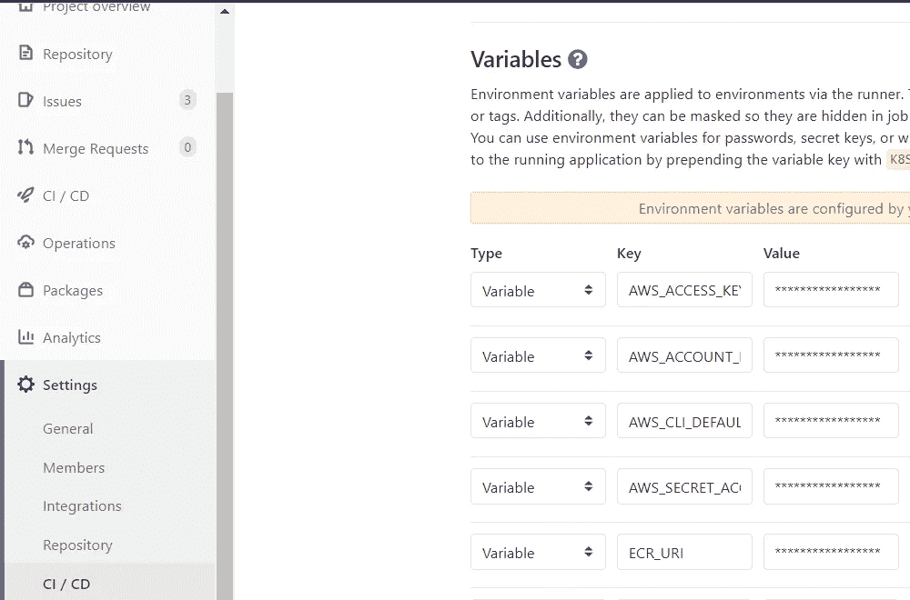

# 自动将微服务部署到 AWS ECS Fargate

> 原文：<https://levelup.gitconnected.com/automate-microservice-deployment-to-aws-ecs-fargate-475172bffc80>

使用 Gitlab CI 简化 Fargate 部署。

AWS ECS:[https://aws.amazon.com/ecs/](https://aws.amazon.com/ecs/)

要通过 Gitlad CD 管道向 ECS FARGATE 集群部署或更新服务，我们需要 4 样东西

1.  。gitlab-ci.yml —包含 gitlab runner 部署服务时要执行的步骤。
2.  具有 ECS、ECR 和 EC2 相关权限的用户

*   [亚马逊 C2 containerregistryfull access](https://docs.aws.amazon.com/AmazonECR/latest/userguide/ecr_managed_policies.html)
*   一个[mazonec 2 containerservicerole](https://docs.aws.amazon.com/AmazonECS/latest/developerguide/ecs_managed_policies.html)
*   [亚马逊任务执行规则](https://docs.aws.amazon.com/AmazonECS/latest/developerguide/task_execution_IAM_role.html)

3.docker-compose.yml —描述要部署的映像、要监听的端口、日志组

4.ecs-params.yml —描述任务大小、群集的网络配置

5.aws-config . sh-包含步骤 2 中 IAM 用户的 AWS 凭据。

我希望部署的服务的目录结构如下所示

要部署的微服务的目录结构

微服务文件夹包含我们正在部署的服务的 src 文件。。gitlab-ci.yml 文件由 Gitlab CI 选择执行。文件的内容如下。请注意，这里只显示了与部署相关的配置项文件的一部分。我们要更新的集群已存在于名为“test-cluster”的 AWS 环境中，该集群在中被声明为变量。gitlab-ci 文件作为 AWS_CLUSTER_NAME

1.  **。gitlab-ci.yml 文件**

2. **IAM 用户**

IAM 用户的 AWS 访问密钥— AWS_ACCESS_KEY_ID 和 AWS_SECRET_ACCESS_KEY 是在 gitlab 项目环境中的项目→设置→ CI/CD →变量下配置的

CI 管道的项目环境变量设置

这不是最佳的安全实践，因为这些密钥很容易被有权访问该项目的团队成员访问或更改。有一种更好的获取凭证的方法，那就是使用 AWS STS，并假设一个角色具有执行 ECS 和 ECR 操作的权限。在以后的文章中会有更多的介绍。目前，如果你信任你的团队成员，这就可以了。

3. **docker-compose.yml**

docker-compose 文件用于创建服务，它包含要部署的映像、端口信息和日志组

4.e **cs-params.yml**

当使用`ecs-cli compose`或`ecs-cli compose service`命令(如在我们的 CD 管道中)来管理 Amazon ECS 任务和服务时，Amazon ECS 任务定义中的某些字段与 Docker 合成文件中的字段不对应。您可以使用带有`--ecs-params`标志的 ECS 参数文件来指定这些值。默认情况下，该命令在名为`ecs-params.yml`的当前目录中查找 ECS 参数文件。

5. **aws-config.sh**

ecs-cli 工具需要 IAM 凭据来运行服务。它们由 aws-config.sh 文件提供。存储在 CI/CD 变量设置中的凭证被读取并存储在配置文件中。

你做过类似的工作吗？你采取了什么方法？我很想听听你的经历。

感谢阅读。如果你对此有想法，一定要留下评论。如果你觉得这篇文章有帮助，给我一些掌声？。

 [## 使用 Amazon ECS 参数

### 当使用 ecs-cli 撰写或 ecs-cli 撰写服务命令来管理您的 Amazon ECS 任务和服务时，有…

docs.aws.amazon.com](https://docs.aws.amazon.com/AmazonECS/latest/developerguide/cmd-ecs-cli-compose-ecsparams.html)