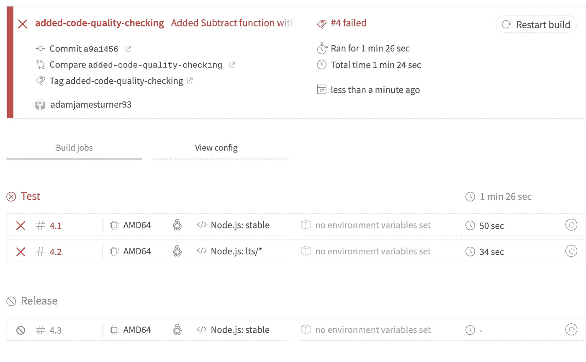
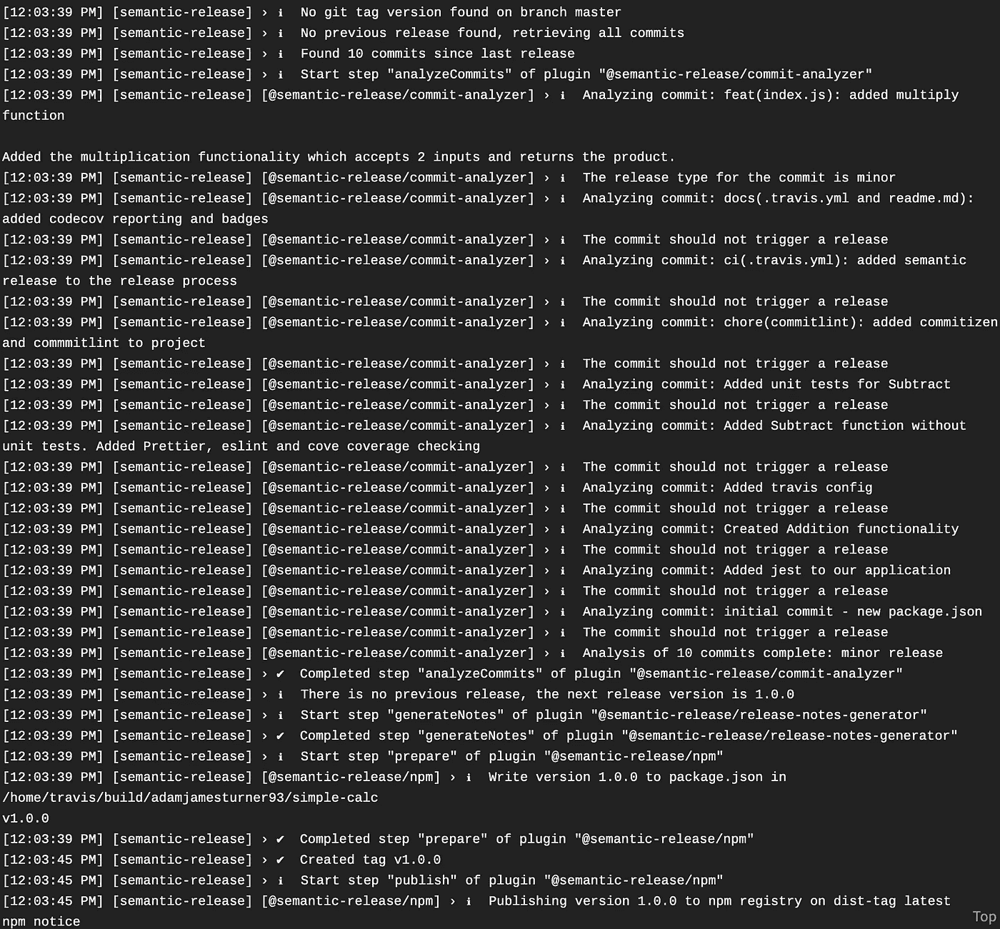

# 通过 Jest、codecov.io、Semantic Release 和 TravisCI 实现 NPM 发布的自动化

> 原文：<https://levelup.gitconnected.com/automate-npm-releases-with-jest-codecov-io-semantic-release-and-travisci-eff812e97541>

## 连续部署和 TDD 简介


想要简化部署 NPM 软件包的方式吗？本指南将指导您如何:

1.设置一个新的 NPM 包
2。用 Jest
3 配置测试。设置代码质量检查(更漂亮，ESLint，代码覆盖率)
4。通过 TravisCI
5 部署到 NPM 和 Github。使用语义发布自动生成变更文档
6。用 codecov.io 添加代码覆盖率报告

最后会有一个到我的 GitHub 库的链接，它可以作为模板用于你自己的项目，或者你也可以跟着我们一起创建它。我将遵循一个简单的演示项目测试驱动的开发方法。我将为我们进行的每个部分创建标签，所以如果你遇到问题，请参考它们。

# 设置新的 NPM 模块

在我们做任何事情之前，我们将需要初始化一个新的节点包，这将是我们在本文中所做的工作，因此需要一个包名。所以，去 https://www.npmjs.com[看看你选择的名字是否独一无二。对于这个项目，我将使用“简单计算”。](https://www.npmjs.com)

我将在 mac 上使用终端，但是你可以使用任何你喜欢的命令行工具。

创建一个新目录并导航到其中。

```
> mkdir simple-calc && cd simple-calc
```

现在让我们为我们的项目建立一个 GitHub 存储库。前往 GitHub 并创建一个新的存储库。注意:如果你没有账户，你需要注册。

现在我们需要通过运行`npm init`来初始化一个新的节点库

```
> npm initThis utility will walk you through creating a package.json file.
It only covers the most common items, and tries to guess sensible defaults.See `npm help json` for definitive documentation on these fields
and exactly what they do.Use `npm install <pkg>` afterwards to install a package and
save it as a dependency in the package.json file.Press ^C at any time to quit.
package name: (simple-calc) 
version: (1.0.0) 
description: A javascript library to perform simple calculations
entry point: (index.js) 
test command: 
git repository: [https://github.com/adamjamesturner93/simple-calc](https://github.com/adamjamesturner93/simple-calc)
keywords: simple calculator
license: (MIT) 
About to write to /home/adam/code/npm/simple-calc/package.json:{
  "name": "simple-calc",
  "version": "1.0.0",
  "description": "A javascript library to perform simple calculations",
  "main": "index.js",
  "scripts": {
    "test": "echo \"Error: no test specified\" && exit 1"
  },
  "repository": {
    "type": "git",
    "url": "git+[https://github.com/adamjamesturner93/simple-calc.git](https://github.com/adamjamesturner93/simple-calc.git)"
  },
  "keywords": [
    "simple",
    "calculator"
  ],
  "author": "Adam Turner <[adamjamesturner93@gmail.com](mailto:adamjamesturner93@gmail.com)>",
  "license": "MIT",
  "bugs": {
    "url": "[https://github.com/adamjamesturner93/simple-calc/issues](https://github.com/adamjamesturner93/simple-calc/issues)"
  },
  "homepage": "[https://github.com/adamjamesturner93/simple-calc#readme](https://github.com/adamjamesturner93/simple-calc#readme)"
}
```

最后，对于设置，让我们用一个自述文件初始化一个 Git 存储库。

```
> echo "# simple-calc" >> README.md
> git init
```

[https://github . com/adamjameturner 93/simple-calc/tree/setup-a-new-NPM-module](https://github.com/adamjamesturner93/simple-calc/tree/setup-a-new-npm-module)

# 用 Jest 设置测试

首先，我们需要安装 Jest。

```
> yarn install -D jest
```

让我们也添加一个`.gitignore`文件，这样我们就不会提交 node_modules 文件夹。这很重要，因为 node_modules 文件夹是一个构建工件，我们应该只提交在另一个设备上构建项目所需的文件。这里有一篇很好的文章，它解释了应该做什么和应该忽略什么:[https://zellwk.com/blog/gitignore/](https://zellwk.com/blog/gitignore/)

```
> echo "node_modules" > .gitignore
```

好了，最后我们需要将 package.json 中的测试脚本改为使用 Jest。

```
"scripts": {
   "test": "jest"
},
```

因此，我们在应用程序中设置了 Jest。然而，我们将在稍后添加一些额外的配置用于代码覆盖检查。

[https://github . com/adamjameturner 93/simple-calc/tree/setup-testing-with-jest](https://github.com/adamjamesturner93/simple-calc/tree/setup-testing-with-jest)

# 添加一些基本功能和测试

现在，让我们添加一些功能，为 npm 提供一些有用的信息。

首先，创建一个`index.js`和`index.test.js`文件。

```
> mkdir src
> touch src/index.js src/index.test.js
```

我们需要的第一项功能是将两个数字相加的能力，因此让我们添加一个单元测试来涵盖这一点。最初，我将在`index.js`文件中删除这个方法，然后在我的`index.test.js`文件中，我可以导入这个方法来测试它。

```
**index.js**
export const Add = () => {
}**index.test.js** import {Add} from './index'describe('Addition', () => { it('given 3 and 7 as inputs, should return 10', () => {
        const expected = 10;
        const actual = Add(3,7);
        expect(actual).toEqual(expected)
    });    it('given 4 and 2 as inputs, should return 6', () => {
        const expected = 6; 
        const actual = Add(4,2);
        expect(actual).toEqual(expected)
    });
});
```

但是这里到底发生了什么呢？

在第 1 行，我们从`index.js`文件导入了`Add`函数。
在 2 号线上，我们有一个`describe`块。这有助于将相关的单元测试组合在一起。当运行您的测试时，它被打印在控制台中，有助于查明哪个测试失败了。在第 3–7 行，我们有实际的单元测试。`it`命名测试并期望回调函数包含实际的测试。然后，我们将预期结果与函数的实际结果进行比较。

那么现在当我们运行`yarn test`或`npm run test`时，我们会看到什么呢？

首先，您可能会得到以下错误:

```
SyntaxError: Cannot use import statement outside a module
```

这是 jest 不知道如何转换新的 ECMAScript import 语句的结果，因此它抛出了一个错误。这很容易通过安装 babel 来解决:

```
> yarn add jest babel-jest @babel/core @babel/preset-env
```

并创建 2 个配置文件:

```
> touch jest.config.json .babelrc**jest.config.json** {
    "transform": {
        "^.+\\.jsx?$": "babel-jest"
    }
}**.babelrc** {
    "presets": ["@babel/preset-env"]
}
```

最后，如果我们运行`yarn test`，我们会看到 2 个失败的测试！正是我们想要的。

```
yarn run v1.21.1
$ jest
 FAIL src/index.test.js
 Addition
 ✕ given 3 and 7 as inputs, should return 10 (5ms)
 ✕ given 4 and 2 as inputs, should return 6 (1ms)● Addition › given 3 and 7 as inputs, should return 10expect(received).toEqual(expected) // deep equality Expected: 10
 Received: undefined 5 | const expected = 10;
 6 | const actual = Add(3,7);
 > 7 | expect(actual).toEqual(expected)
 | ^
 8 | });
 9 | 
 10 | it(‘given 4 and 2 as inputs, should return 6’, () => {at Object.<anonymous> (src/index.test.js:7:24)● Addition › given 4 and 2 as inputs, should return 6expect(received).toEqual(expected) // deep equality Expected: 6
 Received: undefined 11 | const expected = 6;
 12 | const actual = Add(4,2);
 > 13 | expect(actual).toEqual(expected)
 | ^
 14 | });
 15 | });at Object.<anonymous> (src/index.test.js:13:24)Test Suites: 1 failed, 1 total
Tests: 2 failed, 2 total
Snapshots: 0 total
Time: 1.552s
Ran all test suites.
```

如果仔细观察终端中的输出，可以看到我们已经写出了`describe > it`,以及失败的行和失败的原因。Jest 有多神奇？！

现在我们只需要添加一行代码来通过这些测试:

```
**index.js** export const Add = (a, b) => a + b
```

重新运行`yarn test`:

```
yarn run v1.21.1
$ jest
  PASS  src/index.test.js
  Addition
    ✓ given 3 and 7 as inputs, should return 10 (3ms)
    ✓ given 4 and 2 as inputs, should return 6Test Suites: 1 passed, 1 total
Tests:       2 passed, 2 total
Snapshots:   0 total
Time:        1.525s, estimated 2s
Ran all test suites.
✨  Done in 2.49s.
```


呜哇！2 通过测试。

[https://github . com/adamjameturner 93/simple-calc/tree/setup-testing-with-jest-complete](https://github.com/adamjamesturner93/simple-calc/tree/setup-testing-with-jest-complete)

# 与 Travis CI 一起构建

要开始使用 Travis CI，请前往[https://travis-ci.com/dashboard](https://travis-ci.com/dashboard)并使用您的 GitHub 帐户登录。这将有助于将您所有的公共 GitHub 库与 Travis CI 连接起来，从而使您能够构建它们中的任何一个！

为了让 TravisCI 实际上对您的项目做一些事情，您需要再添加一个配置文件，`.travis.yml`。

```
os: linux
language: node_js
node_js:
 - stable
 - lts/*
cache:
    directories:
      - node_modules
jobs:
  include:
    - stage: release
      script:
        - yarn test
```

解释一下:
**OS:** 这告诉 TravisCI 用什么操作系统来构建项目。
**语言:**这告诉 Travis CI 我们正在使用 Node JS。
**node_js:** 这设置了我们想要运行测试套件的节点版本。在这里，我们再次运行稳定节点版本以及所有长期支持版本。
**缓存:**通过缓存我们的 node_modules 目录，我们减少了每次提交东西时构建项目所需的时间。这将告诉 travis 仅在 yarn.lock 更改时才重建 node_modules 目录。
**作业**:在这里我们可以包含我们想要运行的所有作业。我们目前感兴趣的是配置发布阶段，在这个阶段我们告诉 travis 运行`yarn test.`以获得完整的细节，请参见[https://docs . Travis-ci . com/user/languages/JavaScript-with-nodejs/](https://docs.travis-ci.com/user/languages/javascript-with-nodejs/)

现在，当您提交代码库时，您会看到 Travis 自动触发了一个构建。您现在已经建立了一个持续集成管道！

# 加强代码质量

在我们走得更远之前，让我们确保维护高标准的代码。如果我们打算让更多的人为我们的代码库做出贡献，这一点尤其重要。首先，我们将添加更漂亮的和 ESLint，然后我们将在我们的测试基础上执行代码覆盖度量。如果你不确定这些事情是做什么的，不要担心，因为很快就会清楚了。

## [更漂亮的](https://prettier.io/)

漂亮是一个工具，根据你传入的配置文件重新格式化你的代码库。然而，对于给定的语言有标准的格式规则，对于这个项目，我将依赖这些规则。所以，让我们安装它，并对我们在`package.json`中的脚本做一个小小的修改。

```
> yarn add -D prettier**package.json**...
"scripts": {
  "test": "jest",
  "format": "prettier src/**/*.js --write"
}
...
```

## [ESLint](https://eslint.org/)

> ESLint 是一个用于识别和报告 ECMAScript/JavaScript 代码中发现的模式的工具，其目标是使代码更加一致并避免 bug。(ES Lint 文档)

对于如何设置和所有可能的配置的完整指南，文档是极好的。但是，对于简单的设置，您可以运行:

```
> npx eslint --init
```

接下来会问一系列问题来为你做好准备:

```
npx: installed 123 in 7.177s
**? How would you like to use ESLint?** To check syntax, find problems, and enforce code style
**? What type of modules does your project use?** JavaScript modules (import/export)
**? Which framework does your project use?** None of these
**? Does your project use TypeScript?** No
**? Where does your code run?** Browser
**? How would you like to define a style for your project?** Use a popular style guide
**? Which style guide do you want to follow?** Airbnb: [https://github.com/airbnb/javascript](https://github.com/airbnb/)
**? What format do you want your config file to be in?** JSONChecking peerDependencies of eslint-config-airbnb-base@latest
Local ESLint installation not found.
The config that you've selected requires the following dependencies:eslint-config-airbnb-base@latest eslint@^5.16.0 || ^6.1.0 eslint-plugin-import@^2.18.2
**? Would you like to install them now with npm?** Yes
```

ESLint 的一个问题是它与 Prettier 冲突，所以它们会不断抛出警告或错误。幸运的是，Prettier 发布了一个节点包来扩展 ESLint 并确保兼容性。

```
> yarn add --dev eslint-config-prettier eslint-plugin-prettier
```

现在我们把`.eslintrc.json`文件改为:

```
{
  "env": {
    "browser": true,
    "es6": true
  },
  "extends": [
    "airbnb-base",
    "plugin:jest/recommended",
    "plugin:prettier/recommended"
  ],
  "globals": {
    "Atomics": "readonly",
    "SharedArrayBuffer": "readonly"
  },
  "parserOptions": {
    "ecmaVersion": 2018,
    "sourceType": "module"
  },
  "plugins": ["jest", "prettier"],
  "rules": {
    "prettier/prettier": "error"
  }
}
```

确保`prettier`插件和扩展出现在各自数组的末尾非常重要。这是因为 linter 按照外观的顺序读取和应用规则，所以如果你先添加漂亮的(这基本上关闭了规则)，规则将再次打开，你就失去了兼容性。

最后，通过向我们的`package.json`文件添加 lint 脚本，我们可以确保每个人都以同样的方式林挺他们的代码。

```
**package.json**...
"scripts": {
  "test": "jest",
  "format": "prettier src/**/*.js --write",
  "lint": "eslint src/**/*.js --fix"
}
...
```

当我们运行`yarn lint`时，我们可以看到我们得到一个错误:

```
/simple-calc/src/index.js
1:1  error  Prefer default export  import/prefer-default-export
```

如果您愿意，您可以修复错误，但是出于本文的目的，我们将关闭该规则。回到. eslintrc.json 文件，将下面一行添加到规则数组中:

```
"rules": {
  "prettier/prettier": "error",
  "import/prefer-default-export": "off"
}
```

现在，重新运行 lint 脚本，我们没有看到错误。

```
> yarn lint
yarn run v1.21.1
$ eslint src/**/*.js --fix
✨  Done in 0.84s.
```

最后，我们应该在单元测试中加强代码覆盖率。你设置的门槛取决于你和你的团队，但由于这是一个公共图书馆，而且非常简单，我将规定 100%的覆盖率。如果你不确定什么是代码覆盖率，看看肯特·c·多兹[https://kentcdodds.com/blog/common-testing-mistakes](https://kentcdodds.com/blog/common-testing-mistakes)(第二点)[https://kentcdodds.com/blog/how-to-know-what-to-test](https://kentcdodds.com/blog/how-to-know-what-to-test)的这些文章

在我们设置任何东西之前，我们如何检查我们的代码覆盖率呢？幸运的是，Jest 为我们提供了这个功能，除了在 Jest 命令中添加一个标志之外，我们不需要做任何其他事情。在你的终端运行`yarn test --coverage`。

```
> yarn test --coverageyarn run v1.21.1
$ jest --coverage
 PASS  src/index.test.js
  Addition
    ✓ given 3 and 7 as inputs, should return 10 (3ms)
    ✓ given 4 and 2 as inputs, should return 6----------|---------|----------|---------|---------|-------------------
File      | % Stmts | % Branch | % Funcs | % Lines | Uncovered Line 
----------|---------|----------|---------|---------|----------------
All files |     100 |      100 |     100 |     100 |                   
 index.js |     100 |      100 |     100 |     100 |                   
----------|---------|----------|---------|---------|----------------
Test Suites: 1 passed, 1 total
Tests:       2 passed, 2 total
Snapshots:   0 total
Time:        2.187s
Ran all test suites.
```

在这个输出中，我们可以看到我们运行了哪些测试，它们通过了哪些测试，以及我们代码的覆盖率。现在，让我们给我们的`index.js`文件添加一个新函数。

```
**index.js**export const Add = (a, b) => a + b;export const Subtract = (a, b) => a - b;
```

现在，如果我们重新运行测试脚本，我们会看到新的指标:

```
> yarn test --coverageyarn run v1.21.1
$ jest --coverage
 PASS  src/index.test.js
  Addition
    ✓ given 3 and 7 as inputs, should return 10 (2ms)
    ✓ given 4 and 2 as inputs, should return 6----------|---------|----------|---------|---------|----------------
File      | % Stmts | % Branch | % Funcs | % Lines | Uncovered Line 
----------|---------|----------|---------|---------|----------------
All files |      75 |      100 |      50 |     100 |                   
 index.js |      75 |      100 |      50 |     100 |                   
----------|---------|----------|---------|---------|----------------
Test Suites: 1 passed, 1 total
Tests:       2 passed, 2 total
Snapshots:   0 total
Time:        1.887s
Ran all test suites.
✨  Done in 2.73s.
```

成功，2 次通过测试！但是等等，我的测试覆盖率不再是 100%了…


我完全忘记写我的测试了！

这是一件非常容易做到的事情，并且不需要自动检查代码来执行商定的标准。同样，jest 使这一点非常容易实现，只需打开 jest.config.json 文件并将其更改为:

```
{
  "transform": {
    "^.+\\.jsx?$": "babel-jest"
  },
  "coverageDirectory": "./coverage/",
  "collectCoverage": true,
  "collectCoverageFrom": ["src/**/*.js"],
  "coverageThreshold": {
    "global": {
      "branches": 100,
      "functions": 100,
      "lines": 100,
      "statements": 100
    }
  }
}
```

我们在这里添加了 4 个新属性:
**coverage directory**:jest 应该在哪里存储检查代码覆盖率的结果。这里的输出可以在浏览器中查看，或者，正如我们稍后将做的那样，报告给一个服务，比如 code cov . io
**collectc overage**:布尔值。
**收集覆盖范围文件**:收集覆盖范围的文件数组。这里我们说的是 src 目录中的所有 javascript 文件。我们也可以通过在文件名前添加`!`来排除文件。
**覆盖范围阈值**:设置最小代码覆盖范围的全局限制。我们也可以设置文件特定的保险。如果我们有一个特别关键的文件或文件夹，并且希望那里的测试覆盖率比不太关键的文件高，我们可以这样做。

现在，当我运行测试时，我看到了一个稍微不同的输出:

```
$ jest
 PASS  src/index.test.js
  Addition
    ✓ given 3 and 7 as inputs, should return 10 (2ms)
    ✓ given 4 and 2 as inputs, should return 6 (1ms)----------|---------|----------|---------|---------|----------------
File      | % Stmts | % Branch | % Funcs | % Lines | Uncovered Line 
----------|---------|----------|---------|---------|----------------
All files |      75 |      100 |      50 |     100 |                   
 index.js |      75 |      100 |      50 |     100 |                   
----------|---------|----------|---------|---------|----------------Jest: "global" coverage threshold for statements (100%) not met: 75%
Jest: "global" coverage threshold for functions (100%) not met: 50%
Test Suites: 1 passed, 1 total
Tests:       2 passed, 2 total
Snapshots:   0 total
Time:        1.682s
Ran all test suites.
error Command failed with exit code 1.
```

这一次，我仍然通过了测试，然而，Jest 实际上没有通过我的测试，并且由于我的代码覆盖率阈值没有得到满足而抛出了 2 个错误。这让我们在构建时有很大把握，我们正在保持我们的代码质量。如果我们提交这段代码，让我们看看 Travis CI 会发生什么。



Travis 将我们从失败的代码质量中拯救出来

因此，我们现在非常确定，当我们推送代码时，如果构建不符合团队标准，那么构建将会失败。


唷，好险！

[https://github . com/Adam jamesturner 93/simple-calc/tree/add-code-quality-签入](https://github.com/adamjamesturner93/simple-calc/tree/added-code-quality-checking) g

让我们快速为减法函数添加一个单元测试，让我们的集成管道保持畅通。

```
**index.test.js**describe("Subtract", () => {
  it("given 10 and 5 as inputs, should return 10", () => {
    const expected = 5;
    const actual = Subtract(10, 5);
    expect(actual).toEqual(expected);
  });
});
```

[](https://github.com/adamjamesturner93/simple-calc/tree/added-missing-unit-tests) [## adamjamesturner93/simple-calc

### 通过在 GitHub 上创建帐户，为 adamjamesturner93/simple-calc 开发做出贡献。

github.com](https://github.com/adamjamesturner93/simple-calc/tree/added-missing-unit-tests) 

# 强制执行质量提交消息

因此，我们有了由 Travis CI 实施的质量规范。现在让我们强制执行高质量的提交消息。为此，我将使用一种叫做`commitizen`([http://commitizen.github.io/](http://commitizen.github.io/cz-cli/))的工具。这是一个命令行工具，一步一步引导您根据常规提交指导原则创建提交消息-[https://www.conventionalcommits.org/en/v1.0.0/](https://www.conventionalcommits.org/en/v1.0.0/)。

首先，我们需要全局安装 commitizen，然后我们可以使用它的内置 init 命令:

```
> npm install -g commitizen
> commitizen init cz-conventional-changelog --yarn --dev --exact
```

现在我们向`package.json`添加一个新的脚本，它将执行`commitizen`而不是常规的提交。

```
**package.json**...
"scripts": {
  "cm": "git-cz",
  "test": "jest --coverage",
  "format": "prettier src/**/*.js --write",
  "lint": "eslint src/**/*.js --fix"
}
... 
```

现在，当我们运行`yarn cm`时，我们会看到我们的承诺信息。

```
$ git-cz
cz-cli@4.0.3, cz-conventional-changelog@3.1.0? Select the type of change that you're committing: (Use arrow keys)
❯ feat:     A new feature 
  fix:      A bug fix 
  docs:     Documentation only changes 
  style:    Changes that do not affect the meaning of the code (white-space, 
formatting, missing semi-colons, etc) 
  refactor: A code change that neither fixes a bug nor adds a feature 
  perf:     A code change that improves perform
```

这是非常强大的，也可以用来自动化变更日志，并决定是否发布到 NPM(后面会有更多)。在此之前，这个解决方案有一个问题，如果一个新开发人员不知道使用`yarn cm`而只是像往常一样使用`git commit`提交，该怎么办？

为了解决这个问题，我们可以使用一个名为`husky`和`commitlint`的工具来添加一个预提交钩子来嵌入消息。为此，我们需要安装软件包，向我们的`package.json`添加一个新的配置属性，并创建一个新的`.commitlintrc.json`文件:

```
>  yarn add -D husky [@commitlint/cli](http://twitter.com/commitlint/cli) [@commitlint/config-conventional](http://twitter.com/commitlint/config-convention)**package.json** "husky": {
  "hooks": {
    "commit-msg": "commitlint -E HUSKY_GIT_PARAMS"
  }
}**.commitlintrc.json** {
  "extends": [
    "@commitlint/config-conventional"
  ]
}
```

现在，如果我们尝试使用普通提交消息提交，Husky 将会出错:

```
git commit -m 'foo: this will fail'
husky > commit-msg (node v13.7.0)
⧗   input: foo: this will fail
✖   type must be one of [build, chore, ci, docs, feat, fix, improvement, perf
, refactor, revert, style, test] [type-enum]✖   found 1 problems, 0 warnings
ⓘ   Get help: [https://github.com/conventional-changelog/commitlint/#what-is-commitlint](https://github.com/conventional-changelog/commitlint/#what-is-c)husky > commit-msg hook failed (add --no-verify to bypass)
```

然而，当我们使用`yarn cm`执行提交过程时，我们会创建一个类似如下的提交消息:

```
chore(commitlint): added commitizen and commmitlint to project
```

这给出了一个清晰的格式，我们的流程现在将确保所有消息都是这种质量的。

# 发布到 NPM 和 GitHub

因此，现在我们有了一个具有良好代码质量的代码库，测试覆盖率得到了加强，甚至还有高质量的提交消息。让我们用它来发布到 NPM，让提交消息自动创建我们的 NPM 版本和我们的变更日志！

为此，我们将使用一个叫做语义发布的工具。首先，我们将安装`semantic-release-cli`来帮助设置过程。

```
> npm install -g semantic-release-cli
> semantic-release-cli setupsemantic-release-cli setup
**? What is your npm registry?** [https://registry.npmjs.org/](https://registry.npmjs.org/)
**? What is your npm username?** adamjamesturner93
**? What is your npm password?** [hidden]
**? What is your GitHub username?** adamjamesturner93
**? What is your GitHub password?** [hidden]
**? What CI are you using?** Travis CI
Please refer to [https://github.com/semantic-release/semantic-release/blob/master/docs/recipes/travis.md](https://github.com/semantic-release/semantic-release/blob/mas) to configure your .travis.yml file.
```

运行安装程序将询问一系列问题，并创建所需的令牌，以便自动发布到 GitHub 和 NPM。

现在，我们需要对我们的`package.json`和`.travis.yml`文件进行如下更改。

```
**package.json**...
"scripts": {
  "cm": "git-cz",
  "test": "jest --coverage",
  "format": "prettier src/**/*.js --write",
  "lint": "eslint src/**/*.js --fix",
  "semantic-release": "semantic-release"
}
...**.travis.yml**os: linux
language: node_js
node_js:
 - stable
 - lts/*
cache:
    directories:
      - node_modules
jobs:
  include:
    - stage: release
      script:
        - yarn test
      after_success:
        - yarn semantic-release[11:47:42 AM] [semantic-release] [@semantic-release/commit-analyzer] › ℹ  Analyzing commit: Added jest to our application[11:47:42 AM] [semantic-release] [@semantic-release/commit-analyzer] › ℹ  The commit should not trigger a release[11:47:42 AM] [semantic-release] [@semantic-release/commit-analyzer] › ℹ  Analyzing commit: initial commit - new package.json[11:47:42 AM] [semantic-release] [@semantic-release/commit-analyzer] › ℹ  The commit should not trigger a release[11:47:42 AM] [semantic-release] [@semantic-release/commit-analyzer] › ℹ  Analysis of 9 commits complete: no release[11:47:42 AM] [semantic-release] › ✔  Completed step "analyzeCommits" of plugin "@semantic-release/commit-analyzer"[11:47:42 AM] [semantic-release] › ℹ  There are no relevant changes, so no new version is released.Done in 3.89s.
```

我们在这里可以看到，当我们进行这个提交时，`semantic-release`检查所有的提交历史，并断定是否应该发布一个新版本。这取决于是否包括错误修复(补丁)——次要版本变更——新功能——次要版本变更或可能的重大变更——主要版本变更。

# 把所有的放在一起

现在，让我们从头到尾看看这个工作。首先，我将添加一个带有相关测试的新乘法特性:

```
**index.test.js**import { Add, Subtract, Multiply } from "./index";describe("Addition", () => {
  it("given 3 and 7 as inputs, should return 10", () => {
    const expected = 10;
    const actual = Add(3, 7);
    expect(actual).toEqual(expected);
  });
});describe("Subtract", () => {
  it("given 10 and 5 as inputs, should return 10", () => {
    const expected = 5;
    const actual = Subtract(10, 5);
    expect(actual).toEqual(expected);
  });
});describe("Multiplication", () => {
  it("given 10 and 5 as inputs, should return 50", () => {
    const expected = 50;
    const actual = Multiply(10, 5);
    expect(actual).toEqual(expected);
  });
});**index.js**export const Add = (a, b) => a + b;export const Subtract = (a, b) => a - b;export const Multiply = (a, b) => a * b;
```

让我们使用`commitizen`提交它:

```
> yarn cm  
yarn run v1.21.1
$ git-cz
cz-cli@4.0.3, cz-conventional-changelog@3.1.0**? Select the type of change that you're committing**: feat: A new feature
**? What is the scope of this change (e.g. component or file name):** (press enter to skip) index.js
**? Write a short, imperative tense description of the change (max 56 chars):** (23) added multiply function
**? Provide a longer description of the change**: (press enter to skip)
  Added the multiplication functionality which accepts 2 inputs and returns the product.
**? Are there any breaking changes?** No
**? Does this change affect any open issues?** Nohusky > commit-msg (node v13.7.0)
[master 3509f17] feat(index.js): added multiply function
 2 files changed, 11 insertions(+), 6 deletions(-)
✨  Done in 20.29s.
```

现在，您可以在语义发布日志中看到以下内容:



语义发布根据提交历史自动生成 1.0.0 版消息。

现在，当我们在 GitHub 中查看我们的发布时，我们看到已经创建了 1.0.0 版，并且已经根据我们的提交完成了变更日志！

[](https://github.com/adamjamesturner93/simple-calc/releases/tag/v1.0.0) [## adamjameturner 93/简单计算

### 此时您不能执行该操作。您已使用另一个标签页或窗口登录。您已在另一个选项卡中注销，或者…

github.com](https://github.com/adamjamesturner93/simple-calc/releases/tag/v1.0.0) 

# 将您的成功添加到您的自述文件中

最后，我们需要一个非常酷的 readme.md 文件。首先，我们可以用 codecov.io 添加我们的代码覆盖率。前往 https://codecov.io/的，用你的 github 帐户登录。现在导航到您的帐户并添加一个新的存储库(https://codecov.io/gh/<GITHUB 用户名> /+)。

现在更新您的`.travis.yml`文件，将覆盖率上传到:

```
**.travis.yml**os: linux
language: node_js
node_js:
 - stable
 - lts/*
cache:
    directories:
      - node_modules
jobs:
  include:
    - stage: release
      script:
        - yarn test
      after_success:
        - bash <(curl -s [https://codecov.io/bash)](https://codecov.io/bash))
        - yarn semantic-release
```

最后，更新你的`README.md` Mine 看起来像这样，但是你可以更新 GitHub 帐户和项目名称来匹配你的！

```
**README.md
# simple-calc**[](https://codecov.io/gh/adamjamesturner93/simple-calc)
```

现在，当我们将代码推送到 GitHub 时，我们会看到一个自述文件，上面有显示我们的 NPM 版本、代码覆盖率、构建状态和许可证的徽章。

# 包裹

如果你已经做到了这一步，祝贺你！我们已经使用一些行业标准工具建立了一个完整的连续交付管道，同时执行干净和高质量的代码。


给你们自己一点鼓励！