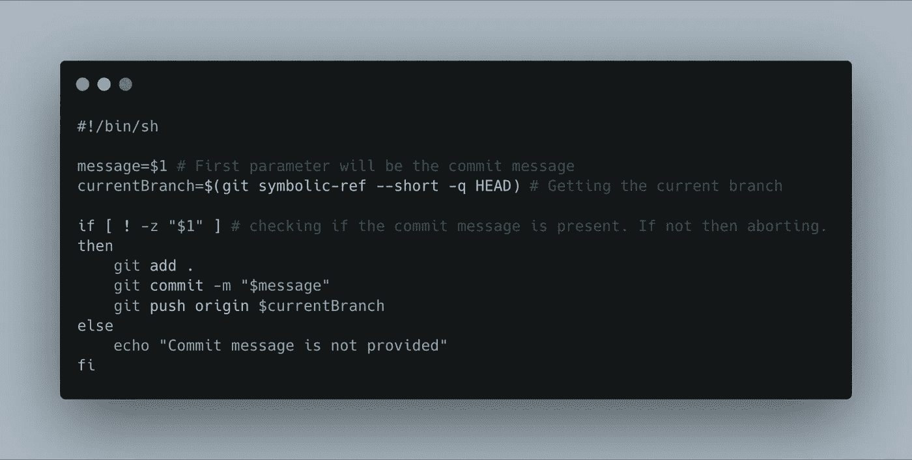
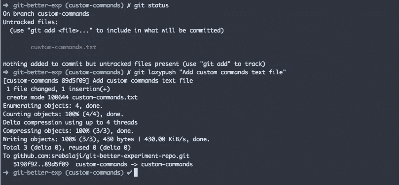
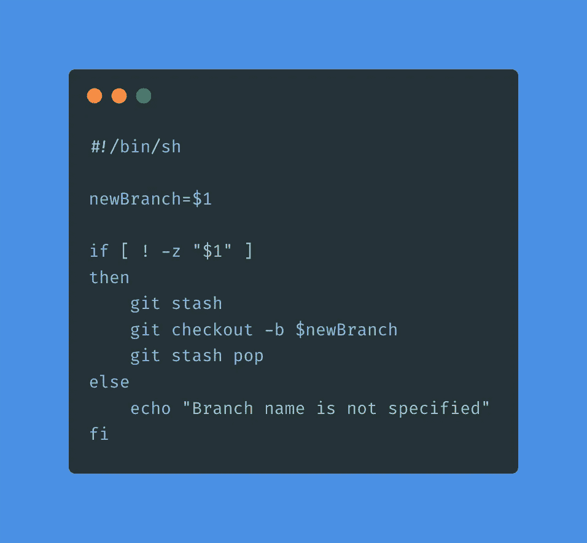
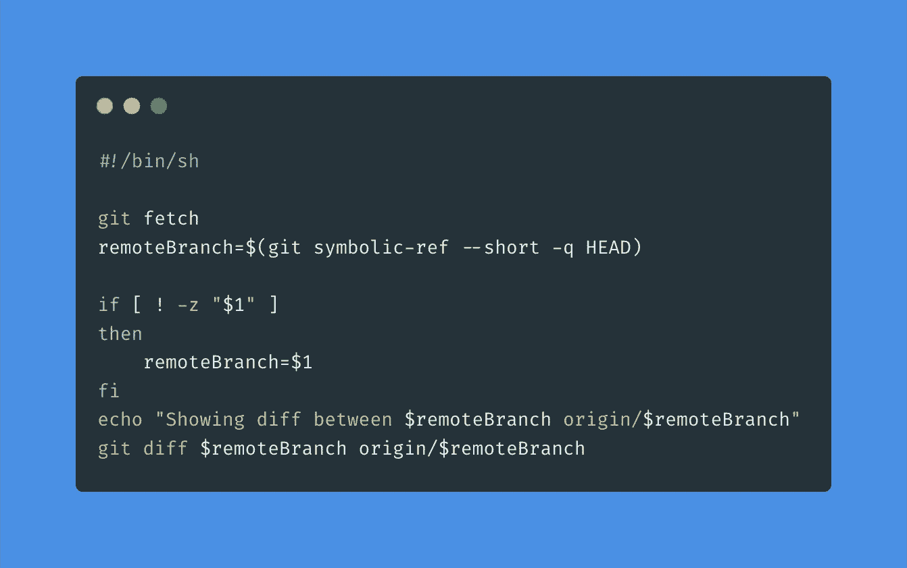
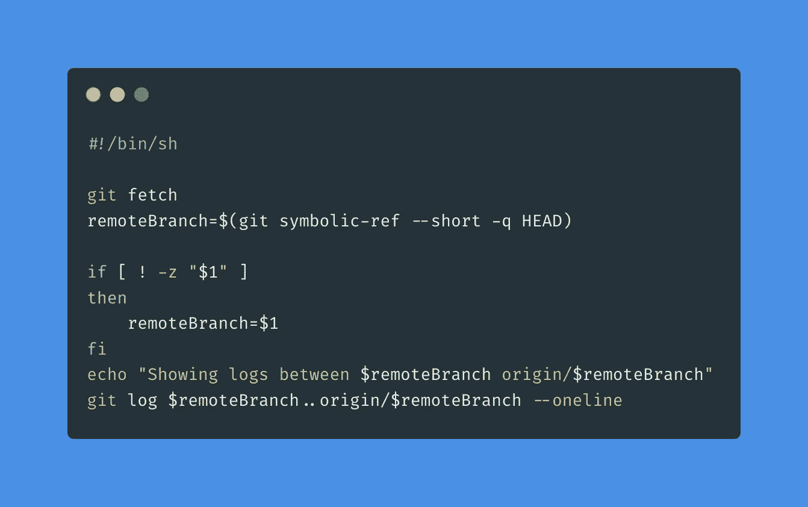
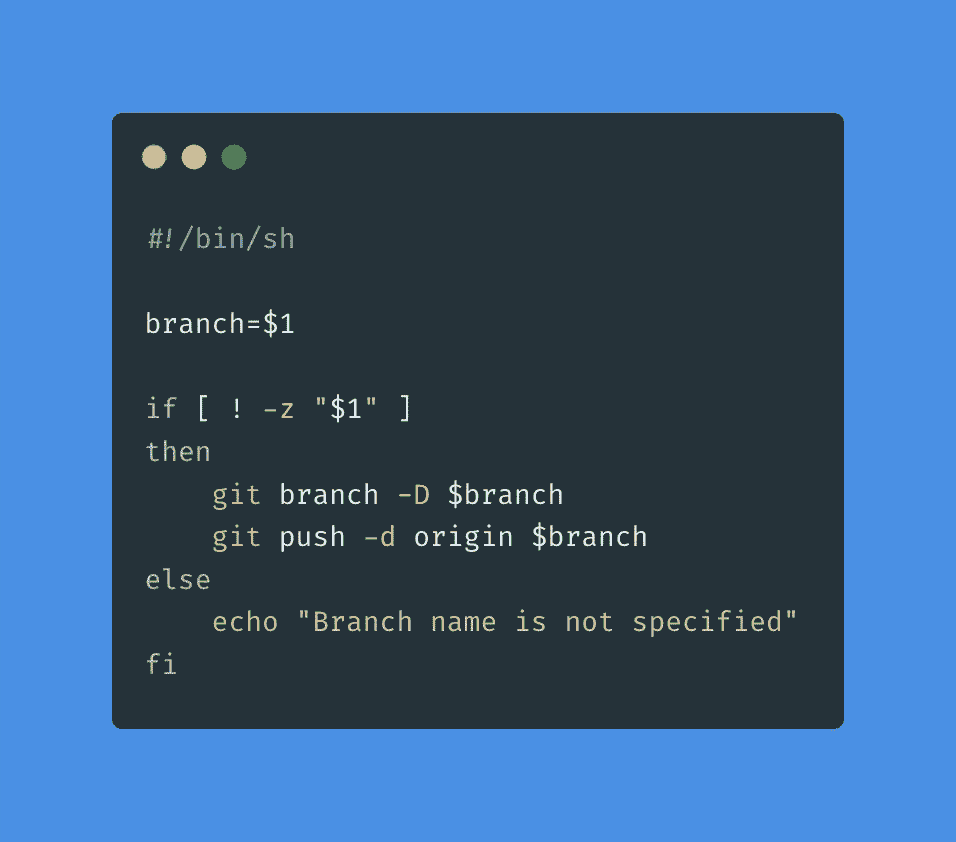

# 使用定制的 Git 命令自动执行重复性任务

> 原文：<https://levelup.gitconnected.com/automate-repetitive-tasks-with-custom-git-commands-76a4b71d262f>


Git 帮助我们编写自己的定制命令，这些命令可以用任何您喜欢的语言编写，比如 Ruby 或 JavaScript。

在本教程中，我将解释如何编写自己的自定义命令，并给出一些例子。在本教程中，我们将使用 bash。

编写定制 git 命令非常简单，只需三个步骤:

1.  用给定格式的名称`git-mycommand`创建一个文件。并且该文件应该具有可执行的访问权限。
2.  创建的文件应该包含在`$PATH`中。这可以在`bashrc`或`zshrc`完成
3.  然后，您可以在任何 git repo 中运行命令`git mycommand`。

# 编写我们的第一个定制命令

让我们编写一个定制的 Git 命令来添加、提交，然后用一个命令将更改推送到 remote。

## 1.为我们的命令创建一个文件

最好有一个目录来包含我们所有的自定义命令，这样就可以对其进行组织。让我们创建一个目录。

```
mkdir my-git-custom-commands
```

在上面创建的目录中创建一个名为`git-lazypush`的文件，并添加以下代码。在此参考[要点中的代码](https://gist.github.com/srebalaji/4b23fb62f6ce26c17b73ca07ae7cfc67#file-git-lazypush)。



最后但同样重要的是，使该文件可执行

```
chmod +x git-lazypush
```

## 2.向$PATH 添加自定义命令

这一点相当重要。这将有助于 Git 识别定制命令。

我们正在将目录添加到`$PATH`。将下面一行添加到`bashrc`或`zshrc`

```
export PATH=$PATH:/your-directory/my-git-custom-commands
```

现在，您可以获取文件或启动终端的新实例

```
source ~/.zshrc
```

## 3.运行我们的自定义命令

一切就绪后，是时候运行我们的自定义命令了。转到您的任何本地 git repo 并运行以下命令

```
git lazypush "Your commit message"
```



如您所见，我已经创建了一个新文件，并执行了自定义命令。

很明显，文件被添加、提交并推送到远程服务器。

Git 命令非常有用，可以用来自动化工作流中的常见任务。所以试着找到你觉得重复的任务，并自动完成。

# 自定义命令的想法

我将添加一些我能想到的自定义命令的想法。

## git-切换到

将当前分支中所有未暂存的更改签出到新分支的自定义命令。

你可以在 [**要点这里**](https://gist.github.com/srebalaji/4b23fb62f6ce26c17b73ca07ae7cfc67#file-git-switch-to) 找到代码。



## git 远程差分

查看指定分支的本地和远程之间差异的自定义命令。

你可以在 [**要点这里找到**](https://gist.github.com/srebalaji/4b23fb62f6ce26c17b73ca07ae7cfc67#file-git-remote-diff) 的代码。



## git 远程日志

custom 命令帮助您查看给定分支的本地和远程更改之间的提交日志。

你可以在[的**要点这里找到代码**](https://gist.github.com/srebalaji/4b23fb62f6ce26c17b73ca07ae7cfc67#file-git-remote-log) 。



## git-硬删除

本地和远程删除分支的自定义命令。

你可以在 [**要点这里**](https://gist.github.com/srebalaji/4b23fb62f6ce26c17b73ca07ae7cfc67#file-git-hard-delete) 找到代码。



## git-lazypr

创建拉请求的自定义命令。Github、Gitlab 中有 API 可以在 repo 中创建 PR。您可以使用它从命令行创建一个 PR。

如果您有任何疑问、反馈或任何事情，您可以留下评论。

感谢您的阅读:)

**你可以在这里找到我的其他 git 相关文章**

```
1\. [What is git cherry-pick and how to use](/what-is-git-cherry-pick-and-how-to-use-it-effectively-665247192442)2\. [Useful tricks of git fetch and git pull](/how-to-use-git-fetch-and-git-pull-effectively-c6a4becfbc16)3\. [A very basic intro of Git](https://medium.com/@srebalaji/a-very-basic-intro-of-git-b9cab0e64153)
```

**本帖原载于我的简讯**[**GitBetter**](https://gitbetter.substack.com/)**。如果你已经来了这么久，那么我想你会对 Git 非常感兴趣。可以订阅**[**Git better**](https://gitbetter.substack.com/)**获取 Git 的招数、技巧、高级话题。**