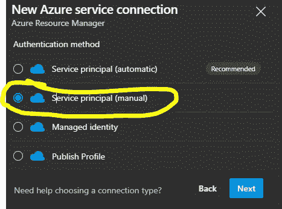
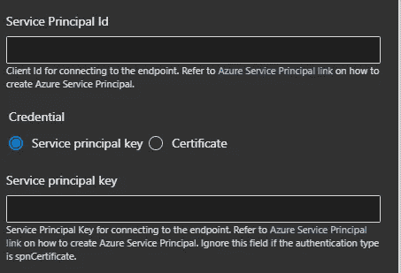

# Azure Key Vault Secrets 在 DevOps 管道中的自动化和集成

> 原文：<https://levelup.gitconnected.com/automate-secrets-to-azure-key-vault-and-access-it-in-devops-pipelines-69a24ecb9602>

如何使用 Terraform 将秘密推入您的密钥库，然后在您的 DevOps 应用程序管道中使用它。


杰森·登特在 [Unsplash](https://unsplash.com/s/photos/vault?utm_source=unsplash&utm_medium=referral&utm_content=creditCopyText) 上拍摄的照片

# 要求

1.  带有秘密的服务主体(应用程序注册)。
2.  带有服务主体访问策略的 Azure 密钥库
3.  Azure DevOps 项目中的服务连接
4.  YAML 管道脚本中的 KeyVault 任务

# 1.使用机密创建服务主体。

我们的第一步是通过 azure CLI 创建一个服务主体，下面是要遵循的基本命令。

**创建 Azure 活动目录应用程序。**

```
az account set -s <subscription>
# name for the azure ad application
appName="project_serviceprincipal"
# create an Azure AD application
az ad app create \ 
 --display-name $appName \     
 --homepage "http://localhost/$appName" \     
 --identifier-uris [http://localhost/$appName](http://localhost/$appName)
```

`--homepage`和`--identifier-uris`值不一定必须是可到达的 URIs。

**创建服务主体**

下一步是创建具有“贡献者”RBAC 角色的服务主体。

```
sp_password="password123" 
subscription_id=$(az account show --query id -o tsv) rg_name="your_resource_group_name" 
az ad sp create-for-rbac --name $appId --password $sp_password \                       --role contributor \                 
--scopes /subscriptions/$subscription_id/resourceGroups/$rg_name
```

> 一旦运行完这个查询，az 将生成包含一个`password`键的输出，并确保您保存它以备后用，因为您无法再次检索它。

# 2.使用 Terraform 创建 Azure 密钥库

我们可以使用 Terraform 来配置密钥库，要求如下

T15"只能从选定的虚拟网络、受信任的 azure 服务和受信任的 internet IP 访问密钥库。"

因此，当您创建您的密钥库时，您可以使用`azurerm_client_config`来读取用于运行您的 Terraform 代码的当前服务主体细节(您可以使用之前创建的服务主体)。

在`network_acls`中，我们已经将`default_action`设置为**拒绝**，所以现在密钥库对于您的网络是私有的，并且必须添加您的构建代理子网 id 才能访问密钥库。但问题是，你的 DevOps 还不是一个可信的 Azure 服务，还必须将你的 DevOps 区域 IP 地址(在本例中为美国南部)添加到`ip_rules`中，才能获得 DevOps 管道中的密钥库访问。您可以在此处获取您的 DevOps 地区 IP 详细信息[允许的地址列表和网络连接— Azure DevOps | Microsoft Docs](https://docs.microsoft.com/en-us/azure/devops/organizations/security/allow-list-ip-url?view=azure-devops&tabs=IP-V4)

最后，`access_policy`是一个重要的参数，您将在其中分配服务主体对密钥库的访问权限，否则您不能使用服务主体添加或列出任何机密(策略现在被视为“传统”策略，可以使用 RBAC 角色，我们可以使用`azurerm_role_assignment`在 terraform 中创建 RBAC)

上面的示例代码将一个秘密“kv_secret”插入到密钥库(我们已将“Create”角色分配给 terraform 服务主体)，您可以通过添加特定于资源的秘密(如存储帐户密钥、app insights API 密钥等)来提高效率。

# 3.在 Azure DevOps 中创建服务连接

下一步是创建一个服务连接，我们稍后将在 Azure DevOps 管道中使用它来访问密钥库

1.  登录到您的组织(`https://dev.azure.com/{yourorganization}`)并选择您的项目。
2.  选择项目设置>服务连接。
3.  选择+新建服务连接，选择您需要的服务连接类型，然后选择下一步。
4.  我们将选择“服务主体(手动)”而不是推荐的选项，因为我们必须在单击“下一步”后提供我们的服务主体详细信息



5.在这里，您将提供您的订阅详细信息+服务主体 Id 和我们在步骤 1 中创建并保存的“密码密钥”



# 4.使用 KeyVault 任务读取管道内部的秘密

使用`AzureKeyVault@2`任务下载应用程序管道中的秘密。我们必须提供先前创建的服务连接&密钥库名称来访问该库

```
# Azure Key Vault
# Download Azure Key Vault secrets
- task: AzureKeyVault@2
inputs:
connectedServiceName: "my_service_connection"
keyVaultName: "example_keyvault"
secretsFilter: '*' # Downloads all secrets for the key vault
runAsPreJob: true # Runs before the job starts
```

密钥库任务将作为前置作业运行，它将在任何作业之前运行，您可以将密钥分配给变量并在整个管道中使用它们。

```
jobs:
- job: Build
  displayName: 'Build'
  variables:
    MySecret: $(my-secret) # this will replace the value from vault
```

## 结论

我已经尝试解释了一种在私有网络中访问 Azure 密钥库以及在 DevOps 管道中访问它的安全方式。同样的事情还有很多其他方法，我的方法可能会有缺陷。我会很感激在采用这个之前做你的研究。快乐脚本:)