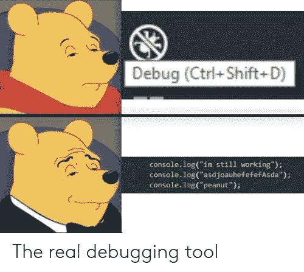

# 使用 Python 自动发送日常邮件

> 原文：<https://levelup.gitconnected.com/automate-sending-daily-mails-using-python-952ede021422>

## 使用网络抓取给你的订户一个每天都要解决的难题

在本文中，我们将构建并部署一个简单的 python 脚本，向所有订阅者发送一封邮件，其中包含每天一个新的谜题！最后，我们将把项目部署到 Heroku，这样脚本就可以在每天预定的时间运行。


照片由[索伦·费伊萨](https://unsplash.com/@solenfeyissa?utm_source=unsplash&utm_medium=referral&utm_content=creditCopyText)在 [Unsplash](https://unsplash.com/s/photos/email?utm_source=unsplash&utm_medium=referral&utm_content=creditCopyText) 拍摄

这里是该项目的 GitHub 链接。

为了更好地理解，我将文章分为 4 个部分:

1.  安装
2.  网页抓取和发送邮件
3.  计划运行时间
4.  部署到 Heroku

好吧，那么，让我们开始建设！

# 1.安装

首先，让我们为我们的项目建立一个虚拟环境。

```
C:\Github\Daily-Puzzle2>virtualenv venv1C:\Github\Daily-Puzzle2>call venv1/Scripts/Activate(venv1) C:\Github\Daily-Puzzle2>
```

接下来，创建一个文件`requirements.txt`,它包含我们项目所需的包的名称。

之后，我们会将它们安装到我们的虚拟环境中。

```
(venv1) C:\Github\Daily-Puzzle2>pip install -r requirements.txt
```

# 2.网页抓取和发送邮件

在这一步中，我们将执行 web 抓取，以确定需要发送给收件人的难题的链接。我们使用请求库获得响应，然后抓取响应以获得正确的链接。

导入库

GeeksforGeeks 收集了一系列有趣的谜题，数字从 1 到 85 不等。因此，我们将从以下内容开始确定链接:

```
*"https://www.geeksforgeeks.org/puzzle-"+day_number*
```

`day_number` 是一个变量，用来记录我们需要发送的字谜的数量。它存储在一个. txt 文件中，初始设置为“1”。在将该特定难题的链接发送给订户后，它递增。

我们将把“获取正确链接”和“发送邮件”的功能分别分成两种方法`getLink()`和`sendMail()`。

返回匹配链接的列表

向所有订户发送邮件

> 注意:如果您使用 Gmail 帐户发送电子邮件，您需要将“允许不太安全的应用程序”设置为“开”。请注意，这使得其他人更容易获得您的帐户，因此最好使用一次性帐户进行开发。

# 3.计划运行时间

在部署到 Heroku 时，我们可以 24x7 全天候运行脚本并使用`time.sleep()`定期调用`sendMail()`,或者我们可以使用调度程序定期运行工作进程。这里，我使用了 [APScheduler](https://devcenter.heroku.com/articles/clock-processes-python) ，一个轻量级的进程内任务调度器。它提供了一个干净、易用的调度 API，没有依赖性，也不依赖于任何特定的作业队列系统。

我们需要创建一个`clock.py`文件来定义时间表。

接下来，我们需要配置我们的 [Procfile](https://devcenter.heroku.com/articles/procfile) 。Procfile 是部署到 Heroku 时必不可少的文件，它指定了应用程序在启动时执行的命令。您可以使用 Procfile 来声明各种进程类型，包括:

*   你的应用程序的 web 服务器
*   多种类型的工作进程
*   单一进程，如[时钟](https://devcenter.heroku.com/articles/scheduled-jobs-custom-clock-processes)
*   部署新版本之前要运行的任务

下面是我们的 Procfile 的样子。

# 4.部署到 Heroku

首先，我们需要从 Heroku 仪表板创建一个新的应用程序。

我们可以使用 Heroku CLI 从本地机器直接部署到 Heroku，或者将应用程序连接到我们的 GitHub 存储库。在这里，我使用 Heroku CLI 进行部署。要安装 CLI，请前往[下载页面](https://devcenter.heroku.com/articles/heroku-cli)进行安装。

# 使用 Heroku CLI 部署的步骤:

1.  转到包含文件的目录。如果未初始化为 git repo，请执行以下步骤:

```
C:\Github\Daily-Puzzle2>git initC:\Github\Daily-Puzzle2>git add .C:\Github\Daily-Puzzle2>git commit -m “commit message”
```

2.登录你的 Heroku 账户

```
C:\Github\Daily-Puzzle2>heroku login -i
```

3.连接到应用程序

```
C:\Github\Daily-Puzzle2>heroku git:remote -a app_name
```

4.向 Heroku 推进

```
C:\Github\Daily-Puzzle2>git push heroku master
```

5.按比例增加时钟流程

```
C:\Github\Daily-Puzzle2>heroku ps:scale clock=1
```

就是这样！！现在我们应该每天早上 8 点收到新的拼图了！



真正的调试器；)(图片来源:谷歌)

如果您想先测试一下，可以像这样更改 clock.py 中的计划:

# 资源:

1.  [GitHub 链接](https://github.com/Kakarot-2000/Daily-Puzzle)