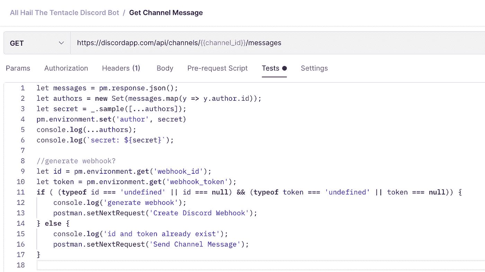

# 用邮递员:不和谐机器人自动化无聊的东西

> 原文：<https://levelup.gitconnected.com/automate-the-boring-stuff-with-postman-discord-bots-9a2ad0088792>

## 使用 Postman 创建简单、快速、低代码的无服务器不和谐自动化机器人。

我将演示如何使用 Postman 创建一个不和谐的机器人，而不必对整个服务器进行编码。我将使用的集合从每日活动列表中随机选择或“牺牲”一个用户，并发布消息标记他们。这个机器人是用来引发讨论和保持人们的参与。这可以很容易地编辑，以创建任何类型的预定消息传递机器人。

有几种不同的方法可以不和谐地做到这一点。但是最简单的方法是创建一个不和谐的 Webhook，将消息发送到一个通道，然后将我们的消息发送到特定通道的 webhook。我们可以在 Discord 服务器设置中创建一个 webhook，但为了让任何想下载并使用我们的 bot 的人更容易，我们将使用 Discord APIs 和 Postman 创建一个 webhook。

为了利用这一点，我们将利用

## 1.进入 [Discord 开发者门户](https://discord.com/developers/applications)并创建一个 Discord 应用

## **2。让我们添加一个机器人并获取机器人令牌**

您可以在这里添加图像和用户名，以便在 bot 向频道发布内容时使用。您将向每个请求添加 Bot 令牌，以便使用 Discord API 进行身份验证。

## 3.获取我们要发布到的频道 ID

获取频道 ID 的最简单方法是在 web 浏览器中导航到您的 Discord，然后简单地转到该频道并复制 ID。

## 4.使用 Postman，让我们获取最近活跃的 Discord 用户列表。

根据 Discord API，我们可以通过调用*/channels/{ { channel _ id } }/messages，*得到最近的所有消息，然后我用一些 javascript 把作者拉出来，保存为一个环境变量。

接下来，我检查是否已经创建了一个 webhook，如果没有，我继续下一个创建 webhook 的请求。如果已经创建了一个 webhook，那么我可以使用 *postman.setNextRequest()* 跳过下一个请求，直接进入最后一个请求。

## 5.创建一个网页挂钩

创建 webhook 后，我们有了一个 webhook id 和一个 webhook 令牌。我把这些留着以后用。

## 6.发送频道消息

在这里，我们使用我们制作的 webhook 来发送一条消息。

请注意我的请求正文，因为这是我们可以格式化我们发送的消息的地方。

## 7.将机器人添加到频道

要将机器人添加到频道，您必须转到应用程序的 OAuth 部分，并生成一个 OAuth 链接来验证您自己并添加机器人。

首先添加邮差 OAuth2.0 回调:[*https://www.postman.com/oauth2/callback.*](https://www.postman.com/oauth2/callback.)

它不允许你生成一个没有这个链接，因为这是一个有效的链接，它应该工作。

接下来，单击 bot 作用域，然后授予 bot 在您的服务器上运行所需的权限。取决于你希望机器人做什么，比如读和写信息，将取决于你的应用程序做什么。

对于我们的系统，我们需要生成和读取现有的 webhooks，并向服务器写入消息。

***请在此之后，复制链接并粘贴到您的浏览器中。它将验证您的用户身份，并允许您将 bot 添加到您运行和管理的服务器中。瞧啊。现在，您的服务器上已经有了您的机器人！***

## 8.自动化使用邮递员监视器！

使用刚刚创建的集合创建一个邮递员监视器。邮递员监视器是一种自动安排邮递员收集运行的简单方法。

不要忘记你的 API 和不和谐信息的环境！

## TL；速度三角形定位法(dead reckoning)

*   使用 API 和 Postman 创建快速简单的不和谐机器人
*   只需在 Discord 应用仪表板中创建一个 bot 来使用 Bot 令牌
*   使用他们的 API 创建一个 webhook，并向 webhook 发送一个请求，在您选择的通道中创建一条消息！

导入我的收藏开始使用这个不和谐的机器人或使用它作为模板在你自己的机器人！

[在推特上关注我:](https://twitter.com/calickahh)@ djfronz

[在 Instagram 上关注我:](https://twitter.com/calickahh)@ djfronz

[在 LinkedIn 上联系我](https://www.linkedin.com/in/stcalica/)。