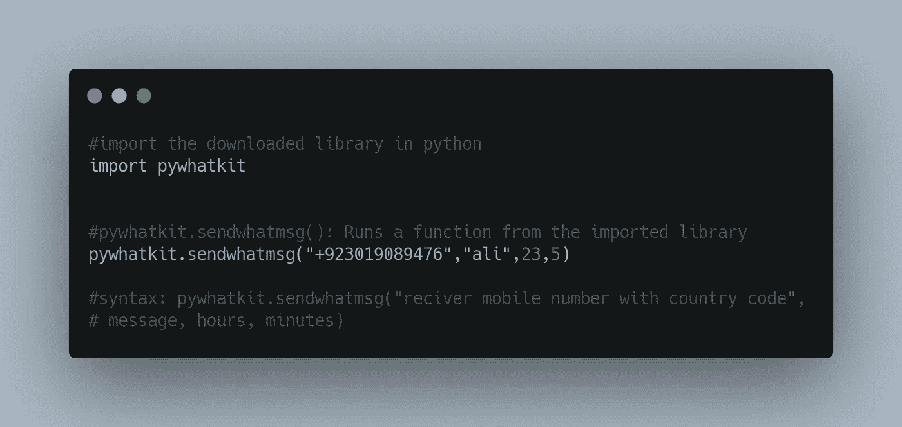

# 使用 Python 即时自动化 WhatsApp 消息！

> 原文：<https://levelup.gitconnected.com/automate-whatsapp-messages-with-python-instantly-3e08d6600612>

## 睡觉时发送 WhatsApp 信息

照片由[杰米街](https://unsplash.com/@jamie452?utm_source=medium&utm_medium=referral)在 [Unsplash](https://unsplash.com?utm_source=medium&utm_medium=referral)

打开 WhatsApp 信息并回复它们可能是一项令人兴奋的任务。如果有更简单的方法不是很好吗？

难道你不想在睡觉的时候给你的朋友、伴侣或者妈妈发短信吗？

数百万人使用 WhatsApp，但我们经常会厌倦重复回复相同的消息。为什么不自动完成这项任务呢？

由于 WhatsApp 的流行，许多工具，如 Whatsapp 机器人和 WhatsApp API，使用户能够以简单的方式自动化他们的消息传递过程，但他们都是付费的。在这里，我将告诉你如何只用两行代码就能做到，对付费机器人的订阅说不，用 Python 自己做，成为一名编码忍者！

# 计算机编程语言

Python 是一种高级编程语言，谷歌、脸书、美国宇航局和世界上几乎所有其他跨国公司都在使用。近年来，Python 已经超越了每一种语言，成为全球最流行、最广泛使用的编程语言。

它在就业市场上的受欢迎程度已经发展到公司在招聘中要求使用 Python 的程度。据《印度时报》报道，Python 是 2021 年收入最高的 5 种编程语言之一。

但是 Python 到底是什么，为什么突然变成了这么抢手的语言？

# 为什么是 Python？

Python 是一种解释性的、面向对象的编程语言，由吉多·范·罗苏姆于 1991 年创建。

Python 可以用于从 web 开发到机器学习、人工智能和数据科学的所有领域。

与其他一些编程语言不同，Python 不需要担心语法。用 Python 写作几乎等同于书面英语。您必须使用适当的函数或“模块”,让 Python 来完成剩下的工作。

Python 简单的语法非常适合学习如何编码的初学者，以及希望快速创建软件原型并赚取合理收入的经验丰富的开发人员。

别再浪费时间了，让我们进入正题吧！

## 1.在 PyCharm 中创建新项目

PyCharm 是一个用于专业开发的 Python IDE。它通过智能辅助、编码辅助和错误预防来帮助您高效地编写代码。如果没有，可以从他们官网下载。

安装后，在 pycharm 中创建一个新项目，给它起一个想要的名字。最关键的部分是选择 Python 作为文件类型。

## 2.安装 pywhatkit

在 pycharm 窗口中打开一个终端并粘贴以下代码

> pip 安装 pywhatkit

**pywhatkit 的一些特性**

*   向 WhatsApp 群组或联系人发送消息
*   向 WhatsApp 群组或联系人发送图像
*   将图像转换为 ASCII 图片
*   将字符串转换为手写
*   播放 YouTube 视频
*   用 HTML 代码发送邮件

## 3.键入以下代码

运行代码，您会发现一条类似这样的消息:

50 秒后，web.WhatsApp.com 将打开，20 秒后，Whatsapp 将发送一条消息。

WhatsApp 的网页版会在指定时间打开并向给定号码发送消息。

**注意:请不要忘记添加国家代码，否则 Python 会抛出一个错误。**

这不是很棒吗？加油！！！去试一试吧。

在不影响睡眠的情况下，你永远不会错过给你的任何朋友或亲密的人发送生日祝福。对于一个人来说，挽救他的友谊、时间或关系已经绰绰有余了。

**结论:**

用 Python 自动处理 WhatsApp 消息在很多情况下都会有帮助。

比如举办一场比赛，让调查变得更有趣，甚至当你想向你的朋友/客户传递任何信息，以防他们中的一个不接电话。

它不仅简单，而且只需要两行代码，不需要其他工作或订阅。你现在能够每天早上给你的女朋友或男朋友发送 WhatsApp 信息，并通过这种机器人浪漫获得关注。

谢谢你一直读到最后。如果你们想要另一篇深入介绍 pywhatkit 库的文章，请告诉我。我很高兴收到你们所有人的来信。