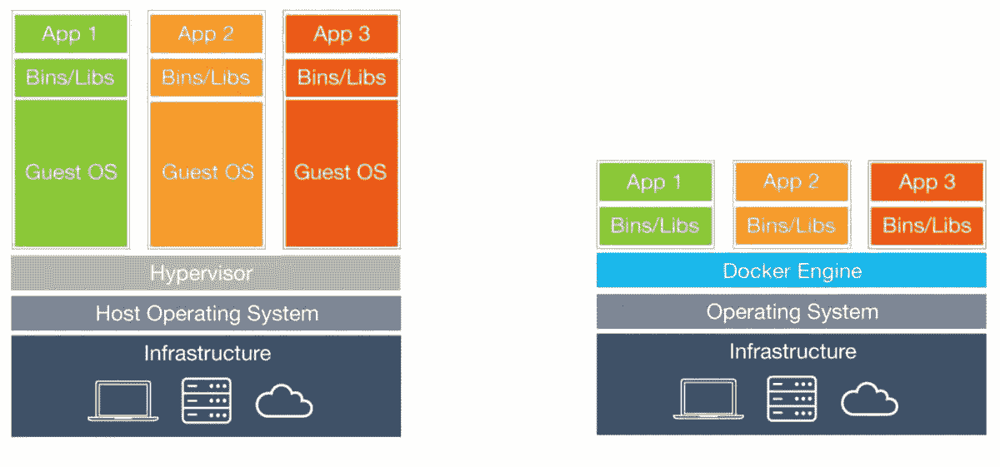

# 使用 Gradle & Docker 自动化您的 Go 应用程序

> 原文：<https://levelup.gitconnected.com/automate-your-go-applications-with-gradle-docker-3c4aa4ddd9bb>

## 利用构建自动化和容器化简化部署。


来自 [Unsplash](https://images.unsplash.com/photo-1580028468862-6895981d7a67?ixlib=rb-1.2.1&ixid=MXwxMjA3fDB8MHxwaG90by1wYWdlfHx8fGVufDB8fHw%3D&auto=format&fit=crop&w=1950&q=80)

在开发软件解决方案时，对速度和效率的需求是一致的。不仅您的应用程序需要完美地编译，而且今天的现代技术空间已经迫使“它在我的机器上工作”成为一种粗俗的说法。今天的应用程序几乎总是需要容器化和可复制的形式，这样你的团队和你的客户就可以随时随地与你的产品进行交互。

在本文中，我们将介绍使用 Gradle 为 Go 应用程序自动构建 Docker 的基础知识。我将介绍每种技术的基础知识，以便更好地了解它们是如何相互作用的。

我们来编码吧！

# 一个基本的围棋服务器

我非常喜欢 simple Go 在设置一个简单的服务器时所做的事情——我们只用 22 行代码就可以做到！这里我们定义了我们的`main`函数，首先初始化一个新的`http.HandleFunc()`方法，该方法为一个`handler`获取一个路由和一个函数。所以当我们点击默认的`"/"`路径时，我们将调用`handler()`方法，该方法给我们的`http.ResponseWriter`写一个编程笑话。然后我们只需调用端口`8080`上的`http.ListenAndServe()`，然后嘣，我们的服务器就准备好了！

# 准备出发的文件

对于一个简单的 Go 程序，我们可以使用一个简单的 docker 文件。 **Docker 是一个虚拟化平台**，**将您的应用程序放在最小化的环境中，称为容器。Docker containers 不像虚拟机那样包含一个完整的操作系统，而是引导你的应用程序只运行最基本的必需品。这减少了开销，创建了可重用的 Docker 容器，并大大提高了部署过程的速度。以下是 docker 如何最小化您的应用程序的可视化表示:**



虚拟机(左)与容器基础架构(右)。来源:[信息世界](https://www.infoworld.com/article/3204171/what-is-docker-the-spark-for-the-container-revolution.html)

一个 **Docker 容器**是应用程序的**运行实例。**为了执行 Docker 容器的实例，**您首先需要一个 Docker 映像**。Docker 映像定义了要构建的应用程序的基础结构。您可以从一个 Docker 容器中运行多个容器实例。要生成 Docker 图像，**您需要一个相应的 Docker 文件。**这是一个可以定义容器规格的文件。

下面是我们将用于 Go 服务器应用程序的`Dockerfile`:

在第 1 行，我们声明了将要使用的 Docker 图像的类型。这里我们说的是获取最新版本的 [Go Docker 图片](https://hub.docker.com/_/golang)。在第 3 行，我们将带有服务器逻辑的`main.go`文件复制到 Docker 映像中。然后在第 5 行我们运行命令`go build main.go`来获得我们的可执行 Go 文件。最后，我们运行命令`"./main"`来运行 Go 可执行文件。`RUN`和`CMD`的区别在于`RUN`指令是在实例化图像之前**使用的，而`CMD`指令是在**容器被实例化之后**运行的。如果一个 Go 可执行文件还没有构建好，你就不会想去运行它。**

> *现在，* ***通常情况下*** *您需要完成* ***附加步骤，创建您的 Docker 映像，定义运行容器的端口，并部署容器本身。*** *这还不包括您是否想为构建版本或推送至 Docker Hub 等外部仓库的映像添加标签。*
> 
> 这就是格雷尔的用武之地！

# 使用 Gradle 实现自动化部署

Gradle 是一个构建自动化工具，可用于定义使您的项目可重复的过程。虽然 Docker 已经增加了一层可复制性和容器化，但是您仍然需要处理 Docker 映像和容器的配置和部署。Gradle 提供的插件可以以可复制的格式扩展您的项目的功能。然后，您可以定义 Gradle 任务来让这些插件工作。

第一步是在你的应用程序的根目录下启动你的项目。首先你需要[安装 Gradle](https://gradle.org/install/) ，然后你可以简单地使用命令`gradle init`启动 Gradle。对于这个例子，您可以在配置选项上点击 enter，因为我们只需要默认设置就可以了。

```
$ gradle initSelect type of project to generate:
  1: basic
  2: application
  3: library
  4: Gradle plugin
Enter selection (default: basic) [1..4]Select build script DSL:
  1: Groovy
  2: Kotlin
Enter selection (default: Groovy) [1..2]Project name (default: test_gradle):> Task :init
Get more help with your project: Learn more about Gradle by exploring our samples at [https://docs.gradle.org/6.8.3/samples](https://docs.gradle.org/6.8.3/samples)BUILD SUCCESSFUL in 7s
2 actionable tasks: 2 executed
```

现在，在我们文件的根目录中，我们可以创建`build.gradle`文件，在这里我们定义 Gradle 插件和任务。以下是我们示例的代码:

首先，我们定义我们希望应用程序使用的`plugins`。这里我们使用了 [Palantir Gradle 插件](https://github.com/palantir/gradle-docker)来为我们的项目添加构建自动化。第 2 行的第一个插件负责构建我们的 Docker 图像，第二个插件自动将图像作为容器运行。

我们可以在第 6 行定义应用程序的版本。然后我们定义我们的第一个任务`docker`，在这里我们可以指定项目的名称，包括项目版本，并在我们的映像中包含任何我们想要的文件。在这种情况下，我们只需要我们的 Go 服务器`main.go`。

最后一个任务`dockerRun`定义了要运行的 Docker 映像的名称，这与我们在`docker`构建任务中定义的名称相同。然后我们定义要使用的端口，其中第一个端口与容器将要运行的端口相匹配。第二个端口是 Docker 容器中的内部应用程序正在运行的端口。最后，`clean true`语法很有用，因为一旦你停止了它，它会自动删除容器。

现在，我们可以运行这两个任务来构建 docker 映像，并使用 Palantir Gradle 插件无缝地运行 Docker 容器。我们可以使用 Windows 的`gradle.bat`或 Linux/Mac 的`gradlew`来实现。

```
$ ./gradlew docker> Task :docker
#1 [internal] load build definition from Dockerfile
#1 sha256:38360e6e661fcb820486172d0c310d8bf39798e04b341c1be678deca41c15464
#1 transferring dockerfile: 115B 0.0s done
#1 DONE 0.0s..........BUILD SUCCESSFUL in 2s
3 actionable tasks: 3 executed
```

要将 Docker 映像作为容器运行，我们可以调用第二个 Gradle 任务。

```
$ ./gradlew dockerRun> Task :dockerRun
c453511861afeeb38ce1c67d730fdf12f951e1f75f9cb2f287b69c7e93b55130BUILD SUCCESSFUL in 1s
1 actionable task: 1 executed
```

如果我们使用`curl`点击端口`8081`，我们会得到一个小小的编程笑话。

```
$ curl localhost:8081
Why did the programmer quit his job?
Because he didn't get arrays.
```

我希望你喜欢这个教程，并学到一些有用的东西。如果你觉得这篇文章有趣或者想了解更多，我鼓励你在下面留下评论。感谢阅读！