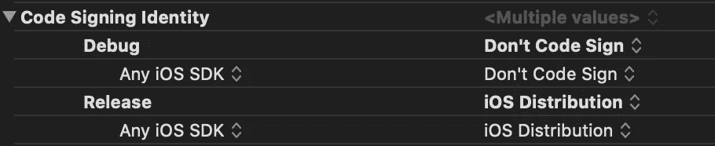
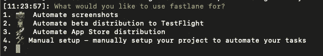
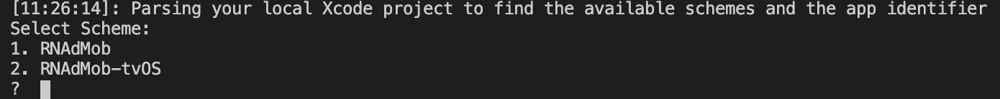
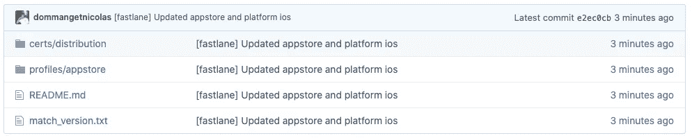
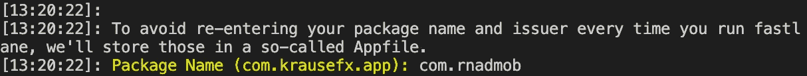
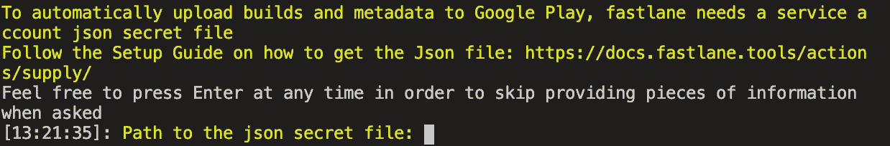
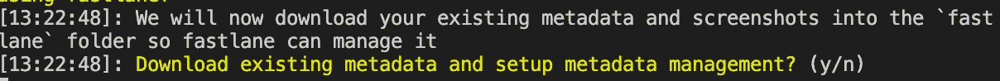

# 使用浪子自动化您的 React 原生应用程序

> 原文：<https://levelup.gitconnected.com/automate-your-react-native-app-with-fastlane-ea516b4a893>

简化截图、测试版部署、应用商店部署和 React 原生应用的登录🚀


# 介绍

对于 iOS 和 Android 来说，有时创建截图、测试版、分发给测试人员等都需要很长时间。为什么不将这些任务自动化呢？

这就是浪子帮助我们节省大量时间的原因😎。

## 什么是浪子？

浪子是一个工具集，用于自动化 iOS 和 Android 的开发和发布过程。

它允许:

*   截屏
*   测试版部署
*   商店部署
*   代码签名

浪子在 iOS 和 Android 上都使用 React Native，这就是我们将要做的🎯

在本文中，我将使用一个来自我之前关于 Google AdMob 的文章的示例应用程序

# 设置

在使用浪子之前，我们需要安装它。这些是先决条件:

*   苹果电脑(浪子不能在 Windows 上运行)
*   一个 React 原生 app(真的？😂)
*   Xcode 命令行工具:

```
$ xcode-select --install
```

*   浪子使用[红宝石](https://www.ruby-lang.org/en/downloads/)，所以我们需要安装它:

```
$ brew install ruby
```

*   自然，我们需要安装浪子:

```
$ sudo gem install fastlane -NV
```

## iOS 部分

在这一部分，我们将使用浪子来签署和部署 iOS 的测试版。

在使用浪子之前，您需要确保以下步骤:

*   拥有 **Xcode 9 或更高版本**
*   一个**苹果开发者 Id** (邮箱+密码)**带管理员权限**
*   设置您的应用程序**捆绑包标识符**(例如 com.rnadmob)
*   App Store Connect 中的一个**应用名称**(如果你没有，浪子会帮你做😎)
*   一个**应用图标**(没有它苹果不会让你上传你的应用)
*   在 iOS 文件夹中放置一个. gitignore 文件(这样 git 就不会关心浪子文件)

ios/。gitignore

准备项目

*   **设置您的捆绑包标识符:**通用- >标识部分- >捆绑包标识符
*   **禁用自动签名:**常规- >签名部分
*   **修改构建设置进行签名:**构建设置- >签名部分- >代码签名标识并设置这些值:



**设置浪子**

我们现在可以在 iOS 文件夹中初始化浪子项目:

```
$ cd RNAdMob/ios
$ sudo fastlane init
```

您会被问到不同的问题:

*   **你想做什么:**



浪子问题

我们将选择"**自动测试版发布到试飞**"

*   **选择方案:**



浪子计划

在我的情况下，我将使用第一个

*   **您的 Apple ID 用户名和密码**

您的帐户可能启用了 2FA，因此您需要创建并提供一个“特定于应用程序的密码”

也有可能发现多个团队，选择合适的团队。

*   **在 App Store Connect 上创建应用:**

如果您的应用程序尚未创建，浪子将询问您是否希望它创建应用程序。

*   **完成**

你的设置已经完成，浪子现在会给你一些信息。🥳

## 测试版部署和代码签名(带证书和签名)

App Store 上的每个应用都需要签名。代码签名向用户保证，您的应用程序来自自上次签名以来未被修改过的已知来源。

浪子允许我们自动快速地签署申请。与浪子签约的两种主要方法是:

*   **匹配:**将您的私钥和证书存储在 git repo 中，以便跨机器同步它们。这使得加入新的团队成员和设置新的 Mac 机器变得容易。这种方法[是安全的](https://docs.fastlane.tools/actions/match/#is-this-secure)并且使用你已经使用的技术。
*   Cert 和 Sigh: 它们允许您在不撤销现有证书的情况下签署您的应用程序。

浪子在他的配置中使用了两个文件:

*   **Appfile:** 存储苹果 ID、应用标识符等信息…
*   **快速文件:**包含车道。一条车道相当于一项任务、一项功能。

我们可以在 **ios/fastlane 下找到这些文件。**在 Fastfile 中，我们已经有了一个“beta”lane:

基本快速文件

这是浪子在初始化期间生成的基本文件。我们可以描述不同的步骤:

*   **increment _ build _ number:**增加“info.plist”文件中的版本号。(您不必在 App Store Connect 上建立相同的号码)
*   **build_app:** 我们可以推断它构建了我们的 app😊
*   **upload_to_testflight:** 将构建上传到应用商店连接和测试飞行

这条车道怎么跑？你只需要进入 **ios/fastlane** 并运行:

```
fastlane beta
```

通道将开始工作，但会失败。为什么？你的应用程序未签名…因此我们需要在通道中添加更多步骤。

以下是修改了车道的新文件:

修改的快速文件

在这个新版本中，我们增加了:

*   它将创建或获取一个证书
*   **获取预配概要文件:**创建或获取预配概要文件
*   **更新项目供应:**设置供应配置文件
*   **更新 _ 项目 _ 团队:**为项目设置团队

现在，您将能够运行:

```
fastlane beta
```

## 测试版部署和代码签名(带匹配)

正如浪子文档中所说，match 可能是签署我们应用程序的最佳解决方案。Match 允许我们在所有开发团队中共享一个代码签名。

**设置匹配**

在设置 match 之前，您需要创建一个新的私有 Git Repo。比如在[https://github.com/](https://github.com/)上。

创建私人回购后，您可以运行:

```
fastlane match init
```

您将被询问 GitHub repo URL(首选 SSH)。在你给出 GitHub repo 之后，一个“匹配文件”会在浪子文件夹中被创建:

基本匹配文件

既然已经设置了匹配，我们可以使用它来创建证书和配置文件:

```
# For the App Store
fastlane match appstore# For the development
fastlane match development
```

在此过程中，系统会提示您输入登录钥匙串和密码来加密/解密您的证书。

完成后，您的证书将被推送到私有 Git repo:



GitHub 中的证书

Match 有很多可能的操作，你可以在[文档](https://docs.fastlane.tools/actions/match/)中找到更多。

既然已经创建了匹配证书和配置文件，我们可以在“beta lane”中使用它，如下所示:

带匹配的快速文件

# Android 部件

您可以在 iOS 和 Android 平台上使用浪子，现在我们将签署和部署我们的 Android 应用程序。

在使用浪子之前，您需要确保以下步骤:

*   一个拥有管理员权限的 **Google Play 控制台账户**(邮箱+密码)
*   **你的**应用**在 Play 控制台上创建了**(不幸的是，浪子没有像 iOS 一样在 Android 上这么做)。****
*   **你的**谷歌证书**(更多信息[点击这里](https://docs.fastlane.tools/getting-started/android/setup/#collect-your-google-credentials))**
*   **在 iOS 文件夹中放置一个. gitignore 文件(这样 git 就不会关心浪子文件)**

**安卓/。gitignore**

## **设置浪子**

**就像“ios”文件夹中的 iOS 一样，我们需要初始化“android”文件夹中的项目:**

```
$ cd RNAdMob/android
$ sudo fastlane init
```

**您会被问到不同的问题:**

*   ****包名****

****

**包名**

*   **你的 **JSON 秘密文件的路径****

****

**JSON 秘密文件**

*   **如果你想用浪子管理**元数据****

****

*   ****完成****

**你的设置已经完成，浪子现在会给你一些信息。🥳**

## **内部测试和代码签名**

**至于 iOS，我们将创建一个测试通道来部署我们的代码。在此之前，我们需要生成一个签名密钥(浪子不这样做)。这与 [React Native Docs](https://reactnative.dev/docs/signed-apk-android) 中的方法相同。**

**您需要位于“android”文件夹的根目录:**

```
keytool -genkey -v -keystore my-release-key.keystore -alias my-key-alias -keyalg RSA -keysize 2048 -validity 10000
```

**生成密钥库后，您可以编辑 Fastfile 并修改“beta”lane，如下所示:**

**Android 快速文件**

**lane 将执行以下操作:**

*   ****询问您的商店密码**(用于生成签名密钥的密码)**
*   ****问你钥匙密码****
*   ****构建应用****
*   ****上传到 play store 内部发布:**第一次上传到 Play Store 需要评论这个步骤，手动完成。"谷歌不允许我们在第一次上传时使用他们的 API . "**

**🚧每次想要使用 lane，都需要在“android/app/build.gradle”中递增“versionCode”。不幸的是，浪子不会自动这么做。**

**浪子允许我们自动完成多项任务，从而节省大量时间。**

**GitLab 回购:【dmg.link/blog-fastlane-repo】T2。**

****你可以在这里** **找到我的其他文章并关注我** [**。感谢阅读，我希望你今天学到了一些新东西🚀**](https://dmg.link/blog)**

**[](/how-to-sign-in-with-apple-on-react-native-4c445de5ff8c) [## 如何在 React Native 上“登录苹果”

### 在 React Native 和 Node.js 上使用 Apple 认证用户的简单指南

levelup.gitconnected.com](/how-to-sign-in-with-apple-on-react-native-4c445de5ff8c) [](https://medium.com/swlh/how-to-use-face-id-with-react-native-or-expo-134231a25fe4) [## 如何在 React Native 或 Expo 中使用 Face ID

### 将生物认证应用到 React Native 或 Expo 应用中。让您的用户使用它登录。

medium.com](https://medium.com/swlh/how-to-use-face-id-with-react-native-or-expo-134231a25fe4)**