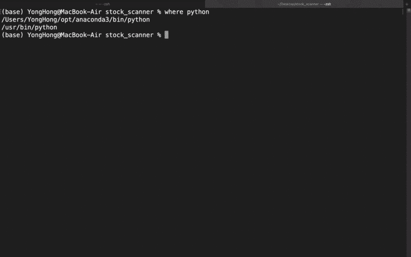

# 使用 Python 自动筛选股票

> 原文：<https://levelup.gitconnected.com/automate-your-stock-screening-using-python-9107dda724c3>

获取每天发送到你邮箱的推荐股票列表！


科技日报在 [Unsplash](https://unsplash.com?utm_source=medium&utm_medium=referral) 上拍摄的

每天早上醒来看到一份通过电子邮件发给你的股票推荐清单，感觉是不是很棒？如果你能自己做到，感觉不是更好吗？以下是你可以做到的！

在我之前的[文章](https://medium.com/analytics-vidhya/build-your-own-technical-analysis-stock-screener-using-python-5d1bb3d091f0)中，我提到了如何构建一个简单的技术分析股票筛选工具。在本教程中，我将向你展示如何使用股票筛选工具自动搜索符合你每天交易策略的股票。这是文章的结构:

1.  定义交易策略
2.  进行筛选
3.  自动化流程

# 第 1 部分:定义交易策略

在本教程中，我将采用一个简单的 [EMA](https://www.investopedia.com/terms/e/ema.asp) (指数移动平均线)反弹策略。顾名思义，我们试图在均线趋势线上寻找反弹，例如 50 日均线。


作者拍摄的 TradingView 截图。

如上图所示，我们的目标是在收盘后寻找符合以下要求的股票:

1.  整体趋势是上升的:18 日均线> 50 日均线> 100 日均线
2.  [随机振荡指标](https://www.investopedia.com/articles/technical/073001.asp) (5，3，3)低于 30，表示股票超卖。
3.  前一根蜡烛线(蜡烛线 2)的低点低于均线 50；收盘高于均线 50；最后一根蜡烛线(蜡烛线 1)的低点高于均线 50。

为了本教程的简单，我将策略的入门规则缩小到以上三条，但这里的交易是，一旦你知道如何做到这一点，你可以很容易地扩大它，并在你的策略中添加任何你想要的指示。同样，你可能已经注意到了，这个策略也适用于其他均线趋势线。

这里不讨论这种策略的效率，但是可以随意查看解释这一点的其他[资源](https://www.youtube.com/watch?v=jdYNaE5GJ0k)。这一策略的回溯测试也将在未来分享(敬请关注！).

# 第 2 部分:执行筛选

## 2.1 获取股票价格

也许获取股票价格最简单的方法是使用 yfinance 库:

```
import yfinance as yf
data = yf.download("AAPL", start="2020-01-01")
print(data)
```


## 2.2 获取库存清单

太好了。但是因为我们要进行筛选，所以获得股票列表是有意义的。我在马来西亚证交所交易，所以我将在这里展示如何获得所有证交所股票的清单。如果您需要帮助来获得您感兴趣的市场的股票列表，请随时在下面发表评论。


在撰写本报告时，有 973 只股票在马来西亚证券交易所上市。

## 2.3 创建技术指标

现在我们有了一个股票列表，也有了一个获取股票价格的方法，我们可以开始创建我们策略中需要的技术指标:18 日均线，50 日均线，100 日均线，随机振荡指标(5，3，3)。

## 代码解释

*   ***第 1–3 行*** *:* 返回股票行情的函数。开始日期设置为“2021–01–01 ”,但是如果您需要更多价格数据，您当然可以更改它。
*   ***第 5–6 行:*** 根据输入周期返回均线的函数。
*   ***第 8–15 行:*** 取窗口、k 周期和 d 周期并计算随机振荡器的函数。
*   ***第 17–18 行:*** 将股票代码传入 get_stock_price 函数(本例中，我加了”。KL "因为这就是 Bursa 股票在[雅虎财经](https://finance.yahoo.com/)中的命名方式，并将结果存储在 price_chart_df 中。
*   ***第 20–28 行:*** 给 price_chart_df 添加必要的指标。

如果我们运行上面的代码并打印结果，我们将得到如下结果:


## 2.4 检查反弹设置

现在我们已经准备好了必要的技术指标，让我们继续创建一个函数来检查反弹设置，特别是我们在第 1 部分中提到的 3 个条件。

## 代码解释

*   ***第五行*** *:* 检查股票是否处于上升趋势的第一个条件:18 日均线> 50 日均线> 100 日均线
*   ***第 6 行:*** 第二个条件，检查两条随机振荡线是否都低于 30。
*   ***第 7–9 行:*** 检查*反弹的第三个条件。*
*   ***第 10 行:*** 如果 3 个条件都为真，则返回真。

## 2.5 屏幕

现在是时候把所有东西放在一起，通过整个股票列表进行筛选，找到符合我们策略要求的股票。

## 代码解释

*   ***第 5–39 行*** *:* 我们到目前为止讨论过的函数。
*   ***第 43 行:*** screened_list 将用于存储筛选结果
*   ***第 45–46 行:*** 获取股票列表，循环遍历列表中的每只股票。
*   ***第 65–67 行:*** 如果 EMA 反弹策略的 3 个条件都满足，将股票添加到 screened_list。
*   ***第 68–69 行:*** 如有打印错误。

# 第 3 部分:自动化过程

## 3.1 设置电子邮件功能

## 代码解释

*   ***第 5–8 行*** *:* 设置邮件内容等字段。将发件人和收件人字段更改为您自己的电子邮件。
*   ***第 10–18 行:*** 设置 SMTP 连接将邮件发送出去。根据您的电子邮件服务提供商更改第 10 行的设置。不要忘记在第 16 行输入密码。

现在你可以在每天收市后执行上面的脚本，得到一个有均线反弹模式的股票列表。

## 3.2 每天运行脚本的计划

有几个选项可以做到这一点，但对我(一个 Mac 用户)来说，最可靠的是使用 crontab。

1.  创建一个包含上述代码的 python 文件。
2.  打开终端并键入`crontab -e`来创建 crontab
3.  按下`i`进入编辑模式
4.  编写运行`0 20 * * 1-5 <YOUR PYTHON PATH> <YOUR PYTHON FILE PATH>`的调度命令
5.  按`esc`退出编辑模式
6.  写`:wq`来保存你的 crontab 并退出

关于第 4 步，`0 20 * * 1-5`表示作业将在每个工作日的晚上 8 点运行。根据您交易的市场，您应该相应地更改时间。至于 Python 路径，可以在终端上使用`where python`来检查 Python 的绝对路径。参考这个[站点](https://crontab.guru/every-day-8am)来了解更多关于 cron 命令的信息。

对于 Windows 用户，可以参考这个很棒的[视频](https://www.youtube.com/watch?v=n2Cr_YRQk7o)来使用 Windows 任务调度器调度 Python 脚本。



GIF 显示了创建 cron 作业的步骤。

# 结论

厉害！现在你应该可以设置一个自动筛选程序，每天运行，找到你想要的股票。我还为你做了一个 Google Colab 文件来测试程序。请随意查看这里的。

如果你喜欢你看到的，看看我的其他故事[这里](https://yonghongtan.medium.com/list/python-stock-screener-tutorial-dcf46b519875)！

[](https://medium.datadriveninvestor.com/how-to-detect-support-resistance-levels-and-breakout-using-python-f8b5dac42f21) [## 如何使用 Python 检测支撑位、阻力位和突破

### 有完整的代码和一个演示笔记本。

medium.datadriveninvestor.com](https://medium.datadriveninvestor.com/how-to-detect-support-resistance-levels-and-breakout-using-python-f8b5dac42f21) [](https://medium.com/geekculture/implementing-the-most-popular-indicator-on-tradingview-using-python-239d579412ab) [## 使用 Python 实现 TradingView 上最流行的指标

### 挤压动量指示器

medium.com](https://medium.com/geekculture/implementing-the-most-popular-indicator-on-tradingview-using-python-239d579412ab) [](https://medium.com/analytics-vidhya/build-your-own-technical-analysis-stock-screener-using-python-5d1bb3d091f0) [## 使用 Python 构建自己的技术分析股票筛选工具

### 一个基于马来西亚股票市场的例子。

medium.com](https://medium.com/analytics-vidhya/build-your-own-technical-analysis-stock-screener-using-python-5d1bb3d091f0) 

***我正在积极学习和使用我的编程知识来提升我的交易。如果你喜欢你所看到的，并且还没有订阅 Medium，请随时通过下面的链接订阅，并跟随我的旅程。谢谢你的支持。***

[](https://yonghongtan.medium.com/membership) [## 加入我的介绍链接-永谭红

### 作为一个媒体会员，你的会员费的一部分会给你阅读的作家，你可以完全接触到每一个故事…

yonghongtan.medium.com](https://yonghongtan.medium.com/membership)