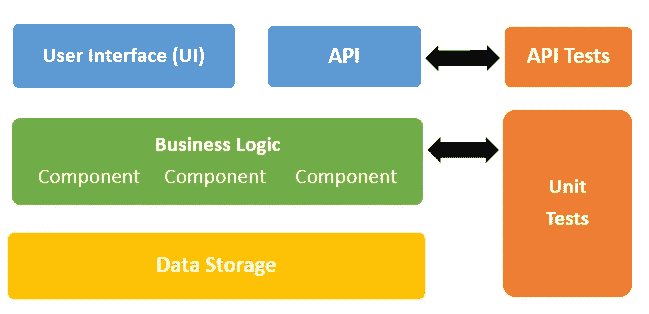
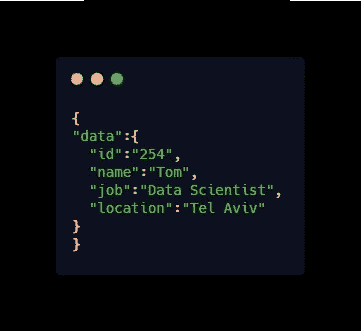
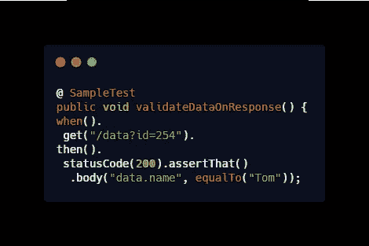

# 关于自动化 API 测试，您需要知道的是

> 原文：<https://levelup.gitconnected.com/automated-api-tests-39f5a25f4eae>

API 正日益成为当今应用程序开发的中心。作为 web 组件之间的主要通信模式，它们用于跨系统连接和传输数据和业务逻辑。

这意味着彻底的 API 测试可以提高软件的质量，并在生产之前将重大的安全风险降至最低。

但是在深入了解自动化 API 测试的更多细节之前，我们先回顾一下 API 测试。

如果你想连接、管理或找到数千个 API，你可以利用 [API 市场](https://rapidapi.com/)来轻松开始集成。

# 什么是 API 测试？

API 测试是一种直接在 API 上执行的软件测试，用于验证它是否满足预期的功能、安全性、可靠性和性能要求。它通常在不加载或不与用户界面交互的情况下测试 API，而是通过向 API 后端发起直接请求。

如下图所示，API 测试是在[业务层](https://en.wikipedia.org/wiki/Business_logic#Business_logic_layer)完成的 GUI 和数据库层之间的所有逻辑操作和事务都发生在这里。它对软件质量至关重要，因为它在短时间内验证了构建中的逻辑。

与 [GUI 测试](https://en.wikipedia.org/wiki/Graphical_user_interface_testing)不同，API 测试可以应对更短的发布周期和常规变化

# 你可以测试什么类型的 API？

API 已经发展了多年——从允许应用程序在同一台设备上运行代码的简单代码库，到允许在一台设备上运行的应用程序调用托管在另一台设备上的代码的远程 API。

在选择 API 测试自动化工具时，理解您正在使用的 API 技术以及如何以最佳方式测试它是很重要的。最常见的 web 服务 API 包括

*   [SOAP](https://en.wikipedia.org/wiki/SOAP) (简单对象访问协议)
*   [休息](https://en.wikipedia.org/wiki/Representational_state_transfer)(具象状态转移)
*   [XML-RPC](https://www.oreilly.com/library/view/programming-web-services/0596001193/ch01.html) (可扩展标记语言——远程过程调用)
*   [JSON-RPC](https://en.wikipedia.org/wiki/JSON-RPC) (JavaScript 对象符号-远程过程调用)

# 自动化 API 测试的需求

API 测试可以提高整个测试套件的效率。在高层次上，API 测试帮助开发人员验证解决方案，维护解决方案，并消除错误。

但是，如果没有彻底执行，问题可能会在产生后很久才出现。这可能会迫使开发团队停止当前的冲刺周期，并返回去寻找哪里出错了。

在测试周期的后期发现 bug 可能会阻碍开发过程，从长远来看，这证明是昂贵的。通过设置自动化 API 测试，您可以:

*   确保所有服务都按预期运行
*   确认是否所有端点都是安全的，不会受到未经授权和未经身份验证的用户的攻击
*   提高功能和非功能测试的覆盖率
*   允许及时向开发团队反馈，最终更快地发布产品
*   从 AWS Lambda 到您的本地设备，测试所有应用程序端点，无论它们托管在哪里。

API 测试允许您验证 web 服务 API 中的四个主要操作，即 GET、POST、PUT 和 DELETE 方法。

下面是一个示例片段，它使用 java [放心库](http://rest-assured.io/)验证从服务器收到的 JSON 响应

假设回答是这样的:

我们可以放心地验证响应。在这种情况下，一个简单的测试是:

从上面的代码片段来看，函数 validateDataOnResponse()调用 API 端点/数据？id=254，我们收到一个 JSON 格式的响应。

该测试还验证 statusCode 为 200，并断言响应在其主体中包含名称“Tom”

# 您可以自动化哪些类型的 API 测试？

您可以在 API 上执行不同类型的测试。虽然测试的范围因 API 而异，但大多数测试都属于以下类别之一:

*   功能测试——它侧重于测试应用程序代码库中的特定功能。目的是确保 API 函数在预期的参数范围内，如果不在，错误会得到适当的处理。理想情况下，这将包括验证 HTTP 响应代码、错误代码和响应的测试用例。
*   负载测试——这种类型的测试是为了测试一个特定的单元或者整个代码库可以支持多少负载。对于处理大量数据或多个用户的应用程序来说，这尤其必要。
    为了确保峰值性能，您需要确定 API 是否能够实际支持预期的负载，无论是 500 个请求，5K 个请求，50k 个请求，甚至 100k 个请求。
*   安全性测试——安全性测试至关重要，因为它有助于确保您的 API 实现不会受到漏洞的影响。因此，开发人员应该确保他们的 API 测试用例包括验证授权、加密机制、访问控制、会话管理等的检查。
    API 安全验证和审计过程还包括[模糊测试](https://owasp.org/www-community/Fuzzing)和[渗透测试](https://blog.securelayer7.net/api-penetration-testing-with-owasp-2017-test-cases/)，两者都确保你的 API 免受外部漏洞的攻击
*   验证测试 API 实现中最后但非常重要的测试之一。
    它验证产品开发、API 行为和整体效率的重要方面。
    这种类型的测试用于验证 API 的开发和实现是否符合约定的标准以及用户的需求和要求。
*   运行时/错误检测——与上面的测试不同，上面的测试主要关注在特定场景中实现 API 的结果，这种类型的测试关注的是 API 如何运行。
*   这包括监视代码实现、执行、错误检测和资源泄漏中的异常。

# API 的测试策略

自动化测试的最佳实践之一，不仅仅是对 API，是配置你的测试套件来提供一个输出，这样你就不必观察系统的响应。
自动化 API 测试可以根据输入条件返回这三个输出中的任何一个:

*   布尔状态-通过或失败
*   任何类型的数据或信息
*   对其他 API 函数或事件的调用

在直接测试 API 时，指定具体的通过或失败场景有些困难。

有些情况下可能没有输出或发生不可预知的事情。然而，通过比较测试后的响应数据或调用另一个 API 后的行为，测试人员可以为他们的测试创建明确的验证场景。

执行全面而严格的 API 测试是验证您的应用程序自始至终运行良好的可靠方法。

然而，为了确保代码更改不会破坏您的 API 并保证生产中的成功，请考虑将自动化 API 测试集成到您的 CI/CD 管道中。