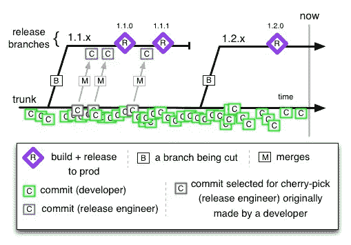
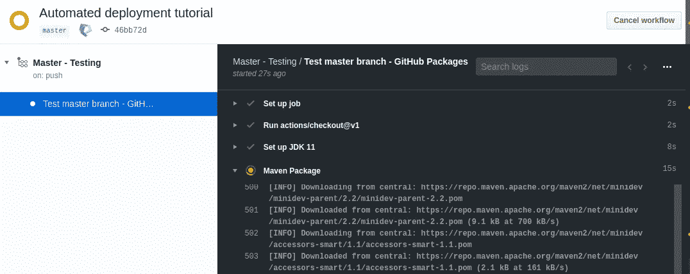
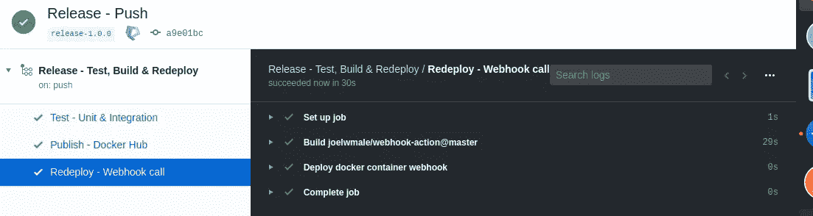

# 使用 Docker、GitHub 动作和 Web 挂钩进行持续部署

> 原文：<https://levelup.gitconnected.com/automated-deployment-using-docker-github-actions-and-webhooks-54018fc12e32>


## 要求

*   一个 maven 项目将被[停靠](https://docs.docker.com/get-started/)进行部署。在本教程中，我将使用一个 [Spring Boot](https://spring.io/projects/spring-boot) 应用程序
*   GitHub 知识库
*   Docker Hub 仓库
*   将部署容器映像的 Linux 机器
*   本教程基于基于[主干的开发](https://trunkbaseddevelopment.com/)策略，但是您可以塑造下面描述的技术来更好地适应您的分支策略

## 我们要建造什么？

我们将创建一个 GitHub 工作流，使用一个 [Webhook](https://medium.com/tanda-developers/a-beginners-guide-to-using-webhooks-3d95018fabbc) 作为触发器，测试、构建并自动触发远程服务器上自动生成的 docker 容器映像的重新部署。

# 入门指南

有许多工具可用于自动化部署。这种方法为运行在远程服务器上的简单应用程序提供了一种非常简单直接的实现方式。

## GitHub 存储库

我们有一个共享的主分支(主干),许多短命的特性分支从它开始生长，并在几天内合并(理想情况下)。我们也有几个发布分支，主分支的版本被挑选出来进行部署。



## Docker Hub 知识库

您还应该创建一个 [Docker Hub 存储库](https://hub.docker.com/repositories)。我们生成的容器映像将被推送到那里，我们的服务器将总是从那里获取应用程序的最新版本，以便重新部署它。

# GitHub 工作流程

为我们的项目触发 GitHub 动作就像在正确的位置放置正确的配置文件一样简单。在 */中的项目根目录下创建两个新的 YAML 配置文件。github/workflows* 文件夹。第一个文件将用于主分支，并将运行一些测试以确保每次推送都正常。第二个将仅应用于发布分支，不仅测试新版本，还为其创建 docker 映像并触发重新部署。

## 主工作流程

```
name: Master - Testing

on:
  push:
    branches:
      - 'master'

jobs:

  artifact:

    name: Test master branch - GitHub Packages
    runs-on: ubuntu-18.04

    steps:
      - uses: actions/checkout@v1
      - name: Set up JDK 11
        uses: actions/setup-java@v1
        with:
          java-version: 11.0.4
      - name: Maven Package
        run: mvn -B clean package -DskipTests
      - name: Maven Verify
        run: mvn -B clean verify
```

这个简单的文件很容易阅读，它触发了 Java 11 环境中 maven 构建生命周期的打包和验证阶段。我强烈建议看一下[关于工作流的官方文档](https://help.github.com/en/actions/configuring-and-managing-workflows/configuring-a-workflow#creating-a-workflow-file)来理解这些配置文件的工作。现在，让我们一步一步地看看我们刚刚创建的那个:

```
name: Master - Testing

on:
  push:
    branches:
      - 'master'
```

仅当主分支被推送时，才会触发此工作流。当您在 GitHub 页面上查看您的操作历史时，以及当您收到关于失败测试的电子邮件通知时，您为您的工作流指定的名称将是可见的，因此请始终选择一个有意义的名称。

```
jobs:

  test:

    name: Test master branch - GitHub Packages
    runs-on: ubuntu-18.04

    steps:
      - uses: actions/checkout@v1
      - name: Set up JDK 11
        uses: actions/setup-java@v1
        with:
          java-version: 11.0.4
      - name: Maven Package
        run: mvn -B clean package -DskipTests
      - name: Maven Verify
        run: mvn -B clean verify
```

在这个工作流程中，我们只有一个作业。我们定义作业将在其上运行的机器类型，您可以在这里找到可能值的列表。

一项工作总是由多个步骤组成。在这种情况下，我们用期望的版本建立一个 java 环境，一旦它准备好了，我们就可以运行我们想要的任何 maven 命令。在这种情况下，我们打包我们的应用程序，然后验证它。

如果你不熟悉 Maven 构建生命周期，我建议看一看[在它的每个阶段](http://maven.apache.org/guides/introduction/introduction-to-the-lifecycle.html)到底做了什么。

## 试试吧！

推送主分支的新版本，并转到存储库的 Actions 部分。您将立即看到工作流被执行。我鼓励您现在对您的配置文件进行一些调整，并根据您的需要调整工作流的行为。



## 发布工作流程

现在我们已经准备好了主工作流，让我们把注意力转向节目的明星。我们的发布工作流应该构建一个 docker 映像并将其发布到 Docker Hub 存储库中，并通过调用 Webhook 端点来触发服务器上的重新部署。如果你不熟悉 Webhooks，我建议看看[这篇文章](https://codeburst.io/what-are-webhooks-b04ec2bf9ca2)。

在我们看一下发布分支的工作流文件应该是什么样子之前，让我们已经为自动重新部署准备好了服务器。

# 准备服务器

对于这个例子，我使用一个简单的运行 Ubuntu 18.04 的 AWS EC2 实例。在远程实例上使用它之前，您可以在本地机器上测试它。

## 安装 docker

由于我们的应用程序将被转换成一个容器映像，我们的服务器将需要安装 docker，以便总是获取和运行最新版本。你可以在这里找到如何安装 docker [最新版本的详细信息，但是这个简单的命令列表在大多数情况下也能达到目的:](https://docs.docker.com/install/linux/docker-ce/ubuntu/)

```
sudo apt-get update
sudo apt-get remove docker docker-engine docker.io
sudo apt install docker.io
sudo systemctl start docker
sudo systemctl enable docker
```

然后，您可以检查安装是否成功:

```
docker --version
```

## 创建 Dockerfile 文件

为了将我们的应用程序转换成容器映像，我们需要一个配置文件来描述创建它的必要步骤。在项目的根目录下，以 *Dockerfile* 的名称创建以下文件。

```
FROM maven:3.6.3-jdk-11-slim AS *build* RUN mkdir -p /workspace
WORKDIR /workspace
COPY pom.xml /workspace
COPY src /workspace/src
RUN mvn -B -f pom.xml clean package -DskipTests

FROM openjdk:11-jdk-slim
COPY --from=*build* /workspace/target/*.jar app.jar
EXPOSE 8080
ENTRYPOINT ["java","-jar","app.jar"]
```

这将创建一个包含 pom 文件和 maven 项目源代码的工作区。然后将它打包，并将生成的 jar 文件作为容器的入口点公开。(确保您的 maven 配置生成了一个 JAR 文件)

注意:确保公开应用程序使用的端口

## **打造码头工人形象**

你现在可以使用 docker 来建立你的形象。使用您的 Docker Hub 凭证登录，导航到您的项目的根目录，构建它并将其推送到您的存储库:

```
sudo docker login -u myusername -p mypassword
cd /example/my-project-path
sudo docker build -t example/my-repository .
sudo docker push example/my-repository
```

## 运行应用程序

现在，您可以通过命令行获取并运行应用程序的最新可用映像:

```
docker run -d --name=SAMPLE_APP example/repository:latest
```

这将在后台启动应用程序。该名称在以后的重新部署中会很有用，所以请确保将其作为参数传递，并存储起来以备后用。然后，您可以获得当前加载的所有容器的列表，在那里您将有希望找到您的应用程序的当前状态:

```
docker container ls -a 
```

## 为 Webhook 创建一个端点

我们的目标是使 HTTP 端点可用，以便我们可以在每次消息发送到该端点时重新部署应用程序。为了做到这一点，我们将安装这个[简洁的轻量级工具](https://github.com/adnanh/webhook)来为我们做这件事。

```
sudo apt-get install webhook
```

您可以查看文档，了解如何进一步定制您的端点。对于本教程，我们将有一个名为“redeploy”的简单端点，每当有消息发送给它时，它都会运行一个 bash 脚本。在您选择的目录中创建一个名为 *hooks.json* 的文件。

```
[
  {
    "id": "redeploy",
    "execute-command": "/my/scrips/path/redeploy.sh",
    "command-working-directory": "/my/path/to/hooks",
    "response-message": "Redeploying API server."
  }
]
```

端点的“*execute-command”*字段应该指向每次端点收到消息时您希望运行的脚本。因此，请确保该脚本确实存在:

```
#!bin/bashdocker pull example/repository:latest
docker stop SAMPLE_APP
docker system prune -f
docker run -d --name=SAMPLE_APP example/repository:latest
```

这个小脚本将停止您的应用程序，删除它，然后使用我们之前看到的命令从您的 docker hub 存储库中获取并运行最新版本。

一旦配置文件和脚本都准备好了，就可以通过运行 webhook 应用程序来激活端点:

```
webhook -hooks /my/path/to/hooks/hooks.json -verbose
```

一旦运行，端点将在[http://your-IP-address:9000/hooks/redeploy 上可用。](http://your-ip-address:9000/hooks/redeploy.)通过[使用邮递员](https://medium.com/aubergine-solutions/api-testing-using-postman-323670c89f6d)或您选择的任何其他工具发送请求来测试它。然后，您可以通过列出当前容器来检查您的应用程序是否成功重启:

```
sudo docker container ls -a
```

端点可以被进一步配置来做一些事情，比如使用另一个端口、验证报头和有效负载，以及向您希望使用的脚本传递参数。我强烈建议您深入了解它的所有功能。

## …然后回到工作流程

让我们回到正题。我们的发布工作流需要自动完成我们刚刚做的那些事情，下面是如何完成的。

## 创造你的秘密

将以下变量作为秘密存储在 GitHub 中，以便工作流能够访问您的 docker 帐户。

*   **DOCKER_REPO -** 您在 Docker Hub 的存储库地址
*   **DOCKER_USER -** 您的用户名
*   **DOCKER_PASS -** 您的密码
*   **DEPLOY_WEBHOOK_URL -** 将用于触发应用程序重新部署的端点地址

## 创建您的工作流文件

就像我们对主分支所做的那样，在“ */”处创建另一个 *YAML* 文件。发布分支的 github/workflows "* 。

```
name: Release - Test, Build & Redeploy

on:
  push:
    branches:
      - 'release-*'

jobs:
  test:
    name: Test - Unit & Integration
    runs-on: ubuntu-18.04

    steps:
      - uses: actions/checkout@v1
      - name: Set up JDK 11
        uses: actions/setup-java@v1
        with:
          java-version: 11.0.4
      - name: Maven Package
        run: mvn -B clean package -DskipTests
      - name: Maven Verify
        run: mvn -B clean verify

  docker:
    name: Publish - Docker Hub
    runs-on: ubuntu-18.04
    needs: [test]
    env:
      REPO: ${{ secrets.DOCKER_REPO }}
    steps:
      - uses: actions/checkout@v1
      - name: Set up JDK 11
        uses: actions/setup-java@v1
        with:
          java-version: 11.0.4
      - name: Login to Docker Hub
        run: docker login -u ${{ secrets.DOCKER_USER }} 
             -p ${{ secrets.DOCKER_PASS }}
      - name: Build Docker image
        run:docker build -t $REPO:latest -t $REPO:${GITHUB_SHA::8} .
      - name: Publish Docker image
        run: docker push $REPO

  redeploy:
    name: Redeploy webhook call
    runs-on: ubuntu-18.04
    needs: [docker]
    steps:
      - name: Deploy docker container webhook
        uses: joelwmale/webhook-action@master
        env:
          WEBHOOK_URL: ${{ secrets.DEPLOY_WEBHOOK_URL  }}
          data: "{ 'myField': 'myFieldValue'}"
```

让我们在这里分解一下最相关的部分。

```
on:
  push:
    branches:
      - 'release-*'
```

这一次，我们希望我们的工作流只在以“ *release-* ”开始的分支被推送时才被执行。

```
docker:
    name: Publish - Docker Hub
    runs-on: ubuntu-18.04
    needs: [test]
    env:
      REPO: ${{ secrets.DOCKER_REPO }}
    steps:
      - uses: actions/checkout@v1
      - name: Set up JDK 11
        uses: actions/setup-java@v1
        with:
          java-version: 11.0.4
      - name: Login to Docker Hub
        run: docker login -u ${{ secrets.DOCKER_USER }} 
             -p ${{ secrets.DOCKER_PASS }}
      - name: Build Docker image
        run:docker build -t $REPO:latest -t $REPO:${GITHUB_SHA::8} .
      - name: Publish Docker image
        run: docker push $REPO
```

我们的应用程序使用我们作为机密存储的信息构建并推送到我们的 docker 存储库。build 命令使用根目录中的 docker 文件。请注意,“需求”配置确保只有在测试成功执行之后，这个作业才会运行。

```
redeploy:
    name: Redeploy - Webhook call
    runs-on: ubuntu-18.04
    needs: [docker]
    steps:
      - name: Deploy docker container webhook
        uses: joelwmale/webhook-action@master
        env:
          WEBHOOK_URL: ${{ secrets.DEPLOY_WEBHOOK_URL  }}
          data: "{ 'myField': 'myFieldValue'}"
```

最后，我们使用一个 [Webhook 动作](https://github.com/marketplace/actions/webhook-action)向我们的端点 URL 发送一个请求。现在，我们只是发送一个没有任何有意义的数据的一般请求，但你可以检查文档，并考虑扩展它，以包括一个验证你的调用的聪明方法。

# 就是这样！

您现在可以创建一个发布分支并推动它。转到 GitHub 存储库的 Actions 部分，观察应用程序自动重新部署的过程。

