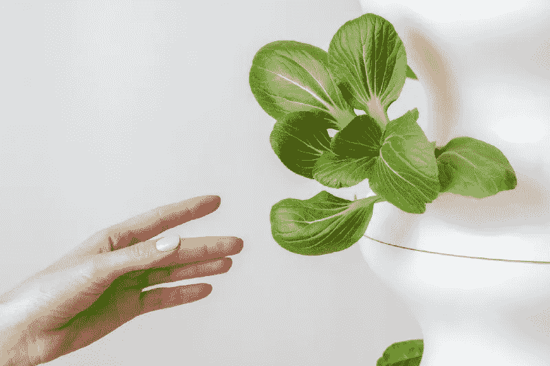
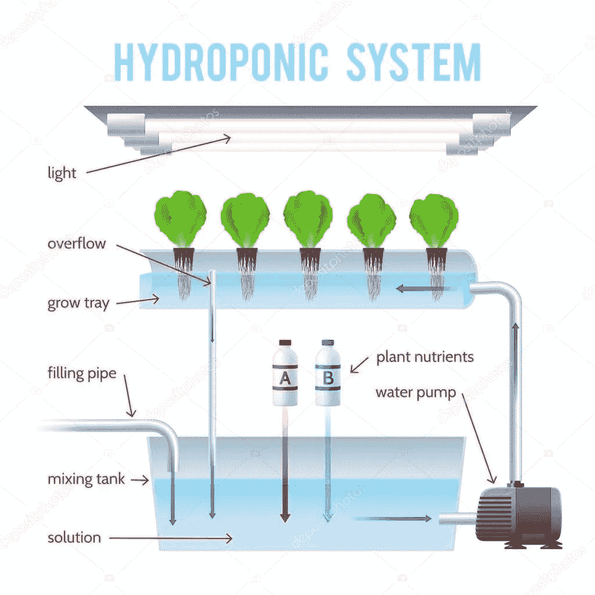
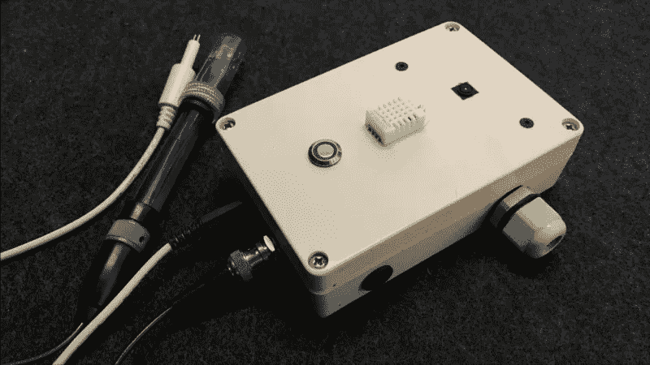

# 自动化水培！

> 原文：<https://levelup.gitconnected.com/automated-hydroponics-9aa697552b9d>

> 可靠高效的小型水培农场自动化系统💧🌱！

[摄莴苣在](https://unsplash.com/@lettucegrow?utm_source=unsplash&utm_medium=referral&utm_content=creditCopyText)[的台阶上](https://unsplash.com/s/photos/hydroponics?utm_source=unsplash&utm_medium=referral&utm_content=creditCopyText)生长

# **什么是水培？**

水培是一种不用土壤种植植物的方法。相反，植物的根可以直接接触到含有它们生长和茁壮成长所需的所有营养物质的水源。这是一个干净、可控和紧凑的生长环境。这些系统通常在室内，具有受控的小气候，允许精确的环境条件，以确保最大限度的植物生长，同时最小限度地暴露于害虫、霜冻、洪水等风险。这将使种植者收获大量高质量的产品，几乎没有因气候或污染而损失的机会。

NFT 水培系统(承蒙:存放照片)

这些垂直的室内农场可以在没有传统农业空间的地方种植。它们也可以全年生长，不受气候或天气条件的影响。对许多人来说，这是一个很大的希望，水培农场将消除食物沙漠，提供新鲜和健康的绿色和其他产品给服务不足的社区。

如果操作得当，水培也是一种非常可持续的做法。令人惊讶的是，通过一次又一次地在系统中循环水，它使用的水比传统农业少得多。它也不会导致土壤退化，而土壤退化是当今世界的一个重要问题。

因此，许多爱好者和商业种植者已经进入了水培的世界。

## ✔水培的优势

1.  所需资源更少—土地(产量约为传统耕作的 240 倍)、水(比传统耕作少 98%)和能源(如果是温室)
2.  高品质的产品，因为环境是完全受管制的。
3.  水被处理和回收后的可持续农业。
4.  季节性不可知。

## 𐄂短缺

1.  商业设置:初始设置成本高
2.  商业设置:在室内种植时，由于温度控制和室内照明，能耗较高

> 作为一个有适当自动化的业余种植者，在你家里有一个水培装置实际上没有坏处，因为它是自我可持续的。它需要很少的空间，易于安装。

# 🔥自动化单元(硬件)

作者照片

他的装置基于 Raspberry Pi Zero W，旨在自动化日常工作，并为种植者消除猜测工作。它需要传感器来使设置能够自我维持，并减少日常任务。它能产生植物健康生长所需的有利的和可重复的条件。它完全在 Node(JS)上运行。

## 📹—照相机

可以访问农场的实时饲料，以了解产品的状态以及是否有任何影响植物的虫害或疾病。

*   **直播饲料**
*   **生长周期的时间推移**

## 🌱—传感器

保持正确的水分营养水平对植物在生长的每个阶段保持健康是至关重要的。使用 pH 和电导率传感器检测水中的营养。

当保持适当的温度和湿度时，植物会茁壮成长。

*   **环境温度和湿度**
*   **营养的酸碱度**
*   **ppm 营养水平**

## 🎛 —控制

LED 灯和水泵根据设定的时间表进行电子开关。这确保了所需的可靠和可重复的环境。

*   **LED 灯(紫外线生长灯)时间表(通常 12 小时一班)**
*   **泵进度表**
*   **营养定量给料器**

## 技术规格:

*   **摄像头** : 5MP
*   **4 通道开触点继电器**(额定值:每通道 230V / 10A)
*   **pH 传感器**(范围:0–14PH，分辨率:0.15PH (STP))
*   **EC 传感器**(范围:0–2000 us/cm 分辨率:5% (STP))
*   **温度传感器**(范围:-40 到 80 摄氏度，分辨率:0.1 摄氏度)
*   **湿度传感器**(范围:0–99.9% RH，分辨率:0.1 %RH)
*   **电源:** 12V/2ADC 穿墙适配器
*   **尺寸:** 90 x 134 x 36 毫米(宽 x 长 x 深)—壁挂支架

# 自动化策略

水培法的优点是大多数参数都可以被严密监控，从而获得可重复的结果。

## 种植灯

对于生长灯，需要保持强度和波长以加速植物的生长。这是通过测量和调整光谱来设定的。灯预定 14 小时开，10 小时关。

## 水泵

随着植物的生长，它们从水中吸收营养和氧气。因此，保持水箱中的水循环非常重要。死水也是蚊子幼虫和其他细菌的滋生地。水泵计划每 30 分钟运行一次。

## 营养

为确保保持正确的 pH 值和 ppm 水平，系统会在设定的时间间隔从储罐中取样。如果 pH 或 ppm 低于或高于要求的水平，则采取纠正措施并重复测量。

## 温度

环境温度和湿度保持在工厂要求的水平。PID 算法用于维持温度和湿度。