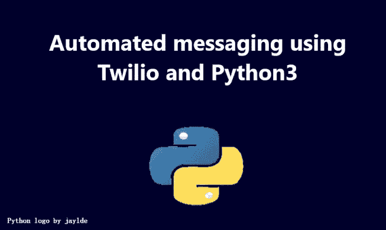
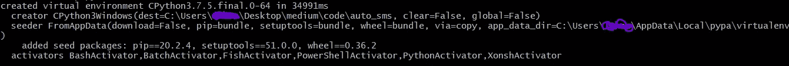
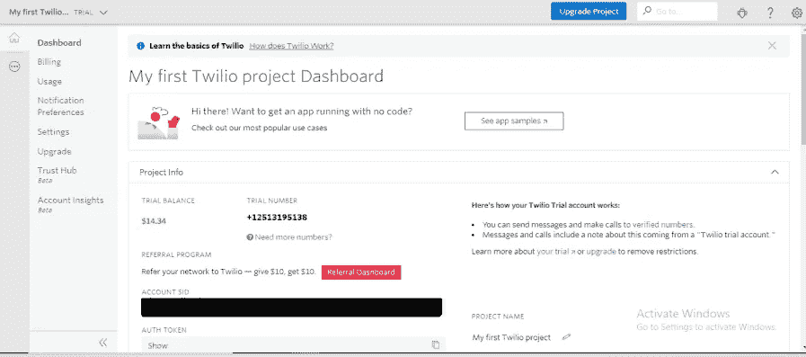
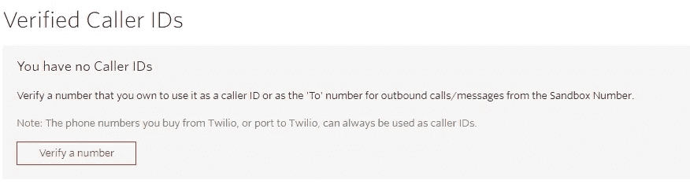
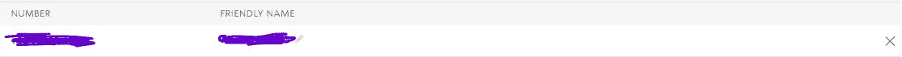
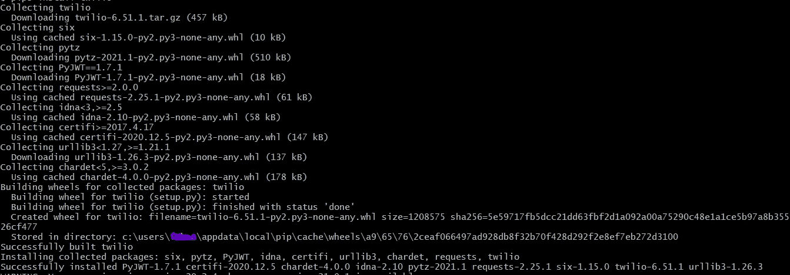
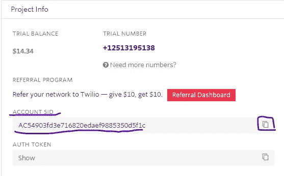
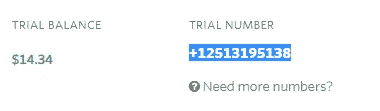
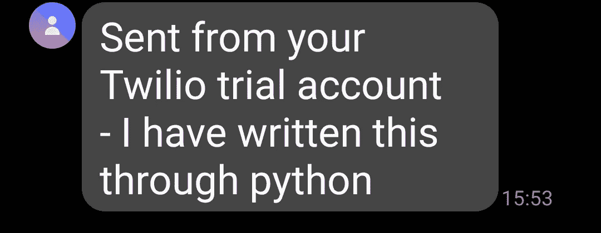

# 使用 Python3 的自动化消息传递

> 原文：<https://levelup.gitconnected.com/automated-messaging-using-twilio-and-python3-b1b28ddae0fb>



大家好！在今天的教程中，我们将学习如何使用 python 发送自动消息。首先，让我们像上次一样创建一个虚拟环境。让我们打开终端/命令提示符，将目录(cd)更改到我们想要存储项目文件的文件夹，例如 my desktop 文件夹。我们将创建一个名为 auto_sms 的新目录(mkdir ),如下所示:

```
cd Desktop
mkdir auto_sms
```

在我的上一篇使用 selenium 进行 web 抓取的教程中，我们安装了一个名为 virtualenv 的模块，所以你可以[查看一下](https://ishanc.medium.com/basics-of-selenium-in-python3-6ed4293c67ef)，但是没有必要使用虚拟环境。你可以简单地做:

```
pip3 install Twilio
```

但我更喜欢使用虚拟环境，所以如果你愿意，你可以跟着一起做。将目录更改为 auto_sms 目录，并创建一个虚拟环境，如下所示:

```
cd auto_sms
virtualenv -p python .
```

任何类似的信息:



那么这是个好消息！虚拟环境现已创建。要在 macOS 上激活它，请键入:

```
source Scripts/activate
```

在 windows 类型上:

```
Scripts\activate
```

要发送自动消息，我们将使用 Twilio 客户端。首先，去 twilio.com[的](https://www.twilio.com/)注册一个免费账户。登录后，您将看到一个类似如下的控制台:



不要向任何人显示您的帐户 SID 和授权令牌；有人会用它来对付你。如果没有帐户 SID 和授权令牌，就无法使用该号码。现在你可以看到我的试算表是 14 美元。然而，你将有 15 美元，除非你以前使用过 Twilio 帐户。如果你看到下面的“这是你的 Twilio 试用帐户的工作方式”，有一个超链接，并附有文字，“验证的数字”。点击它。

如果您没有经过验证的电话号码，那么您就不能向任何号码发送消息。点击链接后，您的屏幕将显示如下内容:



点击验证一个号码，然后通过这两个步骤来验证您想要发送消息的号码。现在窗口看起来会像这样:



紫色代表你的号码。现在，让我们回到控制台，回到我们的终端。现在让我们像这样安装 Twilio 客户机:

```
pip3 install twilio
```

如果您收到如下消息:



恭喜你！安装成功。现在让我们继续创建一个新的目录调用 src，将我们的实际代码与 auto_sms 文件夹中的文件分开。

```
mkdir src
cd src
```

现在创建一个 python 文件，名称随意。您可以使用任何您想要的 IDE 或文本编辑器，但是我将使用 Vim。

让我们从从 twilio 导入客户端开始:

```
from twilio.rest import Client
```

现在我们要创建两个变量。变量名应该和我写的一模一样，因为接下来，我们会给客户端类，我们已经导入的，这两个值。所以保持名字和我写的一样很重要。

首先让我们创建变量‘ACCOUNT _ SID ’,然后将我们的帐户 SID 从控制台复制到这个变量。帐户 SID 和身份验证令牌位于项目信息下:



点击我圈出来的按钮复制。现在给变量这个值。我们还将复制 auth token，并将其赋予变量 AUTH_TOKEN。最后，代码看起来会像这样:

```
ACCOUNT_SID = ('Your Account SID')
AUTH_TOKEN = ('Your Authorization Token')
```

现在让我们创建一个名为 client 的新变量，并将 ACCOUNT_SID 和 AUTH_TOKEN 的值提供给我们导入的客户端类，如下所示:

```
client = Client(ACCOUNT_SID, AUTH_TOKEN)
```

现在在你的代码中写下这个:

```
client.messages.create(from_='Trial Number over here',
                       to='Number you verified',
                       body='Your message over here')
```

其中，试验编号是指项目信息下显示的编号:



如果没有，您需要创建一个；项目信息下有一个选项。既然已经做了，我就把数字放在 from_ 变量里。尽管数字是整数，但应该用引号括起来，作为一个字符串。你也必须让+1 在那里。“到”变量将包含您验证的数字。它还必须包括你的地方的标准代码。最后，正文将包含消息的文本。让我们运行代码。

虽然你的终端上什么也不会出现。检查您发送信息的电话号码。我的信息是‘我是通过 python 写的’。我手机上的短信应用程序显示



就这么简单！我希望你喜欢这篇博客，如果你喜欢，请喜欢，分享和关注这篇博客，以获得更多这样的教程。下面是最终的代码:

```
from twilio.rest import ClientACCOUNT_SID = ('Your account SID')
AUTH_TOKEN = ('Your Auth Token')client = Client(ACCOUNT_SID, AUTH_TOKEN)client.messages.create(from_='Trial Number',
                        to='+Verified Number',
                        body='Message that you would like to write')
#Link to github repository
# [https://github.com/Ishan-Choudhary/Automated-messaging-using-Twilio-and-Python3.git](https://github.com/Ishan-Choudhary/Automated-messaging-using-Twilio-and-Python3.git)
```

再次感谢您的阅读！