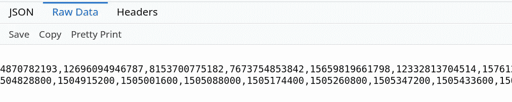

# Python 中区块链指标的自动化 Twitter 机器人

> 原文：<https://levelup.gitconnected.com/automated-twitter-bot-for-blockchain-metrics-in-python-part-2-a551e5a84df1>


这个机器人是一个项目，我已经断断续续地工作了几个月了。这意味着原始代码被重构了无数次，所以我决定重做这篇文章，并删除我发表的关于这个机器人的原始文章，以简化和刷新文档。

对于那些没有阅读原始文章的人，让我简单解释一下这个机器人是如何出现的。

早在 2020 年第四季度，我就在寻找项目创意，因为我正在构建一个投资组合，以配合我最近获得的数据科学认证。我对区块链理工大学和风靡全球的项目也有着好奇的兴趣。一天，在浏览最新的加密推特时，我看到一个来自将军会的请求，呼吁有技能的人为 https://docs.decred.org/privacy/cspp/overview/ T2 的硬币洗牌++制作一个推特机器人

老实说，我不知道从哪里开始，我也不完全确定我是否能够构建它，但在经历了许多版本、重构和花费时间试图解决我遇到的所有问题以及整合社区要求的新机器人功能后，我最终拥有了一个相当稳定并按预期工作的机器人。

该脚本由云托管，在 UTC 时间每天午夜后一点点执行。最初我使用的原始数据来自[https://explorer . DCR data . org/API/chart/privacy-participation？axis=time & bin=day](https://explorer.dcrdata.org/api/chart/privacy-participation?axis=time&bin=day) 但是由于数据发布/刷新的本质以及其他一些问题，这并不十分奏效。简而言之，通常原始数据每两天更新一次，我们需要新的数据，所以我决定每天从 block explorer 中抓取数据，而不是使用它。此外，我们需要的一些数据不是以原始格式提供的，所以即使发布及时，也是不够的。整个抓取过程大约需要 4500 秒，这取决于当天挖掘了多少块，之后它会处理数据并将其广播到 twitter。

让我们看看数据在哪里，我们到底需要什么…如果我们打开:[https://explorer.dcrdata.org/](https://explorer.dcrdata.org/)这是我们得到的结果:


在左上角，我们看到“提议”…这是最近开采的区块。Decred 的平均封锁时间为 5 分钟，这意味着每天应该有大约 288 个新区块被开采。这些块显示在“高度”下，也在上面页面的左侧。可以说，我们要找的数据就在这些街区内。让我们深入其中一个:


像这样的大量信息驻留在每个块中…我们的机器人需要的数据是:1)左上角的 DCR“混合”量，在这种情况下是:2，195，553708 DCR。2)右侧的日期，在本例中为:2020 年 11 月 30 日。3)“已发送总量”，这是在该特定块中交易的 DCR 总量。4)“Block”，这是与其“内部”数据相关联的块号。

让我们快速分解一下脚本的逻辑:每天 UTC 午夜后几分钟，前一天过去了，所有的块都在 explorer 上，我们希望脚本开始抓取刚刚过去的一整天的数据。

在 00:15 UTC，脚本运行后，首先检查当前的“建议块”,以确定基准值。这个建议的区块是新一天的第一个区块之一，因此这是我们刮削范围的终点。现在我们调用一个函数，该函数只查看前一天存储的数据中的最后一块，这是我们抓取范围的起点。这样，我们就锁定了这个范围，我们知道我们需要的所有数据都会被捕获，然后我们开始处理和过滤这些数据。

现在我们需要访问该范围内的所有 URL，例如:[https://explorer.dcrdata.org/block/506](https://explorer.dcrdata.org/block/506889)300 到[https://explorer.dcrdata.org/block/506](https://explorer.dcrdata.org/block/506889)600，并从每个 URL 中收集我们需要的数据。然后，我们使用这些数据并对其进行处理，以获得机器人将广播的最终值和图表。一旦数据被发布，脚本运行时就结束了，一天后这个过程又开始了。

现在我们已经有了基本的逻辑，让我们看看脚本:

它由 13 个功能组成，有些简短而甜蜜，有些则稍显丰富。在我们看所说的“逻辑()”函数之前，让我们先看看所有从主“逻辑()”函数调用的“独立”函数。

我删除了代码中的所有注释，以使它不那么混乱，更具可读性。我会在本文末尾添加源代码。由于这段代码除了记录这个机器人之外，并不打算用于任何其他目的，所以我不打算添加注释。希望我在文章中的解释能够满足我们对每个函数的理解。

首先，我们导入该脚本所需的库(第 1–9 行)。第 12–14 行我们创建了一个 api 对象，我们需要它来通过 tweepy 库与 twitter 交互。第一个独立函数称为‘proposed _ block _ URL()’。该函数使用漂亮的 soup 库来确定最新的块高度，在获得该值后，该函数在被调用时返回该值。我们有一个基本的错误处理机制，它只是在 get 请求由于某种原因产生错误的情况下，将解释器转移回主函数，而不是崩溃。然后，main 函数应该再次调用这个函数，以便重试。


接下来我们有另一个独立的函数叫做“混合日期时间(路线)”，它对于一个截图来说太大了，所以我把它分成了两半。这里我们有与前面函数相同的错误处理逻辑。这个函数传递了一个名为“route”的参数，它是浏览器上一个块的 URL，例如[https://explorer.dcrdata.org/block/506](https://explorer.dcrdata.org/block/506889)300。这个函数基本上会被调用 300 次，以便从前一天开采的每个区块中提取我们需要的数据。首先，我们使用漂亮的 soup 库来获取数据，其中也内置了一些错误处理。原因是，如果日期是<10 号，那么字符串的长度就会短 1 个字符，我们需要适应这样的情况。我们还将 html_main & soup_main 变量定义为全局变量，以便能够在其他函数中使用来自原始 get 请求的数据，而不是用新的 get 请求轰炸服务器。


在这个函数中，我们调用一个名为:date_time(date)的帮助函数，并向它传递刚刚得到的“date”值。在我介绍这个日期时间(日期)函数之前，让我们快速看一下“混合日期时间(路线)”函数的第二部分:


if else 条件语句只是为了确保我们得到我们想要的值，而不是一个错误。由于混合器在时期中运行，并且仅每±20 分钟混合一次，所以一些块将具有 0 DCR 混合，因此是第 95 行中的逻辑，等等。最终，一旦这个函数收集了它需要的所有数据，它将返回混合值、总事务处理值以及块号和每个块的日期。上面提到的辅助函数的快速峰值:


该函数连接日期值，并使用来自 get 请求的数据(我们将其声明为全局变量)来抓取混合值、总事务处理值以及块号，然后返回到调用该函数的位置。

接下来，我们有两个非常简单的函数:


这非常简单，这两个函数从第 111 行看到的 URL 中提取硬币供应量和 DCR 汇率，以计算前一天以美元计算的 DCR 混合量。你可以在下面的屏幕截图右下方看到被刮去的实际值:


接下来的两个函数称为“Twitter _ data()& current _ utc _ time()”:

这个机器人广播的每条推文都以日期开始，以便有一个参考点。第一个函数使用 twitter api 对象从链接到机器人的特定帐户中提取时间轴。一旦我们有了时间线，我们就争论出日期，然后我们声明它是全局的，以便在这个函数之外使用它。我们还将日期转换成可计算的时间戳，我们也将它声明为全局时间戳。


第二个函数 current_utc_time()就是这样做的。当被调用时，它获取当前的 UTC 时间，并将其作为可计算的时间戳返回。

接下来我们有两个函数来决定前一天的 DCR 混合量是否是一个新的历史最高纪录。我们使用来自 dcrdata.decred.org 的原始数据以及我们收集的最新混合值来计算它。原始数据如下所示:



基本上，上面一行是未处理的混合值，下面一行是时间戳。这两行的索引是相同的，所以如果你从一行中截取某个值，从另一行中截取相同的索引，你将得到混合的值及其伴随的时间戳。

好，首先我们得到 json 格式的原始数据。我们将未处理的混合值保存为变量“data_values”中的全局值。然后我们创建两个变量。1 包含时间戳格式的前几天的“日期”,第 194 行的第二个包含原始数据中最新值的时间戳。然后，我们将另一个变量初始化为 False，它将被传递给 helper 函数。


现在我们调用 helper 函数，并将布尔值作为参数传递。如果原始数据上的最新条目==前几天的时间戳，我们知道原始数据是“新鲜的”,然后我们需要删除该最新值，以便在对数据排序后找到前一条记录，如第 168–169 行所示。然后，我们对它进行排序，找出理论上应该是前一个记录的最大值。我们把它处理成可读的格式，保留相关的数字。然后，该函数将先前的记录值返回给 record_check()函数，该函数在被调用时将返回这个派生的(先前的)记录值。


下面我们有一个函数，它确定并返回以美元为单位的 DCR。我们只需刮下赌注的价值，然后乘以当前的美元汇率。


接下来，我们有第一个函数，当这个脚本启动时，这个函数就会被调用。这个函数的作用是启动一个 while 循环，并且只在 time == 00:15 UTC 时中断循环一次，然后调用 main logic()函数，这个函数是从属函数，也可以说是这个程序的主干。在我们介绍主逻辑函数之前，这里还有最后一个非常基本的函数，它决定了我们需要抓取的范围的起始块，称为 start_block1()。

在这里，我们打开我们附加到每日的 csv 文件，并查看最后一个条目，它是前几天范围的最后一个块，该值是我们刮取范围的起点。


主 logic()函数很长，所以我将把它分解开来，分成几个部分来解释:


首先，我们创建两个空列表，我们将在整个函数中使用它们。然后，我们创建一个名为 time value 的变量，以时间戳格式计算最近一条 tweet 和当前 UTC 时间之间的时间差。第 257 行的第一个条件只是验证之前的 tweet 实际上比我们将要收集的最新数据早一天。然后，我们通过调用 proposed_block()函数来创建抓取范围，然后我们创建一个循环，该循环将遍历我们刚刚确定的整个抓取范围，并将我们想要抓取的所有 URL 附加到前面创建的空列表之一中。接下来，在第 270 行中，我们遍历所有的 URL，并调用 mixed_date_time(route)函数来收集我们正在寻找的所有数据，然后将这些数据添加到前面创建的列表中。我们在每个 get 请求之间插入一个 12 秒的暂停期，只是为了尊重服务器，而不是一下子用太多的请求轰炸它。


第 274 行我们循环遍历包含所有数据的列表，去掉一些括号等等。让它更容易使用。第 280 行我们创建了一个时间戳值，它==最近一次 tweet 之后的一天。这在理论上是我们想要的“新”数据。由于抓取范围比我们实际需要的要宽，我们确实需要像这样过滤数据，否则我们可能会从我们不感兴趣的日期获得数据。我们将过滤后的数据以独立的形式添加到一个新列表中。

接下来，我们将这些隔离的数据附加到各自的。csv 文件，以便拥有该数据的历史记录。我们还需要至少 30 天的数据来绘制我们的图表，我们将很快介绍这些数据。


第 319–322 行我们按块合计前几天的混合值，以获得前一天的总混合值。第 324–327 行我们得到混合金额的美元值，并计算混合流通供应量的百分比。我们还为漂亮的显示设置了值的格式。第 333–343 行我们用 BTC 术语计算当前的 DCR 值，类似于我们计算 DCR 的美元值。


第 345–352 行我们使用一个基本条件并调用 record_check()函数来获取前一个记录值。如果我们前一天的新合计混合值大于旧记录，那么我们只需在推文中添加这确实是一个新的历史高点，或者我们只需以正常格式发布推文。第 354–356 行我们在。csv 文件，我们为它们创建熊猫数据框。我们将混合值转换成整数，并将数据帧组合成 1。然后，我们按日期对其进行分组，只使用数据集的最后 31 个条目，也就是最近一个月的误差。这里还创建了一个列表，以累积的方式包含混合值。


第 369–371 行我们从数据框中提取列，并将它们转换为列表格式，以便能够以可计算的格式处理这些值。第 380-391 行我们循环遍历新创建的列表，找到我们需要的字符串的特定部分，并以更精确/可行的形式将它们添加到新列表中。


第 393–400 行我们重建数据帧。第 403–420 行我们整理了轴数据、定位、标签等。并绘制图表。我们将图形图像保存为。名为“graph2.png”的 png 文件


第 421 行我们创建了一个变量，将图片上传到 twitters 服务器，然后我们在第 427 行广播数据。

第 428 行我们只是从我们的云目录中删除图形图像，因为一旦广播，它就变得多余了。


下面的源代码或者访问[https://pastebin.com/BvR7gmDe](https://pastebin.com/BvR7gmDe)，干杯！

```
import time, os, requests, json
import matplotlib.pyplot as plt
import numpy as np
import tweepy
import pandas as pd
from urllib.request import urlopen
from bs4 import BeautifulSoup as bs
from datetime import datetime, timezone
from itertools import accumulateauth = tweepy.OAuthHandler('#############################', '######################################')
auth.set_access_token('#################-#################', '###################################')
api = tweepy.API(auth)def proposed_block_url():
    url = '[https://explorer.dcrdata.org'](https://explorer.dcrdata.org')
    try:
        page = urlopen(url)
    except:
        logic()
    html = page.read().decode("utf-8")
    soup = bs(html, "html.parser")
    current_block = soup.find_all(class_="d-inline-block h3 position-relative")
    current_block = [str(x) for x in str(current_block)]
    first_smaller_than_index = current_block.index('<')
    current_block.pop(first_smaller_than_index)
    s_t_index = current_block.index('<')
    b_t_index = current_block.index('>')
    proposed_block = current_block[b_t_index+1:s_t_index]
    proposed_block = str(''.join(proposed_block))
    return proposed_blockdef date_time(date):
    date = str(''.join(date))
    soup_main = bs(html_main, "html.parser")
    mixed_val = soup_main.find_all(class_="int")
    mixed_val = mixed_val[1]
    mix_int = [str(x) for x in str(mixed_val)]
    mix_int1 = mix_int[18:-7]
    mix_int2 = str("".join(mix_int1))total = soup_main.find_all(class_="int")
    total = list(total)
    total = total[0]
    total = [str(x) for x in str(total)]
    total.pop(0)
    first_index = total.index('>')
    second_index = total.index('<')
    total = total[first_index + 1:second_index]
    total_sent = str(''.join(total))
    total_sent = total_sent.replace(',', '')
    total_sent = round(float(total_sent))block = soup_main.find_all(class_="h5 d-inline-block pl-2")
    block = [str(x) for x in str(block)]
    block = str(block[2:])
    first_index = block.index('#')
    second_index = block.index('<')
    block = block[first_index + 3:second_index - 1]
    block = block[:-2]
    block_nr = str(''.join(block))
    block_nr  = block_nr.replace("'", '').replace(",", '').replace(" ", '')
    block_nr = int(block_nr)
    return mix_int2, date, total_sent, block_nrdef mixed_date_time(route):
    try:
        page = urlopen(route)
    except:
        logic()
    global html_main
    html_main = page.read().decode("utf-8")
    global soup_main
    soup_main = bs(html_main, "html.parser")
    date = soup_main.find_all(class_="fs18 font-weight-bold lh1rem d-inline-block pt-1")
    date = [str(x) for x in str(date)]
    date = date[-20:-8]
    try:
        if date[0] == '>':
            date.pop(0)
        mix_int2 = date_time(date)[0]
        total_sent = date_time(date)[2]
        block_nr = date_time(date)[3]
    except:
        mix_int2 = date_time(date)[0]
        total_sent = date_time(date)[2]
        block_nr = date_time(date)[3]
    date = date_time(date)[1]if len(mix_int2) >= 5:
        mix_int2 = mix_int2.replace(',','')
    if mix_int2 != '0':
        mixed_val2 = soup_main.find_all(class_="decimal")
        mixed_val2 = mixed_val2[3]
        mix_dec = [str(x) for x in str(mixed_val2)]
        mix_dec = mix_dec[22:-7]
        mix_dec = str("".join(mix_dec))
        mixed_in_block = float(str(mix_int2) + '.' + str(mix_dec))
    else:
        zero = 0
    try:
        return mixed_in_block, total_sent, block_nr, date
    except:
        return zero, total_sent, block_nr, datedef coin_supply():
    url = '[https://explorer.dcrdata.org'](https://explorer.dcrdata.org')
    page = urlopen(url)
    html = page.read().decode("utf-8")
    soup = bs(html, "html.parser")
    coin_supply = soup.get_text('Total Coin Supply')
    coin_supply = coin_supply.split('\n')
    coin_supply = coin_supply[-52]
    coin_supply = coin_supply[17:27]
    coin_supply = coin_supply.replace(',','')
    coin_supply = float(coin_supply)
    return coin_supplydef usd_val(mixed_today):url = '[https://explorer.dcrdata.org'](https://explorer.dcrdata.org')
    page = urlopen(url)
    html = page.read().decode("utf-8")
    soup = bs(html, "html.parser")
    global usd_value
    usd_value = soup.get_text('Exchange Rate')
    usd_value = usd_value.split('\n')
    usd_value = usd_value[-27]
    usd_value = usd_value.lower()
    usd_value = usd_value.split('e')
    usd_value = float(usd_value[3])
    global USD
    USD = round((usd_value * mixed_today))def twitter_data():
    api = tweepy.API(auth)
    client_id = api.me()
    x = api.user_timeline(id = client_id, count = 1, tweet_mode='extended')
    tweet_body = [tweet.full_text for tweet in x]
    tweet_body = tweet_body[0]
    tweet_string = tweet_body.split(' ')
    prev_time_stamp = tweet_string[0]
    l_of_pts = prev_time_stamp.split('-')
    global latest_tweet_date
    latest_tweet_date = l_of_pts[2]
    global current_tw_dt
    current_tw_dt = datetime(int(l_of_pts[0]),int(l_of_pts[1]),int(l_of_pts[2])).timestamp()def current_utc_time():
    now_utc = datetime.now(timezone.utc)
    global now_utc_list
    now_utc_list = str(now_utc)[11:16]
    current_time_list = str(now_utc).split(' ')
    cur_date = current_time_list[0]
    l_of_d = cur_date.split('-')
    current_timestamp = datetime(int(l_of_d[0]),int(l_of_d[1]),int(l_of_d[2])).timestamp()
    return current_timestampdef record_helper(test_var):
    if test_var == True:
        data_values.pop()
    record_val = sorted(data_values)[-1]
    record_val2 = [int(x) for x in str(record_val)]if len(str(record_val)) == 14:
        record_val3 = record_val2[0:6]
    elif len(str(record_val)) == 15:
        record_val3 = record_val2[0:7]
    elif len(str(record_val)) == 16:
        record_val3 = record_val2[0:8]record_val4 = [str(i) for i in record_val3]
    global record_value
    record_value = int("".join(record_val4))
    return record_valuedef record_check():
    url_2 = '[https://dcrdata.decred.org/api/chart/privacy-participation?axis=time&bin=day'](https://dcrdata.decred.org/api/chart/privacy-participation?axis=time&bin=day')
    response = requests.get(url_2)
    data = response.text
    parsed = json.loads(data)
    timestamp = parsed["t"]
    global data_values
    data_values = parsed["anonymitySet"]
    test_time = current_utc_time() - 86400
    ts_latest = timestamp[-1]
    test_var = False
    if ts_latest == test_time:
        test_var = True
        prev_rec = record_helper(test_var)
    else:
        prev_rec = record_helper(test_var)
    return prev_recdef staked_in_usd():
    url = '[https://explorer.dcrdata.org'](https://explorer.dcrdata.org')
    page = urlopen(url)
    html = page.read().decode("utf-8")
    soup = bs(html, "html.parser")
    stake = soup.find_all(class_="int")
    stake = stake[5]
    staked_list = [str(x) for x in str(stake)]
    staked_list.pop(0)
    staked_list.pop(-1)
    stake_index1 = staked_list.index('>')
    stake_index2 = staked_list.index('<')
    staked_val = staked_list[stake_index1 +1:stake_index2]
    staked_val = str("".join(staked_val))
    staked_val = staked_val.replace(',','')
    staked_usd = round(int(staked_val) * usd_value)
    return staked_usddef first_check():
    weight = 1
    while weight == 1:
        current_utc_time()
        if now_utc_list == '00:15':
            weight = 2
            logic()
        else:
            time.sleep(45)
            print('First time-based conditional not yet satisfied..')def start_block1():
    with open('blocks.csv', 'r') as f:
        data = f.read()
        data = data.split('\n')
    return int(data[-2])def logic():
    mixed_list = []
    url_block = []
    list_of_300_urls = []
    mixed_by_block = []
    test_list = []
    new_total = []
    new_block = []
    new_date = []
    twitter_data()
    time_value = current_utc_time() - current_tw_dtif time_value == 172800:
        print('startup conditional satisfied')
        proposed_block = proposed_block_url()
        start_block = start_block1()
        proposed_block = int(proposed_block) + 2for i in range(start_block, proposed_block):
            url_block.append(int(i) + 1)
        print('determined block range')
        for i in url_block:
            list_of_300_urls.append('[https://explorer.dcrdata.org/block/'](https://explorer.dcrdata.org/block/') + str(i))
        print('appended urls to list complete. Scraping urls...est 63min remaining if no errors occur..')
        for route in list_of_300_urls:
            mixed_by_block.append(list(mixed_date_time(route)))
            time.sleep(12)
        print('mixed by block data appended to list, wrangling data')
        for i in mixed_by_block:
            mixed_by_block = str(mixed_by_block).replace(',','').replace('[','')
        mixed_by_block = mixed_by_block.split(']')
        mixed_by_block.pop()
        mixed_by_block.pop()day_after_tweet = current_tw_dt + 86400
        ts = datetime.fromtimestamp(day_after_tweet).strftime('%Y-%m-%d %I:%M:%S %p')
        ts_list = ts.split(' ')
        latest_date = ts_list[0]
        day_of_latest_date = latest_date.split('-')
        day_of_latest_data = day_of_latest_date[2]if day_of_latest_data[0] == '0':
            day_of_latest_data = day_of_latest_data[1]
        for i in mixed_by_block:
            test_list.append(str(i).split(' '))
        for i in test_list:
            if i[-2] == day_of_latest_data:
                mixed_list.append(i[-6])
                new_block.append(i[-4])
                new_total.append(i[-5])
                new_date.append(i[-3:])with open('dates.csv', 'a') as f:
            for i in new_date:
                f.write(str(i))
                f.write("\n")with open('mixed.csv', 'a') as f:
            for i in mixed_list:
                f.write(str(i))
                f.write("\n")with open('blocks.csv', 'a') as f:
            for i in new_block:
                f.write(str(i))
                f.write("\n")with open('total.csv', 'a') as f:
            for i in new_total:
                f.write(str(i))
                f.write("\n")print('last conditional satisfied, preparing to broadcast data')
        global mixed_today
        mixed_today = 0
        for i in mixed_list:
            mixed_today += float(i)mixed_today = round(mixed_today)
        usd_val(mixed_today)
        mixed_by_supply = (mixed_today / coin_supply()) * 100
        mixed_by_supply = round((mixed_by_supply), 2)
        cspp_current = "{:,}".format(mixed_today)
        usd_display = "{:,}".format(USD)
        sup_display = "{:,}".format(mixed_by_supply)
        staked_display = "{:,}".format(staked_in_usd())url3 = '[https://explorer.dcrdata.org/market?chart=depth&xc=aggregated&bin=1h&stack=1'](https://explorer.dcrdata.org/market?chart=depth&xc=aggregated&bin=1h&stack=1')
        page3 = urlopen(url3)
        html3 = page3.read().decode("utf-8")
        soup3 = bs(html3, "html.parser")
        btc_value = soup3.find_all(class_="pl-3 fs16 py-2 text-right")
        btc_sliced_val = list(btc_value[-1])
        btc_sliced_val = [str(x) for x in str(btc_sliced_val)]
        prior_index = btc_sliced_val.index('0')
        post_index = prior_index + 7
        btc_val = btc_sliced_val[prior_index:post_index]
        btc_val_final = str(''.join(btc_val))if mixed_today > record_check():
            daily = f"""{latest_date} CoinShuffle++ transaction volume was: {cspp_current} $DCR / {usd_display} $USD
            {sup_display} % of Circulating Supply Mixed Yesterday *NEW ATH!! (1 DCR = {usd_value} USD / {btc_val_final} BTC)
             Total staked in USD: {staked_display} #dcr $dcr #DCR #Decred #bitcoin #btc #DCRDEX"""
        else:
            daily = f"""{latest_date} CoinShuffle++ transaction volume was: {cspp_current} $DCR / {usd_display} $USD
            {sup_display} % of Circulating Supply Mixed Yesterday (1 DCR = {usd_value} USD / {btc_val_final} BTC)
             Total staked in USD: {staked_display} #dcr $dcr #DCR #Decred #bitcoin #btc #DCRDEX"""df_dates = pd.read_csv('dates.csv', delimiter = '\n')
        df_mixed = pd.read_csv('mixed.csv', delimiter = '\n')
        df_total = pd.read_csv('total.csv', delimiter = '\n')
        df_total = df_total.div(1000000)df_mixed = df_mixed.astype(int)
        df_mixed = df_mixed.div(1000000)
        df_data = pd.concat([df_dates, df_mixed, df_total], axis=1)
        df_agg = df_data.groupby(['Dates'], sort=False).sum()
        df_agg = df_agg.tail(31)
        df_agg = df_agg.reset_index()
        df_agg['Dates'] = df_agg['Dates'].str.strip('[]')
        df_agg['Dates'] = df_agg['Dates'].str.strip('""')
        df_acc = list(accumulate(df_agg['Mixed']))m = df_agg['Mixed'].values.tolist()
        t = df_agg['Total'].values.tolist()
        d2 = df_agg['Dates'].values.tolist()
        test_list2 = []
        day = []
        day2 = []
        year = []
        year2 = []
        month = []
        month2 = []for i in d2:
            test_list2.append(str(i).split(' '))
        for i in test_list2:
            day.append(i[1])
            month.append(i[0])
            year.append(i[2])
        for i in month:
            month2.append(i[1:-2])
        for i in day:
            day2.append(i[1:-2])
        for i in year:
            year2.append(i[1:-1])df_date = pd.DataFrame(columns=['day2', 'month2', 'year2'])
        df_date['day2'], df_date['month2'], df_date['year2'] = day2, month2, year2
        df_date = df_date.assign(Dates_new = df_date.day2.astype(str) + ' ' + df_date.month2.astype(str) + ' ' + df_date.year2.astype(str))
        df_date.drop('month2', axis=1, inplace=True)
        df_date.drop('year2', axis=1, inplace=True)
        df_final = pd.concat([df_agg, df_date], axis=1)
        df_final.drop('Dates', axis=1, inplace=True)
        df_final['day2'] = df_final['day2'].astype(int)
        print(df_final)dates_xaxis = df_final['day2'].values.tolist()
        dates_new = df_final['Dates_new'].values.tolist()
        f2 = dates_new[0]
        l2 = dates_new[-1]
        N = len(dates_new)
        xloc = np.arange(N)
        barWidth = 0.50
        p1 = plt.bar(xloc, m, width=barWidth, color='dodgerblue', edgecolor='black')
        p2 = plt.bar(xloc, t, bottom=m, width=barWidth, color='mediumspringgreen', edgecolor='black')
        p3 = plt.plot(xloc, df_acc)
        plt.ylabel('DCR (Million)')
        plt.xlabel('Day of Month')
        plt.xticks(rotation=60)
        plt.xticks(np.arange(len(dates_xaxis)), dates_xaxis)
        plt.title(f'{f2} - {l2}')
        plt.grid(True)
        plt.legend((p1[0], p2[0], p3[0]), ('mixed', 'normal', 'mixed(cumulative)'))
        plt.savefig('graph2.png')
        media = api.media_upload('graph2.png')f = new_block[0]
        l = new_block[-1]
        print(f'data scraped by range {f} - {l}')api.update_status(status = daily, media_ids=[media.media_id])
        os.remove("graph2.png")
        print('data released.')else:
        passif __name__ == '__main__':
    first_check()
```