# Go 中的自动应用

> 原文：<https://levelup.gitconnected.com/automatic-applications-in-go-c6cca3d42f84>


## 更好的自动代码创建和使用工具。

这篇文章不是关于工具的内部，而是关于它们是如何发展的，我如何使用它们，以及你如何也能使用它们。出于好奇，这里记录了这些的起源和这里，尽管请记住最新版本已经有了相当大的变化。确保您为遗留版本签出了正确的标签(参见 README。MD)。

我继续研究这些工具，因为它们对我现在做的一些工作非常有用。这需要大量新数据集和模式的快速原型制作。我向代码生成工具本身添加了更多的功能，但我也在生成的代码之上编写了越来越多的手动应用程序代码，后者越来越难以转移到新生成的代码——显然我需要某种方法来自动化这一过程，这就是 MetaSplice 的动机，它是该系列中最新的小工具。现在，只需更改 sql，发出几个命令，然后几乎回到我离开的地方，只是使用全新的模式、api 和测试，这是一件非常令人高兴的事情。更重要的是，我可以快速迭代新的想法，并在风险很小的情况下进一步开发它们。

简单回顾一下，我们从 [metaapi](https://github.com/exyzzy/metaapi) 工具开始，它最初创建了一个基于 PosgreSQL 表定义的 CRUD 模型 api。然后我们添加了 [metaproj](https://github.com/exyzzy/metaproj) 来为 metaapi 项目创建初始文件，并扩展了 metaapi 来为 CRUD 模型 api 添加自动测试。

**从那以后**，除了修复了很多 bug，我还补充了以下内容:

*   使用 Vue/Vuetify 的全功能 web 服务器的项目设置(我的前端选择)
*   CRUD api 之上的自动公共 HTTP api(路由和处理程序，Gorilla Mux)
*   HTTP api 的自动测试
*   支持 Go/PostgreSQL 空字段/数据
*   数据的简单验证表视图页
*   一个新的工具， **MetaSplice** ，用于从一个生成的项目中捕获和重新合并差异。稍后将详细介绍。

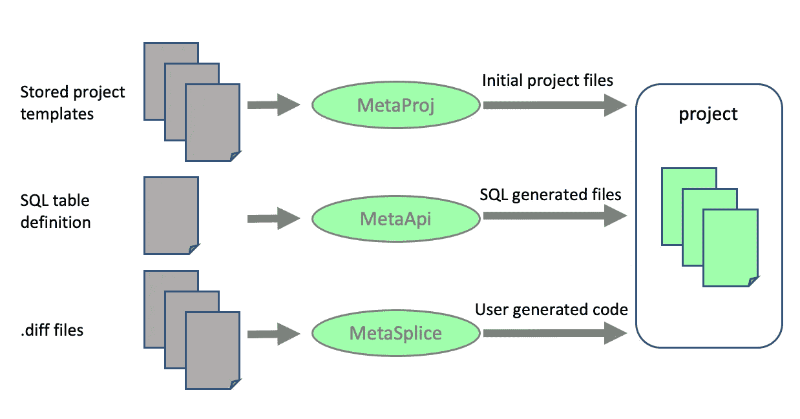

## 环境

本文假设您在 Linux/UNIX 环境中的 PC 上安装了以下软件:

*   [VS 代码](https://code.visualstudio.com/)，或者其他类似的编辑器
*   [Git](https://git-scm.com/)
*   [出发](https://golang.org/)
*   [卷曲](https://curl.haxx.se/)
*   [PostgreSQL](https://www.postgresql.org/) (或 [mac](https://postgresapp.com/)

# 工作流程

我的工作流程现在是这样的:

1.定义一些 SQL 表

2.运行 metaproj 来自动生成初始项目并为 metaapi 设置

3.在项目上运行`go generate`,它运行 metaapi 来自动创建:

*   CRUD api
*   污垢测试
*   api 测试数据
*   HTTP api
*   HTTP 测试
*   自述文件
*   表格视图 html
*   表格视图 Vue js

4.在生成代码的许多*接合点*中的任何一个中编写一些自定义代码，并添加所有新文件。根据需要向 metaapi 或 metaproj 添加更多的拼接点，尽管我已经有一段时间没有这样做了。

5.创建并维护一个 extractsplice/extractsplice.go 文件，该文件只告诉 metasplice 我在哪里接触了东西。

现在，有趣的事情来了。当我不可避免地想要更改或添加模式时:

6.Cd 放入 extractsplice 目录并运行`go generate`。这在 go 项目级别创建了一个新的“diff”项目，它包括我原来的 extractsplice 目录，还包括一个新的自动生成的 applysplice 目录和所有的 splice diff 文件，这些文件允许我将所有的更改重新集成到一个新的 metaapi 项目中。方法如下:

7.编辑*。我的 diff/applysplice 目录中的 sql 文件，以便对模式进行任何更改或添加

8.删除(或者只是重命名，如果偏执)我的最后一个项目目录

9.运行 metaproj，根据修改后的 sql 和 metaapi 的设置自动生成新的初始项目(再次执行上面的步骤 2)

10.在运行 metaapi 的项目上运行`go generate`(再次执行上面的步骤 3 ),以基于新的 SQL 创建新的 api 文件

11.在 diff/applysplice 上运行`go generate`——这将我在步骤 6 中的所有差异添加回我的新项目中。**现在我又回到了我离开的地方，这里有全功能的 CRUD api、HTTP api 和新 SQL 的测试！**甚至 git 文件也被保留。

12.修复由模式更改导致的任何编译错误。

13.转到步骤 4

令人欣慰的是，所有 api 管道代码(通常是许多愚蠢错误的来源)都是由 SQL 表定义的数据驱动的。自动生成和应用 diff(拼接)代码也非常好。让我们做一个小例子来说明这个流程。无处不在的 ToDo 应用。

# 待办事项演示

我们将构建一个简单的示例来展示整个过程，归结起来就是:

1.  基于模式自动创建初始项目(A)
2.  在(A)中写入新的唯一代码(B)
3.  将唯一代码(B)提取到一个不同的项目(C)中
4.  基于新架构自动创建新项目(D)
5.  将我们的差异项目(C)应用到新项目(D)

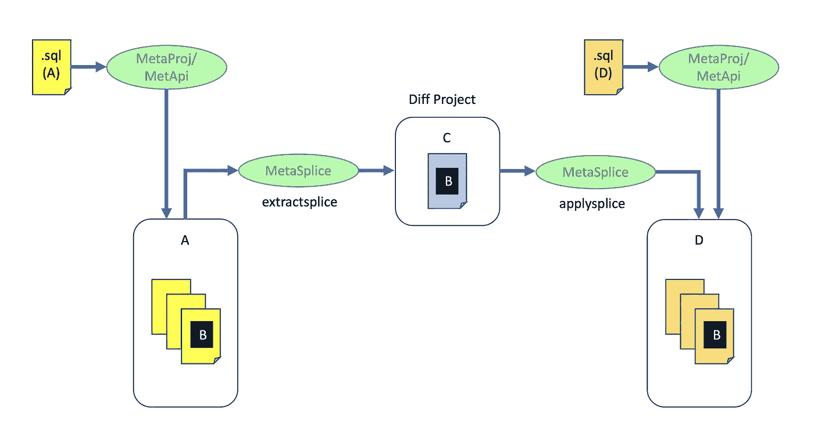

首先，让我们安装我们需要的工具:

```
go get github.com/exyzzy/metaapi
go install $GOPATH/src/github.com/exyzzy/metaapi
go get github.com/exyzzy/metaproj
go install $GOPATH/src/github.com/exyzzy/metaproj
go get github.com/exyzzy/metasplice
go install $GOPATH/src/github.com/exyzzy/metasplice
```

## 创建初始项目

首先，我们将在项目级别为我们的 todos 定义一个 PostgreSQL 表:

todos.sql

```
create table todos (
    id           integer generated always as identity primary key,
    updated_at   timestamptz not null,
    done         boolean not null,
    title        text not null
);
```

现在我们将运行 metaproj，然后使用 go generate(它将运行 metaapi)来创建我们的初始项目

```
metaproj -sql=todos.sql -proj=todo -type=vue
cd todo
go generate
go install
```

您可以在 VS 代码中打开您的项目，并查看到目前为止生成的所有文件。这些是使用 Go/Vue/Vuetify 为您的模式编译和运行的基本文件集。我不打算在这里花时间解释所有这些是什么，但没有什么是太难的，所以请随意探索自己生成的代码。

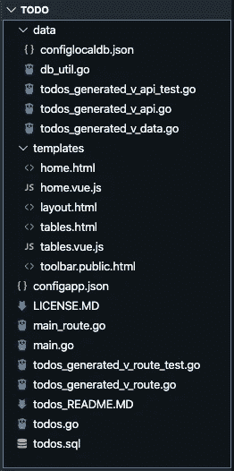

我们需要创建项目本地使用的初始 PostgreSQL 角色和数据库。这是在生成的文件 data/configlocaldb.json 中假定的。

```
createuser -P -d todo <pass: todo>
createdb todo
```

现在您可以运行 CRUD 和 HTTP api 测试了

```
cd data
go test
# should PASS
cd ..
go test
# should PASS
todo
```

这两个都应该通过，现在让我们启动并查看应用程序，输入`todo`，然后在新的终端窗口`open [http://localhost:8000](http://localhost:8000)`中，或者打开浏览器并输入 localhost:8000。您应该会看到一个外观精美的基本 web 应用程序:

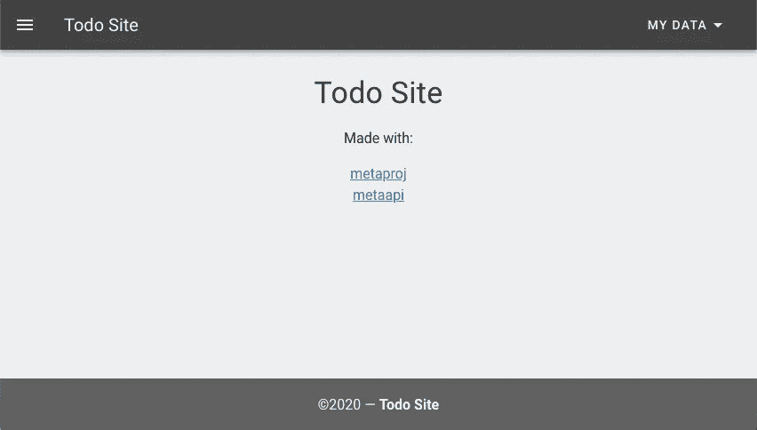

如果你现在点击我的数据。表，您将看到下面的表视图。因为还没有数据，所以没什么可看的。

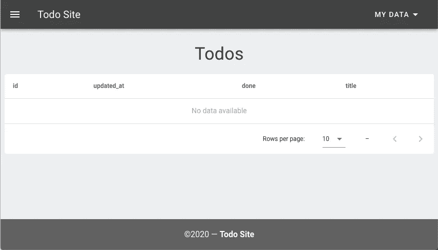

让我们添加一些数据并练习 api。如果您看一下生成的文件，todos_README。在 VS 代码中，它将概述我们刚刚完成的所有步骤，以及生成的 HTTP api:


基于此，我们可以使用 curl 生成一些数据:

```
curl -d '{"done":false, "title":"Buy Some Milk"}' -H "Content-Type: application/json" -X POST [http://localhost:8000/api/todo](http://localhost:8000/api/todo)curl -d '{"done":false, "title":"Walk The Dog"}' -H "Content-Type: application/json" -X POST http://localhost:8000/api/todo
```

果然，新数据出现在我们的表格视图中:

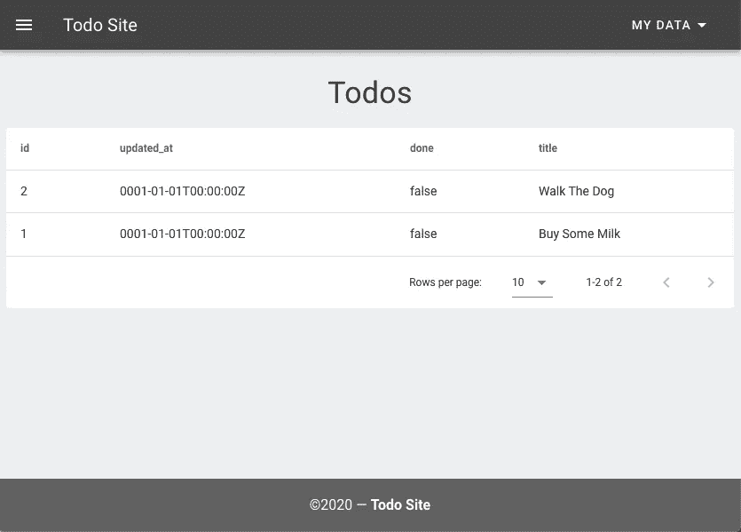

让我们尝试更多的 api:

```
curl -d '{"done":true, "title":"Buy Some Chocolate Milk"}' -H "Content-Type: application/json" -X PUT [http://localhost:8000/api/todo/1](http://localhost:8000/api/todo/1)curl -H "Content-Type: application/json" -X GET http://localhost:8000/api/todo/2curl -H "Content-Type: application/json" -X DELETE http://localhost:8000/api/todo/2
```

所有这些都返回正确的 JSON 响应，应用程序看起来也是正确的:

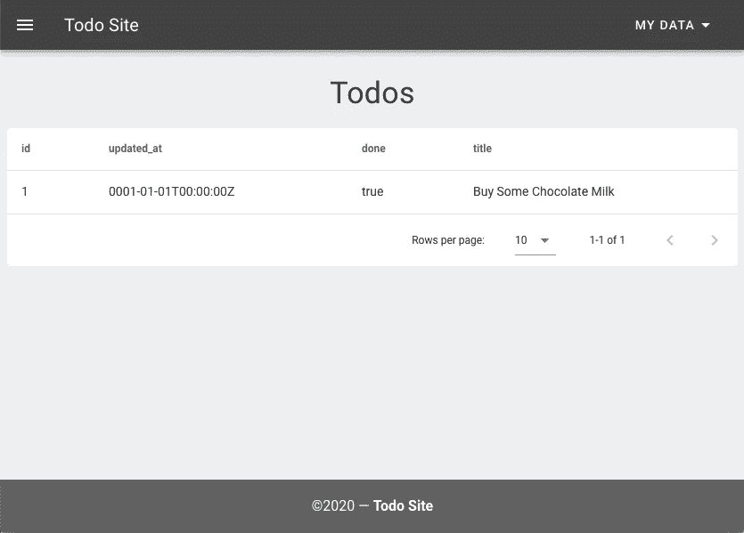

您现在就可以部署它，并拥有一个具有广泛开放的公共 api 的全功能网站。我们还没有编写任何代码，所以让我们这样做并练习 metasplice 工具。

**注意**:如果你正在使用 VS 代码或者其他一些在保存时自动格式化的编辑器，确保它被设置为不修改导入语句，纯 gofmt 应该没问题。这确保了对导入的拼接更改得以保留。

现在让我们初始化我们的 git repo，这样我们就可以捕获最初的生成。

```
git init
git add .
git commit -m "initial commit"
```

## 添加新的唯一代码

现在，我们将开始对基线生成的代码进行更改，我们需要做一些设置来跟踪我们的更改，以便拼接工具可以完成它的工作。这是一笔微不足道的前期开销，设置好之后就很容易维护了。我们要做的第一件事是创建提取文件夹和文件来跟踪我们的更改。

```
mkdir extractsplice
```

extractsplice/extractsplice.go

```
package splice//go:generate  mkdir -p ../../tododiff
//go:generate  mkdir -p ../../tododiff/templates
//go:generate  mkdir -p ../../tododiff/extractsplice
//go:generate  cp ../extractsplice/extractsplice.go ../../tododiff/extractsplice/extractsplice.go**//place any new mkdir -p ../../tododiff/<somefolder> commands here
//place any new cp ../<somefolder>/<somefile> ../../tododiff/<somefolder>/<somefile> commands here****//place any metasplice -src=../<somefolder>/<somefile> -dest=../../tododiff/<somefolder>/<somedifffile> -mode=extract**//go:generate  metasplice -src=../extractsplice/extractsplice.go -dest=../../tododiff/applysplice/applysplice.go -mode=applyfile//go:generate cp -R ../.git ../../tododiff/.git//go:generate  cp ../todos.sql ../../tododiff/applysplice/todos.sql
```

这是样本 extractsplice.go 文件的模式。它在做什么？

*   创建必要的文件夹结构。请注意，我们将所有内容都放在名为 tododiff 的 diff 项目文件夹中——您可以随意命名，只要与 extractsplice.go 文件中的所有命令保持一致。请注意，metasplice 假设它看到的第一个 mkdir 命令在最后一个“/”后包含(目标)diff 项目名
*   创建任何新文件夹并复制任何不是由 metaproj/metaapi 生成的新文件。当您将更多的文件添加到项目中时，您将保留此部分。
*   对任何生成的需要从拼接点提取的文件运行带提取模式的 metasplice。
*   使用 applyfile 模式运行 metasplice。这使用 extractsplice/extractsplice.go 作为输入，在我们的 diff 项目中生成一个匹配的 applysplice/applysplice.go 文件。
*   复制我们的 git 目录(递归)。请注意，这个 git 与 diff 项目文件夹不匹配，如果在那里使用，它会看起来很疯狂，不要在 diff 文件夹中使用 git——它意味着在我们的新 schema 项目上运行 applysplice 后被复制到最终项目中。
*   复制我们当前的项目。sql 文件添加到 applysplice 目录。这不是真正必要的，并且会在反向应用生成时出错，但是我喜欢这样做来捕获与差异相关的模式，并作为新模式更改的起点。这样做没什么坏处。

就这样，现在我们准备添加一些新的代码。我们将通过添加一个交互式的 vue/vue 化界面来稍微修饰一下 UI。这将允许我们演示现有文件内的更改和添加新文件。我们将通过构建一个新的 vue 组件来完成大部分工作，然后在主页上使用它。

```
mkdir -p public/components
```

public/components/vuetodo.js

```
Vue.component('todo-list', {
    // delimiters: ['${', '}'],   CUSTOM DELIMITERS DO NOT WORK IN COMPONENTS, AND ARE NOT NEEDED BY GO!!
    data: () => ({
        todos: []
    }),
    mounted: function() {
        this.$nextTick(function () {
            this.loadTodos();
        })
    },
    methods: {
        addTodo() {axios.post('/api/todo', {"title": "Todo"}
            )
            .then((response) => {
                this.todos.unshift(response.data)
            })
            .catch((error) => {
                if (error.response) {
                // The request was made and the server responded with a status code
                // that falls out of the range of 2xx
                console.log(error.response.data);
                console.log(error.response.status);
                console.log(error.response.headers);
                } else if (error.request) {
                // The request was made but no response was received
                // `error.request` is an instance of XMLHttpRequest in the browser and an instance of
                // http.ClientRequest in node.js
                console.log(error.request);
                } else {
                // Something happened in setting up the request that triggered an Error
                console.log('Error', error.message);
                }
                console.log(error.config);
            });},
        deleteTodo(item) {
            axios.delete('/api/todo/'+item.id.toString()
            )
            .then((response) => {
                let index = this.todos.indexOf(item)
                this.todos.splice(index, 1)
            })
            .catch((error) => {
                if (error.response) {
                console.log(error.response.data);
                console.log(error.response.status);
                console.log(error.response.headers);
                } else if (error.request) {
                console.log(error.request);
                } else {
                console.log('Error', error.message);
                }
                console.log(error.config);
            });

        },
        updateTodo(item) {
            axios.put('/api/todo/'+item.id.toString(), 
                item 
            )
            .then((response) => {
                //vuetify handles checkbox/textfiled update
                return
            })
            .catch((error) => {
                if (error.response) {
                console.log(error.response.data);
                console.log(error.response.status);
                console.log(error.response.headers);
                } else if (error.request) {
                console.log(error.request);
                } else {
                console.log('Error', error.message);
                }
                console.log(error.config);
            });},
        loadTodos () {
            axios.get('/api/todos', 
            )
            .then((response) => {if (response.data == null ) {
                    console.log("no todos returned")
                } else {for (let i= 0; i < response.data.length; i++) {
                        this.todos.push(response.data[i])
                    }}
            })
            .catch((error) => {
                if (error.response) {
                    console.log(error.response.data);
                    console.log(error.response.status);
                    console.log(error.response.headers);
                    } else if (error.request) {
                    console.log(error.request);
                    } else {
                    console.log('Error', error.message);
                    }
                    console.log(error.config);
                });
        }},
    template: `
    <v-card
    max-width="600"
    class="mx-auto"
    >
        <v-toolbar
            color="green accent-1"
        >
            <v-toolbar-title>My Todos</v-toolbar-title>
            <v-spacer></v-spacer>
            <v-btn
                color="blue darken-1"
                [@click](http://twitter.com/click)="addTodo()"
                dark
            >
            Add Todo
            </v-btn>
        </v-toolbar>
        <v-list >
            <v-list-item 
                v-for="todo in todos"
                :key = todo.id
            >
                    <template v-slot:default="{ active, toggle }">
                    <v-list-item-action>
                        <v-checkbox
                        v-model="todo.done"
                        [@change](http://twitter.com/change)="updateTodo(todo)"
                        color="blue darken-1"
                        ></v-checkbox>
                    </v-list-item-action>

                    <v-list-item-content>
                        <v-list-item-title>
                            <v-text-field 
                                dense 
                                hide-details 
                                v-model="todo.title"
                                [@change](http://twitter.com/change)="updateTodo(todo)"
                            ></v-text-field>
                        </v-list-item-title>
                    </v-list-item-content>
                    <v-list-item-action>
                        <v-tooltip top>
                            <template v-slot:activator="{ on }">
                                <v-icon 
                                [@click](http://twitter.com/click)="deleteTodo(todo)"
                                v-on="on"
                                color="blue darken-1"
                                >
                                mdi-delete
                                </v-icon>
                            </template>
                            Delete Todo
                        </v-tooltip>            
                    </v-list-item-action>
                    </template>
            </v-list-item>
        </v-list>
    </v-card>
    `
});
```

您可以轻松地创建一个新页面来使用这个新的 vue 组件，或者只是完全替换主页，这正是我要做的，但是作为如何在拼接点内集成的示例，我们将把它拼接到现有的默认主页中。如果我们打开 home.html 文件，我们可以看到一个拼接点:`<!--#SPLICE# body {[< template "body" . >]} #SPLICE# end -->`

拼接点表示由分隔符限定的生成代码中的命名提取/插入点。我们在这些分隔符范围内编写的任何代码都可以安全地从我们的项目提取到 diff 项目中，然后可以在代码流中相同的相对点重新插入到任何新生成的 schema 项目中。因为它们被嵌入在注释中，所以根据文件类型的不同，它们看起来会有所不同。因为。去吧。他们看起来像:

```
//#SPLICE# tagname {[< template "tagname" . >]}
//#SPLICE# end
```

而对于。它们看起来像:

```
<!--#SPLICE# tagname {[< template "tagname" . >]} #SPLICE# end -->
```

标记名将根据接合点所在的代码段而变化。我们只需要用新代码替换`{[< template "tagname" . >]}`。拼接点总是由这种模式界定:开头是`#SPLICE# <tagname>`，结尾是`#SPLICE# end`，我们编写的独特代码位于它们之间。因为我们在一个。使用多行注释的 html 文件，我们必须在分割拼接点的时候加上注释，这对于 go 文件拼接点来说是不正确的。

在使用这个系统一段时间后，我的经验是，你需要偶尔拼接生成的代码，如果你不能这样做，这将是使用生成代码的一个障碍，但这并不频繁——大多数独特的代码将在新文件中。下面是我们将如何拼接到主页(见粗体):

templates/home.html

```
{{ define "content" }}
<v-container>
    <v-row column align="center" justify="center">
        <v-col>
            <h1 color="grey darken-3" class="mb-5 mt-4 display-1 text-center">
                Todo Site
            </h1>
            <p color="grey darken-3" class="mt-4 text-center">
                Made with:
            </p>
            <div color="grey darken-3" class="subheading text-center">
                <a href="[https://github.com/exyzzy/metaproj](https://github.com/exyzzy/metaproj)">metaproj</a><br>
                <a href="[https://github.com/exyzzy/metaapi](https://github.com/exyzzy/metaapi)">metaapi</a><br>
            </div>
            **<!--#SPLICE# body -->
            <todo-list class="mt-4"></todo-list>        
            <!--#SPLICE# end -->      **  
        </v-col>
    </v-row>
</v-container>
{{ end }}
```

我们还需要在脚本拼接点将组件添加到 vue.js 文件中:

```
//#SPLICE# script {[< template "script" . >]}
//#SPLICE# end
```

像这样:

模板/home.vue.js

```
{{ define "vue" }}
**//#SPLICE# script
<script src="/static/components/vuetodo.js"></script>
//#SPLICE# end**
<script>
    new Vue({
    delimiters: ["${", "}"], //required to not conflict with go template action delimiters
    el: "#app",
    vuetify: new Vuetify(),
    data: () => ({})
});
</script>
{{ end }}
```

当然，由于 metaapi 和 metaproj 是开源的，所以您可以在生成的代码中随意创建新的接合点，或者完全更改底层代码生成。这些工具旨在被理解并适应您的使用，它是一个流动的工具集。你现在在里面看到的，正是我目前需要的。

现在，如果您编译并运行新版本，您将在主页上看到一个新的 Vue/Vue 化交互 UI，它现在使用我们的新组件。点击添加待办事项按钮添加新项目，点击文本编辑/更新文本。点击方块将其取消，点击垃圾图标将其删除。

```
go install
todo
```

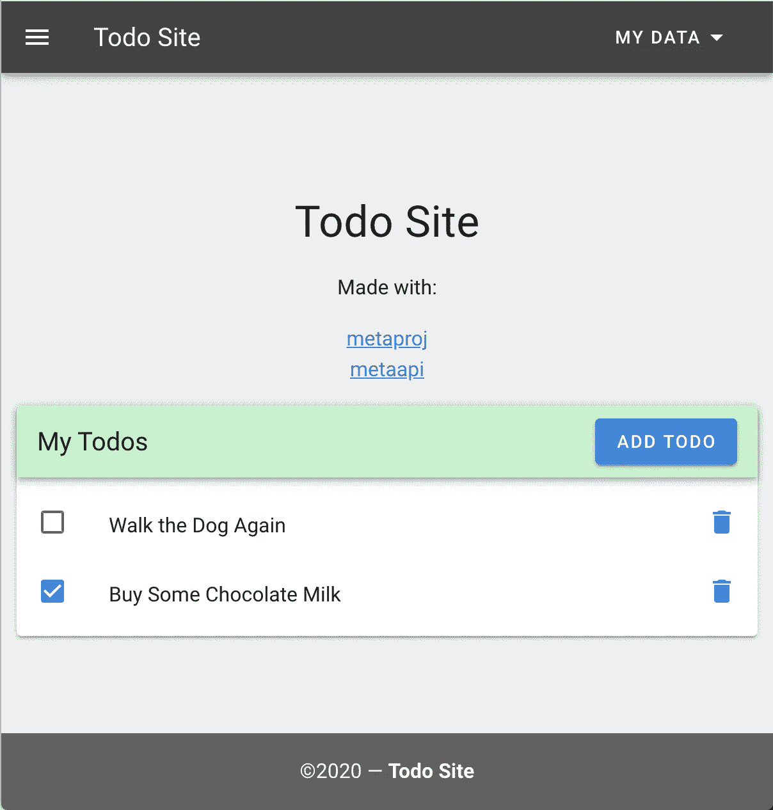

我们剩下要做的就是在 extractsplice.go 文件中跟踪我们的更改(新的唯一代码)，我们将在下面的**粗体**中添加它。

extractsplice/extractsplice.go

```
package splice//go:generate  mkdir -p ../../tododiff
//go:generate  mkdir -p ../../tododiff/templates
//go:generate  mkdir -p ../../tododiff/extractsplice
//go:generate  cp ../extractsplice/extractsplice.go ../../tododiff/extractsplice/extractsplice.go**//go:generate  mkdir -p ../../tododiff/public/components****//go:generate  cp ../public/components/vuetodo.js ../../tododiff/public/components/vuetodo.js****//go:generate  metasplice -src=../templates/home.html -dest=../../tododiff/templates/home.diff.html -mode=extract****//go:generate  metasplice -src=../templates/home.vue.js -dest=../../tododiff/templates/home.vue.diff.js -mode=extract**//go:generate  metasplice -src=../extractsplice/extractsplice.go -dest=../../tododiff/applysplice/applysplice.go -mode=applyfile//go:generate cp -R ../.git ../../tododiff/.git//go:generate  cp ../todos.sql ../../tododiff/applysplice/todos.sql
```

更新 git 以添加组件。

```
git add .
git commit -m "add vuetodo component"
```

## 提取唯一代码

在我们假设的工作流程中，我们已经定义了初始模式，然后我们基于该模式自动生成我们的项目，然后我们添加了一个全新的文件，并且还向生成的文件添加了代码。到目前为止还不错，但是现在假设我们认为现有的模式不足以满足我们接下来要做的事情？也许我们想添加一个我们的 todos 可以引用的事件记录。所以 todos 可以围绕一些特殊的事件来组织。通常，您必须更改您的模式，然后基于该模式手动更新所有代码层。CRUD 模型、CRUD 模型测试、api 层、api 测试、新的表格视图——然后测试/调试所有这些。我们要做一些不同的事情。我们只需将我们所有独特的工作保存到一个 diff 项目中，丢弃原始生成的代码，自动生成所有新代码，然后将我们独特的代码重新插入其中。让我们添加我们的假想事件模式。

要创建 diff 项目，我们需要做的就是在 extractsplice 文件夹中运行`go generate`。

```
cd extractsplice
go generate
```

现在，如果我们进入新的 diff 项目 tododiff，我们可以看到刚刚生成的内容:

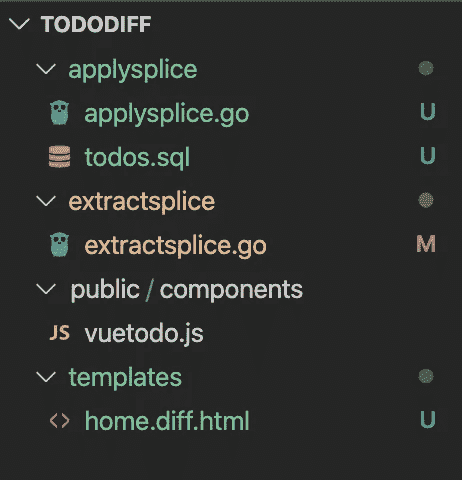

正如所料，它遵循了我们如上所述的 extractsplice 脚本，并捕获了我们所有独特的代码更改。我们现在可以将这些更改应用到新项目中。git repo 也作为一个隐藏文件夹存在。

如果我们打开 home.diff.html，我们可以看到基本的 diff 结构，它只是一个 go 嵌套文本模板，将应用于我们生成的代码的 body 部分。

home.diff.html

```
package main{[< define "body" >]}
-->
<todo-list class="mt-4"></todo-list>
<!--{[< end >]}
```

请注意，metasplice 会自动限定下一次插入时将使用的 html 注释。

您还可以在 applysplice 目录中看到 todos.sql。如上所述，metasplice 不使用它，但它是进行更改和记录从中提取当前差异的模式的良好起点。

## 创建新项目

现在我们有了 diff 项目，我们可以删除 todo 项目并重新开始。实际上，谨慎的做法是对其进行重命名——您可能弄乱了 extractsplice.go 文件，或者遗漏了某些内容。在这种情况下，只需修复 extractsplice.go 并重新创建 diff 项目(确保首先将项目重命名回原来的名称)。

```
mv todo todosave1
cp tododiff/applysplice/todos.sql .
```

现在我们要改变我们的。sql 文件来用事件反映我们的新模式

todos.sql

```
**create table events (
    id         integer generated always as identity primary key,
    created_at timestamptz not null,
    name       text not null,
    type       integer not null,
    event_date timestamptz not null
);**create table todos (
    id           integer generated always as identity primary key,
    updated_at   timestamptz not null,
    done         boolean not null,
    title        text not null**,**
    **event_id     integer references events(id)**
);
```

接下来，我们将以通常的方式生成一个新项目。

```
metaproj -sql=todos.sql -proj=todo -type=vue
cd todo
go generate
go install
```

当然所有的 `go test`也应该通过。我们可以在 todos_README 中看到我们刚刚制作的新 api。医学博士

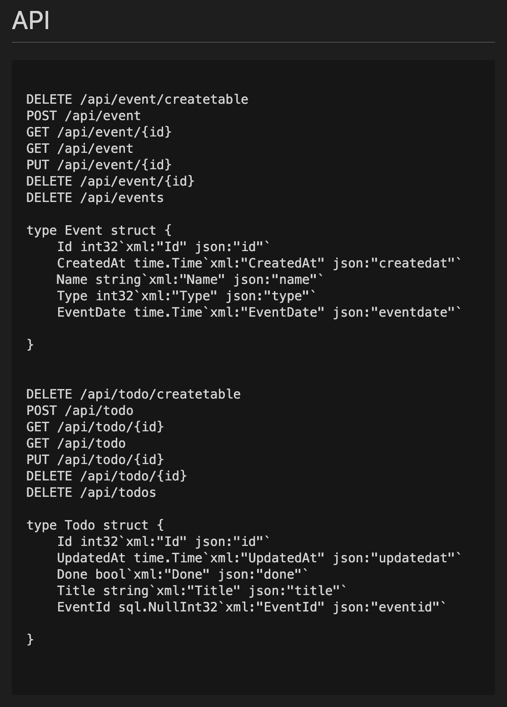

该项目缺少我们所做的 vue 组件更改，我们将在下一步添加。

## 将唯一代码应用于新项目

最后，我们到了有趣的部分。让我们使用 metasplice 将我们的 diff 文件应用到我们刚刚用新模式生成的项目中。

```
cd tododiff/applysplice
go generate
```

它会抱怨找不到../todos.sql —这是因为我们更改了它的位置，在初始提取时将它放在 applysplice 目录下，只是为了保存一个副本。我们实际上并不想将它复制到我们的新项目中，因为生成的项目是正确的。如果这条消息困扰你，只需删除 todo diff/apply splice/apply splice . go 中的最后一行(自我提醒:修复这一点)

好，我们现在是最新的。请注意，我们的 vue 组件已经复制到 public/components 中，如果您查看一下 templates/home.html 和 templates/home.vue.js，我们可以看到我们的拼接已经正确地应用到这些生成的文件中。此外，如果您在 VS 代码上设置了源代码控制，您将能够在该视图中看到所有的 src 差异。因为我们总是在新代码生成之前进行 git 提交，并且提取/应用保存它，所以这允许您只看到由生成器创建的更改——这是一个很好的健全性检查，表明一切都在按预期工作。让我们点燃它，看看会发生什么。

```
cd todo
go install
todo
```

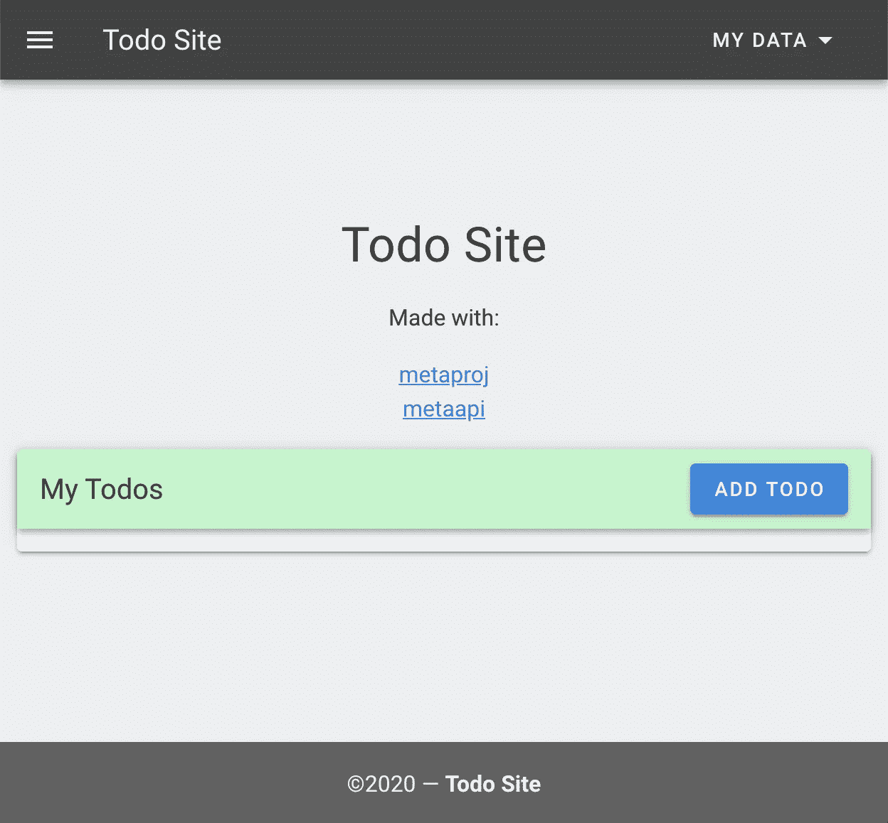

哎呀，当我们运行它时，我们的新组件出现了，但是它是空的并且不工作——这是怎么回事？记住，我们只是更改了 todos 模式，实际上是向 events 表中添加了一个引用列。所以我们当前在 PostgreSQL 中的 todos 表与我们的代码已经过时了。如果我们打开 chrome 控制台，果然有一个 500 错误告诉我们: **'"pq: column "event_id "不存在" '。**易于修复，我们生成的 create table api 会在使用新模式重新创建表之前删除该表，这将修复问题(但会丢失所有测试数据):

```
curl -X DELETE [http://localhost:8000/api/todo/createtable](http://localhost:8000/api/todo/createtable)
```

刷新页面。因此，现在当我们发布或添加新的待办事项时，大家都很高兴:

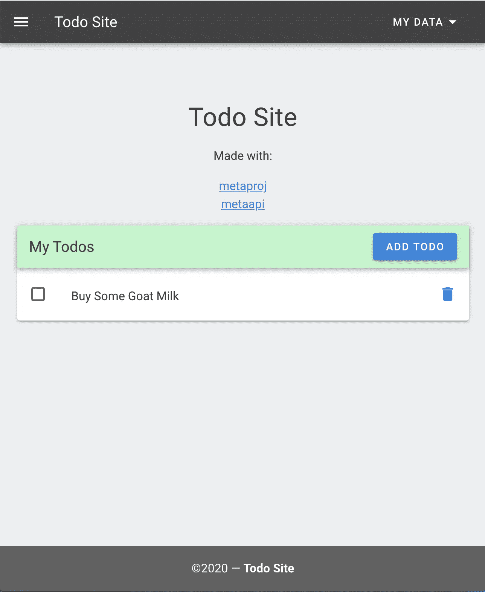

我们还可以使用我们的新 api 来发布一个事件，并在我们的 todos 中引用它。

```
curl -d '{"name":"Joan'\''s Party"}' -H "Content-Type: application/json" -X POST [http://localhost:8000/api/e](http://localhost:8000/api/todo)vent
```

然后在我们的 todo 中引用它

```
curl -d '{"done":false, "title":"Get Party Balloons", "eventid":{"int32":1, "valid":true}}' -H "Content-Type: application/json" -X POST [http://localhost:8000/api/todo](http://localhost:8000/api/todo)
```

现在，当我们查看 tables 视图时，我们可以看到 post api 正在工作，todo.event_id 正在引用我们的新事件:

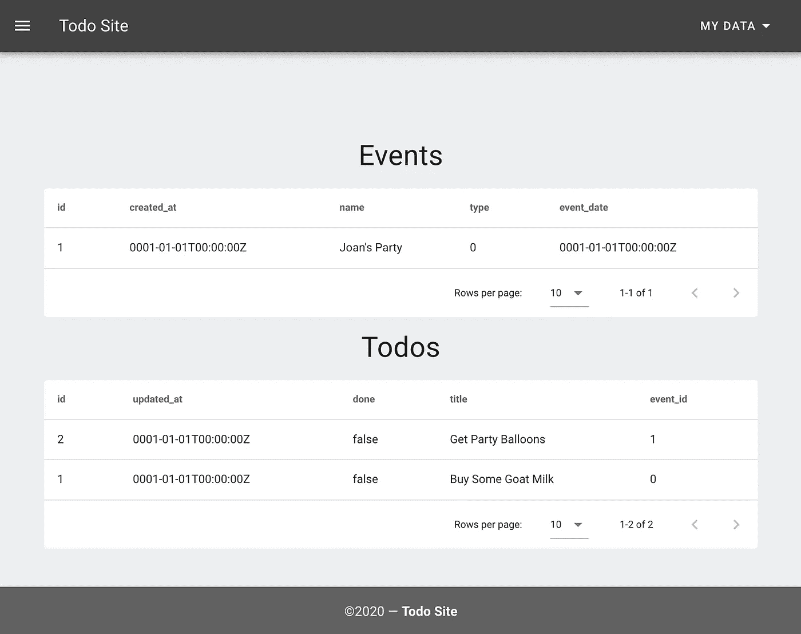

当然，我们的 vuetodo 组件还不知道 event_id，大概我们现在会构建一个新的事件组件，然后更新 todo 组件。或许我们也可以让所有的时间戳都起作用。

## 元分裂

我在以前的文章中介绍过 metaapi 和 metaproj，让我们快速看一下新工具 metasplice。Metasplice 做三件事:

1.  提取由#SPLICE#标记分隔的代码片段，并将它们转换成嵌套模板，称为 diff 文件
2.  从现有的 extractsplice.go 文件创建 applysplice.go 文件
3.  将以前提取的 diff 文件应用于 metaproj/metaapi 生成的项目

metasplice/main.go

```
package mainimport (
    "errors"
    "flag"
    "fmt"
    "io/ioutil"
    "log"
    "os"
    "path/filepath"
    "regexp"
    "strings"
    "text/template"
)func main() {
    srcPtr := flag.String("src", "", "source file")
    destPtr := flag.String("dest", "", "destination file")
    modePtr := flag.String("mode", "splice", "mode: splice (default), extract, generator") flag.Parse()
    if flag.NFlag() == 0 {
        fmt.Println(" valid usage is:")
        //splice: default applies diff file to current source
        fmt.Println("  metasplice -src=sourcefile.diff.go -dest=destinationfile.go")
        fmt.Println("  metasplice -src=sourcefile.diff.go -dest=destinationfile.go -mode=splice")
        //extract: create a new .diff.go from the splice points in the source
        fmt.Println("  metasplice -src=sourcefile.go -dest=destinationfile.diff.go -mode=extract")
        //applyfile: create the applysplice.go file from the extractsplice.go file
        fmt.Println("  metasplice -src=extractsplice.go -dest=applysplice.go -mode=applyfile")
        os.Exit(1)
    }
    if (filepath.Base(*srcPtr) == "") || (filepath.Base(*destPtr) == "") {
        log.Panic("Invalid File Params")
    }
    fmt.Print("metasplice -src=", *srcPtr, " -dest=", *destPtr)
    if *modePtr == "extract" {
        fmt.Println(" -mode=extract")
        //extract splices
        err := extractFile(*srcPtr, *destPtr)
        if err != nil {
            log.Panic(err.Error())
        }
    } else if *modePtr == "applyfile" {
        fmt.Println(" -mode=applyfile")
        //make generate file
        err := applyFile(*srcPtr, *destPtr)
        if err != nil {
            log.Panic(err.Error())
        }
    } else {
        fmt.Println()
        //apply splices
        err := spliceFile(*srcPtr, *destPtr)
        if err != nil {
            log.Panic(err.Error())
        }
    }
}//go through src, find all text between #SPLICE# tag ... #SPLICE# end and create template file
func extractFile(src, dest string) error {
    //get file type
    ext := strings.TrimSpace(strings.ToLower(filepath.Ext(src)))
    dat, err := ioutil.ReadFile(src)
    if err != nil {
        return err
    } destPath := filepath.Dir(dest)
    err = os.MkdirAll(destPath, os.FileMode(0755))
    if err != nil {
        return err
    } fout, err := os.Create(dest)
    if err != nil {
        return err
    }
    defer fout.Close() //find splice tag for .go/.js and .html "\\#SPLICE# foo ", or "<!--#SPLICE# foo -->"
    re1 := regexp.MustCompile(`(\/\/\s*#SPLICE#\s+\w+.*|<!--\s*#SPLICE#\s+\w+\s+-->)`)
    //find the tagname within a splice tag
    re2 := regexp.MustCompile(`#SPLICE#\s+(\w+)`) //FindAllIndex returns array of pair: [index of string start and index 1 past end]
    idx := re1.FindAllIndex(dat, -1)
    _, err = fout.WriteString("package main\n")
    if err != nil {
        return err
    }
    splicestart := 0
    splicename := "end"
    for _, v := range idx { //go through each pair of FindAllIndex
        subdat := dat[v[0]:v[1]] loc := re2.FindSubmatchIndex(subdat)
        if (len(loc) == 0) || (loc[3]-loc[2] == 0) {
            err = errors.New("No tagname detected after #SPLICE#")
            return err
        }
        tagname := string(subdat[loc[2]:loc[3]]) //regex submatch
        if tagname == "end" {                    //if tagname is "end" write the template splice tag name & splice code
            if splicename == "end" {
                err = errors.New("No beginning splice name detected")
                return err
            }
            _, err = fout.WriteString("{[< define \"" + splicename + "\" >]}\n")
            if err != nil {
                return err
            }
            if ext == ".html" { //if html then cap off the multiline comment
                _, err = fout.WriteString("-->\n")
                if err != nil {
                    return err
                }
            }
            _, err = fout.WriteString(string(dat[splicestart:v[0]]) + "\n") //up to beginning of end splice
            if err != nil {
                return err
            } if ext == ".html" { //cap on both sides
                _, err = fout.WriteString("\n<!--")
                if err != nil {
                    return err
                }
            }
            _, err = fout.WriteString("{[< end >]}\n")
            if err != nil {
                return err
            }
        } else { //otherwise capture the splice code start and tagname
            splicestart = v[1] //start after tag
            splicename = tagname
        }
    }
    fout.Sync() //all done
    return err
}//create the applysplice.go file from the extractsplice.go file
func applyFile(src, dest string) error {
    dat, err := ioutil.ReadFile(src)
    if err != nil {
        return err
    } destPath := filepath.Dir(dest)
    err = os.MkdirAll(destPath, os.FileMode(0755))
    if err != nil {
        return err
    } fout, err := os.Create(dest)
    if err != nil {
        return err
    }
    defer fout.Close() re := regexp.MustCompile(`go:generate.+\n`)
    idx := re.FindAllIndex(dat, -1)
    destName := ""
    srcName := ProjName()
    _, err = fout.WriteString("package splice\n\n")
    if err != nil {
        return err
    }
    for _, v := range idx {
        //todo: switch to regex instead of fields
        fields := strings.Fields(string(dat[v[0]:v[1]]))
        switch fields[1] {
        case "mkdir":
            if destName == "" {
                destName = DestName(fields[len(fields)-1])
            }
            str := "//go:generate mkdir -p "
            str += strings.Replace(fields[len(fields)-1], destName, srcName, 1) + "\n"
            _, err = fout.WriteString(str)
            if err != nil {
                return err
            }
        case "cp":
            str := "//go:generate cp "
            if fields[len(fields)-3] != "cp" { //preserve a single cp flag if exists (like -R)
                str += fields[len(fields)-3] + " "
            }
            str += fields[len(fields)-2] + " "
            str += strings.Replace(fields[len(fields)-1], destName, srcName, 1) + "\n"
            _, err = fout.WriteString(str)
            if err != nil {
                return err
            }
        case "metasplice":
            if fields[len(fields)-1] == "-mode=applyfile" {
                break
            }
            str := "//go:generate metasplice "
            li := strings.LastIndex(fields[2], ".")
            str += fields[2][:li] + ".diff" + fields[2][li:] + " "
            s := strings.Replace(fields[3], destName, srcName, 1)
            str += strings.Replace(s, ".diff", "", 1) + "\n"
            _, err = fout.WriteString(str)
            if err != nil {
                return err
            }
        }
    }
    fout.Sync() //all done
    return err
}//execute the nested template splice file against the commented template invocation in dest, specific delims
func spliceFile(src, dest string) error {
    destb, err := ioutil.ReadFile(dest)
    if err != nil {
        return err
    } tt := template.Must(template.New("dest").Delims("{[<", ">]}").Parse(string(destb)))
    template.Must(tt.New("src").Delims("{[<", ">]}").ParseFiles(src)) file, err := os.Create(dest)
    if err != nil {
        return err
    }
    err = tt.ExecuteTemplate(file, "dest", nil)
    file.Close()
    return err
}//assume that src path always ends in /extractsplice under project
func ProjName() string {
    wd, _ := os.Getwd()
    li := strings.LastIndex(wd, "/extractsplice")
    fi := strings.LastIndex(wd[:li], "/")
    return wd[fi+1 : li]
}//asssume a mkdir that ends in /destname as first line
func DestName(path string) string {
    li := strings.LastIndex(path, "/")
    return (path[li+1:])
}
```

extractFile 函数使用 regex 来查找#SPLICE#标记，并获取这些标记中的标记名。applyFile 函数也使用 regex 来查找 go:generate 语句，并做出一些假设，如最后两个函数 ProjName()和 DestName()所示。spliceFile 函数是一个简单的文本模板应用程序，请注意，它希望非常具体的分隔符(" {[]} ")不会与 metaapi 分隔符("<> ")或默认的 go 分隔符(" {{ "，" }} ")冲突。

用了一段时间后，我自然会改变/改进很多东西。例如，使用嵌套模板作为拼接机制起初看起来很聪明和方便，但现在看起来有局限性——虽然现在它完成了我需要的工作。自动化更多的 extractsplice.go 维护也是列表中的重点。

我们已经完成了开发流程的一个周期，meta*工具为我们做了大部分的苦差事——管理细节，这样我们就可以专注于高层次的独特设计。这是一个非常简单的拼接示例，但是在代码中有足够多的拼接点，您可以拼接到这些拼接点中来执行更重要的任务，例如添加到 main init、添加到 routes，甚至扩展单个 api 结构。当然，您还可以在任何地方添加更多拼接点。

您可以在以下网址找到所有源代码:

*   [https://github.com/exyzzy/metaapi](https://github.com/exyzzy/metaapi)
*   https://github.com/exyzzy/metaproj
*   【https://github.com/exyzzy/metasplice 

玩得开心。