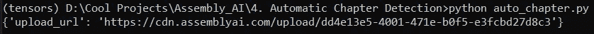
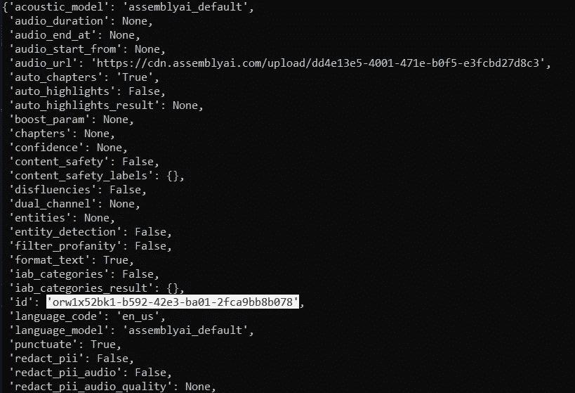
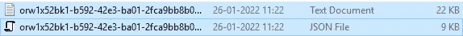

# 基于人工智能和 Python 的自动章节检测

> 原文：<https://levelup.gitconnected.com/automatic-chapter-detection-using-ai-and-python-56af8baa7972>

## 利用人工智能将你的视频或音频内容分解成逻辑章节


[粘土银行](https://unsplash.com/@claybanks?utm_source=medium&utm_medium=referral)在 [Unsplash](https://unsplash.com?utm_source=medium&utm_medium=referral) 拍摄的照片

读者可能遇到的大多数好书都会有一个摘要页，描述目录、涉及的不同章节以及读者对未来内容的预期。它有助于读者快速理解所有涉及的主题，并为他们提供一个选择，跳转到他们认为最有吸引力的部分。

当观看视频或收听有声读物时，观众或听众希望获得与前面讨论的类似的信息。自动章节检测是获得视频或音频数据中关键区间的名称的最佳方式之一，也是使用户能够更好地理解内容的简要总结。

在阅读本文之前，我建议您更熟悉自己的优化语音到文本应用程序的开发，以及如何利用人工智能通过 Python 进行实时语音识别。你可以从这个[链接](https://towardsdatascience.com/how-to-deploy-your-own-optimized-speech-to-text-web-app-with-python-c956c7838ec8)查看前者，从下面的[链接](/how-to-use-ai-for-real-time-speech-recognition-with-python-73fe24c4f1ee)查看后者。

# 自动章节检测项目:

对于这个项目，您将需要必须执行自动章节检测任务的视频或音频内容。这个视频或音频文件可以从网上下载，也可以是你自己制作的。请确保将该文件放在当前工作目录中，以便我们可以轻松地执行所需的操作。让我们通过导入必要的库和加载必要的参数来开始这个项目的开发。

## 导入必要的库并加载所需的参数:

在第一步中，让我们导入所有的基本库，并简要讨论它们的用例。导入 JSON 库是为了帮助我们处理 JSON 文件，我们将在这个项目的大部分时间里使用这些文件。漂亮的印刷让我们有一个更具视觉吸引力的印刷声明，以更好地阅读显示内容。requests 库将帮助我们连接到各种有用的 URL，比如针对 API 键的 AssemblyAI 平台。配置导入是一个 Python 文件，我们创建它来存储 API 密钥。

```
import json
from pprint import pprint
import requests
from fileinput import filename
from config import API_Key
```

为了执行高质量的自动章节分析，最好使用 AssemblyAI 平台。为了继续余下的编码部分，您可以在 [AssemblyAI](https://www.assemblyai.com/) 平台上轻松创建一个帐户，并检索我们可以用于该项目的免费 API 密钥。该密钥位于您登录屏幕的右侧。这个密钥应该放在一个新的“ *config.py* ”文件中，如下面的代码片段所示。

```
API_Key = "Your Free API Key"
```

一旦我们完成了导入，我们就可以开始声明这个项目需要的一些基本变量。转录端点和上传端点变量将帮助我们建立与 AssemblyAI 平台的连接，用于上传我们的数据和接收章节的适当检测。我们还将指定 API 密钥授权的头，并使用 JSON 类型内容。块大小将允许我们以小块的形式上传信息。下面的代码块包含所有必要的参数。

```
transcript_endpoint = "[https://api.assemblyai.com/v2/transcript](https://api.assemblyai.com/v2/transcript)"
upload_endpoint = '[https://api.assemblyai.com/v2/upload'](https://api.assemblyai.com/v2/upload')headers_auth_only = {'authorization': API_Key}headers = {
   "authorization": API_Key,
   "content-type": "application/json"
}CHUNK_SIZE = 5242880
```

在接下来的几节中，我们将重点创建三个不同的功能，使我们能够上传、转录和轮询音频或视频内容。让我们逐一探讨。

## 创建上传功能:

我们将创建的第一个函数是 upload 函数，它将帮助我们将保存的音频或视频内容上传到 AssemblyAI 平台，为此可以对自动章节检测做进一步的分析。upload 函数包含另一个内部函数，我们将利用它来读取前面指定的块大小的可用数据。

一旦我们定义完读取数据的函数，我们就可以将响应上传到前面定义的上传端点。我们将利用请求库来上传我们的数据。我们将通过指定头和函数将文件发送到上传端点 URL，该函数将以指定的块大小将我们的数据上传到 AssemblyAI 平台。执行以下操作的代码块如下所示。

```
def upload(filename):
    def read_file(filename):
        with open(filename, 'rb') as _file:
            while True:
                data = _file.read(CHUNK_SIZE)
                if not data:
                    break
                yield data # upload audio file to AssemblyAI
    upload_response = requests.post(
        upload_endpoint,
        headers=headers_auth_only, 
        data=read_file(filename)
    ) pprint(upload_response.json())
    return upload_response.json()['upload_url']
```



作者图片

您可以使用上述功能运行程序。您可以分配一个变量来保存返回函数，或者只使用函数的 pretty print 命令来硬编码上传 URL，我们将利用它来转录数据。让我们在下一节进一步探讨这个问题。

## 创建转录功能:

下一步，我们将定义转录先前上传的音频或视频文件的函数。我们将需要向脚本端点 URL 发送另一个请求，该请求现在将包含一个脚本请求，其中提到了上传 URL，并且 auto chapters 条件被设置为 True。我们将收到一个 JSON 文件响应，我们将相应地打印并返回。下面的代码片段显示了如何执行所需的操作。

```
def transcribe(audio_url, auto_chapters=False):
    # start the transcription of the audio file
    transcript_request = {
        'audio_url': audio_url,
        'auto_chapters': "True" if auto_chapters else "False"
    } transcript_response = requests.post(transcript_endpoint,      json=transcript_request, headers=headers)
    pprint(transcript_response.json()) return transcript_response.json()['id']
```



作者图片

当我们运行下面的函数时，我们将收到类似于上图所示的值。我们关心的一个主要参数是抄本 ID，它将帮助我们检索必要的信息。您可以存储这些数据，也可以像我们在之前的上传功能中所做的那样，对打印的数据进行硬编码。

## 定义轮询功能:

最后，我们将需要检索信息，这是在转录过程中获得的响应。在这个函数中，我们将定义轮询端点，它是抄本端点和抄本 ID 的组合。我们将使用 get request 命令来检索信息。一旦轮询响应状态完成，我们将创建一个文本文件和一个 JSON 文件。文本文件将存储音频信息的摘要，而 JSON 文件将存储 AI 在音频文件中检测到的所有重要章节。

```
def poll(transcript_id):
    polling_endpoint = transcript_endpoint + "/" + transcript_id
    polling_response = requests.get(polling_endpoint, headers=headers) if polling_response.json()['status'] == "completed":
        filename = transcript_id + '.txt'
        with open(filename, 'w') as f:
            f.write(polling_response.json()['text']) filename = transcript_id + '_chapter.json'
        with open(filename, 'w') as f:
            chapters = polling_response.json()['chapters']
            json.dump(chapters, f, indent=4) print("Transcript Saved")
```



作者图片

在成功执行这个最后的函数之后，您应该能够找到如下两个文件，如上图所示，其中包含相关信息。你可以查看各自音频文件的信息，并注意到人工智能在相应地找出所需的摘要和章节方面做得很好。

## 调用 main 方法:

我们已经讨论了 main 方法中需要的大多数步骤。首先，我们将声明包含工作目录中文件的 filename 变量。我们可以上传这个文件名，并将获得的链接存储在 URL 变量中。

这个链接现在可以被传递到转录端点，在那里音频数据被相应地转录。现在可以将获得的 ID 传递给最终的 poll 函数，该函数将返回包含摘要和自动章节检测信息的文本和 JSON 文件。

```
if __name__ == '__main__':
    filename = "TDS.mp4"
    # Uploading the filename and hardcoding the URL from recieved value, check Screenshot
    # upload(filename)
    url = '[https://cdn.assemblyai.com/upload/dd4e13e5-4001-471e-b0f5-e3fcbd27d8c3'](https://cdn.assemblyai.com/upload/dd4e13e5-4001-471e-b0f5-e3fcbd27d8c3')

    # Transcribe the value 
    # transcript_id = transcribe(url, auto_chapters=True)
    transcript_id = 'orw1x52bk1-b592-42e3-ba01-2fca9bb8b078' poll(transcript_id)
```

一旦我们完成了所有这些步骤，自动章节检测项目就必须成功完成。让我们在下一节最后看一下这个项目的完整 Python 脚本。

## 完整代码:

现在我们已经完成了整个项目的构建，我们可以看看下面嵌入的代码中所示的工作流程。

如果你正在寻找自动章节检测项目的视频指南，我强烈推荐查看下面的[链接](https://www.youtube.com/watch?v=GvfmDGin7Zs)，在那里他们详细介绍了这个项目，涵盖了成功构建它的大部分要求。

# 结论:


由[官方](https://unsplash.com/@paicooficial?utm_source=medium&utm_medium=referral)在 [Unsplash](https://unsplash.com?utm_source=medium&utm_medium=referral) 上拍摄的照片

人工智能领域现代技术的出现帮助我们完成了曾经被认为机器几乎不可能完成的任务。人工智能在自然语言处理领域的进展有助于我们高精度、轻松地执行语音到文本转录、情感分析、自动章节检测和许多其他类似任务。

在本文中，我们了解了如何构建自动章节检测方案。我们查看了必要的库导入和所需的参数，并描述了这个项目的三个主要功能。这三个功能包括一个上传音频或视频文件，另一个转录所需的信息，最后一个保存收到的结果。

如果你想在我的文章发表后第一时间得到通知，请点击下面的[链接](https://bharath-k1297.medium.com/membership)订阅邮件推荐。如果你希望支持其他作者和我，请订阅下面的链接。

[](https://bharath-k1297.medium.com/membership) [## 通过我的推荐链接加入媒体

### 作为一个媒体会员，你的会员费的一部分会给你阅读的作家，你可以完全接触到每一个故事…

bharath-k1297.medium.com](https://bharath-k1297.medium.com/membership) 

看看我的一些与本文主题相关的文章，你可能也会喜欢阅读！

[](https://towardsdatascience.com/develop-your-own-calendar-to-track-important-dates-with-python-c1af9e98ffc3) [## 使用 Python 开发您自己的日历来跟踪重要日期

### 开发一个日历 GUI 界面来管理您 2022 年及以后的计划

towardsdatascience.com](https://towardsdatascience.com/develop-your-own-calendar-to-track-important-dates-with-python-c1af9e98ffc3) [](https://towardsdatascience.com/develop-your-weather-application-with-python-in-less-than-10-lines-6d092c6dcbc9) [## 用 Python 开发不到 10 行的天气应用程序

### 使用 Python 构建我们的天气电视广播应用程序，以接收所需位置的更新

towardsdatascience.com](https://towardsdatascience.com/develop-your-weather-application-with-python-in-less-than-10-lines-6d092c6dcbc9) [](https://towardsdatascience.com/complete-python-starter-guide-for-data-science-for-2022-c1f880fa249d) [## 2022 年数据科学完整 Python 入门指南

### 涵盖了用代码启动数据科学所需的所有 Python 基础和基本概念…

towardsdatascience.com](https://towardsdatascience.com/complete-python-starter-guide-for-data-science-for-2022-c1f880fa249d) 

谢谢你们坚持到最后。我希望你们都喜欢这篇文章。祝大家有美好的一天！