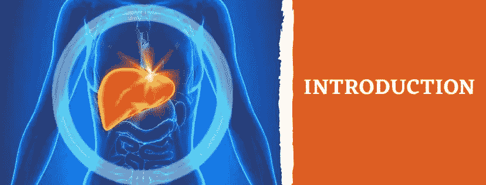
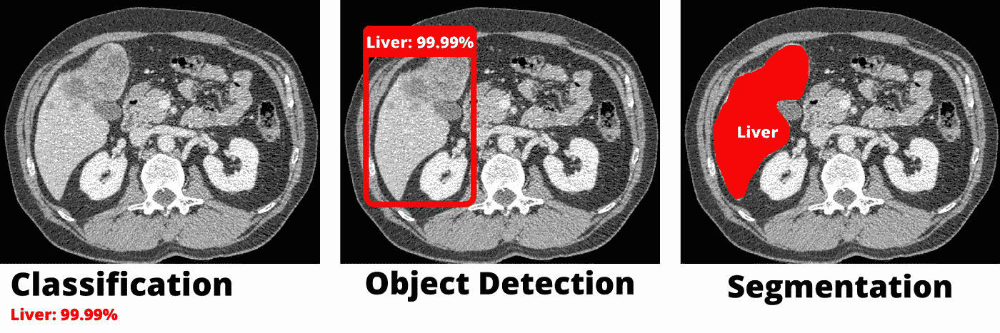
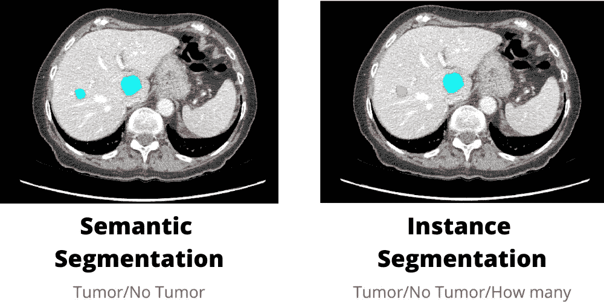
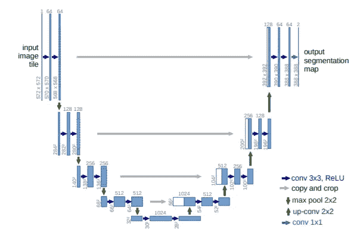
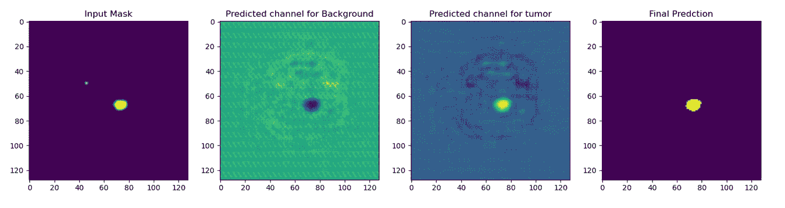

# 自动肝脏分割第 1/4 部分:简介

> 原文：<https://levelup.gitconnected.com/automatic-liver-segmentation-part-1-4-introduction-6fbae7a75bbd>

## 用于医疗成像的人工智能

## 关键词:Python，Monai，PyTorch，3D U-Net，CT 扫描

作者图片

> 我网站里的博文原文是[这里](https://pycad.co/liver-segmentation-part-1/)。

# 摘要

深度学习是一种重要的机器学习技术，可以帮助计算机识别图像中的对象。医学图像用于疾病、损伤和先天性异常的诊断和治疗。

深度学习可以通过医学图像找到肿瘤细胞来检测癌症等疾病。深度学习还有可能通过在手术期间分割器官或扫描患者的癌症或其他疾病迹象来提高医疗质量。

因此，本博客系列的目标是使用 Monai 和 PyTorch 以及 Python 编程语言来创建深度学习模型，以从公共 CT 扫描数据集中分割肝脏。完成本系列后，您将能够创建分割肝脏的相同模型，并使用相同的原理从 CT 扫描或 MRI 中分割其他器官或肿瘤。

我在 FreeCodeCamp 频道的课程

# 介绍

## 图象分割法

计算机视觉中的深度学习可以用于各种任务，其中最常见的是图像分类，这是最早的深度学习应用之一。

图像分类技术简单地确定图像是否包含我们正在寻找的对象(在我们的例子中，肝脏)。
然后是物体检测，这是计算机视觉中另一项极其有用的技术。这项技术需要在我们在图像中寻找的对象周围画一个框(我们称之为边界框)。

另一方面，图像分割是一种结合图像分类和对象检测的技术。这种技术不仅检测图像中的对象，而且还分割对象的正确像素。

作者使用[画布](https://www.canva.com/)制作的图像

## 图像分割类型

有两种类型的图像分割。第一种称为语义分段，第二种称为实例分段。这两种类型之间的区别在于，语义分割仅产生关于像素是否属于两个类别之一的像素概率。另一方面，实例分段的目标是索引对象，即使它们属于同一个类。

在我们的例子中，将使用语义分割，因为我们需要知道切片是否包含肝脏。

作者使用[画布](https://www.canva.com/)制作的图像

## U-Net 架构

[U-Net](https://arxiv.org/pdf/1505.04597.pdf) 深度学习架构用于语义图像分割。它最初是为医学成像分割而开发的，但由于它的高精度和结果，它很快就流行起来，并开始用于其他图像分割任务。U-Net 架构分为两部分。编码器:第一部分包含向下卷积(正常卷积)，随后是最大池层；这部分非常类似于一个图像分类架构，特征数组是在第一部分结束时获得的。该模型然后移动到解码器，它包含向上卷积而不是正常的卷积。在这一部分中，模型首先使用先前提取的特征来创建输出遮罩，该输出遮罩具有与输入图像相同的宽度和高度。

图片来自[原创论文](https://arxiv.org/pdf/1505.04597.pdf)

U-Net 输出是一个像素级遮罩，其尺寸与输入图像相同，通道数与任务中的类数相同。每个通道都有特定类别的像素概率。

作者制作的图像

在进行肿瘤分割时，这是一个输出通道的例子。你得到两个通道:一个是背景像素概率(没有肿瘤的地方)，一个是前景像素概率(有肿瘤的地方)。

# 软件安装

为了完成这个项目，我们需要安装一些软件，我将在这一节中谈到。

*   编程语言:[Python](https://www.python.org/downloads/)
*   文字编辑: [*VS 代码*](https://code.visualstudio.com/download)
*   三维可视化: [*三维切片器*](https://download.slicer.org/)
*   用于分割的工具: [*ITK 捕捉*](http://www.itksnap.org/pmwiki/pmwiki.php?n=Downloads.SNAP3)
*   Anaconda Navigator(这样我们就可以创建虚拟环境和木星笔记本)

***PS:*** 你可以同时使用 3D 切片器(可视化和标注)，但我更喜欢 ITK 快照的分割(标注)部分，我们将需要 3D 切片器来完成另一项任务，我将在下一篇博客中讨论。

# 概述

在那之后，我们谈了一点理论，让我们谈谈在这个系列中我们要做的步骤。

*   第 1 部分:项目介绍(本博客)。
*   第 2 部分:准备和预处理数据。
*   第 3 部分:常见问题/错误。
*   第四部分:培训。
*   第五部分:测试。
*   第 6 部分:克隆 GitHub repo 并直接使用它。

# 你想学医学影像的深度学习！

即将推出全面的医学成像课程，涵盖使用 Monai 和 PyTorch 的 2D 和 3D 分割，并提供额外支持。加入等候名单以接收任何课程更新的通知。

 [## 医学成像深度学习登录页面- PYCAD

### 使用 Monai 和 PyTorch 的医学成像中的 2D 和 3D 分割。

pycad.co](https://pycad.co/monai-and-pytoch-for-medical-imaging/) 

# 关于作者

> 穆罕默德·艾尔·阿明·莫赫塔里是我的名字。我是计算机视觉领域的研究助理(博士生),从事在线内容的创作。我在 [YouTube](https://www.youtube.com/channel/UCdYyILlPlehK4fKS5DiuMXQ) 上创作视频，在 [Udemy](https://www.udemy.com/user/pycad-2/) / [Skillshare](https://www.skillshare.com/user/pycad) 上开设课程，并且是 Medium 上的一名作家，除此之外我还有自己的网站 [Pycad](https://pycad.co/) ，我用它作为一个作品集来分享我所有的知识和作品。有时间的话请看一下:)。