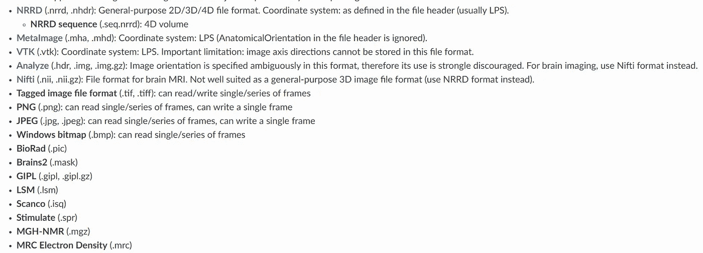
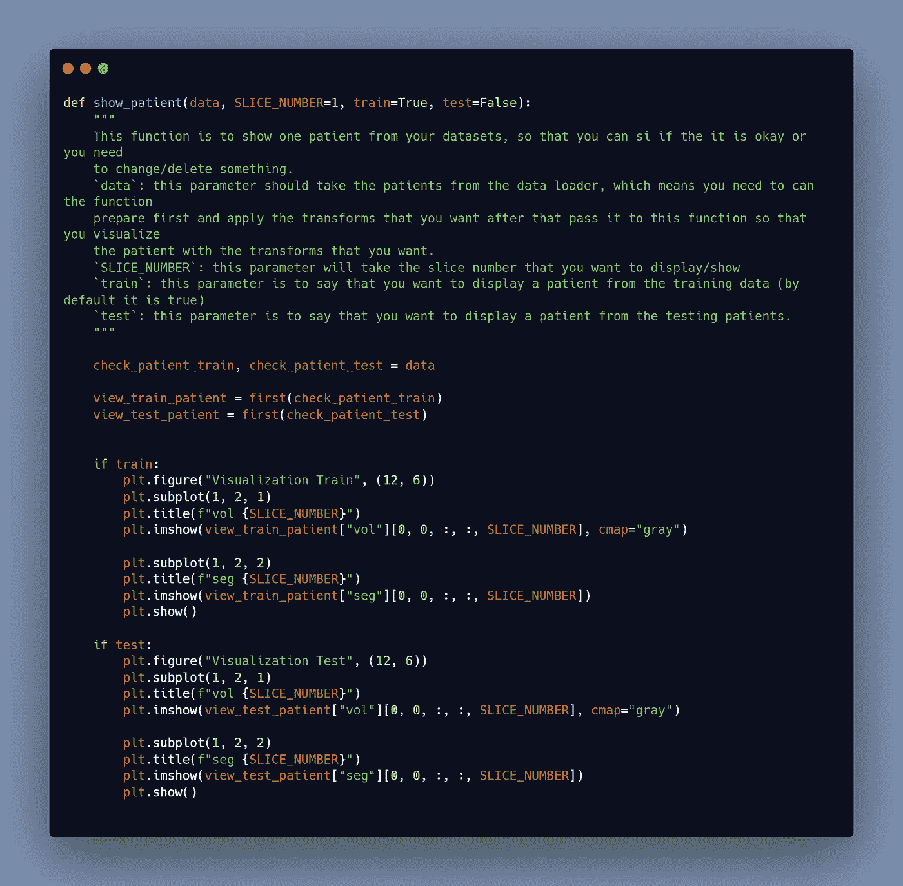

# 肝脏自动分割第 2/4 部分:数据准备和预处理

> 原文：<https://levelup.gitconnected.com/automatic-liver-segmentation-part-2-4-data-preparation-and-preprocess-981d790f5555>

## 用于医疗成像的人工智能

## 关键词:Python，Monai，PyTorch，Kaggle，迪卡侬数据集

作者图片

> 我网站上的博文原文是 [**此处**](https://pycad.co/liver-segmentation-part-2/) 。

# 摘要

肝脏分割过程中最重要的一个方面是本系列的这一部分。我们将讨论以下主题:

*   如何查找和下载数据集。
*   下载数据后(预处理前)如何准备数据？
*   你需要安装哪些软件包，如何安装？
*   如何在 3D 体积中使用 Monai 和 PyTorch 进行预处理？

这篇文章将会是最长的，但是我会试着把它分成几个可管理的部分，这样你就不会迷路了。

# 下载并准备数据

## 数据下载

因为我们将在本课程中为 3D 体积分割肝脏，所以我们将需要 3D 数据(最好是 nifti 文件)。我说 nifti 文件是因为我们将使用 Monai 在预处理部分进行这项工作，而 Monai 不支持其他文件格式。但是不要惊慌，任何问题总会有解决的办法。使用 python 或第三方工具，几乎所有的医学成像文件都可以转换成 nifties。大多数情况下，dicom 文件用于表示患者；我相信你知道 dicom 和 nifti 文件的区别！如果你不知道，请阅读[这篇博文](https://pycad.co/what-is-the-difference-between-dicom-and-nifti-images/)以获得更好的理解(nifti 文件只是一系列相互之间距离很小的 dicoms)。

如果你还没有数据，让我们从如何获得数据开始，然后我们将讨论如何处理它们。

目前，我只知道两个网站可以提供大量的医学影像数据集(如果你知道更多，请在评论中告诉我们，以便我们感兴趣)。

*   [***Kaggle***](https://www.kaggle.com/datasets) :这是众多可以找到数据、代码和挑战的大型数据库之一…
*   [***迪卡侬数据集***](http://medicaldecathlon.com/) :该数据库专门用于医学成像，因此您可以找到各种工作的 nifti 体积，您可以自己测试(在我们的教程中，我们将使用该网站下载肝脏体积)。

因此，您可以从迪卡侬获取肝脏数据集开始，或者如果您想做其他事情，也可以搜索您的特定数据集。

## 将数据转换成 Nifti

正如我在前面的段落中提到的，您可能会使用与我在本课中使用的数据集不同的数据集，并且它们可能不是 nifti 文件，因此您需要转换它们。

让我们从可以转换成 nifti 的最基本的文件类型开始:dicom 文件。

我已经写了一篇关于如何做到这一点的博文，你可以在这里找到。不过，我会给你一个简短的代码描述，这样你就可以使用它，而不必阅读其他博客文章。

在阅读了关于 dicom 和 nifti 文件之间的区别的博文后，我相信您现在对我们需要做什么来创建 ni fti 有了更好的理解。我们现在要做的就是将每个 dicom 系列放在一个数组中，该数组将被用作新的 nifti 文件中的帧数据。别担心，我说的只是由 [dicom2nifti](https://github.com/icometrix/dicom2nifti) 库处理的过程；你所要做的就是打电话给它，它会处理剩下的事情。

您可以从使用 pip 安装软件包开始:

`***pip install dicom2nifti***`

现在，您可以直接调用函数“dicom_series_to_nifti ”,将包含一个患者的 dicom 系列的文件夹路径作为第一个参数，将输出文件的路径+输出文件的名称和扩展名作为第二个参数(例如:patient1.nii ),如果您希望文件被压缩，请在名称末尾添加 the.gz 扩展名(例如:patient1.nii.gz)。

作者使用[碳](https://carbon.now.sh/)制作的图片

此代码仅适用于一名患者，因此如果您有多名患者，则可以使用此代码:

图片由作者使用[碳](https://carbon.now.sh/)制作

这就是如何将 dicom 文件转换为 nifti，但是如果您有不同种类的数据，您可能无法找到 Python 的转换脚本，在这种情况下，您将需要第三方工具，如 MatLab 或 3D slicer…

3D 切片器可以支持的文件有:

为 3D 切片器[网站](https://slicer.readthedocs.io/en/latest/user_guide/data_loading_and_saving.html)截取的图像

当然还有 dicom 文件。

因此，如果您的文件在可以使用 3D 切片器转换的文件列表中，您可以在没有脚本的情况下使用它；否则，你将不得不在谷歌上寻找合适的软件来转换它们。

为 3D 切片器[网站](https://slicer.readthedocs.io/en/latest/user_guide/data_loading_and_saving.html)截取的图像

## 创建 65 个切片的组(如果需要)

让我们进入下一个阶段，即将切片分成 65 组(或者任意数量的切片)。你可能想知道为什么我们需要采取这一步。当您获得一个公共数据集或者甚至您有自己的数据时，您几乎总是会注意到每个患者的切片数量是不同的。如果你在参加培训前不处理这个差异，它可能会成为一个问题。

请记住，我们将进行 3D 分割，因此您的输入体积应该都是相同的大小。当然，您永远也不会收到包含所有患者的精确切片数量的数据集。

如果所有患者的切片数量相似，则不需要自己建立分组。因为我们将在预处理部分执行 resize，所以所有的输入将具有相同数量的切片。然而，如果一个病人有 300 个切片，将其减少到 100 或 60 个切片，您将丢失大量可能携带身体重要信息的切片。

你可能会争辩说，让我们将输入中的切片数量设置为 300。好问题，但我认为你不应该这样做。

1.  训练将非常缓慢，你的 GPU/CPU 内存可能无法处理这样大的输入。
2.  如果您将切片数量等于 60 的患者放大为 300 个切片，您将丢失所有信息(您将创建不存在的切片)。

因此，您需要将切片分成小组，每个小组代表患者的一小部分，然后将它们组合起来以获取整个体积。

要完成这一部分，您需要遵循以下步骤:

***#1-将你所有的 nifti 文件转换成 DICOM***

如果已经有 dicom 文件，不需要马上转换成 nifti 否则，您需要将它们转换成 dicom 来建立小组。

不幸的是，没有特殊的 python 脚本可以执行这种转换。我写了一篇关于如何用 Python 从 nifti 转换成 dicom 的博文，这里 可以看到[。我的方法的问题是，它给所有的 dicom 系列相同的索引，这意味着所有的切片在身体中有相同的位置，你不能把它们转换回 nifties。](https://pycad.co/nifti2dicom/)

因此，您可以使用软件 3D slicer 执行此转换；我知道这需要时间，但我找不到更好的解决方案(如果有人知道更好的解决方案，请在评论中提供链接，谢谢:)。

***#2-将每 65 个切片移入一个文件夹***

当所有患者都是 dicom 格式后，您可以开始将指定数量的切片放入代表身体一小部分的文件夹中；对我来说，我选了 65(是随机选择)，但你可以随便选；尽量不要让子患者通过 100 个切片。

您可以使用我编写的 python 脚本来完成这部分数据准备工作:

图片由作者使用[碳](https://carbon.now.sh/)制作

***#3-将 65 个切片组重新转换为 nifti 文件***

运行上面的脚本后，您将在每个文件夹中获得 65 个切片(因为您可以在函数的参数中更改切片的数量)。现在，我们必须将这些 65 切片组转换成 nifti 文件，以便在训练中使用它们。

我们将利用我前面提到的相同脚本。

图片由作者使用[碳](https://carbon.now.sh/)制作

***#4-删除空卷***

在转换/创建新的 nifti 文件后，您将获得某些 nifti 组，其中没有代表肝脏的切片。这些空切片将在训练过程中导致问题(它们不会导致错误，但会降低模型的准确性)。要消除它们，你必须先了解它们。为此，我创建了一个定位空组的脚本，之后您可以手动删除它们，或者添加几行代码来删除它们。

作者使用[碳](https://carbon.now.sh/)制作的图像

## ***将数据划分到训练/测试文件夹***

现在一切就绪，您所要做的就是将您的数据划分到 train 和 test 文件夹中，这样我们就可以开始预处理了。

如果你想使用我的代码，你应该用我的方式命名你的文件，这样运行脚本就简单了。

***【train volumes】***:包含用于训练的图像/体积/CT 扫描的文件夹。

***【train segmentation】***:包含培训标签/分段的文件夹。

***【test volumes】***:包含用于测试的图像/体积/CT 扫描的文件夹。

***【test segmentation】***:包含测试标签/分段的文件夹。

# 安装 Monai、PyTorch、Cuda 和 Cudnn

我们需要安装几个包来完成这个项目，从核心包 Monai 开始。您还需要安装其他包来在 GPU 上运行代码。我相信在 CPU 上做这个项目是不可行的，因为训练要花很长时间才能完成。

所以要安装 Monai，您只需在您的终端中运行这一行就可以使用 pip 包。

`***pip install monai***`

> ***注意:*** 对我来说，虚拟环境更好，因为我为给定项目安装的任何包都安装在虚拟环境中，这意味着如果项目结束后我不需要那个包，我可以简单地用虚拟环境卸载它。如果您更喜欢使用虚拟环境，您可以构建 conda 环境或常规 Python 虚拟环境。

## 安装 Cuda

安装 Cuda 只需从 [*Nvidia 网站*](https://developer.nvidia.com/cuda-downloads) 下载合适的版本，然后像安装其他软件一样安装即可。

作者截取的图像

只需选择您的偏好，然后点击“下载”按钮。下载完成后，打开文件并按照屏幕上的说明进行操作。

## 安装 Cudnn

Cudnn 不是能装的；不过，您必须首先 [*下载文件*](https://developer.nvidia.com/rdp/cudnn-archive) (确保它适用于您安装的正确 Cuda 版本)。

下载后，从 lib、include 和 bin 文件夹中复制文件，并粘贴到 Cuda 安装文件夹的 lib、bin 和 include 文件夹中。

然后，在您的系统环境路径中，从 cuda 文件夹添加几个目录。

这些是您需要添加到系统环境路径中的路径

作者截取的图像

## 安装 PyTorch

要获得 PyTorch，请访问他们的网站*并选择与您的 Cuda 版本相对应的版本。*

**

*作者截取的图像*

# *预处理*

*我写了一篇关于如何使用 Monai 做预处理的博客文章，你可以在这里找到*，以及另一篇关于如何使用 Monai 做数据增强的博客文章，你可以在这里找到*。***

***到目前为止，我将简单地向您展示我在本教程中使用的函数；然而，所有的信息都可以在预处理博客中找到。***

******

***作者使用[碳](https://carbon.now.sh/)制作的图像***

***当然，在完成预处理后，出于两个原因，您可能需要展示其中一个患者。第一个是查看数据是否正确加载，第二个是在预处理后可视化您的数据，因为您可能无法对所有任务使用相同的预处理，因此您可能需要使用我的值之外的值。***

***此功能可用于查看来自训练和测试数据集的患者。***

******

***作者使用[碳](https://carbon.now.sh/)制作的图像***

***对于本教程来说，这就是数据准备和预处理的全部内容。***

***您在使用 Monai 时可能遇到的常见问题/错误将在即将发布的博客中讨论。***

# ***你想学医学影像的深度学习！***

***即将推出全面的医学成像课程，涵盖使用 Monai 和 PyTorch 的 2D 和 3D 分割，并提供额外支持。加入等候名单以接收任何课程更新的通知。***

*** [## 医学成像深度学习登录页面- PYCAD

### 使用 Monai 和 PyTorch 的医学成像中的 2D 和 3D 分割。

pycad.co](https://pycad.co/monai-and-pytoch-for-medical-imaging/)*** 

# ***关于作者***

******

> ***穆罕默德·艾尔·阿明·莫赫塔里是我的名字。我是计算机视觉领域的研究助理(博士生),从事在线内容的创作。我在[的 YouTube](https://www.youtube.com/channel/UCdYyILlPlehK4fKS5DiuMXQ) 上创作视频，在[的 Udemy](https://www.udemy.com/user/pycad-2/) / [Skillshare](https://www.skillshare.com/user/pycad) 上开设课程，我还是一名 Medium 的作家，此外我还创建了自己的网站 [Pycad](https://pycad.co/) ，我用它作为作品集来分享我所有的知识和作品。有时间的话请看一下:)。***