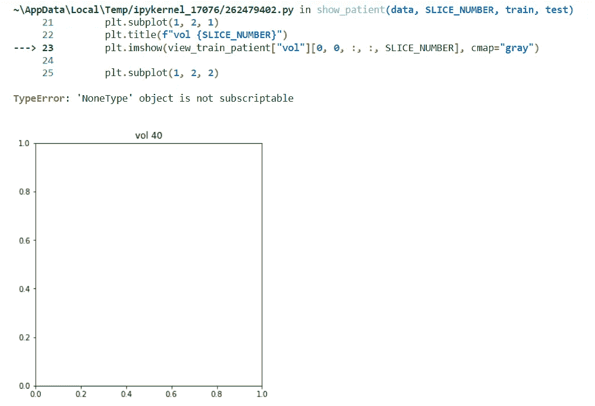

# 肝脏自动分割第 3/4 部分:常见错误

> 原文：<https://levelup.gitconnected.com/automatic-liver-segmentation-part-3-4-common-errors-2aa069fe7383>

## 用于医疗成像的人工智能

## 关键词:Python，Monai，PyTorch，3D U-Net，CT 扫描


作者图片

> 我网站上的博文原文是 [**此处**](https://pycad.co/liver-segmentation-part-3/) 。

# 摘要

在这篇短文中，我将讨论您在使用 Monai 时可能遇到的最常见的问题。因为我发现，有时您无法确定错误来自哪里，因为您无法在终端中找到导致错误的确切行或函数。因此，我会给你三个错误，我花了很长时间才弄明白如何修复，这样你就不会像我一样浪费时间。

> **PS:** 你会注意到错误是极其愚蠢的，但是直到你看到结果你才会意识到这一点哈哈哈。

# 错误

*   错误的数据路径
*   字典中的关键字错误
*   分段中的多个类或像素值(标签)

## 错误的数据路径

我知道这是一个你可能会遇到的愚蠢的错误，你会说你可以很容易地找到它，但我很害怕告诉你，当你使用 Monai 进行预处理时，它不会告诉你这一点。尤其是如果您错误地命名了文件夹或患者。

大多数情况下，您可能会遇到数据扩展的问题。没错，我们使用的是 nifti 文件，所以扩展名应该是。nii，'但是你应该知道文件可能是压缩的，在这种情况下，扩展名应该是' . nii.gz，'如果你忘记了'。代码不会识别你想要打开的文件。

这里奇怪的是，它不会告诉你目录不存在什么的，甚至不会在开始时打印错误信息。

但是，当您进入下一步(可能是训练甚至是显示您的数据)时，它会通知您数据加载器是空的。

> **注意:**出于这个原因，我在之前的博客中说过，你最好在训练前给你的病人看，这样如果你把路径放错了，你就可以纠正它们。

所以如果你试着给病人看，你会得到这样的错误:

```
**TypeError**: 'NoneType' object is not subscriptable
```

然后，您需要验证您的路径和文件扩展名。



这是它将打印的内容

## 字典中的关键字错误

你可能会在创建字典时拼错一个关键字来识别卷和标签(这在我身上发生过很多次哈哈)。所以，当然，在这种情况下它不会工作，但幸运的是，您将收到一条错误消息，指出问题出在关键字上。然而，如果你犯了那样的错误，你将会收到一大段你无法理解的文字，这可能会使你感到困惑。

它看起来是这样的:

```
=== Transform input info -- Spacingd ===

=== Transform input info -- Spacingd ===

=== Transform input info -- Spacingd ===

=== Transform input info -- Spacingd ===

=== Transform input info -- Spacingd ===
vol statistics:
Type: <class 'numpy.ndarray'> float32
Shape: (1, 512, 512, 65)
Value range: (-1024.0, 1408.0)
vol statistics:
Type: <class 'numpy.ndarray'> float32
Shape: (1, 512, 512, 65)
Value range: (-1024.0, 1408.0)
vol statistics:
Type: <class 'numpy.ndarray'> float32
Shape: (1, 512, 512, 65)
Value range: (-1024.0, 1408.0)
vol statistics:
Type: <class 'numpy.ndarray'> float32
Shape: (1, 512, 512, 65)
Value range: (-1024.0, 1408.0)
vol statistics:
Type: <class 'numpy.ndarray'> float32
Shape: (1, 512, 512, 65)
Value range: (-1024.0, 1408.0)
seg statistics:
Type: <class 'numpy.ndarray'> float32
Shape: (1, 512, 512, 65)
Value range: (0.0, 1.0)
seg statistics:
Type: <class 'numpy.ndarray'> float32
Shape: (1, 512, 512, 65)
Value range: (0.0, 1.0)
seg statistics:
Type: <class 'numpy.ndarray'> float32
Shape: (1, 512, 512, 65)
Value range: (0.0, 1.0)
seg statistics:
Type: <class 'numpy.ndarray'> float32
Shape: (1, 512, 512, 65)
Value range: (0.0, 1.0)
seg statistics:
Type: <class 'numpy.ndarray'> float32
Shape: (1, 512, 512, 65)
Value range: (0.0, 1.0)
vol_meta_dict statistics:
Type: <class 'dict'> None
Value: {'sizeof_hdr': array(348), 'extents': array(0), 'session_error': array(0, dtype=int16), 'dim_info': array(0, dtype=uint8), 'dim': array([  3, 512, 512,  65,   1,   1,   1,   1], dtype=int16), 'intent_p1': array(0., dtype=float32), 'intent_p2': array(0., dtype=float32), 'intent_p3': array(0., dtype=float32), 'intent_code': array(0, dtype=int16), 'datatype': array(4, dtype=int16), 'bitpix': array(16, dtype=int16), 'slice_start': array(0, dtype=int16), 'pixdim': array([-1\.        ,  0.69921875,  0.69921875,  0.7       ,  1\.        ,
        1\.        ,  1\.        ,  1\.        ], dtype=float32), 'vox_offset': array(0., dtype=float32), 'scl_slope': array(nan, dtype=float32), 'scl_inter': array(nan, dtype=float32), 'slice_end': array(0, dtype=int16), 'slice_code': array(0, dtype=uint8), 'xyzt_units': array(2, dtype=uint8), 'cal_max': array(0., dtype=float32), 'cal_min': array(0., dtype=float32), 'slice_duration': array(0., dtype=float32), 'toffset': array(0., dtype=float32), 'glmax': array(0), 'glmin': array(0), 'qform_code': array(0, dtype=int16), 'sform_code': array(2, dtype=int16), 'quatern_b': array(0., dtype=float32), 'quatern_c': array(1., dtype=float32), 'quatern_d': array(0., dtype=float32), 'qoffset_x': array(169.11578, dtype=float32), 'qoffset_y': array(-320.038, dtype=float32), 'qoffset_z': array(242.8, dtype=float32), 'srow_x': array([ -0.69921875,  -0\.        ,   0\.        , 169.11578   ],
      dtype=float32), 'srow_y': array([   0\.        ,    0.69921875,    0\.        , -320.038     ],
      dtype=float32), 'srow_z': array([ -0\. ,   0\. ,   0.7, 242.8], dtype=float32), 'affine': array([[  -0.69921875,   -0\.        ,    0\.        ,  169.11578369],
       [   0\.        ,    0.69921875,    0\.        , -320.03799438],
       [  -0\.        ,    0\.        ,    0.69999999,  242.80000305],
       [   0\.        ,    0\.        ,    0\.        ,    1\.        ]]), 'original_affine': array([[  -0.69921875,   -0\.        ,    0\.        ,  169.11578369],
       [   0\.        ,    0.69921875,    0\.        , -320.03799438],
       [  -0\.        ,    0\.        ,    0.69999999,  242.80000305],
       [   0\.        ,    0\.        ,    0\.        ,    1\.        ]]), 'as_closest_canonical': False, 'spatial_shape': array([512, 512,  65], dtype=int16), 'original_channel_dim': 'no_channel', 'filename_or_obj': 'D:\\Youtube\\Organ and Tumor Segmentation\\datasets\\Task03_Liver\\Data_Train_Test\\TrainVolumes\\p00_5.nii.gz'}
vol_meta_dict statistics:
Type: <class 'dict'> None
Value: {'sizeof_hdr': array(348), 'extents': array(0), 'session_error': array(0, dtype=int16), 'dim_info': array(0, dtype=uint8), 'dim': array([  3, 512, 512,  65,   1,   1,   1,   1], dtype=int16), 'intent_p1': array(0., dtype=float32), 'intent_p2': array(0., dtype=float32), 'intent_p3': array(0., dtype=float32), 'intent_code': array(0, dtype=int16), 'datatype': array(4, dtype=int16), 'bitpix': array(16, dtype=int16), 'slice_start': array(0, dtype=int16), 'pixdim': array([-1\.        ,  0.69921875,  0.69921875,  0.7       ,  1\.        ,
        1\.        ,  1\.        ,  1\.        ], dtype=float32), 'vox_offset': array(0., dtype=float32), 'scl_slope': array(nan, dtype=float32), 'scl_inter': array(nan, dtype=float32), 'slice_end': array(0, dtype=int16), 'slice_code': array(0, dtype=uint8), 'xyzt_units': array(2, dtype=uint8), 'cal_max': array(0., dtype=float32), 'cal_min': array(0., dtype=float32), 'slice_duration': array(0., dtype=float32), 'toffset': array(0., dtype=float32), 'glmax': array(0), 'glmin': array(0), 'qform_code': array(0, dtype=int16), 'sform_code': array(2, dtype=int16), 'quatern_b': array(0., dtype=float32), 'quatern_c': array(1., dtype=float32), 'quatern_d': array(0., dtype=float32), 'qoffset_x': array(169.11578, dtype=float32), 'qoffset_y': array(-320.038, dtype=float32), 'qoffset_z': array(242.8, dtype=float32), 'srow_x': array([ -0.69921875,  -0\.        ,   0\.        , 169.11578   ],
      dtype=float32), 'srow_y': array([   0\.        ,    0.69921875,    0\.        , -320.038     ],
      dtype=float32), 'srow_z': array([ -0\. ,   0\. ,   0.7, 242.8], dtype=float32), 'affine': array([[  -0.69921875,   -0\.        ,    0\.        ,  169.11578369],
       [   0\.        ,    0.69921875,    0\.        , -320.03799438],
       [  -0\.        ,    0\.        ,    0.69999999,  242.80000305],
       [   0\.        ,    0\.        ,    0\.        ,    1\.        ]]), 'original_affine': array([[  -0.69921875,   -0\.        ,    0\.        ,  169.11578369],
       [   0\.        ,    0.69921875,    0\.        , -320.03799438],
       [  -0\.        ,    0\.        ,    0.69999999,  242.80000305],
       [   0\.        ,    0\.        ,    0\.        ,    1\.        ]]), 'as_closest_canonical': False, 'spatial_shape': array([512, 512,  65], dtype=int16), 'original_channel_dim': 'no_channel', 'filename_or_obj': 'D:\\Youtube\\Organ and Tumor Segmentation\\datasets\\Task03_Liver\\Data_Train_Test\\TrainVolumes\\p00_5.nii.gz'}
vol_meta_dict statistics:
Type: <class 'dict'> None
Value: {'sizeof_hdr': array(348), 'extents': array(0), 'session_error': array(0, dtype=int16), 'dim_info': array(0, dtype=uint8), 'dim': array([  3, 512, 512,  65,   1,   1,   1,   1], dtype=int16), 'intent_p1': array(0., dtype=float32), 'intent_p2': array(0., dtype=float32), 'intent_p3': array(0., dtype=float32), 'intent_code': array(0, dtype=int16), 'datatype': array(4, dtype=int16), 'bitpix': array(16, dtype=int16), 'slice_start': array(0, dtype=int16), 'pixdim': array([-1\.        ,  0.69921875,  0.69921875,  0.7       ,  1\.        ,
        1\.        ,  1\.        ,  1\.        ], dtype=float32), 'vox_offset': array(0., dtype=float32), 'scl_slope': array(nan, dtype=float32), 'scl_inter': array(nan, dtype=float32), 'slice_end': array(0, dtype=int16), 'slice_code': array(0, dtype=uint8), 'xyzt_units': array(2, dtype=uint8), 'cal_max': array(0., dtype=float32), 'cal_min': array(0., dtype=float32), 'slice_duration': array(0., dtype=float32), 'toffset': array(0., dtype=float32), 'glmax': array(0), 'glmin': array(0), 'qform_code': array(0, dtype=int16), 'sform_code': array(2, dtype=int16), 'quatern_b': array(0., dtype=float32), 'quatern_c': array(1., dtype=float32), 'quatern_d': array(0., dtype=float32), 'qoffset_x': array(169.11578, dtype=float32), 'qoffset_y': array(-320.038, dtype=float32), 'qoffset_z': array(242.8, dtype=float32), 'srow_x': array([ -0.69921875,  -0\.        ,   0\.        , 169.11578   ],
      dtype=float32), 'srow_y': array([   0\.        ,    0.69921875,    0\.        , -320.038     ],
      dtype=float32), 'srow_z': array([ -0\. ,   0\. ,   0.7, 242.8], dtype=float32), 'affine': array([[  -0.69921875,   -0\.        ,    0\.        ,  169.11578369],
       [   0\.        ,    0.69921875,    0\.        , -320.03799438],
       [  -0\.        ,    0\.        ,    0.69999999,  242.80000305],
       [   0\.        ,    0\.        ,    0\.        ,    1\.        ]]), 'original_affine': array([[  -0.69921875,   -0\.        ,    0\.        ,  169.11578369],
       [   0\.        ,    0.69921875,    0\.        , -320.03799438],
       [  -0\.        ,    0\.        ,    0.69999999,  242.80000305],
       [   0\.        ,    0\.        ,    0\.        ,    1\.        ]]), 'as_closest_canonical': False, 'spatial_shape': array([512, 512,  65], dtype=int16), 'original_channel_dim': 'no_channel', 'filename_or_obj': 'D:\\Youtube\\Organ and Tumor Segmentation\\datasets\\Task03_Liver\\Data_Train_Test\\TrainVolumes\\p00_5.nii.gz'}vol_meta_dict statistics:
Type: <class 'dict'> None
Value: {'sizeof_hdr': array(348), 'extents': array(0), 'session_error': array(0, dtype=int16), 'dim_info': array(0, dtype=uint8), 'dim': array([  3, 512, 512,  65,   1,   1,   1,   1], dtype=int16), 'intent_p1': array(0., dtype=float32), 'intent_p2': array(0., dtype=float32), 'intent_p3': array(0., dtype=float32), 'intent_code': array(0, dtype=int16), 'datatype': array(4, dtype=int16), 'bitpix': array(16, dtype=int16), 'slice_start': array(0, dtype=int16), 'pixdim': array([-1\.        ,  0.69921875,  0.69921875,  0.7       ,  1\.        ,
        1\.        ,  1\.        ,  1\.        ], dtype=float32), 'vox_offset': array(0., dtype=float32), 'scl_slope': array(nan, dtype=float32), 'scl_inter': array(nan, dtype=float32), 'slice_end': array(0, dtype=int16), 'slice_code': array(0, dtype=uint8), 'xyzt_units': array(2, dtype=uint8), 'cal_max': array(0., dtype=float32), 'cal_min': array(0., dtype=float32), 'slice_duration': array(0., dtype=float32), 'toffset': array(0., dtype=float32), 'glmax': array(0), 'glmin': array(0), 'qform_code': array(0, dtype=int16), 'sform_code': array(2, dtype=int16), 'quatern_b': array(0., dtype=float32), 'quatern_c': array(1., dtype=float32), 'quatern_d': array(0., dtype=float32), 'qoffset_x': array(169.11578, dtype=float32), 'qoffset_y': array(-320.038, dtype=float32), 'qoffset_z': array(242.8, dtype=float32), 'srow_x': array([ -0.69921875,  -0\.        ,   0\.        , 169.11578   ],
      dtype=float32), 'srow_y': array([   0\.        ,    0.69921875,    0\.        , -320.038     ],
      dtype=float32), 'srow_z': array([ -0\. ,   0\. ,   0.7, 242.8], dtype=float32), 'affine': array([[  -0.69921875,   -0\.        ,    0\.        ,  169.11578369],
       [   0\.        ,    0.69921875,    0\.        , -320.03799438],
       [  -0\.        ,    0\.        ,    0.69999999,  242.80000305],
       [   0\.        ,    0\.        ,    0\.        ,    1\.        ]]), 'original_affine': array([[  -0.69921875,   -0\.        ,    0\.        ,  169.11578369],
       [   0\.        ,    0.69921875,    0\.        , -320.03799438],
       [  -0\.        ,    0\.        ,    0.69999999,  242.80000305],
       [   0\.        ,    0\.        ,    0\.        ,    1\.        ]]), 'as_closest_canonical': False, 'spatial_shape': array([512, 512,  65], dtype=int16), 'original_channel_dim': 'no_channel', 'filename_or_obj': 'D:\\Youtube\\Organ and Tumor Segmentation\\datasets\\Task03_Liver\\Data_Train_Test\\TrainVolumes\\p00_5.nii.gz'}
vol_meta_dict statistics:
Type: <class 'dict'> None
Value: {'sizeof_hdr': array(348), 'extents': array(0), 'session_error': array(0, dtype=int16), 'dim_info': array(0, dtype=uint8), 'dim': array([  3, 512, 512,  65,   1,   1,   1,   1], dtype=int16), 'intent_p1': array(0., dtype=float32), 'intent_p2': array(0., dtype=float32), 'intent_p3': array(0., dtype=float32), 'intent_code': array(0, dtype=int16), 'datatype': array(4, dtype=int16), 'bitpix': array(16, dtype=int16), 'slice_start': array(0, dtype=int16), 'pixdim': array([-1\.        ,  0.69921875,  0.69921875,  0.7       ,  1\.        ,
        1\.        ,  1\.        ,  1\.        ], dtype=float32), 'vox_offset': array(0., dtype=float32), 'scl_slope': array(nan, dtype=float32), 'scl_inter': array(nan, dtype=float32), 'slice_end': array(0, dtype=int16), 'slice_code': array(0, dtype=uint8), 'xyzt_units': array(2, dtype=uint8), 'cal_max': array(0., dtype=float32), 'cal_min': array(0., dtype=float32), 'slice_duration': array(0., dtype=float32), 'toffset': array(0., dtype=float32), 'glmax': array(0), 'glmin': array(0), 'qform_code': array(0, dtype=int16), 'sform_code': array(2, dtype=int16), 'quatern_b': array(0., dtype=float32), 'quatern_c': array(1., dtype=float32), 'quatern_d': array(0., dtype=float32), 'qoffset_x': array(169.11578, dtype=float32), 'qoffset_y': array(-320.038, dtype=float32), 'qoffset_z': array(242.8, dtype=float32), 'srow_x': array([ -0.69921875,  -0\.        ,   0\.        , 169.11578   ],
      dtype=float32), 'srow_y': array([   0\.        ,    0.69921875,    0\.        , -320.038     ],
      dtype=float32), 'srow_z': array([ -0\. ,   0\. ,   0.7, 242.8], dtype=float32), 'affine': array([[  -0.69921875,   -0\.        ,    0\.        ,  169.11578369],
       [   0\.        ,    0.69921875,    0\.        , -320.03799438],
       [  -0\.        ,    0\.        ,    0.69999999,  242.80000305],
       [   0\.        ,    0\.        ,    0\.        ,    1\.        ]]), 'original_affine': array([[  -0.69921875,   -0\.        ,    0\.        ,  169.11578369],
       [   0\.        ,    0.69921875,    0\.        , -320.03799438],
       [  -0\.        ,    0\.        ,    0.69999999,  242.80000305],
       [   0\.        ,    0\.        ,    0\.        ,    1\.        ]]), 'as_closest_canonical': False, 'spatial_shape': array([512, 512,  65], dtype=int16), 'original_channel_dim': 'no_channel', 'filename_or_obj': 'D:\\Youtube\\Organ and Tumor Segmentation\\datasets\\Task03_Liver\\Data_Train_Test\\TrainVolumes\\p00_5.nii.gz'}
seg_meta_dict statistics:
Type: <class 'dict'> None
Value: {'sizeof_hdr': array(348), 'extents': array(0), 'session_error': array(0, dtype=int16), 'dim_info': array(0, dtype=uint8), 'dim': array([  3, 512, 512,  65,   1,   1,   1,   1], dtype=int16), 'intent_p1': array(0., dtype=float32), 'intent_p2': array(0., dtype=float32), 'intent_p3': array(0., dtype=float32), 'intent_code': array(0, dtype=int16), 'datatype': array(2, dtype=int16), 'bitpix': array(8, dtype=int16), 'slice_start': array(0, dtype=int16), 'pixdim': array([-1\.       ,  0.6992188,  0.6992188,  0.7      ,  1\.       ,
        1\.       ,  1\.       ,  1\.       ], dtype=float32), 'vox_offset': array(0., dtype=float32), 'scl_slope': array(nan, dtype=float32), 'scl_inter': array(nan, dtype=float32), 'slice_end': array(0, dtype=int16), 'slice_code': array(0, dtype=uint8), 'xyzt_units': array(2, dtype=uint8), 'cal_max': array(0., dtype=float32), 'cal_min': array(0., dtype=float32), 'slice_duration': array(0., dtype=float32), 'toffset': array(0., dtype=float32), 'glmax': array(0), 'glmin': array(0), 'qform_code': array(0, dtype=int16), 'sform_code': array(2, dtype=int16), 'quatern_b': array(0., dtype=float32), 'quatern_c': array(1., dtype=float32), 'quatern_d': array(0., dtype=float32), 'qoffset_x': array(169.11581, dtype=float32), 'qoffset_y': array(-320.038, dtype=float32), 'qoffset_z': array(242.8, dtype=float32), 'srow_x': array([ -0.6992188,  -0\.       ,   0\.       , 169.11581  ], dtype=float32), 'srow_y': array([   0\.       ,    0.6992188,    0\.       , -320.038    ],
      dtype=float32), 'srow_z': array([ -0\. ,   0\. ,   0.7, 242.8], dtype=float32), 'affine': array([[  -0.69921881,   -0\.        ,    0\.        ,  169.11581421],
       [   0\.        ,    0.69921881,    0\.        , -320.03799438],
       [  -0\.        ,    0\.        ,    0.69999999,  242.80000305],
       [   0\.        ,    0\.        ,    0\.        ,    1\.        ]]), 'original_affine': array([[  -0.69921881,   -0\.        ,    0\.        ,  169.11581421],
       [   0\.        ,    0.69921881,    0\.        , -320.03799438],
       [  -0\.        ,    0\.        ,    0.69999999,  242.80000305],
       [   0\.        ,    0\.        ,    0\.        ,    1\.        ]]), 'as_closest_canonical': False, 'spatial_shape': array([512, 512,  65], dtype=int16), 'original_channel_dim': 'no_channel', 'filename_or_obj': 'D:\\Youtube\\Organ and Tumor Segmentation\\datasets\\Task03_Liver\\Data_Train_Test\\TrainSegmentation\\p00_5.nii.gz'}
seg_meta_dict statistics:
Type: <class 'dict'> None
Value: {'sizeof_hdr': array(348), 'extents': array(0), 'session_error': array(0, dtype=int16), 'dim_info': array(0, dtype=uint8), 'dim': array([  3, 512, 512,  65,   1,   1,   1,   1], dtype=int16), 'intent_p1': array(0., dtype=float32), 'intent_p2': array(0., dtype=float32), 'intent_p3': array(0., dtype=float32), 'intent_code': array(0, dtype=int16), 'datatype': array(2, dtype=int16), 'bitpix': array(8, dtype=int16), 'slice_start': array(0, dtype=int16), 'pixdim': array([-1\.       ,  0.6992188,  0.6992188,  0.7      ,  1\.       ,
        1\.       ,  1\.       ,  1\.       ], dtype=float32), 'vox_offset': array(0., dtype=float32), 'scl_slope': array(nan, dtype=float32), 'scl_inter': array(nan, dtype=float32), 'slice_end': array(0, dtype=int16), 'slice_code': array(0, dtype=uint8), 'xyzt_units': array(2, dtype=uint8), 'cal_max': array(0., dtype=float32), 'cal_min': array(0., dtype=float32), 'slice_duration': array(0., dtype=float32), 'toffset': array(0., dtype=float32), 'glmax': array(0), 'glmin': array(0), 'qform_code': array(0, dtype=int16), 'sform_code': array(2, dtype=int16), 'quatern_b': array(0., dtype=float32), 'quatern_c': array(1., dtype=float32), 'quatern_d': array(0., dtype=float32), 'qoffset_x': array(169.11581, dtype=float32), 'qoffset_y': array(-320.038, dtype=float32), 'qoffset_z': array(242.8, dtype=float32), 'srow_x': array([ -0.6992188,  -0\.       ,   0\.       , 169.11581  ], dtype=float32), 'srow_y': array([   0\.       ,    0.6992188,    0\.       , -320.038    ],
      dtype=float32), 'srow_z': array([ -0\. ,   0\. ,   0.7, 242.8], dtype=float32), 'affine': array([[  -0.69921881,   -0\.        ,    0\.        ,  169.11581421],
       [   0\.        ,    0.69921881,    0\.        , -320.03799438],
       [  -0\.        ,    0\.        ,    0.69999999,  242.80000305],
       [   0\.        ,    0\.        ,    0\.        ,    1\.        ]]), 'original_affine': array([[  -0.69921881,   -0\.        ,    0\.        ,  169.11581421],
       [   0\.        ,    0.69921881,    0\.        , -320.03799438],
       [  -0\.        ,    0\.        ,    0.69999999,  242.80000305],
       [   0\.        ,    0\.        ,    0\.        ,    1\.        ]]), 'as_closest_canonical': False, 'spatial_shape': array([512, 512,  65], dtype=int16), 'original_channel_dim': 'no_channel', 'filename_or_obj': 'D:\\Youtube\\Organ and Tumor Segmentation\\datasets\\Task03_Liver\\Data_Train_Test\\TrainSegmentation\\p00_5.nii.gz'}seg_meta_dict statistics:
Type: <class 'dict'> None
Value: {'sizeof_hdr': array(348), 'extents': array(0), 'session_error': array(0, dtype=int16), 'dim_info': array(0, dtype=uint8), 'dim': array([  3, 512, 512,  65,   1,   1,   1,   1], dtype=int16), 'intent_p1': array(0., dtype=float32), 'intent_p2': array(0., dtype=float32), 'intent_p3': array(0., dtype=float32), 'intent_code': array(0, dtype=int16), 'datatype': array(2, dtype=int16), 'bitpix': array(8, dtype=int16), 'slice_start': array(0, dtype=int16), 'pixdim': array([-1\.       ,  0.6992188,  0.6992188,  0.7      ,  1\.       ,
        1\.       ,  1\.       ,  1\.       ], dtype=float32), 'vox_offset': array(0., dtype=float32), 'scl_slope': array(nan, dtype=float32), 'scl_inter': array(nan, dtype=float32), 'slice_end': array(0, dtype=int16), 'slice_code': array(0, dtype=uint8), 'xyzt_units': array(2, dtype=uint8), 'cal_max': array(0., dtype=float32), 'cal_min': array(0., dtype=float32), 'slice_duration': array(0., dtype=float32), 'toffset': array(0., dtype=float32), 'glmax': array(0), 'glmin': array(0), 'qform_code': array(0, dtype=int16), 'sform_code': array(2, dtype=int16), 'quatern_b': array(0., dtype=float32), 'quatern_c': array(1., dtype=float32), 'quatern_d': array(0., dtype=float32), 'qoffset_x': array(169.11581, dtype=float32), 'qoffset_y': array(-320.038, dtype=float32), 'qoffset_z': array(242.8, dtype=float32), 'srow_x': array([ -0.6992188,  -0\.       ,   0\.       , 169.11581  ], dtype=float32), 'srow_y': array([   0\.       ,    0.6992188,    0\.       , -320.038    ],
      dtype=float32), 'srow_z': array([ -0\. ,   0\. ,   0.7, 242.8], dtype=float32), 'affine': array([[  -0.69921881,   -0\.        ,    0\.        ,  169.11581421],
       [   0\.        ,    0.69921881,    0\.        , -320.03799438],
       [  -0\.        ,    0\.        ,    0.69999999,  242.80000305],
       [   0\.        ,    0\.        ,    0\.        ,    1\.        ]]), 'original_affine': array([[  -0.69921881,   -0\.        ,    0\.        ,  169.11581421],
       [   0\.        ,    0.69921881,    0\.        , -320.03799438],
       [  -0\.        ,    0\.        ,    0.69999999,  242.80000305],
       [   0\.        ,    0\.        ,    0\.        ,    1\.        ]]), 'as_closest_canonical': False, 'spatial_shape': array([512, 512,  65], dtype=int16), 'original_channel_dim': 'no_channel', 'filename_or_obj': 'D:\\Youtube\\Organ and Tumor Segmentation\\datasets\\Task03_Liver\\Data_Train_Test\\TrainSegmentation\\p00_5.nii.gz'}
seg_meta_dict statistics:
Type: <class 'dict'> None
Value: {'sizeof_hdr': array(348), 'extents': array(0), 'session_error': array(0, dtype=int16), 'dim_info': array(0, dtype=uint8), 'dim': array([  3, 512, 512,  65,   1,   1,   1,   1], dtype=int16), 'intent_p1': array(0., dtype=float32), 'intent_p2': array(0., dtype=float32), 'intent_p3': array(0., dtype=float32), 'intent_code': array(0, dtype=int16), 'datatype': array(2, dtype=int16), 'bitpix': array(8, dtype=int16), 'slice_start': array(0, dtype=int16), 'pixdim': array([-1\.       ,  0.6992188,  0.6992188,  0.7      ,  1\.       ,
        1\.       ,  1\.       ,  1\.       ], dtype=float32), 'vox_offset': array(0., dtype=float32), 'scl_slope': array(nan, dtype=float32), 'scl_inter': array(nan, dtype=float32), 'slice_end': array(0, dtype=int16), 'slice_code': array(0, dtype=uint8), 'xyzt_units': array(2, dtype=uint8), 'cal_max': array(0., dtype=float32), 'cal_min': array(0., dtype=float32), 'slice_duration': array(0., dtype=float32), 'toffset': array(0., dtype=float32), 'glmax': array(0), 'glmin': array(0), 'qform_code': array(0, dtype=int16), 'sform_code': array(2, dtype=int16), 'quatern_b': array(0., dtype=float32), 'quatern_c': array(1., dtype=float32), 'quatern_d': array(0., dtype=float32), 'qoffset_x': array(169.11581, dtype=float32), 'qoffset_y': array(-320.038, dtype=float32), 'qoffset_z': array(242.8, dtype=float32), 'srow_x': array([ -0.6992188,  -0\.       ,   0\.       , 169.11581  ], dtype=float32), 'srow_y': array([   0\.       ,    0.6992188,    0\.       , -320.038    ],
      dtype=float32), 'srow_z': array([ -0\. ,   0\. ,   0.7, 242.8], dtype=float32), 'affine': array([[  -0.69921881,   -0\.        ,    0\.        ,  169.11581421],
       [   0\.        ,    0.69921881,    0\.        , -320.03799438],
       [  -0\.        ,    0\.        ,    0.69999999,  242.80000305],
       [   0\.        ,    0\.        ,    0\.        ,    1\.        ]]), 'original_affine': array([[  -0.69921881,   -0\.        ,    0\.        ,  169.11581421],
       [   0\.        ,    0.69921881,    0\.        , -320.03799438],
       [  -0\.        ,    0\.        ,    0.69999999,  242.80000305],
       [   0\.        ,    0\.        ,    0\.        ,    1\.        ]]), 'as_closest_canonical': False, 'spatial_shape': array([512, 512,  65], dtype=int16), 'original_channel_dim': 'no_channel', 'filename_or_obj': 'D:\\Youtube\\Organ and Tumor Segmentation\\datasets\\Task03_Liver\\Data_Train_Test\\TrainSegmentation\\p00_5.nii.gz'}
seg_meta_dict statistics:
Type: <class 'dict'> None
Value: {'sizeof_hdr': array(348), 'extents': array(0), 'session_error': array(0, dtype=int16), 'dim_info': array(0, dtype=uint8), 'dim': array([  3, 512, 512,  65,   1,   1,   1,   1], dtype=int16), 'intent_p1': array(0., dtype=float32), 'intent_p2': array(0., dtype=float32), 'intent_p3': array(0., dtype=float32), 'intent_code': array(0, dtype=int16), 'datatype': array(2, dtype=int16), 'bitpix': array(8, dtype=int16), 'slice_start': array(0, dtype=int16), 'pixdim': array([-1\.       ,  0.6992188,  0.6992188,  0.7      ,  1\.       ,
        1\.       ,  1\.       ,  1\.       ], dtype=float32), 'vox_offset': array(0., dtype=float32), 'scl_slope': array(nan, dtype=float32), 'scl_inter': array(nan, dtype=float32), 'slice_end': array(0, dtype=int16), 'slice_code': array(0, dtype=uint8), 'xyzt_units': array(2, dtype=uint8), 'cal_max': array(0., dtype=float32), 'cal_min': array(0., dtype=float32), 'slice_duration': array(0., dtype=float32), 'toffset': array(0., dtype=float32), 'glmax': array(0), 'glmin': array(0), 'qform_code': array(0, dtype=int16), 'sform_code': array(2, dtype=int16), 'quatern_b': array(0., dtype=float32), 'quatern_c': array(1., dtype=float32), 'quatern_d': array(0., dtype=float32), 'qoffset_x': array(169.11581, dtype=float32), 'qoffset_y': array(-320.038, dtype=float32), 'qoffset_z': array(242.8, dtype=float32), 'srow_x': array([ -0.6992188,  -0\.       ,   0\.       , 169.11581  ], dtype=float32), 'srow_y': array([   0\.       ,    0.6992188,    0\.       , -320.038    ],
      dtype=float32), 'srow_z': array([ -0\. ,   0\. ,   0.7, 242.8], dtype=float32), 'affine': array([[  -0.69921881,   -0\.        ,    0\.        ,  169.11581421],
       [   0\.        ,    0.69921881,    0\.        , -320.03799438],
       [  -0\.        ,    0\.        ,    0.69999999,  242.80000305],
       [   0\.        ,    0\.        ,    0\.        ,    1\.        ]]), 'original_affine': array([[  -0.69921881,   -0\.        ,    0\.        ,  169.11581421],
       [   0\.        ,    0.69921881,    0\.        , -320.03799438],
       [  -0\.        ,    0\.        ,    0.69999999,  242.80000305],
       [   0\.        ,    0\.        ,    0\.        ,    1\.        ]]), 'as_closest_canonical': False, 'spatial_shape': array([512, 512,  65], dtype=int16), 'original_channel_dim': 'no_channel', 'filename_or_obj': 'D:\\Youtube\\Organ and Tumor Segmentation\\datasets\\Task03_Liver\\Data_Train_Test\\TrainSegmentation\\p00_5.nii.gz'}
```

但是你不需要知道他们在这里放了什么，因为没有什么是重要的。

当您遇到这种类型的错误时，只需转到错误的底部，您就会看到类似这样的内容:

```
**RuntimeError**: applying transform <monai.transforms.compose.Compose object at 0x000001A4A682AC10>
```

或者

```
**KeyError**: 'Key was missing (voll) and allow_missing_keys==False'
```

或者

```
**RuntimeError**: applying transform <monai.transforms.spatial.dictionary.Spacingd object at 0x000001A4A682A250>
```

因此，如果您遇到这种错误，您应该仔细检查您在字典中使用的关键字:)。

## 分段中的多个类或像素值(标签)

这是最常见的错误，让人们滞留数小时，如果不是数天。因为你永远不会明白错误的类型，除非你已经遇到过它们或者有人帮助你了解它们。

如果您下载了一个公共数据集，或者您有一个已标记的数据集但不知道是谁标记的，这可能会是一个问题。当人们进行细分时，他们可能会细分为不同于你试图做的任务，或者他们可能会犯最初没有注意到的错误。

例如，假设您正在尝试进行肝脏分割，并且您下载了一个以前用于肝脏和肝肿瘤分割的数据集。在这种情况下，标签将有三个不同的值(类):背景、肝脏和肿瘤。因此，如果您使用相同的数据集而不做任何更改，它将不起作用。因为你会在你的代码中指定你只有两个类(background 和 liver)，当代码运行数据时，它会找到三个不同的值，会自动把它们放在三个类中。所以你会得到一个 Cuda 错误，你会认为问题出在你的 GPU 或者 Cuda 安装上，但实际上是你正在使用的数据。

```
**RuntimeError**: 'CUDA error: device-side assert triggered'
```

因此，如果您遇到这种类型的错误，您应该仔细检查您的数据。如果你想了解更多关于这个错误的信息，看看这篇 [*的博文*](https://pycad.co/runtimeerror-cuda-error-device-side-assert-triggered/) 。

# 接下来呢！

在下面的博文中，我将向您展示如何在您的机器上运行培训。

> 请记住，我将使用与 Monai 相同的代码，有一些小的变化。

# 你想学医学影像的深度学习！

即将推出全面的医学成像课程，涵盖使用 Monai 和 PyTorch 的 2D 和 3D 分割，并提供额外支持。加入等候名单以接收任何课程更新的通知。

[](https://pycad.co/monai-and-pytoch-for-medical-imaging/) [## 医学成像深度学习登录页面- PYCAD

### 使用 Monai 和 PyTorch 的医学成像中的 2D 和 3D 分割。

pycad.co](https://pycad.co/monai-and-pytoch-for-medical-imaging/) 

# 关于作者


> 穆罕默德·艾尔·阿明·莫赫塔里是我的名字。我是计算机视觉领域的研究助理(博士生),从事在线内容的创作。我在 [YouTube](https://www.youtube.com/channel/UCdYyILlPlehK4fKS5DiuMXQ) 上创作视频，在 [Udemy](https://www.udemy.com/user/pycad-2/) / [Skillshare](https://www.skillshare.com/user/pycad) 上开设课程，并且是 Medium 上的一名作家，除此之外我还有自己的网站 [Pycad](https://pycad.co/) ，我用它作为一个作品集来分享我所有的知识和作品。有时间的话请看一下:)。