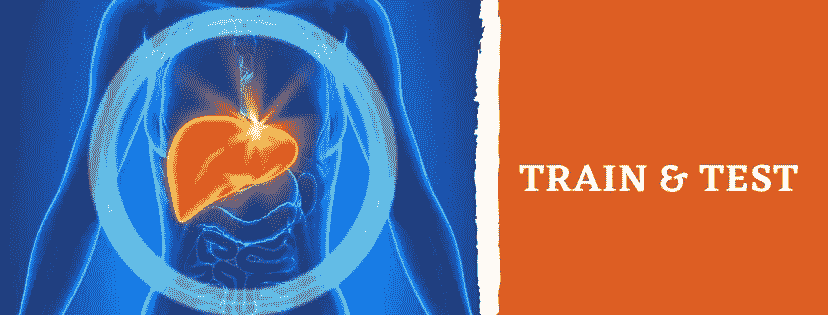
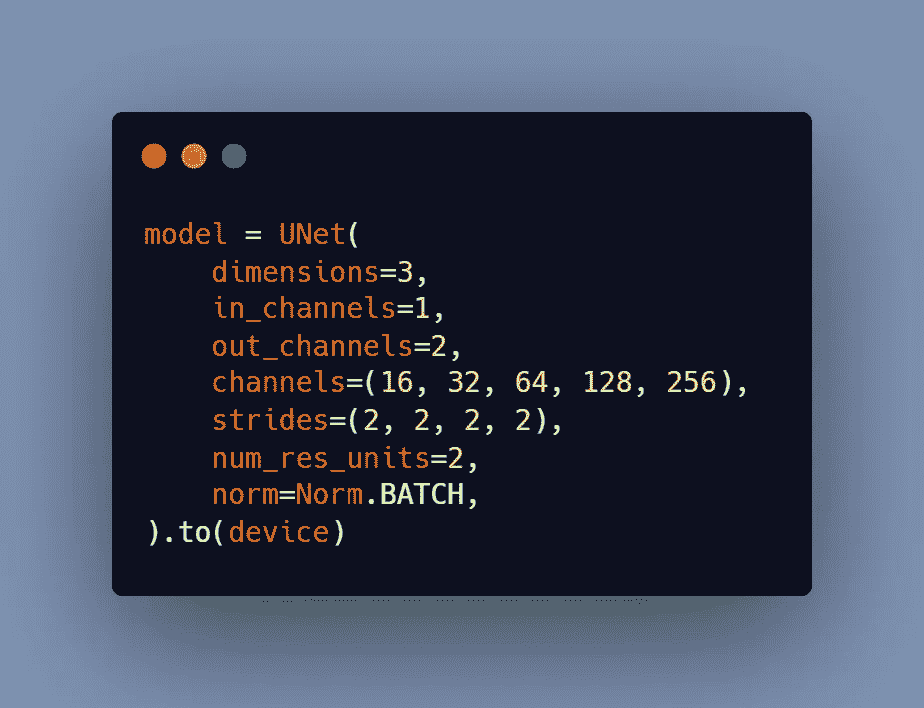
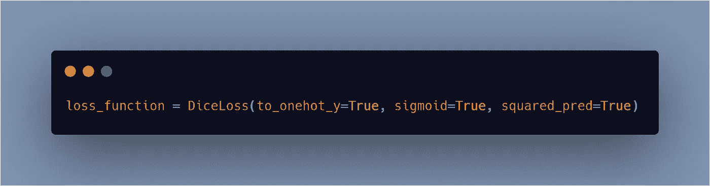
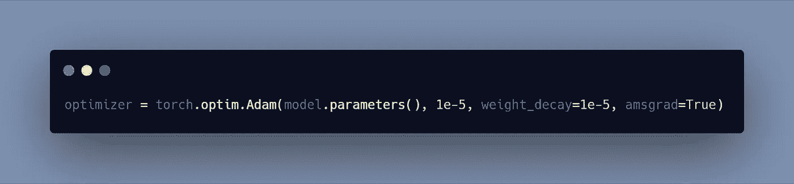
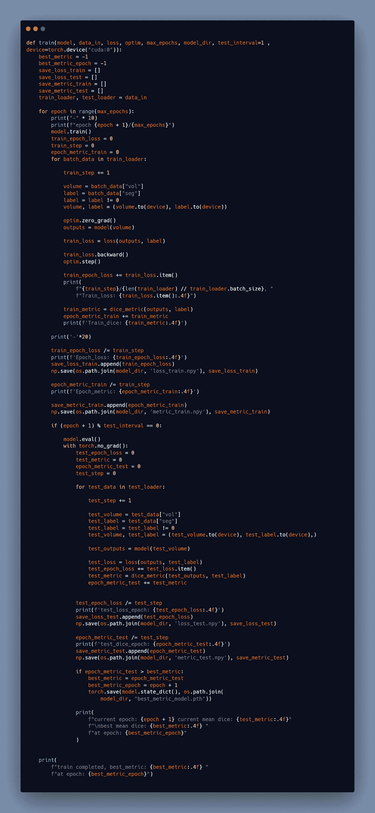
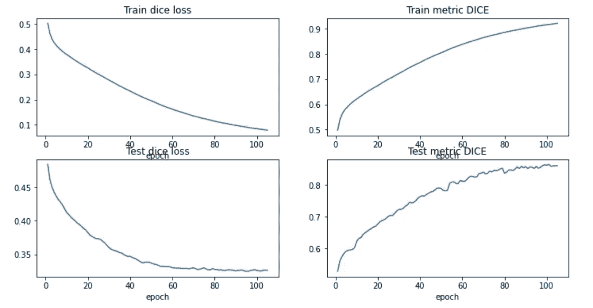
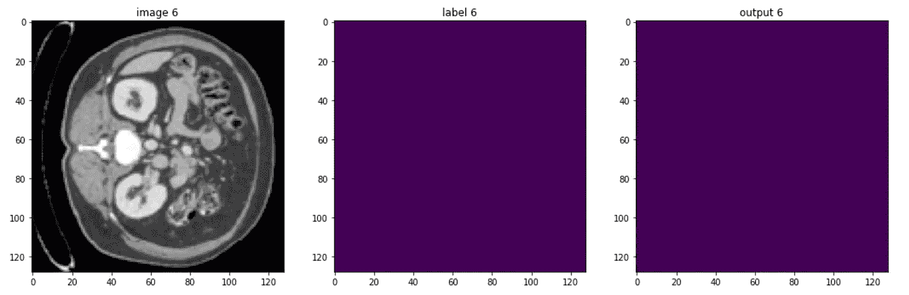
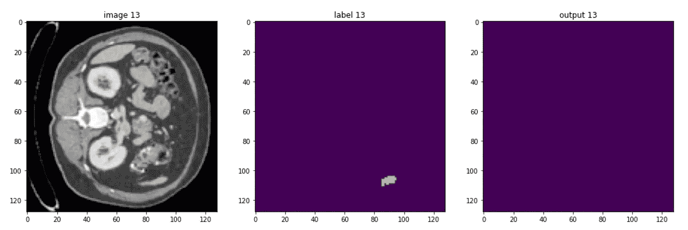
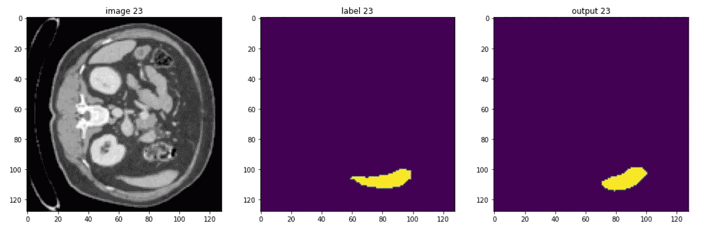
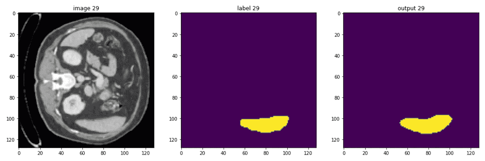

# 自动肝脏分割—第 4/4 部分:模型的训练和测试

> 原文：<https://levelup.gitconnected.com/automatic-liver-segmentation-part-4-4-train-and-test-the-model-d145dce16ccd>

## 用于医疗成像的人工智能

## 关键词:Python，Monai，PyTorch，3D U-Net，CT 扫描



> 我网站上的博文原文是 [**此处**](https://pycad.co/liver-segmentation-part-4/) 。

# 摘要

让我们讨论一下在我们准备好数据和安装好软件包之后，如何开始培训。您可以使用我将直接为这一部分提供的 train 函数，但首先我要向您解释代码，以便如果您遇到任何错误或获得较低的准确性，您将知道如何修复它。

# U-Net 模型

在处理完数据之后，您必须导入的第一件事是来自 monai 的 U-Net 模型(或者，如果您愿意，也可以使用您定义的模型)。



图片由作者使用[碳](https://carbon.now.sh/)制作

要考虑的重要参数是 ***尺寸*** 该参数控制卷积块的尺寸，这里我们可以选择使用一个 ***3D U-Net*** (通过将尺寸设为 3)或一个 ***2D U-Net*** (通过将尺寸设为 3)。放心吧，默认值是 ***3*** 。

然后是***【in _ channel】***，它指的是输入通道，它只有一个，因为您使用的切片只有一个通道，并且包含两个不同的值(0 表示背景，1 表示前景)。但是，对于***‘out _ channel’***(输出通道)，您必须输入 2，以便每个通道包含单个类的预测。这意味着通道 0 表示对类别背景(无肝脏)的预测，而通道 1 表示对类别前景(肝脏)的预测。

另一方面，***‘通道’***参数控制每个卷积块的滤波器/内核的数量。

其他参数与任务并不特别相关。

# 损失函数

损失函数我用了骰子损失，我在本博客 的 [*中解释过。*](https://pycad.co/the-difference-between-dice-and-dice-loss/)

要从 monai 导入它，您可以使用这行代码:



图片由作者使用[碳](https://carbon.now.sh/)制作

你可以在这里看到我在 YouTube 上的完整课程 来了解更多关于这些的信息。

# 【计算机】优化程序

然后您可以使用以下代码行从 monai 导入 Adam 优化器。



作者使用[碳](https://carbon.now.sh/)制作的图像

# 训练模型

现在一切就绪，剩下的就是运行 [*训练脚本*](https://github.com/amine0110/Liver-Segmentation-Using-Monai-and-PyTorch/blob/main/train.py) ，它将从 [*实用程序文件*](https://github.com/amine0110/Liver-Segmentation-Using-Monai-and-PyTorch/blob/main/utilities.py) 中调用训练函数。

这是训练功能，更多的解释你可以随时查看 YouTube 课程。



图片由作者使用[碳](https://carbon.now.sh/)制作

> 请耐心等待，因为培训可能需要一些时间(甚至超过 24 小时)，这取决于您有多少病人。

# 测试模型

终于到了看到自己劳动成果的时候了。有一个 [*测试笔记本*](https://github.com/amine0110/Liver-Segmentation-Using-Monai-and-PyTorch/blob/main/testing.ipynb) 包含了运行指标和模型所需的所有步骤。

这些是训练和测试数据的指标:



作者截取的图像

要测试模型，首先像训练一样加载 U-Net 模型，然后有一个功能允许您将权重加载到创建的模型，最后您可以开始通过测试患者来查看模型是否分割良好。

这是一个病人的一些切片:



当然，该模型可以改进，但您应该知道，在医疗成像中，没有完美的任务，因为图像类型非常困难，但本课程的目标是让您快速了解 monai，以及如何使用它来处理 3D 体积。

# 克隆 GitHub 存储库

现在您已经理解了代码是如何工作的，您可以简单地克隆我的 GitHub 库，并通过调用您需要的函数来开始使用它。

要克隆 GitHub repo，您可以在终端中运行以下代码行:

```
git clone [https://github.com/amine0110/Liver-Segmentation-Using-Monai-and-PyTorch](https://github.com/amine0110/Liver-Segmentation-Using-Monai-and-PyTorch)cd ./Liver-Segmentation-Using-Monai-and-PyTorch
```

然后开始享受吧！

# 你想学医学影像的深度学习！

即将推出全面的医学成像课程，涵盖使用 Monai 和 PyTorch 的 2D 和 3D 分割，并提供额外支持。加入等候名单以接收任何课程更新的通知。

[](https://pycad.co/monai-and-pytoch-for-medical-imaging/) [## 医学成像深度学习登录页面- PYCAD

### 使用 Monai 和 PyTorch 的医学成像中的 2D 和 3D 分割。

pycad.co](https://pycad.co/monai-and-pytoch-for-medical-imaging/) 

# 关于作者


> 穆罕默德·艾尔·阿明·莫赫塔里是我的名字。我是计算机视觉领域的研究助理(博士生),从事在线内容的创作。我在 [YouTube](https://www.youtube.com/channel/UCdYyILlPlehK4fKS5DiuMXQ) 上创作视频，在 [Udemy](https://www.udemy.com/user/pycad-2/) / [Skillshare](https://www.skillshare.com/user/pycad) 上开设课程，并且是 Medium 上的一名作家，除此之外我还有自己的网站 [Pycad](https://pycad.co/) ，我用它作为一个作品集来分享我所有的知识和作品。有时间的话请看一下:)。