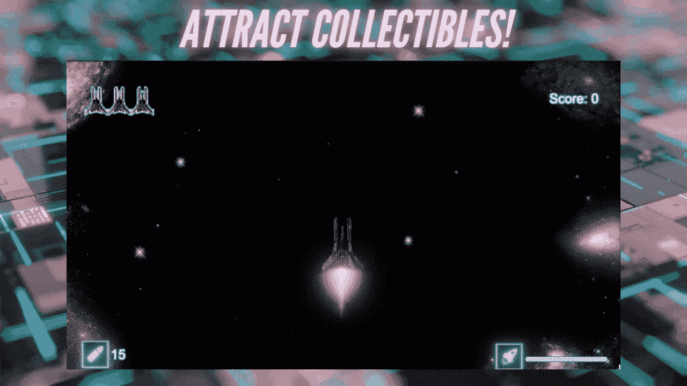
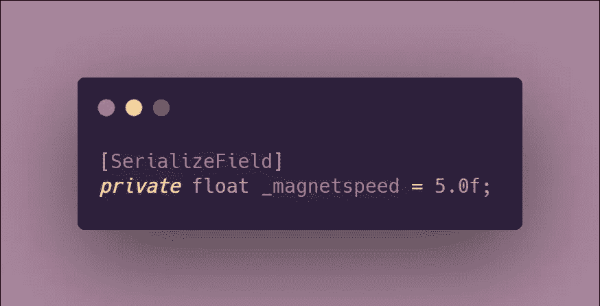
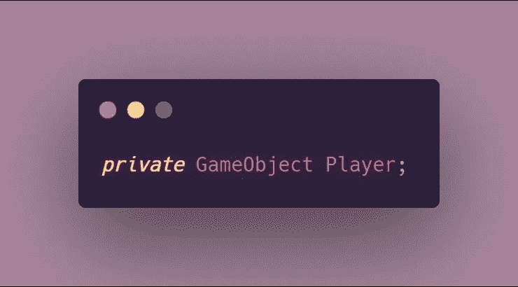
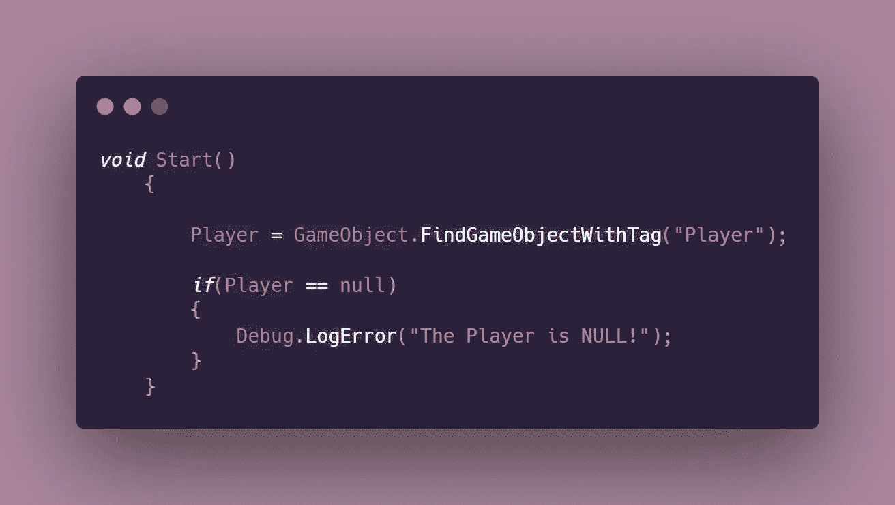
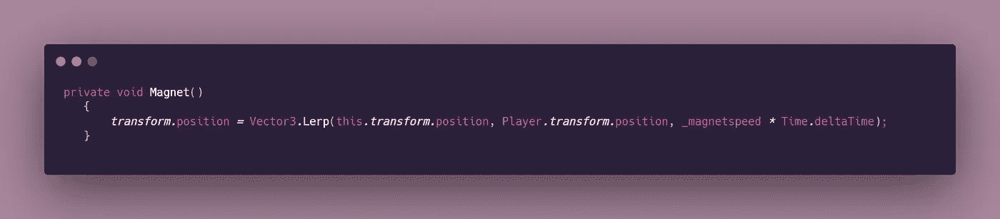
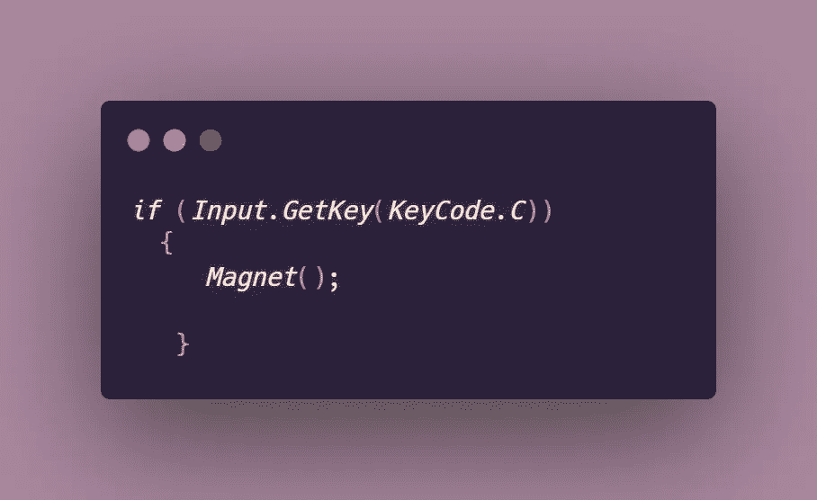
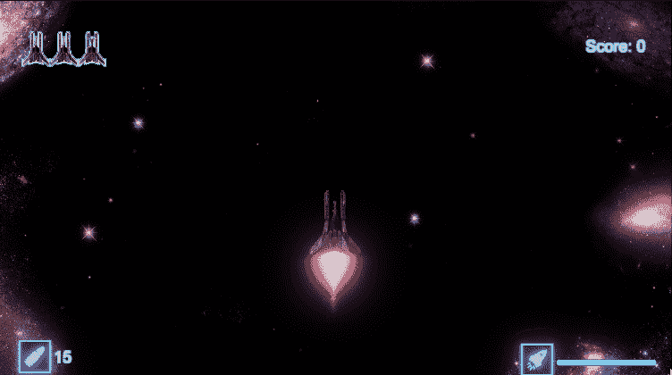

# 自动吸引玩家上电

> 原文：<https://levelup.gitconnected.com/automatically-attract-power-ups-to-the-player-1824f1dd17ac>

## 2D 太空射手—第二阶段:核心程序设计挑战

**目标**:向玩家吸引收藏品、能量或任何你选择的物品。

# 对“磁铁”进行编程

这段代码将被添加到我的[模块化加电脚本](/creating-modular-power-up-systems-bcf349e0020)中，所有的加电行为都在这里处理。理想情况下，这段代码的位置需要在一个脚本中，该脚本附加到你想要吸引玩家的对象上，因为我们将访问它的变换能力来获得想要的结果。

1.  为物体向玩家移动的速度创建一个全局变量。我添加了一个 SerializeField，这样我就可以在需要的时候从 Inspector 中调整速度的值。

2.创建一个全局变量来引用 Player 对象。这样做是为了让你以后能够访问玩家的变形。

3.在 Start 函数中找到 Player 对象。

> **注意**:作为一个最佳实践，你应该在寻找游戏对象和组件时总是进行空值检查。

现在你已经设置了所有必要的变量，是时候学习一下 [**Vector3 了。Lerp**](https://docs.unity3d.com/ScriptReference/Vector3.Lerp.html) 。简单地说，这允许我们在 A 点和 b 点之间插值。

**这对我们意味着什么？**

我们可以利用这一点，使对象 A(收藏品)向对象 B(玩家)移动，因为它将穿过它们之间的任何一组点，不管它们在什么位置。

4.创建一个处理吸引力逻辑的方法。这里，通过使用 Vector3.Lerp 来改变可收集对象的位置。Lerp(起点、终点、速度)。

5.从更新或您认为合适的地方调用该方法。就我个人而言，我将该方法设置为通过玩家输入来激活。尽管要注意，如果你使用 Input 来实现这一点，你一定不能使用 **GetKey** 而不是 **GetKeyDown。** GetKey 将允许移动连续流动，而不是每次按下按键时使对象移动一个单位。这是因为只要您按住键，GetKey 中的输入就为真，因此其中的逻辑将在每一帧运行。

## 结果是:

本文是 GameDevHQ 的核心编程挑战系列的一部分。在下一篇文章中，我将介绍如何添加危险收藏品！