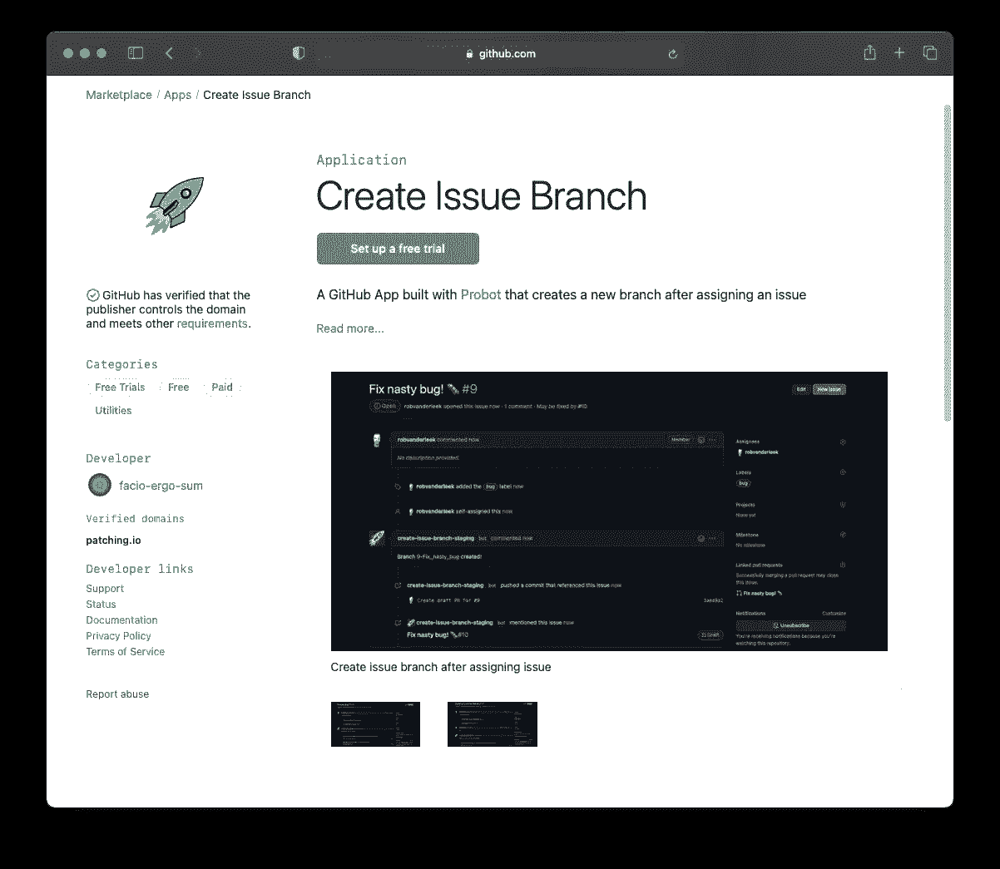
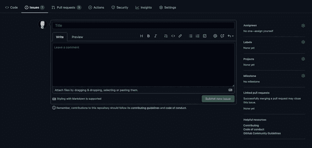
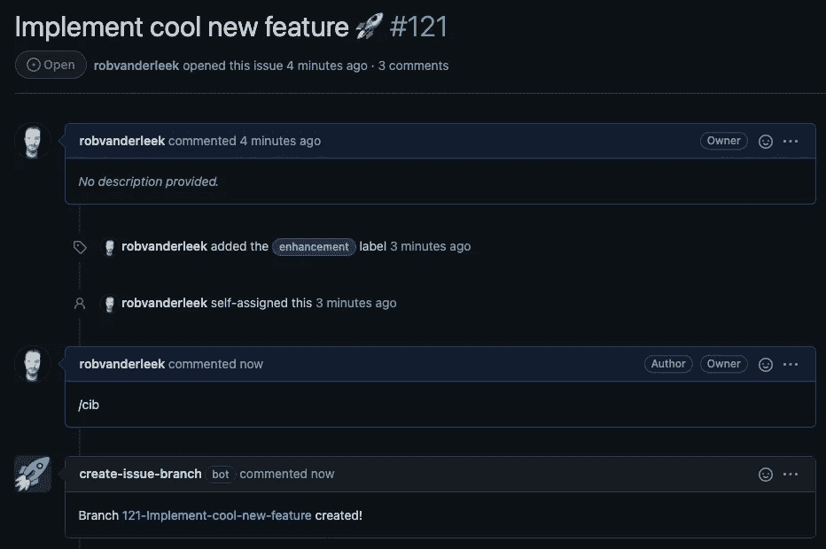

# 从 GitHub 中的问题自动创建分支

> 原文：<https://levelup.gitconnected.com/automatically-create-a-branch-from-an-issue-in-github-fcfc50b1d68f>


格伦·卡斯滕斯-彼得斯在 [Unsplash](https://unsplash.com?utm_source=medium&utm_medium=referral) 上的照片

软件工程师的典型工作日是这样的:

1.  选择一个问题来解决
2.  创建分支
3.  想一想🤔和一点编码魔术✨
4.  打开一个 pull-request 来测试和检查您的代码
5.  回到 1

它可能看起来不怎么样，但实际上很有趣，开发人员是问题的解决者。当然，软件工程比上面的列表包含的要多得多，但最终，即使是最大、最复杂的软件系统也是在解决问题的小的、有时是微小的迭代中构建的。

GitHub 存储库内置了很好的问题跟踪和代码审查功能，不幸的是，该平台缺少一个特殊的小功能:自动地(并且一致地)创建分支来处理问题。

假设你已经选择了标题为“修复价格排序错误”的第 123 期，你应该如何命名这个分支？

*   `Fix_sorting_by_price_bug`？
*   `fix-sorting-by-price-bug`？
*   `123-fix-sorting-by-price-bug`？
*   `issue-123`？
*   `bug/fix-sorting-by-price-bug`？

如果你自己在一个代码库上工作，遵循一个分支名称惯例需要一些训练，有时分支名称如`bugfix`开始出现(当你想知道为什么一段代码被修改时，这降低了代码变更的可追溯性)。

团队通常同意一个标准，但是如果你不能自动化地执行那个标准，随着时间的推移，你会注意到团队成员开始偏离它。

# 问题，遇到解决方案🤝解决方法，遇到问题。

GitHub 平台可以用应用和动作来扩展。您可以在 GitHub Marketplace 上找到并安装应用程序。一个专门为自动创建问题分支而构建的应用程序是[创建问题分支](https://github.com/marketplace/create-issue-branch)。



在 GitHub 市场上创建问题分支

为您的存储库开始使用该应用程序只需点击“设置免费试用”按钮，选择一个计划(非商业用途是免费的)并为您的选择(或所有)存储库安装它。

为存储库安装“创建问题”分支后，如果分配了问题，则会自动创建一个新分支:



分配问题后，会自动创建一个分支

# 支持不同的工作流程

开发工作流因项目和团队而异。
这就是为什么自 1.5 年前推出以来，该应用程序增加了许多配置选项。以下是一些解释，你可以在文档中找到更多选项[。配置存储在存储库或组织级别的 YAML 文件中。](https://github.com/robvanderleek/create-issue-branch/blob/main/README.md)

## ChatOps 模式

默认情况下，创建问题分支会在分配问题后创建一个新分支，但您也可以[将应用程序置于 ChatOps 模式](https://github.com/robvanderleek/create-issue-branch#mode-auto-or-chatops)，只有在问题注释中给出 ChatOps 命令`/create-issue-branch`(或仅`/cib`)时才会创建一个分支:



ChatOps 模式:在给出 ChatOps 命令后创建一个分支

## GitHub 动作支持

点击一个按钮就可以安装该应用程序，并允许您访问上述工作流模式。如果你想定制你的开发工作流程甚至进一步创建问题分支也可以[作为 GitHub 动作](https://github.com/robvanderleek/create-issue-branch#option-2-configure-github-action)运行。

下面的工作流 YAML 显示了如何将“创建问题分支”作为 GitHub 操作嵌入:

```
on:
  issues:
    types: [ assigned ]
  issue_comment:
    types: [ created ]
  pull_request:
    types: [ closed ]

jobs:
  create_issue_branch_job:
    runs-on: ubuntu-latest
    steps:
      - name: Create Issue Branch
        uses: robvanderleek/create-issue-branch@main
        env:
          GITHUB_TOKEN: ${{ secrets.GITHUB_TOKEN }}
```

## 自定义分支名称

你如何喜欢你的分支名字是一个品味的问题，或者取决于一个团队已经决定的标准。

创建问题分支为[提供了许多配置选项](https://github.com/robvanderleek/create-issue-branch#branch-names)来帮助您选择符合您偏好的分支名称样式。
例如，您可以使用非常短的分行名称，如`i123`，稍微长一点的名称，如`issue-123`，坚持使用默认名称:`issue-123-fix-sorting-by-price-bug`，使用基于发行标签的前缀作为分行名称:`bug/issue-123-fix-sorting-by-price-bug`，或者您能想到的任何其他风格。

# 那么，为什么 GitHub 中没有这个功能呢？

如果创建问题分支是 Git 开发工作流程中如此平凡但重要的一部分，那么为什么 GitHub 问题接口中没有这个特性呢？尤其是因为其他平台也支持它(例如 GitLab 中的[),一旦你习惯了这个特性，就很难离开它工作。](https://docs.gitlab.com/ee/user/project/repository/web_editor.html#create-a-new-branch)

我已经创建了 Create Issue Branch 应用程序来响应一个[长期存在的特性请求问题](https://github.com/isaacs/github/issues/1125)。该问题现已被关闭，并由 GitHub 官方账户中的[问题](https://github.com/github/feedback/discussions/3441)跟进。也许有一天这个特性会被包含在 GitHub 问题中，但是直到那一天[安装创建问题分支](https://github.com/marketplace/create-issue-branch)并且享受工作流程的小改进！🚀

编码快乐！

[](https://github.com/robvanderleek/create-issue-branch) [## robvanderleek/创建-发布-分支

### 自动创建问题分支的 GitHub 应用程序/操作(或者在分配问题后自动创建，或者…

github.com](https://github.com/robvanderleek/create-issue-branch)