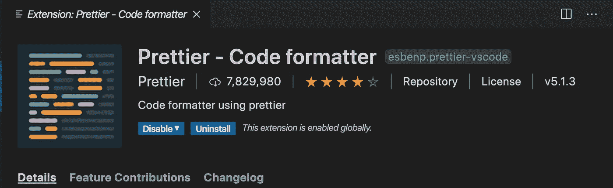
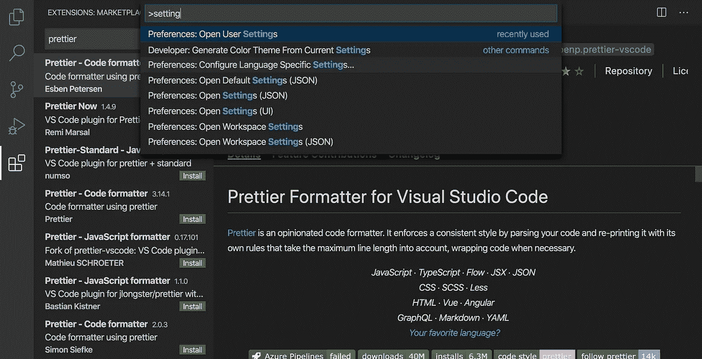
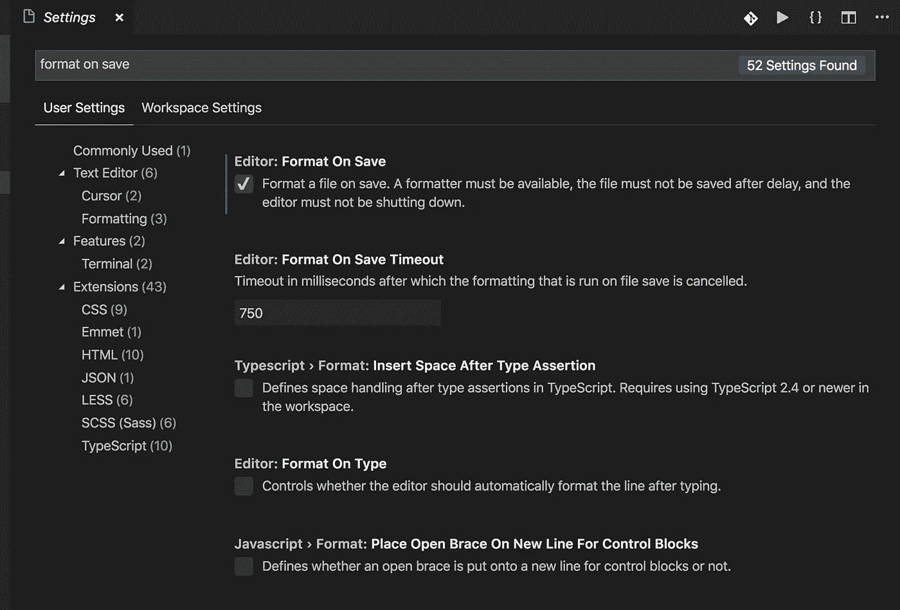
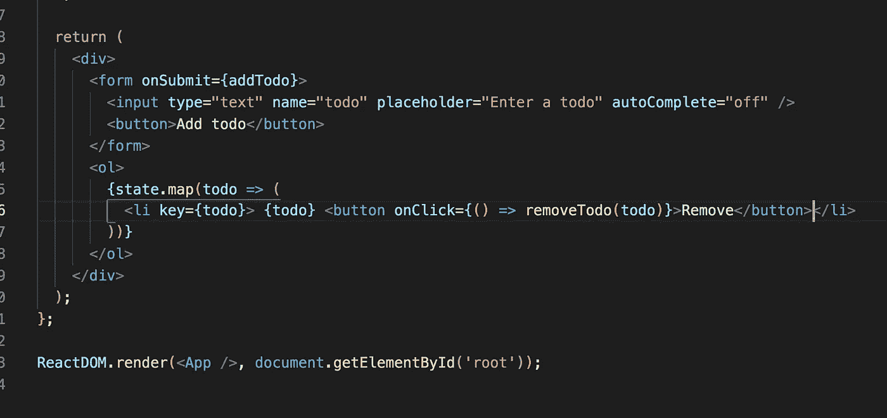
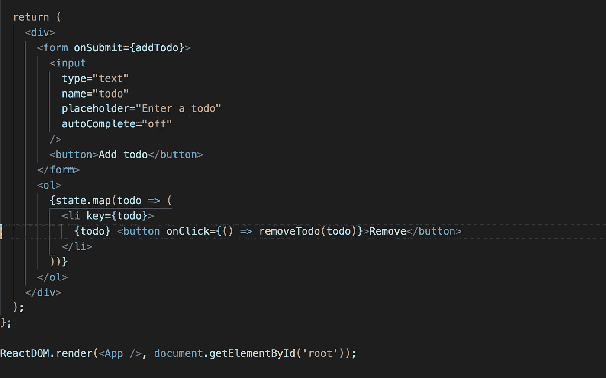
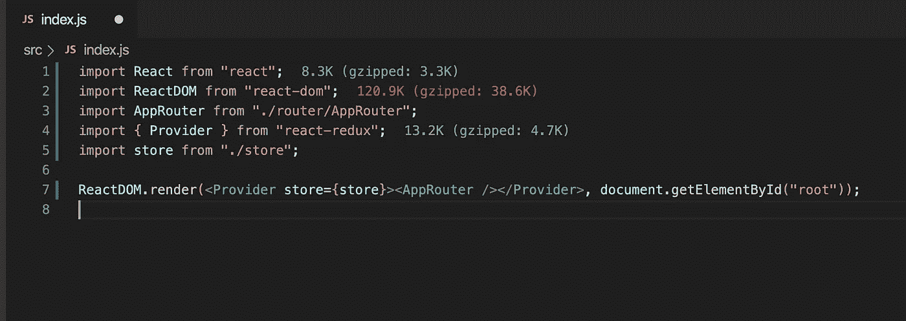
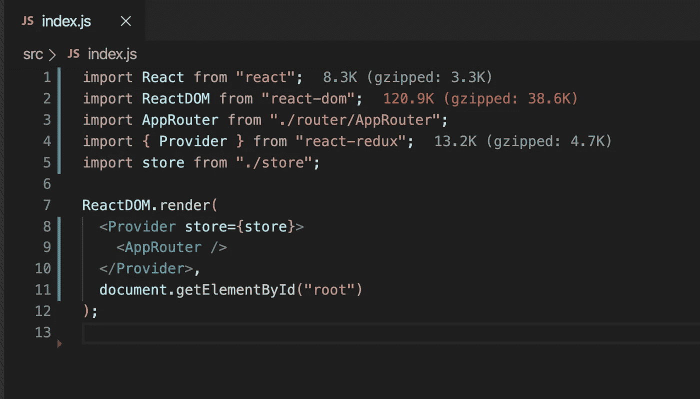
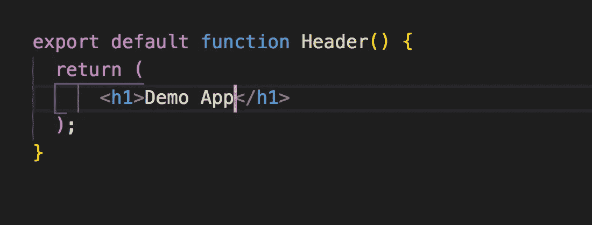
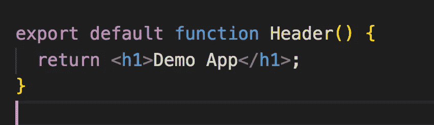

# 在使用 JavaScript 时自动格式化 Visual Studio 代码中的代码，并与更漂亮的

> 原文：<https://levelup.gitconnected.com/automatically-format-code-in-visual-studio-code-when-working-with-react-c48674a12dc5>

通过不浪费时间格式化代码来提高您的生产力


在本文中，我们将探索非常流行的 Visual Studio 代码扩展`Prettier`,顾名思义，它很好地格式化了代码。

更漂亮的是一个`Opinionated Code Formatter`，它格式化用 Javascript、Angular、Vue、React、Typescript 和许多其他语言编写的代码。

**安装:**

1.在 VS 代码中点击扩展的图标

2.搜索“更漂亮”

3.你会看到漂亮的扩展

4.点击安装按钮

5.一旦安装了扩展，点击 Reload 按钮或重启 VS 代码



**用法:**

要在保存时自动格式化文件，在 Visual Studio 代码中，按`Control + Shift + P`或`Command + Shift + P (Mac)`打开命令面板，键入`setting`，然后选择`Preferences: Open User Settings`选项



搜索“`format on save`”设置并勾选复选框。



*就是这样！恭喜你！您已经按照默认设置配置了更漂亮的格式。*

现在，打开任何 React 代码。假设您的代码如下所示



如果您使用 Ctrl+S(Mac 的 Command + S)保存文件，`prettier`将如下所示格式化您的代码



这要好得多，并且符合 React 风格指南。

如果你有这样的代码



然后在保存时，它将被格式化成这样



如果你有这样的代码



漂亮将删除不必要的括号，并会缩短代码，如下所示



所以现在，如果一行放不下代码，您不必担心增加空间或将代码移到第二行。漂亮会自动帮你完成任务。

这将使你更有效率，因为你不会在格式化上浪费时间

## **高级配置**

如果你想更多地控制格式，漂亮也允许。

在项目的根目录下创建一个名为`.prettierrc` (dot prettierrc)的文件，并根据需要添加配置

例如，在`.prettierrc` 文件中添加以下 JSON

```
{
 "singleQuote": true,
 "trailingComma": "none"
}
```

`SingleQuote: true`将在代码中对字符串使用单引号而不是双引号

`trailingComma: "none"`将删除文件中对象声明的所有尾随逗号

你可以在这里找到所有的配置选项[。](https://prettier.io/docs/en/options.html)

今天到此为止。希望你今天学到了新东西。

**别忘了直接在你的收件箱** [**这里**](https://yogeshchavan.dev) **订阅我的每周时事通讯，里面有惊人的技巧、诀窍和文章。**