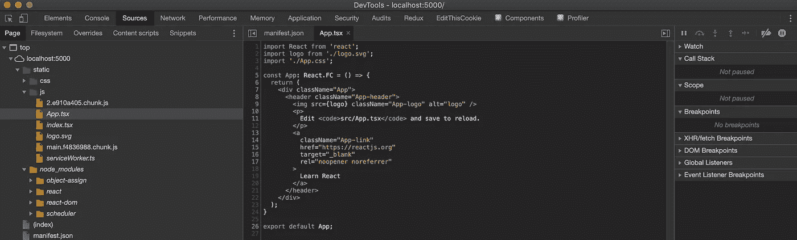

# 源地图可能会泄露你的私人项目文件

> 原文：<https://levelup.gitconnected.com/automatically-generated-source-maps-could-be-revealing-your-private-projects-files-17b2d13d7da4>


鲍里斯·斯莫克罗维奇在 [Unsplash](https://unsplash.com?utm_source=medium&utm_medium=referral) 上的照片

## 您可能会错误地使用自动生成的源代码映射来公开您的前端应用程序源代码。

当您开始创建 web 应用程序时，通常会接触一些流行的库或框架。例如，您可以使用众所周知的“create-react-app”CLI，它将为您完成所有工作。

CLI 将自动生成捆绑文件以及名为“源映射”的文件。每次对应用程序进行生产构建时，都会在包文件旁边生成“. js.map”文件。那些是源地图。它们是在与您的包文件相同的文件夹中创建的，如果您不够注意，当您将它们发布到您的服务器时，您的代码可能会被公开。这不仅适用于“create-react-app”CLI，任何其他绑定器都可能发生这种情况。

当您将缩小的 JavaScript 文件发布到您的服务器时，您的源映射也可能被错误地发布，这意味着每个人都可以看到您的私有源代码。这包括项目的原始数据。js，。ts，。咖啡，。sass 文件。

## 什么是源地图？

简而言之，源映射只是一个简单的 JSON 文件，其中包含一个对象。该对象有两个重要的键:“sources”和“sourcesContent”。“sources”键包含项目中本地文件的名称数组，而“sourcesContent”键包含这些文件的内容数组。

为了更好地理解，请参见下面的源映射文件示例。

源映射文件示例

## 这是什么意思？

如果您公开您的源映射文件，任何人都可以阅读您的部分源代码。

## 会有什么影响？

对于一些项目来说，这可能是不好的。公司投入资金和精力来制造一个在客户端有很多逻辑的产品。使用源代码地图，任何人都可以复制这个项目，修改它，并将其作为他们“自己”的项目发布在其网站上，并开始赚钱，甚至羞辱你的应用程序的名称。在这种情况下，您应该确保不公开您的源地图。

## 你如何从中受益？

一些项目对发布源代码地图是开放的，因为这有助于人们学习新技术，如何构建大型应用程序等。当阅读别人写的代码时，你可以学到很多有用的东西，特别是当你是 web 技术世界的初学者，你所看到的只是缩小的文件时。这可以让你更仔细地了解一些项目的内幕。

## 你怎么知道一个网站有公开的源代码地图？

打开你的 Google Chrome DevTools，查看网络日志，浏览下载的 JS 文件，看看在某个文件的末尾是否有类似这样的一行。

```
//# sourceMappingURL=main.1ad01fd1.chunk.js.map
```

这一行描述了为这个包生成的源映射文件的位置。如果您访问这个`sourceMappingURL`，您应该能够看到源文件。

如果您看不到这一行，仍然有可能生成源映射文件。只要尝试在一个新窗口中打开任何 JavaScript 包文件，然后在你的地址栏中将“. min.js”替换为“. min.js.map”，如果你足够幸运的话，你将看到源文件。

## 如何以更易读的方式查看源地图？

例如，如果你正在使用谷歌 Chrome，只需访问一些使用 React 的网站(如果你使用 React 开发者工具扩展，你可以看到该网站正在使用 React ),如果你运气好，该网站有公开的源代码地图。打开谷歌 Chrome DevTools，重新加载你的网站，点击“源”标签，在左侧，你将能够看到这个网站的文件。这些文件可能还包括来自源地图的文件，所以您可以看到项目的。ts，。咖啡，。tsx 等。文件在那里。

去[官方 React 网页](https://reactjs.org/)或者[官方 Angular 网页](https://angular.io/)试试吧！



Chrome DevTools 显示来自源地图的文件。

## 阻止您的源代码公开

您不应该在构建过程中删除所有的`.map`文件——特别是，如果您分析您的生产日志，源映射可能会有所帮助——这就是它们的目的。只要确保不公开它们就行了。你可以这样做，比如把它们放在另一个(私有)目录中，或者干脆不允许服务 static。映射服务器上的文件。

## 结论

当您将 web 应用程序投入生产时，请考虑是否要公开您的项目文件。如果你决定公开你的源地图，你可以在这个 GitHub 知识库[https://github.com/michalszorad/spreading-source-code](https://github.com/MichalSzorad/spreading-source-code)上列出你的网站，帮助传播构建网络应用的知识。

如果你不想错过任何新文章，请在我的推特上关注我[https://twitter.com/michalszorad](https://twitter.com/michalszorad)

[](/typescript-keeping-type-guards-safe-and-up-to-date-2457d52bd722) [## TypeScript:保持类型保护安全并保持最新

### 普通类型的警卫可以帮助我们。

levelup.gitconnected.com](/typescript-keeping-type-guards-safe-and-up-to-date-2457d52bd722) [](https://gitconnected.com/learn) [## 了解如何编码-查找编码教程| gitconnected

### 从开发者提交和排名的教程中学习任何编程语言、框架或库。教程是…

gitconnected.com](https://gitconnected.com/learn)