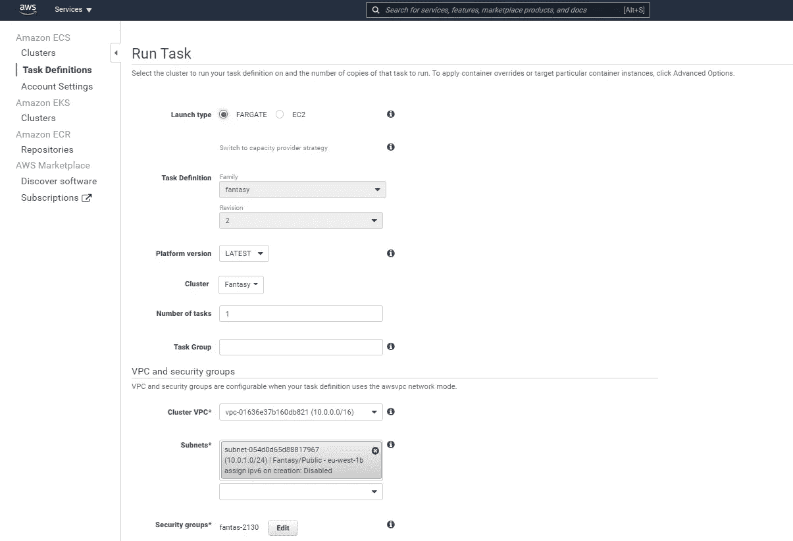
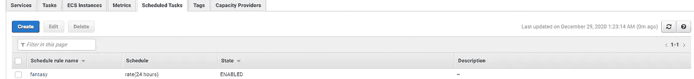

# 用 Python，FPL，熊猫，Docker 和 AWS 自动管理你的梦幻英超球队

> 原文：<https://levelup.gitconnected.com/automatically-manage-your-fantasy-premier-league-team-with-python-fpl-pandas-docker-and-aws-ea373097a3c7>


我已经更新了这个项目，使代码更简单，更容易遵循，以及使用 AWS Lambda 代替 Fargate。你可以在这里找到更新版本[。](https://conor-aspell.medium.com/updated-automatically-manage-your-fantasy-premier-league-team-with-python-and-aws-lambda-e92eebacd93f)

我将把这个故事作为使用 FPL 图书馆的指南。

每年的这个时候又来了，我厌倦了更新我的幻想队，我没有和我心爱的富勒姆一起在降级区好好跑，我的幻想队在我的朋友联盟中排名最后。

幸运的是，有一个很棒的 Python 库， [FPL](https://fpl.readthedocs.io/en/latest/user/installation.html) ，由[阿莫斯巴斯迪安](https://github.com/amosbastian)维护，用于与梦幻英超 API 交互。这让我们很容易获得梦幻英超联赛的数据，决定我们想要换进和换出哪些球员，并执行转会。我将通过 Docker 和 AWS ECS Fargate 向您展示如何在本赛季剩余的时间里为您管理您的团队。

本教程的所有代码都可以在我的 Github 上找到，[这里](https://github.com/ConorAspell/FPL)。

# 先决条件

*   一支[梦幻英超](https://fantasy.premierleague.com/my-team)球队
*   [Python](https://www.python.org/downloads/)
*   [码头工人](https://www.docker.com/)。
*   一个[免费 AWS 账户](https://portal.aws.amazon.com/billing/signup#/start)。

# 假想足球赛

幻想足球是一种游戏，参与者担任虚拟职业英超足球队的总经理。

竞争者通过参加所有英超球员都可以参加的选秀来选择他们的球队。

团队由以下人员组成:

*   2 名守门员
*   5 名防守队员
*   5 名中场队员
*   3 名前锋

每个球员都有一个分配给他们的值，球队的值不得超过 100。球员的价值在整个赛季都在波动。每位玩家只能从一队中选择 3 名玩家。11 名球员入选首发，4 名替补。

然后，球员根据他们在每场比赛中的表现得分，如果一名首发球员不上场，他们将与一名替补球员交换。所有先发球员得分的总和就是比赛周比赛者的得分。所有比赛周数的总和就是一个竞争者得分的总和。

在每个比赛周之间，参赛者可以用一名球员交换另一名球员，选择一名新队长，并更换他们的首发阵容和替补队员。

# 战略

我们需要决定的第一件事是我们决定如何评价玩家的策略。我们需要两个策略，一个是选择哪个玩家退出，另一个是选择哪个玩家加入。

根据对去年冠军约书亚·布尔的采访，你需要的 4 个主要数据点是状态、比赛难度、可用性和主场/客场。你应该把那些状态不佳，不能上场，即将到来的比赛很艰难并且正在客场比赛的球员转移出去，你应该把那些状态良好，可以上场，比赛很轻松并且正在主场比赛的球员转移进来。

他还建议将表现差的球员转出，而不是转入表现好的球员。因为这个原因，我们会在球员转入之前计算出被转出的球员。

在本教程中，我们将制作一个加权指数，就像我在[之前的一篇关于梦幻橄榄球的帖子](https://conor-aspell.medium.com/how-to-use-python-and-pandas-to-pick-a-fantasy-sports-team-4fe9afe18b2d)中所做的那样，并使用加权随机性来挑选出要转出和转入的球员。如果您想使用不同的策略，如神经网络，或者想包含更多的数据点，如天气预报，请随意。

## 步骤 1:设置 FPL

创建一个新的 Python 项目，激活您的[虚拟环境](https://docs.python.org/3/library/venv.html)，运行以下命令来安装 FPL:

```
pip install fpl
```

我们还需要 [Pandas](https://pandas.pydata.org/) 进行数据操作，以及 Datetime 来计算当前的游戏周:

```
pip install pandas
pip install datetime
```

## 步骤 2:设置环境变量

为了访问我们团队的详细信息，我们需要在环境变量中存储我们的用户名、密码和用户 id。你可以通过进入[https://fantasy.premierleague.com/](https://fantasy.premierleague.com/)找到你的用户 id，然后选择团队>游戏周历史，网址应该是这样的:[https://fantasy.premierleague.com/entry/1234567/transfers](https://fantasy.premierleague.com/entry/6452204/transfers)其中 1234567 是你的用户 id。


```
export EMAIL=YOUR_EMAIL
export PASSWORD=YOUR_PASSWORD
export USER_ID=YOUR_USER_ID
```

我们将把代码分成 main.py 和 update_team.py 两个部分。

## 步骤 3:认证

现在我们有了变量，我们可以使用 FPL 图书馆来获得我们需要的数据。FPL 使用异步请求，所以所有方法都必须用“async”声明，所有请求都必须有“await”。

我们的代码应该是这样的:

```
from fpl import FPL
import aiohttp
import asyncioasync def update(email, password,user_id):
  async with aiohttp.ClientSession() as session:
     fpl = FPL(session)
     login = await fpl.login(email, password)
     user = await fpl.get_user(user_id)
```

## 第四步:获得我们当前的选择

FPL 为用户提供了一个名为“get_picks”的方法，但是我们需要当前的游戏周来调用它。为了获得当前游戏周，我们将调用另一个名为“get_gameweeks”的方法来获得所有游戏周的开始日期，然后选择未来最接近的一个作为当前游戏周。

```
gw = await fpl.get_gameweeks(return_json=True)
df = pd.DataFrame(gw)
today = datetime.now().timestamp()
df = df.loc[df.deadline_time_epoch>today]
gameweek= df.iloc[0].id
picks = await user.get_picks(gameweek-1)
```

不幸的是，picks 只返回球员的 id，他们的位置，如果他们是队长/副队长。然而，如果我们存储 id，即返回的“元素”字段，我们可以使用“get_player”方法来获得关于每个玩家的更多数据。

```
players = [x['element'] for x in picks[gameweek-1]]
picked_players = []
for player in players:
    p = await fpl.get_player(player, return_json=True)
    picked_players.append(p.copy())
picked_players = pd.DataFrame(picked_players)
```

我们现在有了一个数据框，其中包含了更多的数据，为了便于查看，我过滤掉了一些列，但这只是我当前团队的一个示例。

这里可用的数据非常有用，但是，API 中有一个错误，如果一个球员本赛季没有受伤，他们就没有价值。为了避免任何错误，请使用 fillna 来填写任何 NaNs 到 100。

```
picked_players.chance_of_playing_this_round= picked_players.chance_of_playing_this_round.fillna(100)
```

我们还需要一个数据，在我们选择哪个球员离开之前，这是即将到来的比赛周的设备难度等级(FDR)。

## 第四步:获得下周的日程安排

FPL 图书馆有一个方法叫做“get_fixtures_by_gameweek ”,我们将会用到它。

```
fixtures = await fpl.get_fixtures_by_gameweek(gameweek, return_json=True)fixtures = pd.DataFrame(fixtures)
```

这提供了很多信息，包括每个团队的难度等级，我们将在下一步使用。

## 第五步:计算玩家下一局游戏难度

要计算即将到来的游戏难度，我们只需从对手的难度中减去玩家团队的难度。你需要在计算玩家时再做一次，所以这应该是它自己的方法。

由于两个帧都有一个“id”字段，我们从 fixes 数据帧中删除了所有不必要的字段。

为了让球员在客场比赛，我们做了一个内部的[连接](https://pandas.pydata.org/pandas-docs/stable/reference/api/pandas.DataFrame.merge.html)球员队和球队客场比赛的赛程，对主队重复，然后[把两个数据帧追加](https://pandas.pydata.org/pandas-docs/stable/reference/api/pandas.DataFrame.append.html)在一起。

在客场比赛的球员会被罚 1 分，在主场比赛的球员会得到 1 分的奖励。

由于 append 操作不更新索引，我们重置索引以避免该方法的任何副作用。

```
def calc_fdr_diff(players, fixes):
    fixes = fixes[['team_a', "team_h", "team_h_difficulty", "team_a_difficulty"]] away_df = pd.merge(players, fixes, how="inner", left_on=["team"], right_on=["team_a"]) home_df = pd.merge(players, fixes, how="inner", left_on=["team"], right_on=["team_h"]) away_df['fdr'] = away_df['team_a_difficulty']-home_df['team_h_difficulty']-1 home_df['fdr'] = home_df['team_h_difficulty']-home_df['team_a_difficulty']+1 df = away_df.append(home_df)
    df.index = range(len(df))
    return df
```

## 第六步:挑选一名球员转出

我们将根据我们的数据创建一个指数，数值越高，意味着玩家被替换的可能性越大。我们将使它成为一个独立的方法。首先，我们要检查一名球员是否是本周比赛的球队的一员。

我们使用 [ravel](https://pandas.pydata.org/pandas-docs/stable/reference/api/pandas.Series.ravel.html) 将球队放在一个列表中，然后检查其球队不在该列表中的球员。我们还可以使用 list comprehension 来检查一个球队是否打了两场比赛，并使用 [Pandas "loc"](https://pandas.pydata.org/pandas-docs/stable/reference/api/pandas.DataFrame.loc.html) 函数获得一周内有两场比赛的球员。

```
def calc_player_out(players, fixtures):
    teams_playing = fixtures[["team_a", "team_h"]].values.ravel()
    teams_playing = pd.unique(teams_playing)
    ps_not_playing = players.loc[~players.team.isin(teams_playing)]
    teams_playing_twice = [x for x in teams_playing if list(teams_playing).count(x)>1]
    ps_playing_twice=
players.loc[players.team.isin(teams_playing_twice)]
```

我们现在将使用“ [iterrows](https://pandas.pydata.org/pandas-docs/stable/reference/api/pandas.DataFrame.iterrows.html) ”遍历我们的玩家，并根据他们的数据计算“权重”。你可以见机行事，根据你认为合适的来改变数值，但是你应该把那些状态不好，不能上场，即将到来的比赛很艰难，正在客场比赛的球员转移出去。

你也可以把它变得更加个人化，例如，如果我想让更多的富勒姆球员转会，我可以更多地为富勒姆效力。

我们使用 Pandas 的“ [sample](https://pandas.pydata.org/pandas-docs/stable/reference/api/pandas.DataFrame.sample.html) ”方法返回新的数据帧，其中包含权重和基于权重选择的行。

```
df1 = pd.DataFrame(columns=players.columns.tolist())
for x in players.iterrows():weight = 25
    weight-= x[1]['fdr']*3
    weight-= float(x[1]['form'])*4
    weight += (100-float(x[1]['chance_of_playing_this_round']))*0.2
    if x[1]['id'] in ps_not_playing['id']:
         weight+=25
    if x[1]['id'] in ps_playing_twice['id']:
         weight -=25
    if weight < 0:
        weight = 0
    x[1]['weight'] = weight
    df1 = df1.append(x[1])
return df1,df1.sample(1, weights=df1.weight)
```

这就产生了这样的重量:

价值越高，他们被替换的可能性越大，所以若日尼奥、谢尔维和拉卡塞特最有可能被替换。

## 第七步:过滤掉不合格的玩家

在我们挑选球员转会之前，我们应该移除所有不合格的球员。如果一名球员使我们的预算超过了 100 米的限制，如果他们与我们现有的 3 名球员为同一支球队效力，如果他们是我们现有的球员之一，或者如果他们踢的位置与我们被转移出去的球员不同，那么这名球员就没有资格。

我们可以通过使用 user 的“last_deadline_bank”方法，然后加上我们替换的球员的成本，来获得我们的剩余预算。

我们可以通过制作一个[数据透视表](https://pandas.pydata.org/pandas-docs/stable/reference/api/pandas.pivot_table.html)并统计所有有三个条目的团队来得到无效团队。

```
budget = user.last_deadline_bank+player_out.now_cost.iloc[0]dups_team = picked_players.pivot_table(index=['team'], aggfunc='size')invalid_teams = dups_team.loc[dups_team==3].index.tolist()
```

## **步骤 8:在**中选择要转会的球员

FPL 有一个叫“获取球员”的方法，让我们可以得到所有可用的球员。我们将使用它来获得所有可用的球员，但是，API 将它作为一个对象返回，所以我们需要使用一个 list comprehension 来将其转换为一个字典列表，然后我们使用前面步骤中的变量来过滤掉不符合条件的球员。

```
potential_players = await fpl.get_players()
player_dict = [dict(vars(x)) for x in potential_players]
df=  pd.DataFrame(player_dict)
df = df[~df['team'].isin(invalid_teams)]
df = df[(df.now_cost<budget)]
df= df.loc[~df['id'].isin(picked_players['id'].tolist())]
df = df.loc[df.element_type==player_out.element_type.iloc[0]]
```

这个数据有一个相同的错误，如果一个球员在赛季中没有受伤，它将有一个“这一轮比赛机会”的 NaN 值。这可以用 [fillna](https://pandas.pydata.org/pandas-docs/stable/reference/api/pandas.DataFrame.fillna.html) 修复。

```
df.chance_of_playing_this_round = df.chance_of_playing_this_round.fillna(100.0)
```

我们可以重新使用我们之前制作的“calc_fdr_diff”方法来获得所有没有被过滤掉的玩家的难度。在此之前，我们应该重置索引并删除播放器

```
picked_players.index = range(15)
rows_to_drop=player_out.index.values.astype(int)[0]
picked_players=picked_players.drop(rows_to_drop)
df = calc_fdr_diff(df, fixtures)
```

接下来，我们需要对所有球员进行称重。我们将使用一种类似的方法来衡量球员，但我们希望更好的球员的价值更高，此外，由于有 200+潜在的选择，将有一个合理的机会，其中一个底部的选择将被选中，所以我们将过滤掉除了前 10 名以外的所有人。

数据框架中有大量数据，如果你想将你的权重建立在其他东西的基础上，比如提供的“影响力、创造力、威胁”指数，你可以这样做。

```
def calc_player_in(df, fixtures): df1 = pd.DataFrame(columns=df.columns.tolist())
    teams_playing = fixtures[["team_a", "team_h"]].values.ravel()
    teams_playing = pd.unique(teams_playing) teams_playing_twice = [x for x in teams_playing if list(teams_playing).count(x)>1] ps_not_playing = df.loc[~df.team.isin(teams_playing)]
    ps_playing_twice=df.loc[df.team.isin(teams_playing_twice)]
    for x in df.iterrows():
        weight = 0.1
        weight+= x[1]['fdr']*3
        weight+= float(x[1]['form'])*4
        weight -= (100-float(x[1]['chance_of_playing_this_round'])) * 0.2 if weight < 0:
            weight = 0
        if x[1]['id'] in ps_not_playing['id']:
            weight+=5
        if x[1]['id'] in ps_playing_twice['id']:
            weight -=5
        if float(x[1]['form']) ==0:
            weight=0
        if weight < 0:
            weight = 0
        x[1]['weight'] = weight
        df1 = df1.append(x[1]) df1=df1.sort_values('weight', ascending=False).iloc[0:10]
    return df1.sample(1, weights=df1.weight)
```

这导致这 10 名球员被选中考虑。

这些玩家之间的体重差异很小，所以很可能评分最高的玩家不会被选中，随机抽样为我选择了 Neto。

## 步骤 9:执行转移

FPL 图书馆有一个执行球员转会的方法，叫做“转会”,你可以把球员外出和球员进入的 id 作为一个列表传入。如果你想进行多次转移，你可以传递多个玩家 id。

```
transfer= await user.transfer(player_out.id.tolist(), player_in.id.tolist())
```

API 有一个问题，它有时会无缘无故地抛出一个错误，如果它不起作用，就将代码包装在 try/except 块中。

## 步骤 9a:选择队长

不幸的是，由于你的用户团队直到下一个游戏周开始才在 API 中更新，如果你想改变你的队长或替补，你将无法选择你已经替补的球员。您可以不将您的球员添加到您的“挑选的球员”数据框中，并运行以下代码行来确定该轮的最佳队长，使用选择被替换的球员的权重。

```
captain=picked_players.sort_values(by=['weight']).iloc[0].id
```

## 步骤 9b:选择接头

制定替补名单有点麻烦，因为 FPL 直到比赛周开始才会更新你选择的球队，所以你需要将你的球员编号分配给你的球员编号，计算出你的球员编号的权重，并将你的球员编号附加到你选择的球员中。

```
player_in['id'] =player_out['id'].iloc[0]
player_in, null_value=calc_player_out(player_in, fixtures)
picked_players=picked_players.append(player_in)
```

然后，我们需要将我们挑选的球员分为守门员和外场球员，并选出最佳守门员和 10 名最佳外场球员。

然后，我们将比较应该首发的球员和已经首发的球员，并列出两份名单，一份是替补球员名单，另一份是替补球员名单。

```
players_to_sub_in, players_to_sub_out = calc_subs(picked_players, players[0:11], players[11:15])for i in range(0, len(players_to_sub_in)):
    s = await user.substitute([players_to_sub_in[i]],[players_to_sub_out[i]])def calc_subs(picked_players, current_starters, current_subs):
    goalkeepers=picked_players.loc[picked_players.element_type=="1"]
    outfield = picked_players.loc[picked_players.element_type!=1]
    goalie = goalkeepers.sort_values(by=['weight']).iloc[0].id
    goalie_out = goalkeepers.sort_values(by=['weight']).iloc[1].id
    squad=outfield.sort_values(by=['weight']).iloc[0:10].id.tolist()
    squad.append(goalie)
    players_to_sub_in = []
    players_to_sub_out = []
    for player in picked_players.id.tolist():
        if player in squad and player in current_subs:
            players_to_sub_in.append(player)
        if player not in squad and player in current_starters:
            players_to_sub_out.append(player)
    return players_to_sub_in, players_to_sub_out
```

## 步骤 10:添加检查以查看代码是否应该运行:

AWS 使用 Rates 和 CRON 表达式来触发任务。这些用于每 X 天/小时/年运行一次代码。由于梦幻英超联赛的比赛周是不一致的，有时需要 3 天，有时 7 天，我们将每天运行我们的代码，如果比赛周在第二天开始，我们将运行代码。

我们将使用“get_gameweeks”函数，就像我们之前需要查找当前游戏周时所做的那样。然后我们得到今天的时间戳，加上一天得到明天的时间戳。找到下一个截止日期时间戳，如果截止日期比明天更近，检查将通过，我们的团队将更新。

## 步骤 10:记录代码

Docker 是一种将代码放入容器的方式。容器允许开发人员将应用程序与它需要的所有部分打包在一起，比如库和其他依赖项，并作为一个包进行部署。在将容器部署到 AWS ECS Fargate 之前，我们将制作容器并让它运行。

在制作 Dockerfile 文件之前，您需要用 pip 定义一个 requirements.txt 文件。

```
pip freeze > requirements.txt 
```

此外，有一个 env.list 文件使得本地测试变得更容易，因为它定义了您需要的所有环境变量，所以您不必在命令行中定义它们。

docker 文件应该是这样的。

我们只需要复制相关文件，设置工作目录并声明环境变量。

要构建 Dockerfile 文件，请运行以下命令

```
docker build -t fantasy .
```

然后使用这个命令运行程序。

```
docker run --env-file env.list -it fantasy python main.py Docker
```

如果由于任何原因遇到问题，运行以下命令进入 docker shell。

```
docker run -it fantasy-premier-league bash
```

然后您可以运行这些命令来运行容器中的代码。

```
cd code
python main.py
```

## 步骤 11:将容器推送到 AWS 弹性容器注册中心

有了 AWS，你可以登录并使用菜单，也可以使用命令行界面，我已经在之前介绍过如何用[命令行界面做类似的事情。如果你想的话，你可以照着做，但是在这篇文章中，我会告诉你如何让代码按照菜单的时间表运行。](/creating-twitch-highlights-and-posting-daily-to-reddit-with-python-docker-and-aws-ecs-fargate-c9127eeb72bd)

进入[弹性容器注册中心](https://eu-west-1.console.aws.amazon.com/ecr/repositories?region=eu-west-1)，点击“创建存储库”。


在表单中，将您的存储库命名为“fantasy ”,并将其他内容保留为默认值。单击表单末尾的“创建存储库”。

您应该在 ECR 主页上看到类似这样的内容。


点击你的存储库，你会看到右上角有一个“推送命令”的图片。


在这里运行 4 个命令，您的映像将被推送到 ECR。

## 步骤 12:创建集群和任务定义


在左侧菜单中，单击“群集”，选择“仅联网”，然后点击“下一步”。将你的集群命名为“幻想”，选中“创建一个新的 VPC”并点击“创建”。当它完成时，进入侧边导航的“任务定义”并点击“创建一个新的任务定义”。

*   选择“Fargate”发射类型
*   给你的任务命名，我把它命名为“幻想”
*   对于任务角色，选择“无”
*   对于任务执行角色，让 Amazon 为您创建一个新角色
*   对于任务内存，选择 1GB，vCPU 选择. 5
*   单击“添加容器”按钮
*   使用您的容器存储库中的值填写如下


点击表格末尾的“创建”。

## 步骤 13:运行任务

在屏幕开始处选择操作->运行任务。将所有内容保留为默认值，然后单击“运行任务”。



您应该会看到这样的菜单:


如果您单击该任务，您可以看到它正在打印的日志及其状态。

## 步骤 14:创建计划任务

回到“幻想”集群菜单，从菜单中选择“预定任务”并点击“创建”


填写姓名和 id 为“幻想”，选择幻想任务定义。


点击“创建预定任务”,如果一切都已经设置好了，你应该会看到这个页面。


如果你回到“幻想”集群，你应该看到“任务计划”下的任务。



## 结束语

你的梦幻团队现在应该可以安全离开了，它会在每个游戏周之前持续更新，你不需要做任何事情。我们使用了 FPL 图书馆、熊猫、Docker 和 AWS。

如果你觉得这很有用，请随意鼓掌或在 LinkedIn 上与我联系。