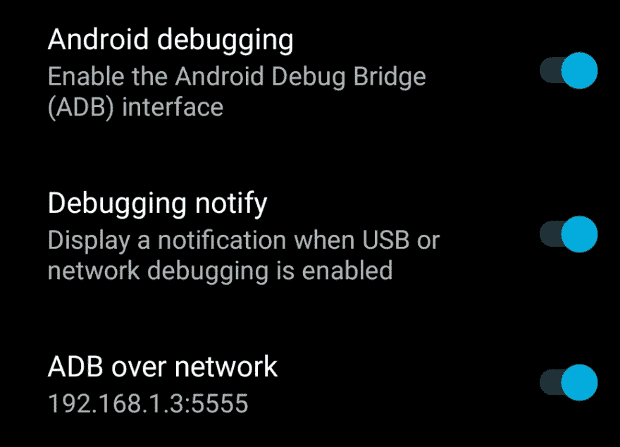
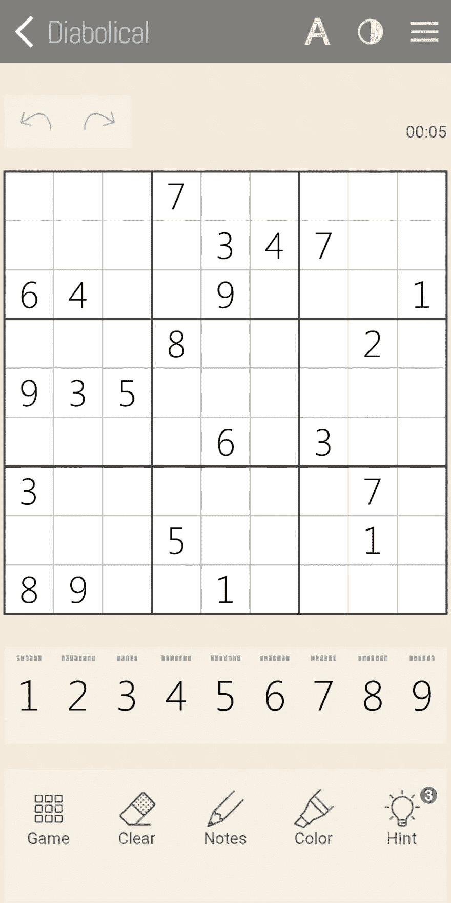
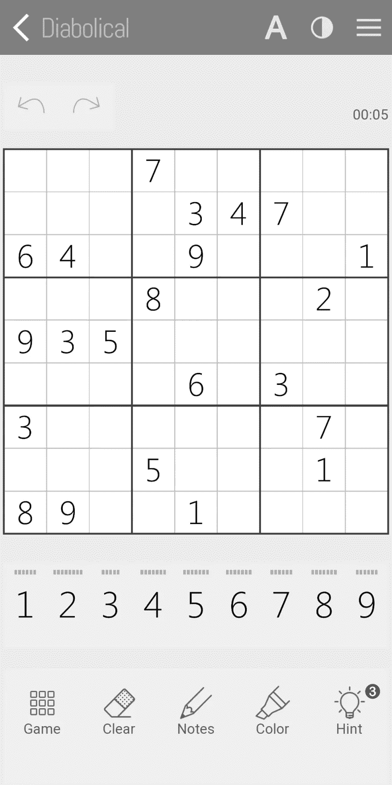
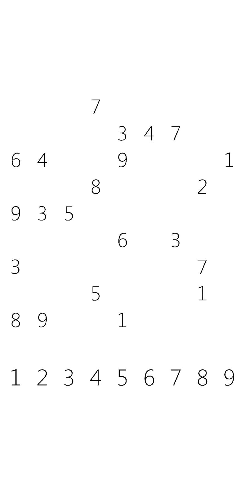

# 用 Python 和 Pytesseract 自动化 Android 游戏:数独

> 原文：<https://levelup.gitconnected.com/automating-android-games-with-python-pytesseract-sudoku-c25b811d5e8a>


# 介绍

我做了一个 Python 脚本来自动化 Android 上的数独游戏，之前我在 Youtube 上看了 [Engineer Man 的视频](https://www.youtube.com/channel/UCrUL8K81R4VBzm-KOYwrcxQ)对不同的游戏做了同样的事情。

该脚本可以分为 5 个部分

1.  使用 ADB 连接到 Android 设备，并从中获取游戏截图
2.  使用[抱枕](https://pypi.org/project/Pillow/)为[宇宙魔方](https://pypi.org/project/pytesseract/)处理截图
3.  使用[pytesserac](https://pypi.org/project/pytesseract/)将数独游戏网格提取到 Python 中的 2D 列表中。
4.  解决数独游戏
5.  使用 Python 将求解的输入发送到您的 Android 设备

在这 5 个主题中，我将主要关注第 2、3 和 5 个，因为第 1 和第 4 个主题已经被广泛涉及。

链接到我自动化的游戏:[https://play.google.com/store/apps/details?id=com.quarzo.sudoku](https://play.google.com/store/apps/details?id=com.quarzo.sudoku)

完整的代码可从以下存储库中获得:

[Github:haideralipunjabi/sudoku _ automate](https://github.com/haideralipunjabi/sudoku_automate)

您还可以观看脚本的运行:

# 使用的库

*   [枕头](https://pypi.org/project/Pillow/)
*   [纯 python-adb](https://pypi.org/project/pure-python-adb/)
*   [宇宙魔方](https://pypi.org/project/pytesseract/)
*   [进度](https://pypi.org/project/progress/)

# 辅导的

## 第 1 (a)条。使用 ADB 连接到您的设备

互联网上的大多数教程使用有线 ADB，这阻碍了许多人使用这种方法。我将使用无线 ADB，这不是很难设置。



1.  转到您的手机设置>系统>开发者选项(这可能会因手机不同而有所差异，因此如果在您的中有所不同，请在互联网上查找)
2.  通过网络打开 Android 调试和 ADB。
3.  请注意 ADB over Network 下显示的 IP 地址和端口
4.  在你的电脑上安装亚洲开发银行
5.  进入命令行/命令提示符，输入
    adb connect < ip 地址> : < port >
    使用第 3 步中的 ip 地址和端口
6.  首次连接时，您需要在手机上授权连接。
7.  您的设备应通过 WiFi 连接到您的电脑。

## 第 1 款(b)项。使用 ADB 和 Python ( [pure-python-adb](https://pypi.org/project/pure-python-adb/) )

您可以使用 Python 定义以下函数来连接到与您的计算机相连的第一台 ADB 设备

```
from ppadb.client import Clientdef connect_device():
    adb = Client(host='127.0.0.1',port=5037)
    devices = adb.devices() if len(devices) == 0:
        print("No Devices Attached")
        quit()
    return devices[0]
```

我们稍后将使用该函数返回一个`ppadb.device.Device`实例，该实例将用于截图，并将输入发送到您的设备。

## 1 c .截图并保存

[pure-python-adb](https://pypi.org/project/pure-python-adb/) 让捕捉你的设备截图变得非常容易。`screencap`函数就是你获取截图所需要的全部。使用 Pythons 文件 IO 保存到`screen.png`

```
def take_screenshot(device):
    image = device.screencap()
    with open('screen.png', 'wb') as f:
        f.write(image)
```



## 2.用[枕头](https://pypi.org/project/Pillow/)处理截图

在抓取的截图中，任何 OCR 的准确率都会很低。为了提高准确性，我使用了 [Pillow](https://pypi.org/project/Pillow/) 来处理截图，以便它只在白色背景上以黑色显示数字。

为此，我们首先使用`image.convert('L')`将图像转换为灰度(或单通道)。这将使颜色转换为灰色阴影(0-255)。



在此之后，我们需要黑色的数字(最暗的，或非常接近黑色的)，其余的是白色的。为此，我们使用`image.point()`使所有的灰色> 50 变成白色(255)，其余的(数字)变成 0。为了安全起见，我还增加了一点对比度和清晰度。



```
def process_image(image):
    image = image.convert('L')
    image = image.point(lambda x: 255 if x > 50 else 0, mode='L')
    image = ImageEnhance.Contrast(image).enhance(10)
    image = ImageEnhance.Sharpness(image).enhance(2)
    return image
```

## 3.使用 [pytesseract](https://pypi.org/project/pytesseract/) 从图像中提取数字

在整个图像上使用 [pytesseract](https://pypi.org/project/pytesseract/) 可能会给我们数字，但它不会告诉我们数字出现在哪个盒子里。因此，我使用[枕头](https://pypi.org/project/Pillow/)来裁剪每个框，然后在裁剪后的图像上使用[立方体](https://pypi.org/project/pytesseract/)。在使用[pytesserac](https://pypi.org/project/pytesseract/)之前，我定义了一些函数来给我每个盒子的坐标，并给我每个盒子的裁剪图像。

因为数独有一个 9x9 的网格，所以我使用两个从 0 到 8 的 for 循环来遍历每个盒子。默认配置下的 [pytesseract](https://pypi.org/project/pytesseract/) 不够精确，我不得不通过配置`--psm 10 --oem 0`。

*   `--psm`参数定义了页面分段方法。`10`代表`Treat the image as a single character`。这似乎是最合适的，因为我传递的是每个盒子的裁剪图像。
*   `--oem`参数定义了 OCR 引擎模式。`0`代表`Legacy Engine Only`。

下面的函数将从传递的`image`中提取数字，并返回一个包含数字的 9x9 2D 列表。

```
def get_grid_from_image(image):
    grid = []
    bar = Bar("Processing: ", max=81)
    for i in range(9):
        row = []
        for j in range(9):
            digit = pytesseract.image_to_string(
                get_box(image, i, j), config='--psm 10 --oem 0')
            if digit.isdigit():     # If pytesseract returned a digit
                row.append(int(digit))
            else:
                row.append(0)
            bar.next()
        grid.append(row)
    return grid
```

## 4.解决数独游戏

现在我们有了 9x9 数独，我们需要解决它。解数独是一个已经涉及很多的话题，我也是从[geeksforgeeks.org](https://www.geeksforgeeks.org/)那里复制了这段代码。

[这是 geekforgeeks 关于数独的文章](https://www.geeksforgeeks.org/sudoku-backtracking-7/)

## 5.使用 Python 将求解的输入发送到您的 Android 设备

为了发送输入，我首先从解出的数独网格中过滤出输入，也就是说，只发送丢失的值。我使用前面的`get_coords`函数得到每个盒子的坐标，然后计算它们的中心。我使用亚洲开发银行在该中心发送了一个联系人，然后发送了解决方案。

```
def automate_game(org_grid, solved_grid):
    for i in range(9):
        for j in range(9):
            if org_grid[i][j] == 0:     # If the box was blank in the game
                x1, y1, x2, y2 = get_coords(i, j)
                center = (x1 + (x2 - x1)/2, y1 + (y2-y1)/2)     # Calculating the center of the box (to select it)
                solution = solved_grid[i][j]
                device.shell(
                    f'input touchscreen swipe {center[0]} {center[1]} {center[0]} {center[1]} 5')
                device.shell(f'input text {solution}')
```

## 运行代码

我写的所有代码都在函数中，它们被一个一个地调用。注意，我在步骤 3 中得到的网格没有直接传递到步骤 4。我使用`deepcopy`来创建它的一个副本，这样我就可以将已求解的网格与步骤 5 中未求解的/原始的网格进行比较。

```
if __name__ == "__main__":
    # Connect the device using ADB
    device = adb.connect_device()
    # Take Screenshot of the screen and save it in screen.png
    adb.take_screenshot(device)
    image = Image.open('screen.png')
    image = process_image(image)        # Process the image for OCR
    org_grid = get_grid_from_image(image)      # Convert the Image to 2D list using OCR / Pytesseract
    solved_grid = deepcopy(org_grid)        # Deepcopy is used to prevent the function from modifying the original sudoku game
    solve_sudoku(solved_grid)
    automate_game(org_grid, solved_grid)        # Input the solved game into your device
```

# 参考

*   [工程师男的 Youtube](https://www.youtube.com/channel/UCrUL8K81R4VBzm-KOYwrcxQ)
*   [Tesseract OCR 最佳实践—ai-facets.org](https://ai-facets.org/tesseract-ocr-best-practices/)
*   [亚行—通过无线网络连接](https://developer.android.com/studio/command-line/adb#wireless)