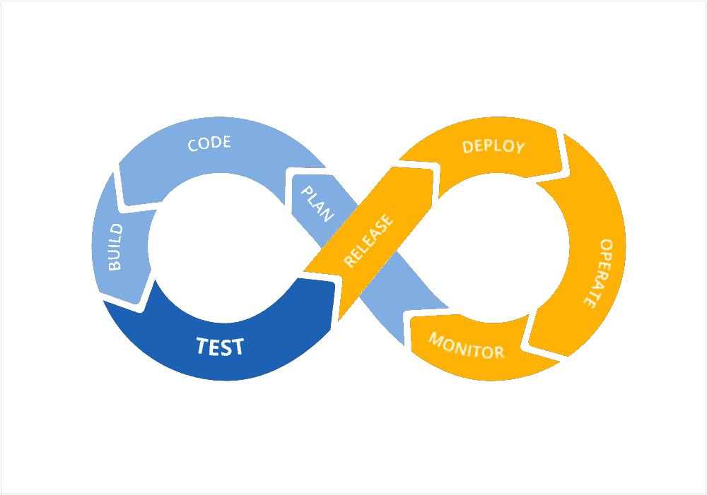
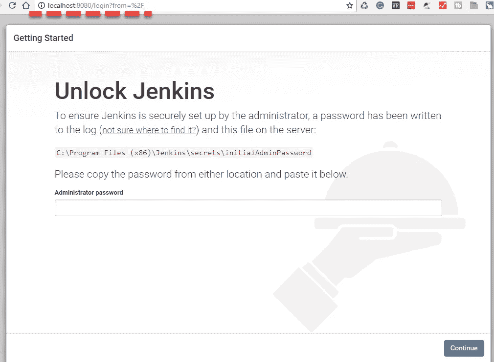
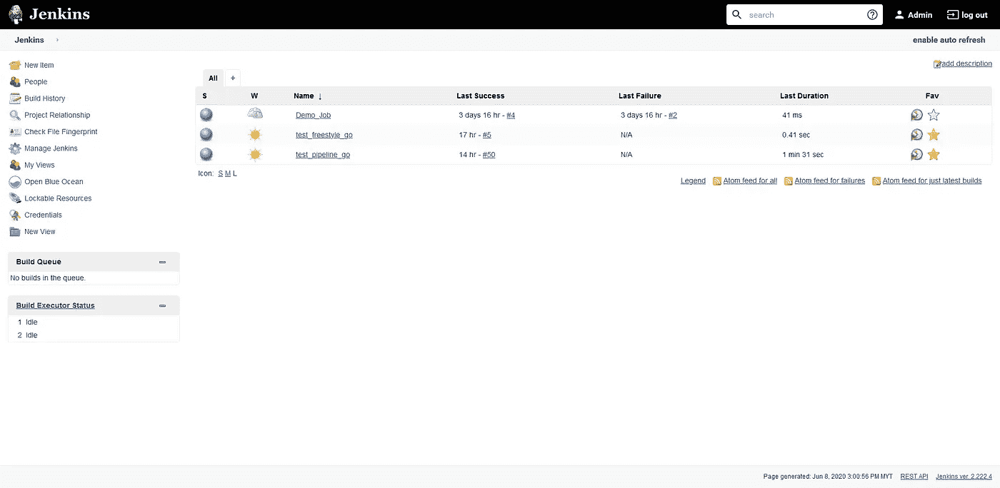
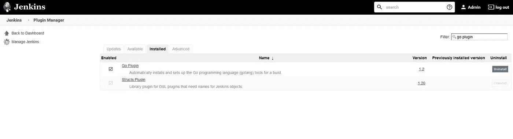
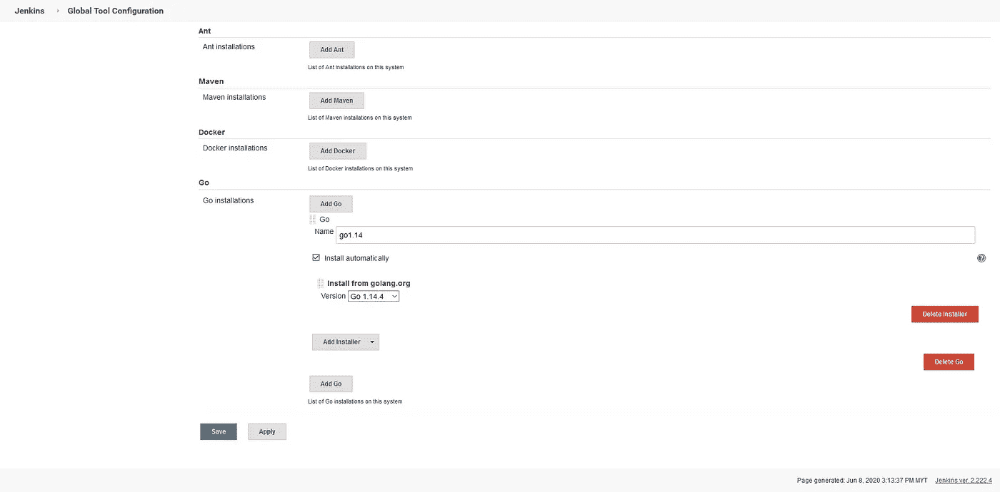
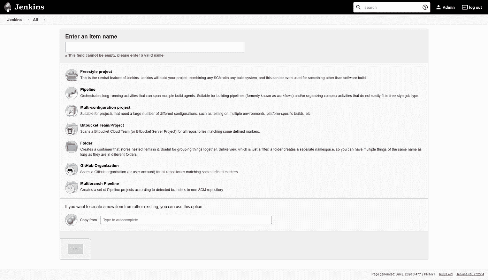
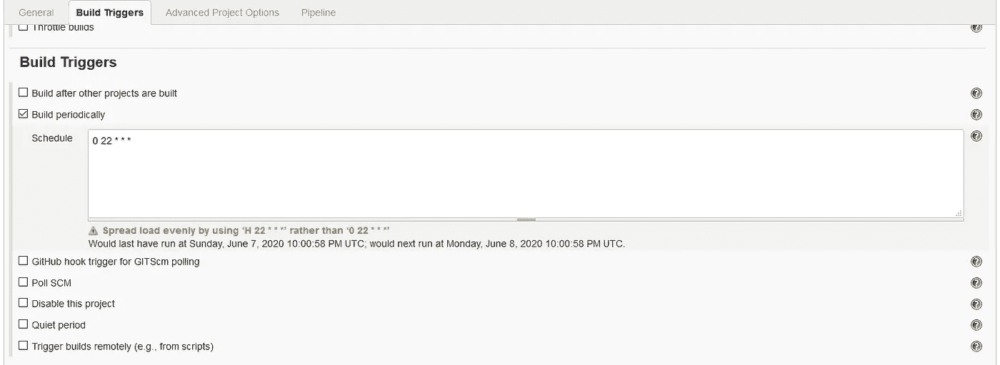
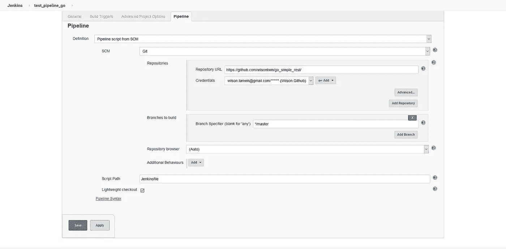
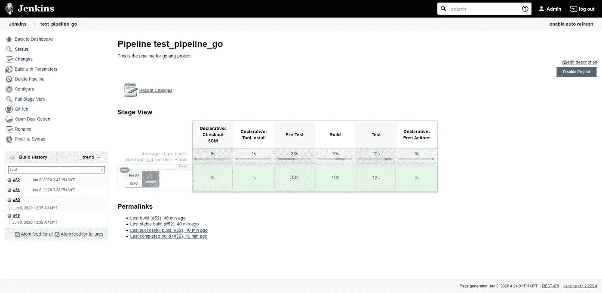

# 使用 Jenkins 自动构建和测试 Go 应用

> 原文：<https://levelup.gitconnected.com/automating-build-and-test-of-go-application-with-jenkins-9f96879b5479>

您是否经历过这样的情况:您的开发团队部署了一段代码，却在系统的另一部分出现了错误？通常情况下，我们都曾遇到过这个问题。

那么如何减少这种情况的发生呢？每当发布一段新代码时，您的组织中是否有许多测试人员反复测试每一个功能？

当我们努力快速交付高质量的软件时，有必要对持续集成和持续交付(CI/CD)工具进行适当的需求。

持续集成和持续交付(CI/CD)工作流

# **什么是 CI/CD？**

CI/CD 管道帮助您自动化软件交付过程，从初始化代码构建、运行自动化测试到部署到试运行或生产环境。

典型的 CI/CD 工作流如下所示:

1.  一名工程师对应用程序代码进行了一些更改。
2.  当代码准备好时，它被推送到 Git 存储库，并创建一个 pull 请求供高级审查。
3.  CI 自动触发构建和测试，以确保它不会破坏系统。
4.  一旦构建和测试通过，高级人员就开始审查代码并进行合并。
5.  然后工件被发布并部署到试运行或生产环境中。
6.  从站点收集信息以向团队提供反馈，从而了解最新构建版本的状态和影响。
7.  任何新的特性或 bug 都会反馈给团队，并添加到 backlog 中。

# **有哪些可用的 CI/CD 工具？**

随着 CI/CD 工作流需求的增加，出现了许多可用的工具，例如:

1.  詹金斯—【https://www.jenkins.io/ 
2.  特拉维斯·CI—[https://travis-ci.org/](https://travis-ci.org/)
3.  切尔莱西—[https://circleci.com/](https://circleci.com/)
4.  团队城市—[https://www.jetbrains.com/teamcity/](https://www.jetbrains.com/teamcity/)
5.  git lab—[https://about.gitlab.com/](https://about.gitlab.com/)

还有很多很多…

今天，我们来看看如何使用 Jenkins 自动构建和测试 Go 应用程序。

Jenkins 是一个开源的基于 Java 的自动化工具，支持构建、部署和自动化任何软件开发项目。它很容易安装并且有很多插件(感谢活跃的社区！)可以在自动化过程中使用。

# 安装 Jenkins

Jenkins 可以安装在各种平台上，无论是在您的本地机器上、云中还是 Docker 平台上。如果选择直接在机器上安装 Jenkins，那么必须先安装 Java。

在这个例子中，我们将看看如何在 Docker 平台上安装 Jenkins，当然，前提是要安装 Docker。

1.  通过运行`docker pull jenkins/jenkins:lts`提取 Docker 图像
2.  通过运行`docker run -p 8080:8080 -p 50000:50000 -v jenkins_home:/var/jenkins_home jenkins/jenkins:lts`使用 Docker 映像创建一个容器
3.  通过访问 localhost:8080，验证 Jenkins 已经启动并正在运行
4.  然后你会看到一个页面(如下所示)要求输入管理员密码，你可以在 docker 日志中找到

5.安装建议的插件。

6.创建第一个管理员用户。

7.然后，您将看到 Jenkins 仪表盘。

詹金斯仪表板

# 设置 Jenkins 职务

一旦 Jenkins 启动并运行，我们就可以设置一个作业来自动运行我们的 Go 应用程序的构建和测试(在本例中，它托管在一个私有的 GitHub 存储库中)。

首先，我们必须安装 Go 插件，它为构建设置了 Golang 工具。要做到这一点，点击左侧菜单上的管理詹金斯，然后管理插件，然后在可用选项卡下搜索“Go 插件”(我已经安装了我的插件，所以它会出现在已安装的选项卡)。

Jenkins 上的 Go 插件

然后，我们必须添加我们对全局工具配置感兴趣的 Go 版本(对 Manage Jenkins 也是如此)。给它起一个名字，以后在设置 Jenkins job 时需要参考这个名字。

将 Go 添加为全局工具

设置完成后，我们可以开始创建 Jenkins 作业，在本例中，我们将看到 pipeline。可以通过单击左侧菜单上的新项目，然后选择“管道”来触发。

然后我们可以开始创建我们的管道。在“构建触发器”选项卡中，有各种选项。您可以在 GitHub 存储库上创建一个 webhook，每当有 pull 请求时，它就会触发 Jenkins 上的构建，或者您可以基于 Jenkins 上的另一个构建结果来触发构建。我们还可以使用 cron 表达式来调度它的运行。

管道的生成触发器

接下来是管道脚本，我们在其中定义了每个阶段要执行的步骤。Jenkins 有两种方法来检索管道脚本，要么从配置本身，要么从存储库中提取。

詹金斯管道公司

在上面的截图中，我们将使用我们的存储库中定义的 Jenkinsfile。让我们深入管道脚本。

用于构建和测试 Go 应用程序的 Jenkinsfile

Jenkinsfile 的解释:

1.  一开始，我们将把`agent`定义为任何。这意味着 Jenkins 将分配任何可用的执行者，不管它是如何被标记或配置的。
2.  在工具中，我们将指定构建工具，在这种情况下，我们将使用之前在全局工具配置中定义的“go1.14”。
3.  然后，我们将设置环境变量，就像我们在本地机器上运行 Go 应用程序时那样。
4.  然后，我们将定义我们的阶段:安装所有依赖项的预测试，编译和构建 Go 应用程序的构建，运行单元测试的测试等等。你也可以添加其他阶段。
5.  最后但并非最不重要的是 post 部分，它可以在各种条件下运行，如始终运行、不稳定运行、成功运行、失败运行以及在执行完所有阶段后进行更改。在本例中，无论构建状态如何，我们都将触发电子邮件通知。

# 运行 Jenkins 作业

一旦设置好作业，我们可以通过 Build / Build with Parameters 按钮手动执行 run now，或者通过调度运行或触发 GitHub 库中的 webhook 自动执行。

詹金斯管道概述示例

上面显示了 Jenkins 管道概览的示例。一目了然，我们可以看到过去的构建历史以及失败的阶段。我们还可以更深入地研究特定阶段的日志，看看有什么问题。

使用 Jenkins 可以实现更多功能(感谢各种插件)，例如，在成功构建和测试后部署到登台环境，或者通过 Slack 通知团队，或者将构建状态发送回 GitHub，以表明 PR 可以安全合并。

我们将再次回来获取更多的提示和技巧！下次再见，干杯！