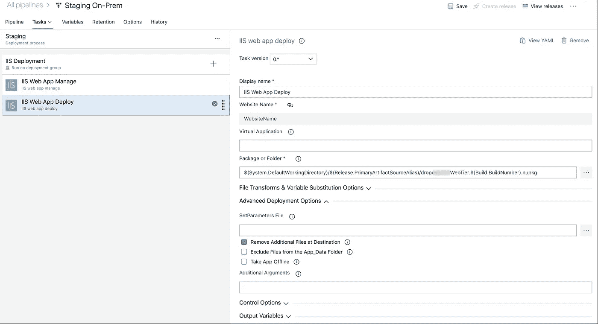

# 使用 Azure DevOps 自动部署到本地服务器

> 原文：<https://levelup.gitconnected.com/automating-deployments-to-on-premis-servers-with-azure-devops-bb0e6cac4656>

作为一个大部分职业生涯(非常短暂)都在从事一键式云资源部署的人，当我跳到一个遗留项目并意识到从部署流程到试运行和生产的复杂性时，我感到震惊。使用传统的。NET 框架应用程序堆栈，部署过程由以下步骤组成:

1.  将 Visual Studio 中的配置目标设置为`release`
2.  构建项目
3.  复制。使用 USB 连接到配置为 VPN 访问的客户端笔记本电脑
4.  复制。dll 通过 RDP 到目标服务器
5.  进入 IIS 管理器，将文件路径指向应用程序的新版本

正如您所看到的并且可能已经经历过的，这是一个漫长、缓慢并且容易出错的过程，如果其中一个步骤可能无法正常工作，那么这个过程通常会持续一个多小时。对我来说，不得不使用客户端笔记本电脑也是一个真正的痛点，因为它有 3 个不同的密码进入，其中没有一个是我设置的，也没有一个是我能记住的。这也意味着，如果我们需要进行部署，我必须在办公室使用笔记本电脑——那天不能在家工作。

我的第一步是**自动化构建过程**。如果我们可以让 Azure Pipelines 至少构建这个项目，我可以下载文件并手动复制它们。网上有很多关于如何设置的指南，但最终结果意味着它给了我一个项目所需的所有文件的. zip 文件。这也消除了一个常见的错误热点，它是在我的机器上本地构建的。这也意味着不管是谁写的代码，构建过程总是相同的。

第二步是**建立一个释放管道**。在 Azure Pipelines 中，我们想要做的是[创建一个部署组](https://docs.microsoft.com/en-us/azure/devops/pipelines/release/deployment-groups/index?view=azure-devops)，然后将我们想要部署的服务器注册为该部署组中的一个目标。这将允许我们直接部署到本地服务器。那么，我们该怎么做呢？

**要求:**

*   PowerShell 3.0 或更高版本。在我们的 Windows Server 2003 机器上，我们需要从 PowerShell 2.0 升级。这是一个简单的下载，安装和重启。
*   。NET Framework x64 4.5 或更高版本

**步骤:**

1.  导航到 Azure DevOps 中管道下的部署组:

Azure DevOps >管道中的部署组菜单项

2.创建新的部署组。这个想法是，您可以让几个服务器在同一个组中，同时将代码部署到所有这些服务器上(例如出于负载平衡的原因)。在我的例子中，我的部署组中只有一个目标，所以组的概念有点多余。

3.打开您刚刚创建的群，然后单击右上角的“注册”。这是我们实际将服务器添加到组中的步骤。

注册一个目标窗口

4.我们想要勾选`Use a personal access token in the script for authentication`框，将这个脚本复制到我们的服务器，并在 PowerShell 中以管理员身份运行它。

5.**如果脚本要求您输入认证类型，您将需要获得一个 PAT 令牌**。这可以在你的个人资料下找到(点击右上角的图片)，然后是安全部分。

个人访问令牌设置

如果还没有为您创建的令牌(名称中应该有“部署组”)，请创建一个新令牌。如果您需要创建一个新的令牌，它需要启用`Deployment Groups`范围:

部署组范围

如果您正在创建新的令牌，它将为您提供令牌字符串，您可以将该字符串复制到剪贴板中。如果已经有一个令牌，请单击“重新生成”并复制它提供给您的令牌字符串。

回到 PowerShell，按 enter 使用 PAT 令牌身份验证，然后粘贴这个字符串。

将 PAT 令牌粘贴到 PowerShell 窗口中

6.这应该会运行一遍，并询问您是否要输入该特定代理应该具有的任何标记。标签是一种标记服务器功能的方式，例如，如果您有多个 web 服务器，或者可能有一个单独的数据库服务器。在我的例子中，服务器既是网络又是数据库，所以我将其标记为`web`和`db`。

7.该脚本将询问您希望哪个用户运行该服务。我很喜欢这个默认值，所以我只按了 enter 键，但是您可能希望将它的范围限定为 IIS 应用程序池。

8.就是这样！这将在`C:\azagent`创建一个新文件夹，当你推出一个新的部署时，它将保存临时文件。

如果您刷新注册代理的网页并刷新，您应该会看到您的服务器。

部署组中的注册代理

现在，如果您[创建一个新的发布管道](https://docs.microsoft.com/en-us/azure/devops/pipelines/release/?view=azure-devops)，您将能够选择您新创建的部署组。我仍然使用经典的发布管道，但是如果你创建一个`yaml`发布管道，步骤将会非常相似。让我们来看一下创建发布管道的步骤。

1.  转到管道>发布，并创建一个新的发布管道
2.  选择适当的模板。在我的例子中，我现在不担心数据库升级，所以我只选择底部的选项，即网站部署:

3.为您的舞台命名:

4.通过单击“添加项目”链接构建项目，然后选择要从中获取的构建管道。

在 add an artifact 屏幕中，选择您想要从哪个构建管道中获取工件

5.链接工件后，打开 stage 并在 stage settings 页面中设置网站名称、绑定和应用程序池名称的参数。这些设置与您在 IIS 管理器中配置的设置完全相同。

在阶段设置中设置网站名称和应用程序池名称

6.在 IIS 部署步骤中，将部署组设置为我们在上一节中创建的组。在本例中，我将其设置为部署到“本地”部署组。

在 IIS 部署作业设置中设置部署组

7.在“IIS Web App 管理”任务中，将物理路径设置为您希望文件在服务器上实际存储的位置。

在此 Web 应用程序管理任务中，设置您希望在服务器上存储应用程序文件的物理路径

您还可以在这里设置任何附加参数。在我的例子中，我需要从这些高级设置中启用 32 位应用程序在应用程序池中运行，所以我将它作为命令行参数传递。

IIS 应用程序池设置中添加的命令行参数

出于好奇，命令是:

8.最后，将包或文件夹设置配置为指向您希望从构建中部署的文件所在的位置:

为了从工件中获取文件，不管它的别名是什么，我在路径中放了一些 Azure Pipelines 环境变量。

我修改的另一个设置是启用 XML 变量替换，因此我可以将数据库连接字符串作为变量放入发布管道，并让 Azrue 管道管理替换。

本质上就是这样。现在，您可以从您的构建中创建一个发布，然后可以将它部署到您的本地 web 服务器上。如果您正确设置了触发器，那么您可以在`git push`将代码自动构建、发布并部署到您的本地服务器上。这就是未来！

我要部署的 web 服务器运行在 Windows Server 2008 上，我已经能够使用 Azure Devops 对它进行现代化，这个概念在这个应用程序创建时还是一个白日梦。

如果你有任何问题或者我错过了任何关键细节，请在评论中留下，我会尽快回复你。否则，如果这篇文章是有帮助的，给一些掌声。