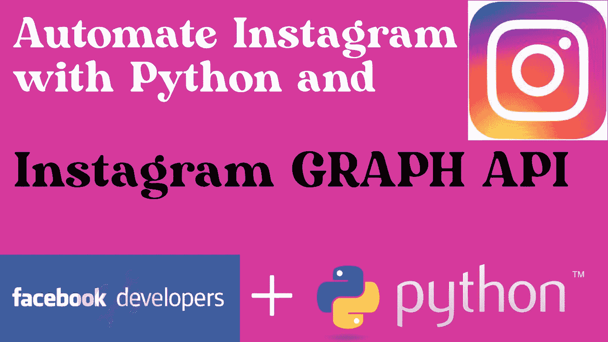
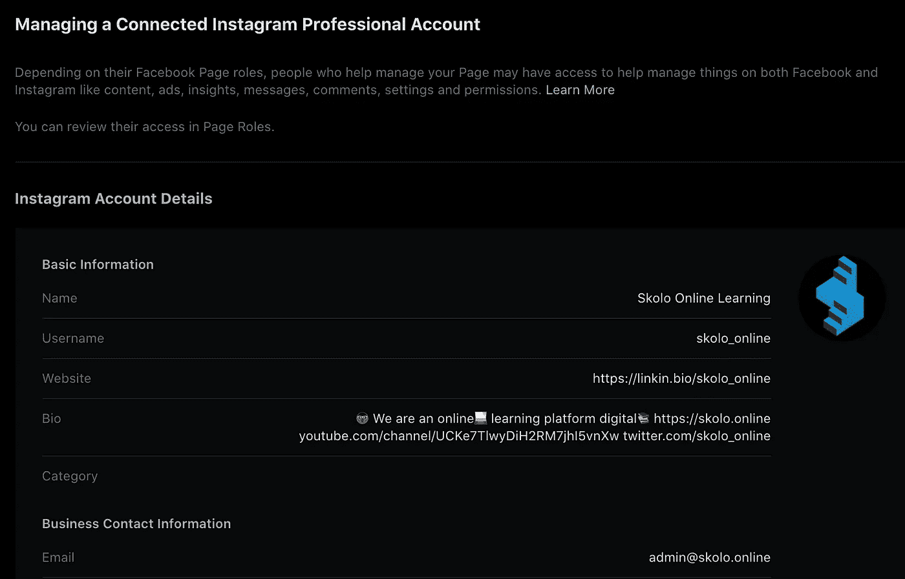

# 使用 Python 和 Instagram Graph API 自动发布 Instagram 帖子

> 原文：<https://levelup.gitconnected.com/automating-instagram-posts-with-python-and-instagram-graph-api-374f084b9f2b>

现在，你可以通过编程来安排你的 instagram 帖子，而不需要依赖 Hootsuite 等限制和昂贵的应用程序。使用 Instagram Graph API，您可以创建自己的代码来发布到 instagram，每天最多可发布 25 篇帖子。



*   将您的 facebook 页面连接到您的 instagram 帐户
*   创建 facebook 开发人员帐户，并为 Instagram API 生成访问令牌
*   为您的 instagram 页面获取 instagram graph API 用户 ID
*   将图片发布到您的 instagram 页面
*   用于发布图像的 Python 代码

在我们开始之前，需要注意的是，您只能为 instagram 商业帐户安排帖子，而不是个人帐户。影响者账户被接受为商业账户，您需要通过 instagram 应用程序进行设置。

进入你的个人资料>点击右上角的汉堡菜单>点击右下角的设置>然后选择账户>滚动到底部，你会看到一个切换到商业/专业账户的选项。通过这些步骤，你就设置好了。

# 将您的 facebook 页面连接到 instagram 帐户

登录你的 facebook 页面，进入设置> instagram。您应该会看到类似下面的内容:



如果你没有看到这个，会有一个按钮让你把 facebook 页面连接到 instagram 账户。在你点击按钮之前，如果你已经在另一个窗口登录了 instagram，这会有所帮助——浏览器有一个 cookie。您将能够连接该帐户，重新输入您的密码，你就完成了。

# 为 instagram graph API 生成访问令牌

这类似于我们在教程中所做的:[https://medium . com/nerd-for-tech/automate-Facebook-posts-with-python-and-Facebook-graph-API-858 a03d 2b 142](https://medium.com/nerd-for-tech/automate-facebook-posts-with-python-and-facebook-graph-api-858a03d2b142)

Instagram graph API 访问密钥可以在与 facebook graph API 密钥相同的位置找到，事实上，您可以使用为发布到 facebook 而创建的同一应用程序来生成令牌——您只需调整访问权限。以下是您需要添加的访问权限:

访问:【https://developers.facebook.com/tools/explorer/ 向您的应用添加权限。如果您有多个应用程序，请确保从下拉列表中选择正确的应用程序。

添加 instagram 权限后，您现在将拥有以下所有权限:

```
pages_show_listinstagram_basicinstagram_manage_commentsinstagram_manage_insightsinstagram_content_publishpages_read_engagementpages_manage_postspublic_profile
```

添加这些权限后，点击生成访问令牌，您将完成 facebook 页面和 instagram 页面的首次登录过程。

请注意，您从 Graph API explorer 获得的访问令牌是一个短期令牌，仅在一小时内有效，您需要将此令牌与有效期为 60 天的长期令牌进行交换。instagram 操作需要用户访问令牌。

运行下面的命令:

```
curl -i -X GET "https://graph.facebook.com/{graph-api-version}/oauth/access_token?  
    grant_type=fb_exchange_token&          
    client_id={app-id}&
    client_secret={app-secret}&
    fb_exchange_token={your-access-token}"
```

您将需要您的:(1)应用 ID，(2)应用密码和(3)此请求的短期访问令牌。如果成功，您将收到一个长期生活令牌作为回应。

# 获取 instagram 商业页面用户 ID

所有对 instagram graph API 的请求都需要一个页面用户 ID，您可以使用上面的用户访问令牌和 facebook 页面 ID 轻松获得它。facebook 页面 ID 可以在本教程开始时连接到 instagram 帐户的 facebook 页面的“关于”部分找到。

```
curl -i -X GET \
 "https://graph.facebook.com/v10.0/{facebook_page_id}?fields=instagram_business_account&access_token={access-token}"
```

就是这样，你现在可以使用 API 直接将帖子发送到 instagram。

# 使用 Instagram Graph API 将帖子发布到您的 instagram 页面

帖子分两步发送到 instagram:(1)创建一个包含图片的容器，instagram 返回一个创建 id，(2)发布创建 id，将帖子发送到 insta gram。

***注意:所有请求都需要您的用户访问令牌(最好是长期令牌)。***

```
curl -i -X POST https://graph.facebook.com/v10.0/{ig_user_id}/media?image_url={public_http_path_to_image}&caption={url_encoded_caption}&access_token={user_access_token}
```

这个请求需要的是:

*   IG 上面部分的用户 ID
*   你要发布的图片的路径(理想的是 IG 的方形图片，并且该路径必须是公共可访问的，如 http 或 https 服务器)
*   URL 编码标题
*   用户访问令牌

然后使用您将收到的创建 id 发送帖子:

```
POST https://graph.facebook.com/v10.0/{ig_user_id}/media_publish?creation_id={creation_id}&access_token={user_access_token}
```

# 使用 Python 代码发布到 instagram

有趣的是，仅仅张贴一张图片就要花费太多的精力去完成所有这些步骤。python 的强大之处在于能够预先安排帖子，甚至可以使用 html 动态创建帖子，这种可能性是无限的:

```
import requests
import config
import jsondef postInstagramQuote():#Post the Image
    image_location_1 = 'http:path-to-your-image.com/img/image-name.jpg'
    post_url = '[https://graph.facebook.com/v10.0/{}/media'.format(config.ig_user_id)](https://graph.facebook.com/v10.0/{}/media'.format(config.ig_user_id))payload = {
    'image_url': image_location_1,
    'caption': 'Get jobs online on [https://careers-portal.co.za](https://careers-portal.co.za) #career #hiring #jobs #job #jobssouthafrica #hiringnow,
    'access_token': config.user_access_token
    }
    r = requests.post(post_url, data=payload)
    print(r.text)result = json.loads(r.text)
    if 'id' in result:
        creation_id = result['id']second_url = '[https://graph.facebook.com/v10.0/{}/media_publish'.format(config.ig_user_id)](https://graph.facebook.com/v10.0/{}/media_publish'.format(config.ig_user_id))
        second_payload = {
        'creation_id': creation_id,
        'access_token': config.user_access_token
        }
        r = requests.post(second_url, data=second_payload)
        print('--------Just posted to instagram--------')
        print(r.text)
    else:
        print('HOUSTON we have a problem')postInstagramQuote()
```

随后，您可以使用 python 调度库来定期调度这些帖子。

要了解更多信息，请观看我们的 youtube 教程，我们将进一步使用 python 和 imgkit 从 HTML 创建实际的图像，这样您就可以使用代码每天为 instagram 创建新鲜的内容。

## 使用 Instagram Graph API 和 Python 的 Youtube Instagram 自动化教程