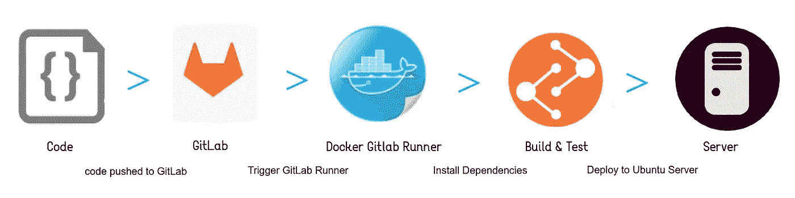
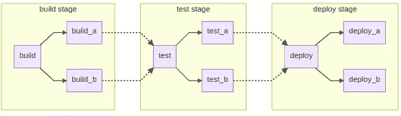
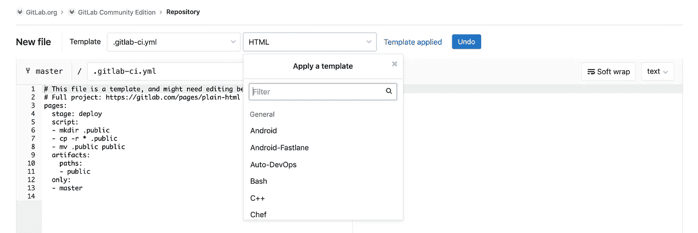
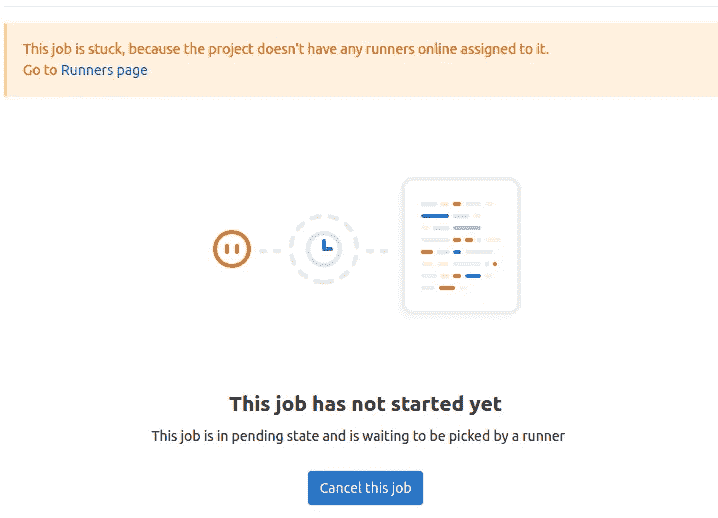
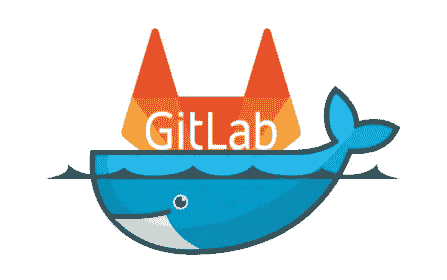
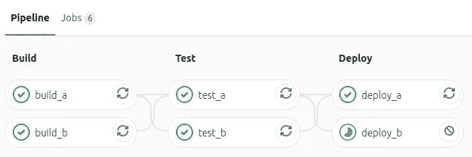
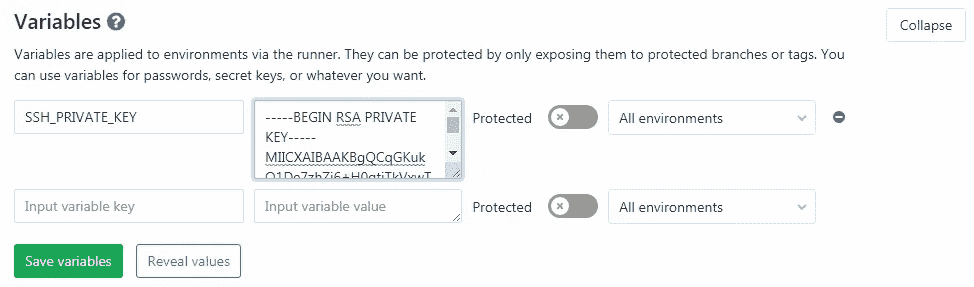
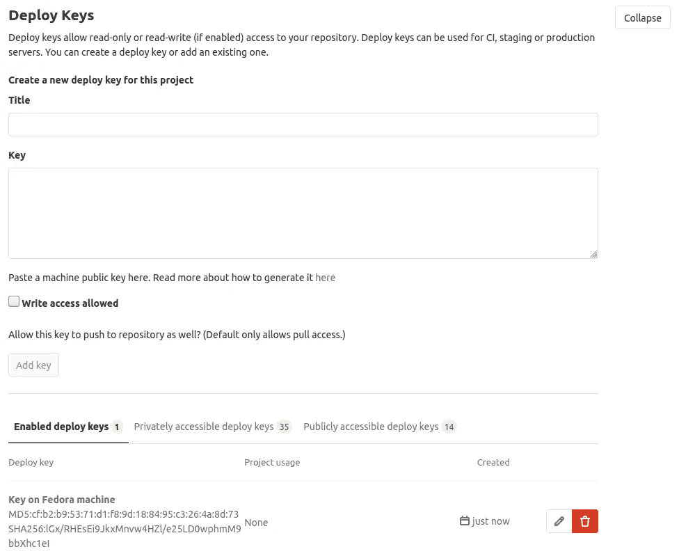
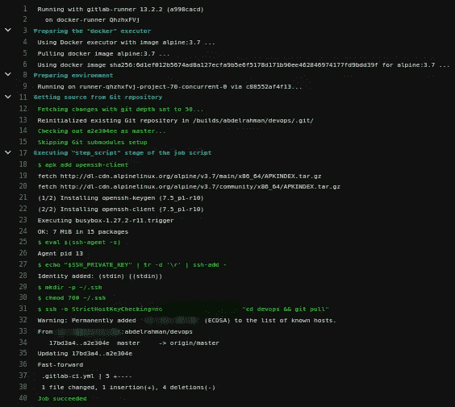

# 自动化集成和部署到远程服务器

> 原文：<https://levelup.gitconnected.com/automating-integration-and-deployment-to-remote-server-63a2b6576ebf>

## GitLab CI/CD



> P 先决条件:
> - [什么是版本控制？](https://www.reddit.com/r/explainlikeimfive/comments/1701qi/eli5_what_a_version_control_system_is/)
> -[Docker 是什么？](https://www.redhat.com/en/topics/containers/what-is-docker)
> - [什么是 CI/CD？](https://www.redhat.com/en/topics/devops/what-is-ci-cd)

# 目标

我们的目标是通过一个示例应用程序友好地了解 GitLab CI/CD，帮助您入门，而不必阅读所有的 GitLab 文档。

# 概观

持续集成的工作方式是将小代码块(提交)推送到 Git 存储库中托管的应用程序的代码库，并且每次推送都运行一个脚本管道来构建、测试和验证代码更改，然后将它们合并到主分支中。

连续交付和部署由一个更进一步的 CI 组成，在每次推送至存储库的默认分支时，将您的应用程序部署到生产环境中。

这些方法使您能够在开发周期的早期发现 bug 和错误，确保部署到生产环境中的所有代码都符合您为应用程序建立的代码标准。

O 使用 Gitlab CI/CD 的主要好处之一是，您可以从使用大量第三方插件和工具创建工作流的繁琐过程中解脱出来。

> 如果您的代码库托管在版本控制系统而不是 GitLab 上，并且您想要使用 GitLab CI/CD，您可以阅读关于[存储库镜像](https://docs.gitlab.com/ee/user/project/repository/repository_mirroring.html)的内容。
> 
> 如果您是从詹金斯过来的，您也可以查看方便的[参考资料](https://git.digizilla.net/help/ci/jenkins/index.md)来转换您的管道。

# 入门指南

GitLab CI/CD 由一个名为 basic `.gitlab-ci.yml`的文件配置，该文件位于存储库的根目录下。该文件中设置的脚本由 [GitLab 运行程序](https://docs.gitlab.com/runner/)执行。

要将脚本添加到该文件中，您需要按照适合您的应用程序和您希望执行的测试的顺序来组织它们。为了可视化这个过程，假设您添加到配置文件中的所有脚本都与您在计算机终端上运行的命令相同。

这些脚本被分成**个作业**，它们共同组成了一个**管道。**

# 管道

我们可以随心所欲地构造管道，因为 YAML 是一种人类可读的序列化语言

假设修建 3 条管道:

*   ***项目管道*** 安装依赖项，运行 linters，以及任何处理代码的脚本。
*   ***持续集成管道*** 运行自动化测试并构建代码的分布式版本。
*   ***部署管道*** 将代码部署到指定的云提供商和环境。

管道执行的步骤被称为**作业**。当你根据这些特征对一系列工作进行分组时，这被称为**阶段**。作业是管道的基本构件。它们可以被分组为阶段，并且阶段可以被分组为流水线。

# 基本管道



与图表匹配的基本`/.gitlab-ci.yml`管道配置示例:

在这个层次结构中，所有三个组件都被视为三个不同的管道[{build_a，build_b}，{test_a，test_b}，{deploy_a，deploy_b}]。

主要的项目符号——构建、测试和部署是阶段，这些部分下的每个项目符号是一项工作

作业将根据**阶段**指令中列出的顺序执行。

您可以使用仅**的**指令将 deploy_a 部署到临时服务器，将 deploy_b 部署到生产服务器，这将在仅**的**指令下将提交推送到分支时触发作业

```
deploy-production:stage: deployscript:
     - ./deploy_prod.shonly:
     - master
```

> **注**:管道名称是自定义的。您可以将`deploy-production`重命名为对您有意义的名称。

您可以使用 CI Lint 编写并验证您的 YAML 文件，然后将其添加到存储库的根目录中( *GitLab 存储库 UI >左侧栏 CI/CD > Pipelines CL Lint 按钮*)

您也可以通过 UI 使用其中一个[模板](https://gitlab.com/gitlab-org/gitlab-foss/tree/master/lib/gitlab/ci/templates)开始。您可以通过创建新文件、选择适合您的应用程序的模板并根据您的需要进行调整来使用它们:



将您的文件保存到 repo 的根目录后，GitLab 会将其检测为 CI/CD 配置并开始执行

如果您转到左侧栏 *CI/CD > Pipelines* ，您会发现您的作业被卡住，如果您单击其中一个作业，您会看到以下问题:



# GitLab Runner

GitLab Runner 是一个开源项目，用于运行您的作业并将结果发送回 GitLab。它与 GitLab CI/CD 一起使用，后者是 GitLab 附带的一个开源持续集成服务，负责协调作业。

# 安装 GitLab 转轮



GitLab Runner 可以在 GNU/Linux、macOS、FreeBSD 和 Windows 上安装和使用。您可以使用 Docker 安装它，手动下载二进制文件，或者使用 GitLab 提供的 rpm/deb 包的存储库。在这篇博客中，我将把它作为 docker 服务安装

# 安装 Docker 映像并启动容器

开始之前，确保 [Docker 已安装](https://docs.docker.com/get-docker/)。

要在 Docker 容器中运行`gitlab-runner`,需要确保容器重启时配置不会丢失。要做到这一点，有两个选项，这里描述的是[和](https://docs.gitlab.com/runner/install/docker.html#option-1-use-local-system-volume-mounts-to-start-the-runner-container)。当安装过程中被要求提供图片时，我输入了 alpine:3.7，它很轻，足够了。

> **注意:**如果您使用的是`[*session_server*](https://docs.gitlab.com/runner/configuration/advanced-configuration.html)`，您还需要通过在您的`*docker run*`命令中添加`*-p 8093:8093*`来暴露端口`*8093*`。

# 登记赛跑者

最后一步是注册一个新的跑步者。GitLab Runner 容器在注册之前不会拾取任何作业。

完成注册后，生成的配置将被写入您选择的配置卷(如`/srv/gitlab-runner/config`)，并由跑步者使用该配置卷自动加载。

要使用 Docker 容器注册跑步者:

1.  运行注册命令:

*   对于本地系统卷装载:

```
docker run --rm -it -v /srv/gitlab-runner/config:/etc/gitlab-runner gitlab/gitlab-runner register
```

> 如果您在安装过程中使用了非`*/srv/gitlab-runner/config*`的配置卷，那么您应该使用正确的卷更新命令。

*   对于 Docker 卷装载:

```
docker run --rm -it -v gitlab-runner-config:/etc/gitlab-runner gitlab/gitlab-runner:latest register
```

2.运行注册命令:

```
Please enter the gitlab-ci coordinator URL (e.g. [https://gitlab.com)](https://gitlab.com)) 
https://gitlab.com
```

3.输入您获得的用于注册跑步者的令牌:

```
Please enter the gitlab-ci token for this runner
xxx
```

您可以从设置> CI/CD >跑步者>扩展>手动设置特定跑步者获取 URL 和令牌

现在是时候重启卡住的管道了，然后你会发现它被成功执行了。



# 部署

我将在这里提到通过 YAML 脚本使用 ssh 访问远程服务器

> 要轻松地为云提供商部署，您可以使用 [dpl](https://github.com/travis-ci/dpl)

## 添加 SSH 密钥

当您的 CI/CD 作业在 Docker 容器(意味着环境是包含的)中运行，并且您想要在私有服务器中部署您的代码时，您需要一种方法来访问它。这就是 SSH 密钥对派上用场的地方。

> 在跳转到 GitLab CI 之前，请确保您可以连接到服务器

您首先需要创建一个 SSH 密钥对。要了解更多信息，请遵循[生成 SSH 密钥](https://docs.gitlab.com/ee/ssh/README.html#generating-a-new-ssh-key-pair)的说明。**不要**向 SSH 密钥添加密码短语，否则`before_script`会在 YAML 文件中提示输入密码短语。

在这里，我生成 SSH RSA 密钥

```
ssh-keygen -t rsa -b 4096 -C "example" 
```

`-C`标志在键中添加了一个注释，以防您有多个这样的键，并想知道哪个是哪个。它是可选的。

之后，我们需要复制私钥，该私钥将用于连接到我们的服务器，以便能够自动化我们的部署过程:

```
# Copy the content of public key to authorized_keys
cat ~/.ssh/id_rsa.pub >> ~/.ssh/authorized_keys
```

使用以下命令显示并复制`id_rsa`的内容:

```
cd .ssh && cat id_rsa
```

*   进入 GitLab UI 侧边栏>设置> CI/CD >变量>展开
*   添加一个名为 SSH_PRIVATE_KEY 的变量，并在 Value 字段中粘贴刚刚从服务器复制的私钥(如果是 AWE EC2，它将是/的内容。pem 文件)



# 添加部署密钥

部署密钥允许对服务器上克隆的存储库进行只读或读写(如果启用)访问。

*   进入 GitLab UI 侧边栏>设置>存储库>部署密钥>展开
*   创建标题并在**键**字段粘贴`id_rsa.pub`中已有的内容

```
cd .ssh && cat id_rsa.pub
```



是时候写 YAML 文件了:

默认情况下，alpine 没有 SSH 客户端。这就是为什么我使用 alpine 包管理器来添加 SSH 客户端。如果在运行者注册或 YAML 配置中不使用 alpine，您必须根据您的 Linux 系统来更改命令。



> 希望这次旅行对你有好处。
> 
> 尽管互联网上有令人难以置信的资源，所以一定要在评论中分享你离不开的东西。