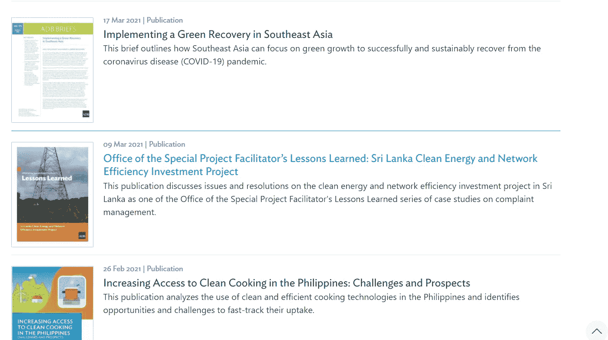
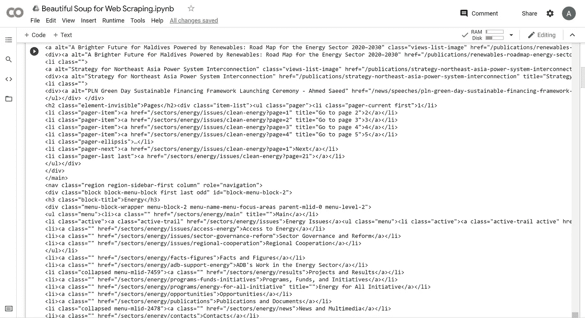
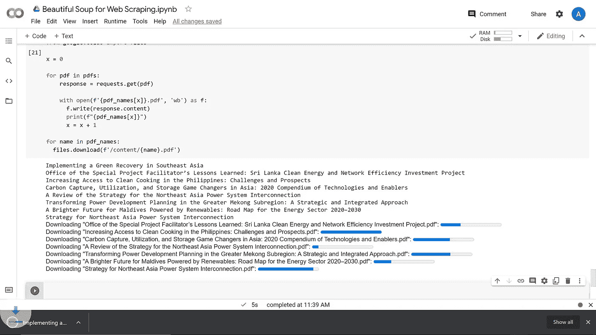

# 使用 Beautiful Soup 从网页自动下载多个文档

> 原文：<https://levelup.gitconnected.com/automating-multiple-document-downloads-from-a-webpage-using-beautiful-soup-b81f6a839024>

我最喜欢的代码用途之一是让它为我完成无聊的任务。作为一名研究人员，我的部分职责包括收集信息，以便自己和他人进行分析。有时，谷歌搜索和下载出版物可能会很乏味和重复，所以我们为什么不建立一个“研究助理”来为我们做这些呢？

我们的“研究助理”将会把亚洲开发银行[清洁能源问题页面](https://www.adb.org/sectors/energy/issues/clean-energy)上的所有出版物下载到我们的电脑上。包含我的代码的完整 google colab 文件可以在本文末尾找到。



一些出版物可以在[网站](https://www.adb.org/sectors/energy/issues/clean-energy)上下载

# 打造我们的研究助手

我们从导入抓取网站所需的两个主要库开始:Requests 和 BeautifulSoup。

如果你想浏览一个网站，Beautiful Soup 是一个很好的 python 库。它非常有效地从 HTML 文档的大量信息中过滤(就像做汤一样)出你想要的信息。然而，它不能完成的任务之一是将感兴趣的网站信息放入您的编码环境中。这就是我们使用请求库的原因，因为它可以获取网站的 html 文档并将其带入我们的代码中。

```
# Import the necessary libraries to webscrape the publicationsimport requests
from bs4 import BeautifulSoup as soup
```

现在我们已经导入了库，我们将定义我们想要抓取的 URL。然后，我们可以将这个 URL 提供给请求库，并请求将网站信息拉入我们的代码中。一旦完成，我们将请求转换成一个实例，并将其传递给 Beautiful Soup 来创建一个可读性更好的打印输出。

```
# First define the url of interesturl = "https://www.adb.org/sectors/energy/issues/clean-energy" # Once you have set the url, we can now use the requests library to get the content of the url's html page.html_page = requests.get(url).content # Now we have the html page we are going to use Beautiful Soup to put the information into a more readable format and then print it below. We call this a soup page.soup_page = soup(html_page, "html")
soup_page
```

您可以从下面的汤页打印结果中看到，这些信息仍然非常混乱，而且还不是一种易于收集的格式。幸运的是，漂亮的 Soup library 具有非常易用的功能，允许我们筛选数据以获得我们感兴趣的内容:网站上所有出版物的列表。



我们的汤页面片段

通读 soup 页面，注意每个单独的数据都由<>指定？我们可以使用 Beautiful Soup 来搜索这些数据位，以找到出版物下载链接。

```
# First, notice that each <> that starts with "a" always contains text while <>'s not containing "a" look more like commands telling the html page where a button, or other design element should be. Let's use this to do our first filter.soup_page.findAll("a")
```

这比以前好，但是仍然有大量我们不感兴趣的信息。滚动打印输出，找到详述出版物的行。每一行都有“class = views-list-image”。继续阅读 soup 页面，您会看到其他数据位也包含“class = ”,但是使用了不同的类名。我们可以使用这个类名进一步过滤。

```
# Save the filtered information as an instancelinks = soup_page.findAll("a",{"class": "views-list-image"})
links
```

有了出版物列表，我们就可以用美汤拉出感兴趣的属性。在我们的例子中，我们将把 web 链接拉到承载出版物的页面，以及出版物的标题。

```
# Now that we have the links we can pull out the link to each of the pages where you can download the reports of interestlinks[0].attrs["href"] # Demonstrating using the same method to get the title name of the first reportlinks[0].attrs["alt"]
```

现在我们已经了解了如何获取出版物的网页链接和标题，我们将使用一个短循环来接收和保存每个出版物的网页链接。

```
# A short loop to save the weblinks to each of the publicationspub_links = []for link in links:
   pub_links.append("https://www.adb.org" + link.attrs["href"])pub_links
```

您可能已经注意到了我们现在保存的 URL 的一个小问题。如果您单击其中的任何一个，您将不会被直接带到报告的 PDF，相反，您将最终出现在托管 PDF 下载和其他相关报告信息的网页上。

我们将使用与上面相同的方法，在每个单独的出版物页面上找到我们要搜索的 pdf 的网络链接。

```
# Investigating what the soup page looks like --> This is always good practice to do with every new web/soup pagehtml_page = requests.get(pub_links[0]).content
soup_page = soup(html_page, "html")
soup_page
```

附在页面底部的 google colab 文件显示了一步一步的方法来为单个出版物 soup 页面找到正确的过滤设置。在本文中，我们将直接跳到正确的过滤器。

```
# After the step by step investigation to figure out the right attributes to filter by we now have the PDF link for the first publicationpub_link = soup_page.findAll("a",{"title": links[0].attrs["alt"]})[0]
pub_link
```

从“pub_link”到上面代码片段的打印输出应该包含 PDF 的 URL、标题、src、图像链接和图像宽度。使用本文前面描述的相同方法，我们现在将保存每个 pdf 的标题和网页链接。

```
# Here's a short loop that goes to each publication page and saves (1) the PDF's URL and (2) the publications titlepdfs = []
pdf_names = []
x = 0for link in pub_links:
   html_page = requests.get(link).content
   soup_page = soup(html_page, "html")
   text = soup_page.findAll("a",{"title": links[x].attrs["alt"]})[0]
   pdfs.append(text.attrs["href"])
   pdf_names.append(text.attrs["title"])
   x = x + 1
```

# 下载出版物

由于这是一个 google colab 文件，我们将使用 google colab 的一个名为 files 的库。Jupyter 笔记本可能需要一个不同的选项。

文件库允许我们自动下载我们用代码生成的文件。

```
# Import the necessary libraries
import urllib.request
from google.colab import filesx = 0# First pull the PDF weblinks using the requests libraryfor pdf in pdfs:
   response = requests.get(pdf) # Name the PDF's using the names we saved from the loop above with open(f'{pdf_names[x]}.pdf', 'wb') as f:
      f.write(response.content)
      print(f"{pdf_names[x]}")
      x = x + 1 # Download each of the named PDF's directly into your download folderfor name in pdf_names:
   files.download(f'/content/{name}.pdf')
```

一旦我们运行上面的代码，你应该看到文件开始下载到你的电脑上。下图显示了我在文件下载过程中在 google colab 上看到的内容。



我们的清洁能源报告直接下载到我们的电脑上

太棒了。现在我们有了自己的下载“研究助手”。我们的“研究助手”中使用的技术可以用于其他网页和其他文件下载。

希望你能在其他项目中使用它！

[](https://colab.research.google.com/drive/1u4605Be800_rBowtsw-VoiMPWg1fl0MF?usp=sharing) [## 美丽的刮网汤

### 这是一个简短的练习，演示了如何使用 Beautiful Soup 和请求来抓取出版物，然后自动将它们下载到您的计算机上。

colab.research.google.com](https://colab.research.google.com/drive/1u4605Be800_rBowtsw-VoiMPWg1fl0MF?usp=sharing)