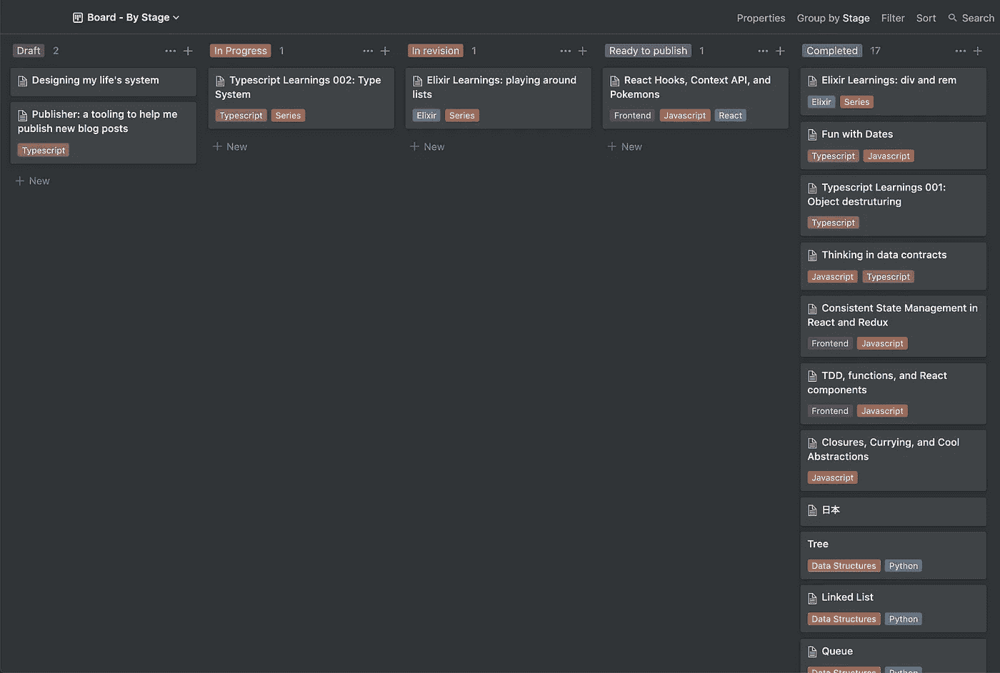

# 用 Typescript 自动化我的博客文章发布过程

> 原文：<https://levelup.gitconnected.com/automating-my-blog-post-publishing-process-with-typescript-46dc1665d3a1>

*本帖原载于* [***TK 的博客***](https://leandrotk.github.io/tk/2020/04/publisher-a-tooling-to-automate-the-process-to-publish-my-blog-posts/index.html) *。*

照片由[帕特里克·福尔](https://unsplash.com/@patrickian4?utm_source=medium&utm_medium=referral)在 [Unsplash](https://unsplash.com?utm_source=medium&utm_medium=referral) 拍摄

我正在培养一种写作习惯，试图发表越来越多的文章。尽管我使用像 [Medium](https://medium.com/@leandrotk_) 、 [dev.to](https://dev.to/teekay) 和 [Hashnode](https://hashnode.com/@teekay) 这样的发布博客，我还是喜欢在[我自己的博客](http://leandrotk.github.io/tk)上发布我的内容。

因为我想建立一个简单的网站，这个博客基本上是 HTML，CSS 和很少的 JavaScript 网站。但问题是，出版过程可以更好。

现在是怎么运作的？

我在观念上管理博客路线图。看起来是这样的:

这是一个简单的看板类型的板。我喜欢这个板，因为我可以把我所有的想法变成实体的(还是数字的？)表示。我也用它来建立一个草稿，润色，让它越来越好地发表在博客上。

所以我用概念来写我的博客。在我完成它之后，我复制这个想法并粘贴到一个在线工具中，将 markdown 转换成 HTML。然后我可以使用这个 HTML 来创建实际的帖子。

但这只是正文，页面的内容。我总是需要创建一个包含标题内容、正文和页脚的 HTML。

这个过程繁琐又无聊。但好消息是，它可以自动化。这篇文章就是关于自动化的。我想向你们展示我创造的这个新工具的幕后，以及我在这个过程中所学到的东西。

# 特征

我的主要想法是准备发布一整篇 HTML 文章。正如我之前提到的，`<head>`和`<footer>`部分变化不大。所以我可以用它作为“模板”。

有了这个模板，我就有了可以为我撰写和发表的每篇文章修改的数据。这个数据可以是模板中的一个变量，用这个表示`{{ variableName }}`。一个例子:

现在，我可以使用模板，用真实数据替换变量，每篇文章的具体信息。

第二部分是正文，实帖。在模板中，用`{{ article }}`表示。这个变量将被 markdown 生成的 HTML 替换。

当我们从概念中复制和粘贴笔记时，我们得到了一种降价风格。该项目将把这个 markdown 转换成 HTML，并将其用作模板中的`article`变量。

为了创建理想的模板，我查看了需要创建的所有变量:

*   `title`
*   `description`
*   `date`
*   `tags`
*   `imageAlt`
*   `imageCover`
*   `photographerUrl`
*   `photographerName`
*   `article`
*   `keywords`

有了这些变量，我创建了[模板](https://github.com/leandrotk/publisher/blob/master/examples/template.html)。

为了传递这些信息来构建 HTML，我创建了一个`json`文件作为文章配置:`article.config.json`。我有这样的东西:

第一步:项目应该知道如何打开和阅读模板和文章配置。有了这些数据，我可以用它来填充模板。

模板优先:

所以我们基本上需要实现`getTemplateContent`函数。

带有`__dirname`的`resolve`将从正在运行的源文件中获取目录的绝对路径。然后转到`examples/template.html`文件。`readFile`将异步读取并返回模板路径中的内容。

现在我们有了模板内容。我们需要为文章配置做同样的事情。

这里有两件不同的事情:

*   由于`article.config.json`具有 json 格式，我们需要在读取文件后将这个 json 字符串转换成 JavaScript 对象
*   文章配置内容的返回将是一个我在函数返回类型中定义的`ArticleConfig`。让我们建造它。

当我们得到这个内容时，我们也使用这个新类型。

现在我们可以使用`replace`方法来填充模板内容中的配置数据。为了说明这个想法，它看起来像这样:

但是有些变量在模板中出现不止一次。营救用的正则表达式。有了这个:

…我得到所有匹配`{{ title }}`的字符串。所以我可以构建一个函数来接收要查找的参数，并在标题位置使用它。

现在我们可以替换所有匹配。标题变量的一个示例:

但是我们不想只替换标题变量，而是替换文章配置中的所有变量。全部替换！

现在我全部换掉！我们这样使用它:

但是我们遗漏了两个部分:

*   `tags`
*   `article`

在 config json 文件中，`tags`是一个列表。所以，对于这个列表:

最终的 HTML 将是:

所以我用`{{ tag }}`变量创建了另一个模板:`tag_template.html`。我们只需要映射`tags`列表并创建每个 HTML 标签模板。

在这里我们:

*   获取标记模板路径
*   获取标记模板内容
*   通过`tags`映射，并基于标签模板构建最终的标签 HTML

`buildTag`是一个返回另一个函数的函数。

它接收`tagContent`——它是标签模板内容——并返回一个函数，该函数接收一个标签并构建最终的标签 HTML。现在我们调用它来获取文章标签。

关于这篇文章。看起来是这样的:

它接收到`articleFile`，我们试图获取路径，读取文件，并获取 markdown 内容。然后将这个内容传递给`fromMarkdownToHTML`函数，将 markdown 转换成 HTML。

这部分我使用了一个名为`showdown`的外部库。它处理将 markdown 转换成 HTML 的每一个小细节。

现在我有了标签和文章 HTML:

我又错过了一件事！以前，我认为我总是需要将图像封面路径添加到文章配置文件中。大概是这样的:

但是我们可以假设图像名称是`cover`。挑战在于延伸。可以是`.png`、`.jpg`、`.jpeg`或`.gif`。

所以我构建了一个函数来获得正确的图像扩展。想法是在文件夹中搜索图像。如果它存在于文件夹中，则返回扩展名。

我从“现有的”部分开始。

这里我使用`existsSync`函数来查找文件。如果它存在于文件夹中，则返回 true。否则为假。

我将这段代码添加到一个函数中:

我为什么这样做？

使用这个函数，我需要通过`folder`、`filename`和`extension`。`folder`和`filename`总是一样的。不同的是`extension`。

所以我可以用 curry 创建一个函数。这样，我可以为同一个`folder`和`filename`构建不同的函数。像这样:

整个函数如下所示:

但是我不喜欢用这个硬编码的字符串来表示图像扩展。`enum`真酷！

现在使用我们新枚举的函数`ImageExtension`:

现在我已经有了填充模板的所有数据。太好了！

HTML 完成后，我想用这些数据创建真正的 HTML 文件。我基本上需要得到正确的路径，HTML，并使用`writeFile`函数来创建这个文件。

为了找到路径，我需要了解我的博客的模式。它用年、月、标题组织文件夹，文件命名为`index.html`。

一个例子是:

起初，我考虑将这些数据添加到文章配置文件中。所以每次我需要从文章配置中更新这个属性来获得正确的路径。

但是另一个有趣的想法是通过文章配置文件中已经有的一些数据来推断路径。我们有`date`(如`"2020-04-21"`)和`title`(如`"Publisher: tooling to automate blog post publishing"`)。

从日期，我可以得到年和月。根据标题，我可以生成文章文件夹。`index.html`始终不变。

字符串应该是这样的:

对于约会来说，真的很简单。我可以通过`-`分裂和解构:

对于`slugifiedTitle`，我构建了一个函数:

它删除字符串开头和结尾的空格。然后向下转换字符串。然后删除所有特殊字符(只保留单词和空白字符)。最后，用一个`-`替换所有空白。

整个函数看起来像这样:

这个函数试图获取文章文件夹。它不会生成新文件。这就是为什么我没有把`/index.html`加到最后一个字符串的末尾。

为什么会这样？因为，在写新文件之前，我们总是需要创建文件夹。我用这个文件夹路径的`mkdir`来创建它。

现在，我可以使用该文件夹在其中创建新的文章文件。

这里我们遗漏了一件事:当我在文章配置文件夹中添加图像封面时，我需要复制它并粘贴到正确的位置。

对于`2020/04/publisher-a-tooling-to-blog-post-publishing/index.html`示例，图像封面将位于资产文件夹中:

为此，我需要两样东西:

*   用`mkdir`创建一个新的`assets`文件夹
*   用`copyFile`复制图像文件并粘贴到新文件夹中

要创建新文件夹，我只需要文件夹路径。要复制和粘贴图像文件，我需要当前图像路径和文章图像路径。

对于文件夹，因为我有了`newArticleFolderPath`，我只需要将这个路径连接到 assets 文件夹。

对于当前的图像路径，我有正确扩展名的`imageCoverFileName`。我只需要得到图像覆盖路径:

为了获得未来的图像路径，我需要连接图像封面路径和图像文件名:

有了这些数据，我就可以创建新文件夹了:

复制并粘贴图像封面文件:

当我实现这个`paths`部分的时候，我发现我可以把它们组合成一个函数`buildPaths`。

我还创建了`ArticlePaths`类型:

我可以使用该函数获得我需要的所有路径数据:

现在是算法的最后一部分！我想快速验证创建的帖子。那么，如果我可以在浏览器选项卡中打开创建的帖子会怎么样呢？那太棒了！

所以我做到了:

这里我使用`open`库来模拟终端打开命令。

就这样了！

# 学习

这个项目非常有趣！通过这个过程我学到了一些很酷的东西。我想把它们列在这里:

*   当我在学习 Typescript 时，我想快速验证我写的代码。所以我配置`nodemon`在每次文件保存时编译并运行代码。将开发过程变得如此动态是很酷的。
*   我尝试使用新节点`fs`的`promises` : `readFile`、`mkdir`、`writeFile`和`copyFile`。它在`Stability: 2`上。
*   我做了大量的[奉承](https://leandrotk.github.io/tk/2020/03/closure-currying-and-cool-abstractions/index.html)来使一些功能可以重用。
*   枚举和[类型](https://leandrotk.github.io/tk/2020/04/typescript-learnings-002-type-system/index.html)是在 Typescript 中保持状态一致的好方法，也是所有项目数据的好表示和文档。[数据契约](https://leandrotk.github.io/tk/2020/04/thinking-in-data-contracts/index.html)真是个好东西。
*   工具思维。这是我真正喜欢编程的原因之一。构建工具来自动化重复的任务，让生活更轻松。

我希望这是一本好书！继续学习，继续编码！

我的 [Twitter](https://twitter.com/leandrotk_) 和 [Github](https://github.com/leandrotk/) 。

# 资源

*   [数据契约中的思考](https://leandrotk.github.io/tk/2020/04/thinking-in-data-contracts/index.html)
*   [打字稿学习](https://leandrotk.github.io/tk/2020/04/typescript-learnings/index.html)
*   [闭包、Currying 和酷抽象](https://leandrotk.github.io/tk/2020/03/closure-currying-and-cool-abstractions/index.html)