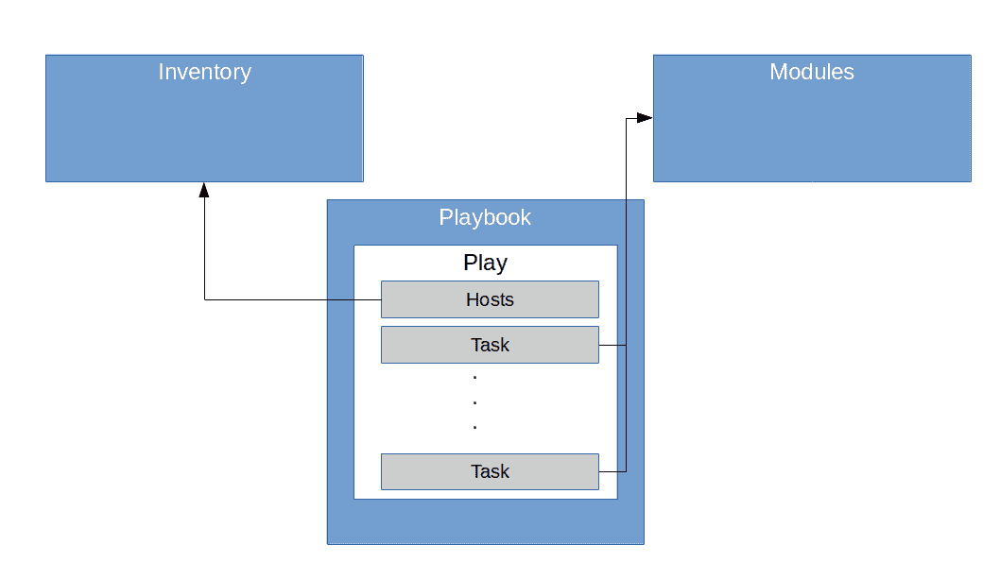

# Ansible 自动化供应—基础知识

> 原文：<https://levelup.gitconnected.com/automating-provisioning-with-ansible-the-basics-b810c5bb92a9>

对于我的项目，我经常需要一个干净的 Linux 盒子，它有一个定义好的状态，我可以用它来玩，如果我犯了一个错误，就简单地再次转储它。当然，我为此使用了云环境。然而，我经常发现自己登录到这些新创建的机器之一来手动执行安装。是时候学习如何实现自动化了。

# Ansible —基础知识

Ansible 是一个平台，旨在自动配置和安装虚拟机(或者更一般地说，任何类型的服务器，包括物理机甚至容器)。Ansible 是无代理的，这意味着为了管理虚拟机，它不需要在该机器上安装任何特殊的代理。相反，它使用 ssh 来访问机器(在 Linux / Unix 世界中，而在 Windows 中，您将使用类似 WinRM 的东西)。

当您使用 Ansible 时，您在专用机器上运行 Ansible 引擎，在该机器上需要安装 Ansible 本身。这台机器叫做**控制机**。从这个控制机器，你管理一个或多个**远程机器**，称为**主机**。Ansible 将通过 SSH 连接到这些节点，并在那里执行所需的命令。Ansible 需要它需要管理的所有主机的列表，这个列表被称为**清单**。清单可以是静态的，即清单只是一个列出所有节点的文件，也可以是动态的，实现为提供 JSON 格式的节点列表并由 Ansible 调用的脚本，或者用 Python 编写的插件。这在将 Ansible 用于云环境时尤其有用，在云环境中，节点列表会随着节点的启动或关闭而发生变化。

一天结束时，节点上“实际执行的事情”是一个 Python 脚本。这些脚本被称为 Ansible **模块**。您可能会问自己如何在节点上调用该模块。答案很简单——ansi ble 将模块复制到节点，执行它，然后再次移除它。当您使用 Ansible 时，您为每个节点或节点组执行一列**任务**，任务是对具有特定参数的模块的调用。

应用于特定节点组的任务序列称为**剧本**，指定一组剧本的文件称为**剧本**。因此，剧本允许您以可重复的方式将定义的模块调用序列应用于一组节点。行动手册只是 YAML 格式的普通文件，因此可以在版本控制下保存，并可以根据基础设施即代码的原则进行处理。



# 安装和第一步

由于是无代理的，Ansible 安装起来相当简单。事实上，Ansible 是用 Python 编写的(社区版的源代码可以在 [GitHub](https://github.com/ansible/ansible) 上找到)，可以用

```
pip3 install --user ansible
```

接下来，我们需要一个主机。在这篇文章中，我在数字海洋上安装了一个主机。在我的例子中，主机被分配了 IP 地址 134.209.240.213。我们需要将这个 IP 地址放入一个清单文件中，使它对 Ansible 可见。一个简单的清单文件(INI 格式，也支持 YAML)如下所示。

```
[servers] 134.209.240.213
```

在这里，“服务器”是一个标签，如果我们需要管理具有不同配置文件的节点(例如 web 服务器、应用服务器或数据库服务器)，我们可以使用它来对节点进行分组。

通常情况下，您不会手动创建该文件。我们将在稍后的帖子中讨论动态库存，但目前，您可以使用我在 DigitalOcean 的早期帖子中使用的脚本的[版本来自动供应液滴。该脚本启动一台机器，并将其添加到存储库文件 hosts.ini 中。](https://github.com/christianb93/ansible-samples/blob/master/partI/create_droplet.sh)

有了这个库存文件，我们就可以使用 Ansible 在这个节点上临时执行命令了。这里有一个简单的例子。

```
export ANSIBLE_HOST_KEY_CHECKING=False 
ansible -i hosts.ini \ 
  servers \ 
  -u root \ 
  --private-key ~/.ssh/do_k8s \ 
  -m ping
```

让我们一步步来看这个例子。首先，我们设置了一个环境变量，该变量在第一次连接到未知主机时阻止 SSH 主机密钥检查。接下来，我们调用 ansible 命令行客户端。第一个参数是库存文件的名称，在我们的例子中是`host.ini`。第二个参数(`servers`)指示 Ansible 仅对那些在我们的清单文件中带有标签`servers`的主机运行我们的命令。这允许我们使用不同的节点配置文件，并对它们应用不同的命令。接下来，`-u`交换机要求 Ansible 使用 root 用户连接到我们的主机(这是 DigitalOcean 上的默认 ssh 用户)。下一个开关指定存储私有主机密钥的文件，Ansible 将使用该密钥连接到节点。

最后，开关`-m`指定要使用的模块。对于这个例子，我们使用 ping 模块来尝试建立到主机的连接(您可以在这里查看这个模块的源代码)。

模块也可以接受参数。一个非常通用的模块是`command`模块(如果没有指定模块，这实际上是默认的)。这个模块接受一个参数，它将简单地在节点上作为一个命令执行。例如，下面的代码片段在所有节点上执行`uname -a`。

```
export ANSIBLE_HOST_KEY_CHECKING=False 
ansible -i hosts.ini \ 
servers \ 
-u root \ 
--private-key ~/.ssh/do_k8s \ 
-m command \ 
-a "uname -a"
```

# 权限提升

到目前为止，我们的例子都假设 Ansible 用来 SSH 到机器的用户拥有所有必需的特权，例如，运行`apt`。在 DigitalOcean 上，标准用户是 root，这种简单的方法在这里有效，但是在其他云环境中，比如 EC2，情况就不同了。

假设我们已经使用 Amazon Linux AMI 创建了一个 EC2 实例(它有一个名为 ec2-user 的默认用户),并将它的 IP 地址添加到我们的 hosts.ini 文件中(当然，我已经编写了一个[脚本](https://github.com/christianb93/ansible-samples/blob/master/partI/create_ec2_instance.sh)来自动化这个操作)。我们还假设使用的 SSH 密钥名为 ansibleTest，存储在目录`~/.keys`中。然后，ping 命令将如下所示。

```
export ANSIBLE_HOST_KEY_CHECKING=False 
ansible -i hosts.ini \ 
servers \ 
-u ec2-user \ 
--private-key ~/.keys/ansibleTest.pem \ 
-m ping
```

这实际上是可行的，但是如果我们想安装一个像 Docker 这样的包，这就变了。我们将在下一篇文章中了解更多关于软件包安装和状态的信息，但是实际安装软件包的命令应该如下所示。

```
export ANSIBLE_HOST_KEY_CHECKING=False 
ansible -i hosts.ini \ 
servers \ 
-u ec2-user \ 
--private-key ~/.keys/ansibleTest.pem \ 
-m yum -a 'name=docker state=present'
```

这里，我们使用 yum 模块，它能够利用 Amazon Linux 使用的 YUM 包管理器来安装、升级、删除和管理包。但是，这将会失败，您将会收到一条类似“您需要成为 root 用户才能执行此命令”的消息。发生这种情况是因为 Ansible 将使用 ec2_user 通过 SSH 进入您的机器，默认情况下，这个用户没有运行 yum 所需的权限。

在命令行上，你当然可以使用`sudo`来解决这个问题。为了指示 Ansible 这样做，我们必须在命令中添加开关-b。Ansible 将使用 sudo 以 root 用户身份执行模块。

```
export ANSIBLE_HOST_KEY_CHECKING=False 
ansible -i hosts.ini \ 
servers \ 
-b \ 
-u ec2-user \ 
--private-key ~/.keys/ansibleTest.pem \ 
-m yum -a 'name=docker state=present'
```

附加参数`-become-user`可用于控制 Ansible 将使用哪个用户来运行操作。缺省值是 root，但是也可以使用任何其他用户(当然，假设用户拥有相应命令所需的特权)。

上面的例子看起来仍然像是可以用简单的 shell 脚本轻松完成的事情，在一个清单文件中遍历所有主机并调用一个 ssh 命令。然而，当我们在本系列的下一篇文章[中开始讨论模块时，Ansible 的真正威力就变得显而易见了。](https://leftasexercise.com/2019/11/18/automating-provisioning-with-ansible-using-modules/)

*原载于 2019 年 11 月 11 日*[*【http://leftasexercise.com】*](https://leftasexercise.com/2019/11/11/automating-provisioning-with-ansible-part-i/)*。*