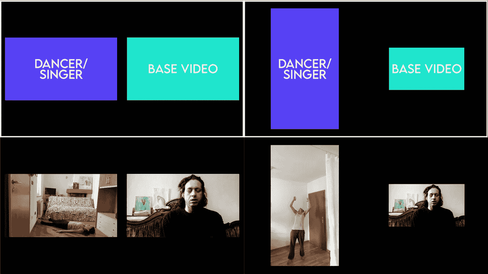

# 使用 Python 自动编辑视频

> 原文：<https://levelup.gitconnected.com/automating-video-editing-with-python-2de5f574d0ff>

## 结合 ffmpeg 和 Vimeo 的 API 的力量，以令人难以置信的速度制作视频。


沙哈达特·拉赫曼在 [Unsplash](https://unsplash.com?utm_source=medium&utm_medium=referral) 上拍摄的照片

我最近不得不解决一个自动化问题，客户希望自动生成数百个视频，将一个“基本视频”与从数百个视频列表中挑选的视频放在一起。虽然这可以很容易地用手工完成，但这个项目是一个正在进行的项目，生成的视频数量每天都在增长。出于这个原因，我决定使用 Python 和 ffmpeg 编写一个小脚本，自动生成这些视频并上传到客户端的 Vimeo 频道。

这篇短文旨在关注自动化、视频编辑和 Vimeo 的 API 的一些特定方面，因此我不会在 Python 基础知识上花费任何时间。我将把重点放在我发现具有挑战性并且我认为分享起来很有趣的一些点点滴滴上。

# 准备

在自动化作业中，准备工作是必不可少的，尤其是当您试图从文件本身获取信息时。出于这个原因，我为脚本将要处理的视频文件设置了一些基本规则，并要求这些规则符合*。文件命名的最终决定如下:*

**index _ artist name _ 出处. extension**

*有了这三条简单的信息，我就能够跟踪已经生成的视频，并使用提供的元数据在 Vimeo 上定制标题和描述。我使用下划线作为数据分隔符，然后在需要时使用存储在列表中的整齐分隔的数据。*

## *问题*

*有两件事我在开始时没有考虑到，结果在尝试了几次后被添加到准备步骤中。*

*1.由于 ffmpeg 是通过 *os.system* Python 模块使用的(原因解释如下)，我很快意识到重音字母在脚本的 ffmpeg 阶段引起了问题。通过在 zsh 配置文件中[启用 UTF-8 解决了这个问题。](https://superuser.com/questions/583031/how-can-i-get-zsh-to-display-international-characters-properly)*

*2.视频的堆叠要求视频长度完全相同(完美的帧)。出于这个原因，所有最初符合 11 分 43 秒的视频都必须进行修改，并增加 2 帧，以避免 ffmpeg 中的 [*重复帧*](https://video.stackexchange.com/questions/20958/ffmpeg-dropping-duplicate-frames) 错误。这是因为原始的基础视频*实际上是* 11 分 43 秒 2 帧长。*

# *剧本*

*该脚本实际上是一个非常简单的文件夹迭代，它遍历两个特定文件夹中的所有文件，并使用 ffmpeg 生成一个视频。一旦视频生成，它就被保存并通过它的 API 上传到 Vimeo。虽然文件夹迭代没有什么奇特或值得注意的地方*

**对于 os.walk 中的根、目录、文件(文件夹):**

*事情的 ffmpeg 方面有一些有趣的方面值得分析。*

# *ffmpeg*

*返回语句被输入到 os.system 以接入 ffmpeg 的简要概述。*

**注意:决定通过 os.system 使用 ffmpeg，而不是使用* [*ffmpeg 的 python 绑定*](https://github.com/kkroening/ffmpeg-python) *，以避免该项目的开源和社区维护性质的潜在问题。虽然 python 绑定似乎得到了很好的记录和支持，但我还是选择了官方的 ffmpeg 库。这主要是因为脚本必须是面向未来的，并且由非开发人员使用。**

*由于需要在视频上执行一系列操作，我决定使用 ffmpeg 的 filter_complex 参数，虽然稍微复杂一些*(双关语)，但允许更高级别的控制。**

**ffmpeg 的 filter complex 在这样的假设下工作:我们传递一些变量(在本例中是视频)作为输入，在对它们执行一个动作后，我们为要输出的变量分配一个新的名称。这是理解视频是如何被编辑和传播的关键，并使链接效果变得非常容易。**

## **规模**

**首先，视频需要缩放。脚本处理的所有视频都是全高清(1920 x 1080 像素)或*垂直*全高清(1080 x 1920 像素)。考虑到我们已经讨论过最终的视频应该看起来像下面的图片，我使用缩放功能将视频的宽度缩小到 884 像素(对于水平视频，垂直视频使用了不同的比例)。**

****

**水平和垂直输入的视频组合布局。**

## **衬垫**

**即使缩放和 hstacking 足以生成所需的视频，这也意味着在 Vimeo 上打开视频而不完全屏蔽播放器会导致视频形状怪异:非常宽，与视频高度一样高。因为客户希望视频总是用黑边填充，所以在合并视频之前，我分别用黑边填充。这些黑色边距使得每个视频宽 960 像素，高 1080 像素:正好是全高清帧的一半。填充功能的第二部分将视频精确地放置在填充区域的中心。**

## **HStack**

**Hstacking 是我发现的并排放置两个视频的最简单的方法。不需要太多解释。给定两个或更多的输入，它在一个文件中一个接一个地输出它们。h 代表*水平*堆叠，垂直堆叠见 [vstack](https://ffmpeg.org/ffmpeg-filters.html#vstack) 。**

## **塞特萨尔**

**最后，最后但同样重要的是，我必须对最终的视频合成使用 setsar 函数，以避免出现怪异的纵横比(我一直得到宽度短 1 个像素的最终视频)。setsar 滤镜“为滤镜输出视频设置样本(即像素)纵横比”。**

**这个主要代码块负责合成视频的生成，然后将合成视频传递给 Vimeo API 进行上传。根据视频输入是水平的还是垂直的，以及视频中出现的艺术家是歌手还是舞者，调用这个特定代码块的不同迭代。艺术家的类型决定了来自两个输入视频的音频是否需要混合:**

```
**[0:a][1:a]amix=inputs=2:duration=longest[aud]
-map “[aud]”**
```

**或者只需要使用来自主视频的音频。**

```
**map 1:a**
```

# **Vimeo API**

**Vimeo API 实现非常简单，但是需要一些后台设置工作才能运行。与 Youtube 不同，Vimeo 有很高的上传配额，这使得它成为这类自动上传项目的优秀平台。这意味着任何人都可以使用脚本自动上传内容到他们的 Vimeo 挑战赛，而不会遇到任何限制。**

**为了启用 API，用户需要在 Vimeo 的[开发者门户](https://developer.vimeo.com/apps/new)上创建一个应用。这个过程非常简单，如果应用程序只需要在用户的个人 Vimeo 账户上使用，Vimeo 方面的批准周转将会非常快。**

**一旦应用程序被创建和批准，你将能够访问*客户端 id* 、*客户端秘密*和*访问令牌*，这是脚本工作所必需的。使用 Vimeo API 的 [Python 包装器](https://github.com/vimeo/vimeo.py)提供的视频上传示例，我们可以轻松地将视频上传到我们的频道。负责此操作的代码行有 5 行，出于安全原因，它们被放在“try: except:”块中，以捕捉潜在的错误。**

**用于在 Vimeo 上上传生成的视频的 try 语句概述。**

# **结论**

**差不多就是这样！你可以在这里找到完整代码的链接，并且可以在[项目的网站](https://www.human-signs.com/participants/)任何参与者的页面内看到结果。希望你觉得 python、ffmpeg 和 vimeo 的组合有用而且有趣。**