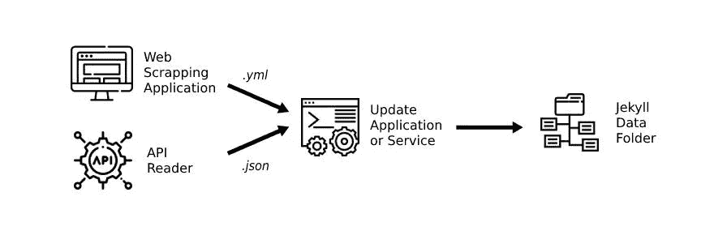
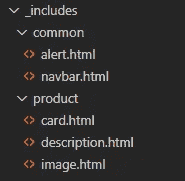
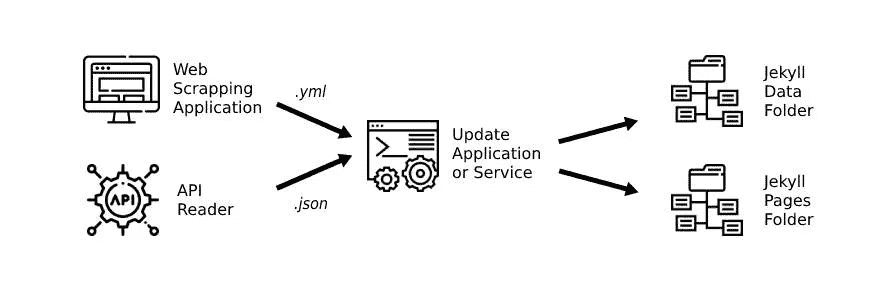

# 使用 Jekyll 自动创建网站

> 原文：<https://levelup.gitconnected.com/automating-website-creation-using-jekyll-6f7550e52bc1>

*关于使用 Jekyll 和 Liquid templates 构建基于 web 内容抓取和 API 请求的网站解决方案的案例研究。*

# **真实案例**

想象一下，你有一个庞大而复杂的网站，有很多页面和内容，大部分时间都用信息和视觉刺激淹没了用户。现在，你正转向一个更精简的信息结构，更小的网站专注于你的产品。您部署解决方案的时间跨度很短，真正的挑战在于如何汇编大量信息并自动完成创建这些小型网站的过程。

# 以用户为中心的解决方案

记住你是在试图为某人解决问题。技术方面是惊人的，但最终，你的解决方案必须解决一个业务问题。在这种情况下，我们需要创建一些更小、更直接的网站，包含来自更大网站的内容，以一种对最终用户更有意义的方式。直接与您的设计和业务团队合作至关重要。了解哪些信息是必不可少的，以及它们应该如何显示，以何种顺序和优先级显示，将有助于您避免未来的麻烦。

# 理解上下文

在选择工具之前，了解信息的背景是至关重要的。对您的决策起关键作用的几个问题是:

*   这些数据多久改变一次？
*   出于业务和法规遵从性原因，您的信息保持最新和正确有多重要？
*   每个案例中有多少是标准化的或专用的？
*   这些内容适合模板模型吗？
*   这个项目最重要的特点是什么？

这些问题将有助于您了解需要更新数据的频率，以及是否需要自动更新或在需要时手动更新。会发生多少例外情况，哪些可以标准化和模板化。记住，不要为你没有的问题过度设计解决方案。如果你的数据每年改变一次，很可能你不需要每天通过例行程序更新它。

# 适合正确工作的正确工具

在这种情况下，在了解到数据不会不断变化，速度和重量是项目成功的关键因素(该项目专注于新兴市场，在那里低端手机占主导地位，互联网速度不是最好的)后，我们选择与 Jekyll 合作进行静态内容生成。内容将通过使用一个简单的 web 报废应用程序(因为 HTML 是一种结构化标记语言，您可以提取大量具有一致性的信息)和一个 API 来获取，这两个应用程序都将保存在 Jekyll 的 *_data* 文件夹中。

整体流程(图标由[平面图标](https://www.flaticon.com/)表示)

# 牢记可扩展性

如果您正在考虑扩展和自动化您的创建，请记住简单的数据建模将对您有很大帮助。

## 为你的数据和物品准备钥匙

使用 Jekyll 将允许您将文件系统用作数据库。在项目、页面和数据之间使用键。这将帮助您识别您的内容，并允许自动获取和合并数据。想象一下，你有一个页面，在[首页](https://jekyllrb.com/docs/front-matter/)和*中有关键字“1”。在 *_data* 文件夹中的 json* 名为“data_1.json”，你可以很容易地使用变量、 *WHEREs* 、 *IFs、*等操作符来定位引用任何具体项目的数据。

# 构建您的项目

理解数据上下文后，从层堆栈的角度考虑项目，并将其合并到工具架构中。

## 数据层

把你的数据层想象成你的数据库。在 Jekyll 中，文件夹 *_data* 是你的*的位置。csv* 、*。yml* ，*。json、*或其他数据文件。在这里，创建文件夹来组织你的数据，这样你就可以理解和维护它。您可以拥有一个外部应用程序，它会定期从数据源中获取数据，并更新该文件夹中的文件。

## 布局层

在这里你可以定义你的网站将会有哪些布局。例如，您可能需要一个主页布局、一个登录页面、一个有一列的内容页面和另一个有两列的内容页面。否则，您可以根据要显示的内容类型、新闻布局、产品类别布局和产品布局来组织布局。

## 内容层

现在你已经有了你的布局(你的网站的宏观视图)，你的数据(你的内容的微观视图)，是时候构建你的内容了。Jekyll 允许你创建自定义的内容文件夹(通过使用[集合](https://jekyllrb.com/docs/collections/)，它将帮助你组织你的内容。

## 第一招来了

你的过程将变得更加迭代:为你的网站将有的每个内容建立一个页面。现在你有了完整的模型。布局已经过测试，应用于页面的数据已经过验证，现在您可以看到最终的结果，至少在这种情况下是这样。现在，让我们后退一步。

您已经有了示例页面。所以，让我们把它分解成更容易维护的组件，并且在实现自动化层时会给你很大帮助。这样，您的自动化将只需要创建组件名称和数据模型，并且所有的微调都将在组件中进行。

## 组件层

您的组件将进入 *_includes* 文件夹。保持一个命名约定，会对你有很大帮助。在 includes 文件夹中为每种类型的页面或模型创建一个文件夹。例如，您有自己的*“产品页面”*，在 includes 文件夹中创建一个名为*“产品”*的文件夹，并将这些页面的所有组件放在那里。此外，您可以使用一个*公共*文件夹，用于那些出现在多种类型页面上的组件。所以你会得到这样一个结构:

includes 文件夹的结构。

创建组件时，请记住数据中可能会出现*空案例*。也许某些项目的数据会丢失，或者在某些情况下可能不存在。在这些情况下，让 *if-else* 语句成为你的朋友。

创建所有组件后，更新您的页面，这样它将使用来自 *_includes 的组件。*点击 *查看更多关于包含和传递参数[。](https://jekyllrb.com/docs/includes/)*现在，你的页面将会更加简单，组件的行为和样式将会是独立的，你将能够很容易地将你需要的数据传递给它。现在，我们可以转到自动化层，创建我们仍然需要的所有页面。

## 自动化层

现在，让我们以可扩展的方式创建内容。使用 includes 创建页面，知道在 *_data* 文件夹中的何处存储和获取内容，并且拥有内容文件夹的结构。接下来是一个关键组件，一个将从数据源获取结果并将内容保存在 Jekyll 项目中属于它们的地方的应用程序。根据您从 web scrapper 或 API 端点获得的数据，创建一个基于您的模板的新页面，进行所有需要的替换(这里关键字起着重要的作用),您将最终获得可以部署的新页面。

该进程，现在生成页面和内容(图标由[扁平图标](https://www.flaticon.com/)

## 更新层

最后，您可以基于您最喜欢的 CI/CD 工作流，甚至使用现场服务器上的调度程序来自动化部署过程。从数据源获取所有数据，建立一个新版本的网站，瞧。

# 主要学习内容

当你阅读这篇文章的时候，你可能会问自己:*“为什么不从一开始就多花一点时间来计划所有的结构，并使它更直接地发展呢？”。*像任何涉及许多利益相关者和来自不同领域的人(你可能会和设计师、产品负责人、业务分析师、营销人员等等一起工作)的过程一样，规范变化很快，你需要使架构适应这些变化*。*所以，这里是关键的学习点(就我而言):

> 为你的项目选择一个垂直的方法。尽可能简单地让它跨所有层工作，这样你就会理解这个结构，并且能够更容易更快地适应变化。

# 结果呢

做完这一切后，您将最终得到一个静态生成的网站，它使用不同的数据源。它更安全、更轻便、更快。可以在 way.feevale.br/的[和 digital.feevale.br/](https://way.feevale.br/)的[查看样本结果。在这两种情况下，数据来自不同的来源，内容页面是使用 Jekyll 静态生成的。](https://digital.feevale.br/)